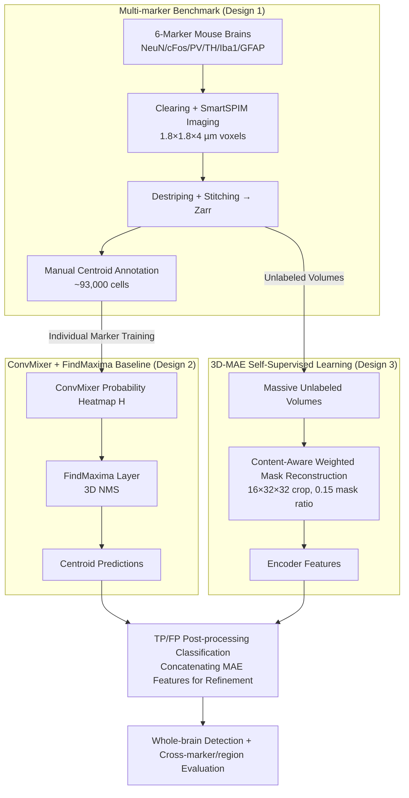

# Toward Generalizable Whole Brain Representations with High-Resolution Light-Sheet Data

**Conference**: CVPR 2026  
**arXiv**: [2603.29842](https://arxiv.org/abs/2603.29842)  
**Code**: [https://canvas.lightsheetdata.com](https://canvas.lightsheetdata.com)  
**Area**: Object Detection  
**Keywords**: Light-sheet fluorescence microscopy, whole-brain imaging, cell detection benchmark, self-supervised learning, foundation models

## TL;DR

Ours proposes CANVAS—the first large-scale subcellular resolution Light-Sheet Fluorescence Microscopy (LSFM) whole-brain benchmark dataset. It covers 6 cell markers, includes ~93,000 cell annotations and a public leaderboard, reveals the severe inadequacies of existing detection models in cross-marker and cross-region generalization, and explores the potential of 3D Masked Autoencoders (MAE) for self-supervised representation learning.

## Background & Motivation

1. **Background**: Advances in tissue clearing and LSFM have enabled the acquisition of complete 3D mouse brain data at subcellular resolution. A single whole-brain dataset can reach ~100GB (compressed), containing 1600-1850 z-slices of approximately 7000×10000 pixels each.
2. **Limitations of Prior Work**: While data acquisition capabilities have improved significantly, there is a lack of scalable processing methods and standardized benchmarks for petabyte-scale LSFM data. Existing CV models (e.g., U-Net, ResNet, ViT) designed for CT, fMRI, or X-ray struggle to generalize to LSFM data.
3. **Key Challenge**: Different cell type markers exhibit highly heterogeneous morphological features across brain regions (e.g., astrocytes vs. dopaminergic neurons), making it difficult for a single model to generalize across markers and regions. Furthermore, LSFM annotation costs are extremely high (167,950 predictions required manual verification).
4. **Goal**: To provide the first public whole-brain LSFM benchmark dataset, establish cell detection evaluation standards, reveal generalization bottlenecks of existing models, and explore self-supervised methods to address the scarcity of annotations.
5. **Key Insight**: Construct a comprehensive benchmark covering 6 functionally distinct cell markers (NeuN, cFos, PV, TH, Iba1, GFAP), selecting ROIs across different brain regions for annotation to systematically evaluate the cross-dataset and cross-region generalization of baseline models.
6. **Core Idea**: To drive field development by providing a standardized benchmark and detailed evaluation rather than proposing a new detection algorithm.

## Method

### Overall Architecture

The paper does not propose a new detector but instead formalizes a reproducible benchmark for "systematically evaluating the generalization of whole-brain LSFM cell detection." The pipeline consists of three components: The **Multi-marker Benchmark** handles data generation—mouse brain tissues are preserved via SHIELD, delipidated, fluorescently labeled with SmartBatch+, cleared with EasyIndex, and imaged at 1.8×1.8×4 µm voxel resolution using a SmartSPIM light-sheet microscope. After destriping and stitching, data is stored as Zarr and ~93,000 cell centroids are annotated via Neuroglancer. The **ConvMixer + FindMaxima Detection Baseline** trains detectors on annotated data: the ConvMixer backbone outputs probability heatmaps, followed by a FindMaxima layer for 3D non-maximum suppression (NMS) to convert heatmaps into discrete coordinates. The **3D-MAE Self-Supervision** learns transferable features from massive unlabeled volumes to bypass LSFM's high annotation costs; the learned encoder features are concatenated for TP/FP post-processing refinement. Together, these form a complete evaluation loop: "Benchmark Construction → Baseline Detection/Generalization Gap Exposure → Self-Supervised Mitigation of Label Scarcity."

### Key Designs

**1. Multi-marker Benchmark: Exposing Cross-marker Generalization Challenges**

Single-marker datasets fail to expose generalization weaknesses because morphology remains consistent. CANVAS deliberately selects 6 markers with vastly different functions and morphologies: NeuN (neuronal nuclei), cFos (neuronal activity), PV (parvalbumin interneurons), TH (dopaminergic neurons), Iba1 (microglia), and GFAP (astrocytes), ranging from spherical nuclei to complex stellate structures. For each marker, 3 training ROIs and 3 test ROIs were selected, totaling ~93,000 verified cell centroids (45,745 training + 47,301 test). By covering this morphological spectrum, the quantification of model failure across markers becomes precise.

**2. ConvMixer + FindMaxima Detection Baseline: Reformulating Detection as Heatmap Prediction + 3D NMS**

Standard box-based detection is costly in 3D. The paper adopts a density/heatmap paradigm: the ConvMixer backbone outputs a 3D probability heatmap $H$, and the FindMaxima layer performs 3D NMS—predicting a centroid if a voxel $H(x,y,z)$ is the maximum within its $d_{\min}$ neighborhood and exceeds threshold $\tau$. ConvMixer was chosen for its simple, fast structure suitable for 100GB volumes. Evaluation uses kd-tree based nearest neighbor matching with tolerances set to average cell radii (6 pixels for NeuN/cFos, 8 for TH/PV/GFAP, 5 for Iba1).

**3. 3D-MAE Self-Supervised Learning: Redesigning Masking and Reconstruction for Sparse/Dense Signals**

Due to high annotation costs, the paper adapts 3D MAE for LSFM. Two key modifications were made: First, patch sizes were optimized to fit actual cell sizes (best at 16×32×32 crops with 4×8×8 patches); larger receptive fields (e.g., 32×64×64) introduced harmful noise. Second, Content-Aware Reconstruction Weighting was implemented to bias the loss toward areas containing cells:

$$w_i = \alpha + \gamma \cdot \min\!\left(1,\ \mathrm{Var}(\mathbf{x}_i)/\bar{\sigma}^2\right)$$

Background patches receive weight $\alpha=1$, while high-variance cell patches receive up to $\alpha+\gamma=10$. Notably, the optimal mask ratio is only 0.15—far lower than the 0.75 used for natural images—because 3D micro-volumes possess high semantic density, and excessive masking destroys critical spatial relationships between cells.

### Loss & Training

- **Baseline Detection**: Binary Focal Loss, trained individually per marker, converging within one day on NVIDIA RTX 3090/4090.
- **3D-MAE**: Content-aware MSE reconstruction loss, AdamW optimizer ($\eta=1.5 \times 10^{-4}$), cosine annealing, trained for 700 epochs.
- **Multimodal Model**: Jointly trained on ~60k patches across all 6 markers; reconstruction loss remained within 15% of the best single-marker results.

## Key Experimental Results

### Main Results

| Trained Model | cFos F1 | NeuN F1 | TH F1 | PV F1 | GFAP F1 | Iba1 F1 |
|---------|---------|---------|-------|-------|---------|---------|
| cFos Model | **0.78** | 0.02 | 0.04 | 0.28 | 0.00 | 0.03 |
| NeuN Model | 0.76 | **0.81** | 0.41 | **0.89** | 0.05 | 0.43 |
| TH Model | 0.74 | 0.21 | **0.57** | 0.68 | 0.04 | 0.56 |
| PV Model | 0.29 | 0.73 | 0.20 | 0.63 | 0.01 | 0.06 |
| GFAP Model | 0.74 | 0.04 | 0.14 | 0.21 | **0.33** | 0.43 |
| Iba1 Model | 0.74 | 0.57 | 0.28 | 0.62 | 0.61 | **0.81** |

### Ablation Study (3D-MAE Configs)

| Configuration | Optimal Mask Ratio | Recon Loss | Note |
|------|-----------|---------|------|
| 16×32×32 / 4×8×8 | 0.15 | **Best** | Best for 5/6 markers |
| 24×48×48 / 6×12×12 | 0.15-0.35 | Second | Best for GFAP |
| 32×64×64 / 8×16×16 | 0.35-0.55 | Worst | Excess noise in RF |
| Joint Marker | 0.15 | 0.0070 vs 0.0061 | Effective transfer on 10x data |

### Key Findings

- **Severe Generalization Gap**: Most models perform well only on their own marker; cross-dataset F1 drops sharply (e.g., cFos model on NeuN is only 0.02).
- **GFAP is Hardest to Detect**: Even with its own model, F1 is only 0.33; an Iba1 model (0.61) actually outperforms the GFAP model on GFAP data.
- **NeuN Model has Best Generalization**: Achieves F1=0.89 on PV, likely due to morphological similarity in nuclear signals.
- **MAE Features Boost Detection**: As a post-processing classifier, GFAP F1 increased by an average of 22.9% (up to 86.3% in region 3).
- **Optimal Mask Ratio is Lower than Natural Images**: 0.15 vs 0.75, reflecting high semantic density in 3D biological images.

## Highlights & Insights

- **First Whole-Brain LSFM Benchmark**: CANVAS fills the gap for standardized benchmarks in biological volumetric imaging. Covering various cell types provides a resource for 3D foundation model development.
- **Content-Aware MAE Weighting**: A simple but effective trick—applying 10x weight to cell-containing patches in sparse signals. This weighting strategy is relevant for all SSL methods dealing with sparse data.
- **Complementary Multimodal Perspectives**: The paper clearly positions LSFM within the spectrum of fMRI (macro) $\rightarrow$ LSFM (meso) $\rightarrow$ EM (nano), providing a framework for multimodal neuroscience.

## Limitations & Future Work

- Annotation volume remains small (~93k vs. ~87 million cells in a mouse brain), covering only 3 ROIs per marker.
- No new detection algorithm was proposed; the baseline (ConvMixer) is relatively simple.
- 6 markers cover only a fraction of cell types; future extension is needed.
- 3D-MAE is currently used only for post-processing classification, not yet integrated into end-to-end detection.

## Related Work & Insights

- **vs. BrainSeg / CellPose**: Existing methods target specific modalities or types; CANVAS provides a systematic platform for cross-marker generalization.
- **vs. Natural Image MAE**: The optimal mask ratio (0.15) for LSFM is much lower than natural images (0.75), indicating strategies must be tuned to data characteristics.
- **vs. fMRI/EM Datasets**: LSFM uniquely balances whole-organ coverage with subcellular resolution, bridging functional and structural imaging.

## Rating

- Novelty: ⭐⭐⭐ (Primary contribution is the benchmark, not the architecture)
- Experimental Thoroughness: ⭐⭐⭐⭐ (Systematic cross-marker evaluation and hyperparameter search)
- Writing Quality: ⭐⭐⭐⭐ (Detailed background and clear motivation)
- Value: ⭐⭐⭐⭐ (Critical infrastructure for the LSFM community and guidances for future brain analysis models)

<!-- RELATED:START -->

## Related Papers

- [\[CVPR 2026\] MRD: Multi-resolution Retrieval-Detection Fusion for High-Resolution Image Understanding](mrd_multi-resolution_retrieval-detection_fusion_for_high-resolution_image_unders.md)
- [\[CVPR 2026\] SteelDefectX: A Coarse-to-Fine Vision-Language Dataset and Benchmark for Generalizable Steel Surface Defect Detection](steeldefectx_a_coarse-to-fine_vision-language_dataset_and_benchmark_for_generali.md)
- [\[CVPR 2026\] Online Data Curation for Object Detection via Marginal Contributions to Dataset-level Average Precision](online_data_curation_for_object_detection_via_marginal_contributions_to_dataset-.md)
- [\[CVPR 2026\] Heuristic-inspired Reasoning Priors Facilitate Data-Efficient Referring Object Detection](heuristic-inspired_reasoning_priors_facilitate_data-efficient_referring_object_d.md)
- [\[CVPR 2026\] HeROD: Heuristic-inspired Reasoning Priors Facilitate Data-Efficient Referring Object Detection](herod_heuristic_inspired_reasoning_data_efficient_rod.md)

<!-- RELATED:END -->
