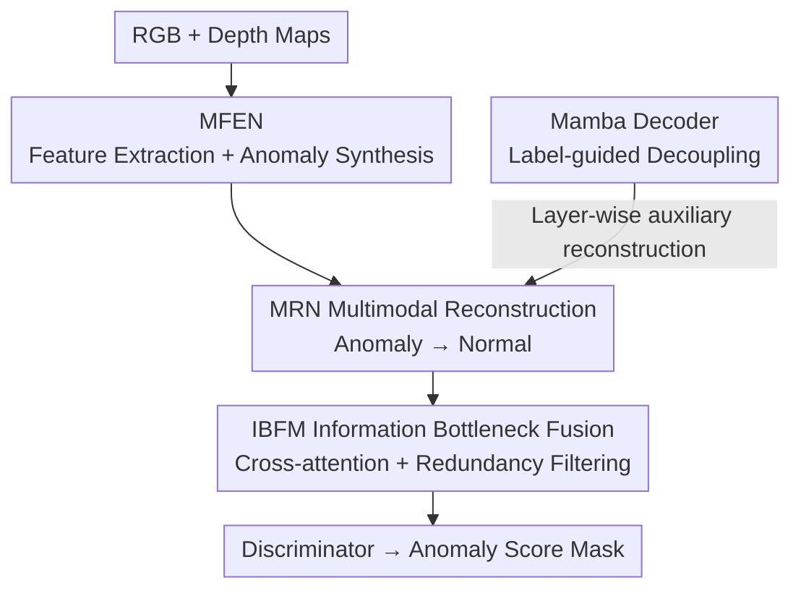

# Towards an Incremental Unified Multimodal Anomaly Detection: Augmenting Multimodal Denoising From an Information Bottleneck Perspective

**Conference**: CVPR 2026  
**Paper**: [CVF Open Access](https://openaccess.thecvf.com/content/CVPR2026/html/Long_Towards_an_Incremental_Unified_Multimodal_Anomaly_Detection_Augmenting_Multimodal_Denoising_CVPR_2026_paper.html)  
**Code**: https://github.com/longkaifang/IB-IUMAD (Available)  
**Area**: Multimodal Anomaly Detection / Incremental Learning  
**Keywords**: Industrial Anomaly Detection, Multimodal Fusion, Incremental Learning, Information Bottleneck, Mamba

## TL;DR
This paper proposes IB-IUMAD, a unified framework for industrial multimodal anomaly detection (RGB+Depth) that enables a single model to learn new objects incrementally. By employing a Mamba decoder to decouple spurious feature coupling between objects and an Information Bottleneck Fusion Module to filter redundant information from fused features, the framework significantly mitigates catastrophic forgetting in incremental learning. It consistently outperforms SOTA methods on MVTec 3D-AD and Eyecandies.

## Background & Motivation
**Background**: Multimodal Anomaly Detection (MAD) in industrial inspection utilizes both RGB and depth maps to locate surface defects. The mainstream paradigm has been N-objects-N-models (one independent model per category), but recent trends have shifted toward the more efficient N-objects-One-model approach, where a single model detects anomalies for all categories.

**Limitations of Prior Work**: Real-world production lines continuously encounter new objects. An ideal unified model should be able to learn these "incrementally" without full retraining. However, existing N-objects-One-model frameworks largely focus on unimodal (e.g., pure RGB) incremental detection and fail to address the multimodal version (defined in this work as IUMAD, Incremental Unified Multimodal Anomaly Detection). Critically, models trained well on initial objects suffer from catastrophic forgetting when incrementally learning new ones.

**Key Challenge**: Prior works on mitigating forgetting (object-aware self-attention, semantic compression loss, gradient projection) have **ignored the role of spurious and redundant features in exacerbating forgetting**. Through controlled experiments, the authors found that while unimodal frameworks suffer from background interference (spurious) and Berlin noise (redundant), multimodal frameworks—due to the complexity of cross-modal fusion—are even more susceptible. They drop performance **more severely than unimodal ones, sometimes facing total collapse**. Thus, the information gain from fusion inadvertently becomes an amplifier for forgetting.

**Goal**: Suppress "spurious feature interference" and "fusion feature redundancy" simultaneously within a multimodal, incremental, and unified framework to preserve historical knowledge.

**Key Insight**: The authors decompose the problem into two non-overlapping sub-problems: spurious features primarily arise from "coupling caused by shared feature spaces across objects," while redundant features arise from "prediction-irrelevant information retained after cross-modal fusion." The former is addressed via sequence modeling for decoupling, and the latter is filtered using the Information Bottleneck (IB) perspective.

**Core Idea**: By combining a "Mamba decoder to decouple inter-object feature coupling" with an "Information Bottleneck Fusion Module to retain only discriminative features," the proposed IB-IUMAD denoising framework weakens the impact of spurious and redundant features on forgetting at the source.

## Method

### Overall Architecture
IB-IUMAD is a multimodal reconstruction-based anomaly detection pipeline consisting of "feature extraction → anomaly synthesis → reconstruction decoupling → bottleneck fusion → discrimination." The inputs are RGB and depth maps of the same object, and the output is an anomaly score map (mask).

Specifically: The Multimodal Feature Extraction Network (MFEN) uses EfficientNet to extract RGB and depth features, employing feature jittering to artificially "shake" normal features into anomalous ones for training. The Multimodal Reconstruction Network (MRN) reconstructs these features back to their normal state, where the residue serves as the anomaly signal. During reconstruction, each layer integrates a **Mamba decoder** that uses a label classifier to decouple features of different objects, preventing the feature space of old objects from being contaminated by new ones (suppressing spurious features). After reconstruction, multi-scale features are sent to the **Information Bottleneck Fusion Module (IBFM)** for cross-attention fusion and IB regularization to filter redundant information. A final discriminator outputs the localization results.

### Key Designs

**1. Mamba Decoder: Using label guidance to decouple feature coupling and suppress spurious features**

Spurious features stem from different objects sharing the same feature space. When a model incrementally learns a new object, it indiscriminately updates the feature space of old objects, causing reconstruction interference. The authors insert a Mamba decoder into each MRN layer. Each decoder consists of an Efficient State Space Module (ESSM), Depth-wise Convolution (DwConv), and attention. ESSM uses DwConv and Efficient 2D Scanning (ES2D) to sample fine-grained information from patches:

$$\hat{X}^{i+1}_{R/D} = \mathrm{DwConv}(X^{i}_{R/D}),\quad \tilde{X}^{i+1}_{R/D} = \mathrm{ESSM}(\mathrm{LN}(X^{i}_{R/D}))$$

$$X^{i+1}_{R/D} = \mathrm{Attention}(\mathrm{LN}(\tilde{X}^{i+1}_{R/D})) + \hat{X}^{i+1}_{R/D}$$

where $R/D$ denotes RGB/Depth. The outputs are supervised by a label classifier using cross-entropy $L_{R/D}=\min L_{CE}(Y^{RGB/Depth}_{mab}, Y)$. Explicitly distinguishing "which object this feature belongs to" establishes boundaries in the feature space, minimizing contamination during incremental updates.

**2. Information Bottleneck Fusion Module (IBFM): Filtering fusion redundancy from an IB perspective**

Cross-modal fusion introduces redundant information unrelated to "whether the object is anomalous." IBFM uses cross-attention for fusion: $F_{fu}=\mathrm{CrossAtt}(F^{1}_{fusion}, F^{2}_{fusion})$, then compresses it via a bottleneck (linear projections + dropout + ReLU) into $F^{g}_{fu}$.

To determine what to retain, the mutual information $I(F_{fu};F^{g}_{fu})$ is decomposed: $I(F_{fu};F^{g}_{fu}) = I(F_{fu};F^{g}_{fu}\mid Y) + I(F^{g}_{fu};Y)$. "Removing redundancy" means maximizing $I(F^{g}_{fu};Y)$ and minimizing $I(F_{fu};F^{g}_{fu}\mid Y)$. Since $I(F^{g}_{fu};Y)\le I(F_{fu};Y)$, the goal simplifies to $\min\, I(F_{fu};Y) - I(F^{g}_{fu};Y)$. KL divergence is used as the proxy loss:

$$L_{IB} = \mathrm{KL}[P(Y\mid F_{fu})\,\|\,P(Y\mid F^{g}_{fu})]$$

This theoretically ensures that redundancy is removed without damaging discriminative information.

### Loss & Training
The total loss combines reconstruction, classification, and IB objectives. Reconstruction uses MSE to pull fused features back to normal: $L_{Fusion}=\frac{1}{W\times H}\lVert F^{RGB}_{org}-F^{g}_{fusion}\rVert_{2}^{2}$.

$$L_{All} = \lambda_1 L_{CE}(Y^{RGB}_{mab}, Y) + \lambda_2 L_{CE}(Y^{Depth}_{mab}, Y) + \lambda_3 L_{Fusion} + \lambda_4 L_{IB}$$

All $\lambda$ are set to 1. In the incremental protocol, after initial training on 6 basic objects, each incremental step (using current data only) trains for 800 epochs. Performance is evaluated using the Forgetting Measure (FM).

## Key Experimental Results

Experiments used MVTec 3D-AD (10 objects) and Eyecandies (10 objects). Four incremental settings were tested, including the hardest 6-1 with 4 steps.

### Main Results

Comparison on MVTec 3D-AD (RGB+3D) against incremental unified methods IUF and CDAD:

| Setting | Method | I-AUROC | AUPRO | FM (⇓) |
|------|------|---------|-------|--------|
| 10-0 (Unified) | IUF (ECCV24) | 88.7 | 89.2 | – |
| 10-0 (Unified) | CDAD (CVPR25) | 79.1 | 88.1 | – |
| 10-0 (Unified) | **IB-IUMAD** | **91.0** | **90.4** | – |
| 6-1 with 4 steps | IUF (ECCV24) | 75.1 | 79.5 | 15.1 / 8.4 |
| 6-1 with 4 steps | CDAD (CVPR25) | 69.5 | 75.7 | 8.9 / 7.7 |
| 6-1 with 4 steps | **IB-IUMAD** | **78.6** | **82.4** | **9.3 / 6.9** |

In the most challenging 6-1 (4 steps) setting, IB-IUMAD outperforms IUF by 3.5% in I-AUROC and reduces FM by 5.8%, demonstrating its robustness against forgetting.

### Ablation Study

Ablation of core modules on MVTec 3D-AD (I-AUROC / FM):

| Mamba | IBFM | 6-1×4 I-AUROC | 6-1×4 FM | 10-0 I-AUROC |
|:---:|:---:|:---:|:---:|:---:|
| ✗ | ✗ | 75.3 | 12.7 | 86.7 |
| ✓ | ✗ | 76.0 | 11.0 | 88.8 |
| ✗ | ✓ | 76.9 | 10.2 | 89.2 |
| ✓ | ✓ | **78.6** | **9.3** | **91.0** |

### Key Findings
- **Complementary Modules**: Adding IBFM (redundancy) is slightly more effective than solely adding Mamba (decoupling), but using both yields the best results, proving that spurious and redundant features are independent sources of forgetting.
- **Denoising Gains Scale with Forgetfulness**: The improvement is more significant in multi-step incremental settings (4 steps) than in single-step settings.
- **Cross-attention is Optimal**: It outperforms Addition or Concat in IBFM, showing that IB constraints require strong cross-modal interaction.
- **Efficiency**: IB-IUMAD is 41× faster (21.4 FPS) and uses 44× less memory (1.48 GB) than M3DM, making it deployment-friendly.

## Highlights & Insights
- **Novel Attribution**: Attributing catastrophic forgetting to "spurious + redundant features" is a fresh perspective. The paper provides evidence via controlled experiments before proposing targeted solutions.
- **Principled Information Bottleneck**: The derivation of the IB loss is mathematically sound, using KL divergence as a proxy to ensure $F^g_{fu}$ retains predictive power while discarding noise.
- **Mamba as a Decoupler**: Repositioning Mamba/SSM from feature extraction to inter-object decoupling is an innovative use case for continuous learning scenarios.

## Limitations & Future Work
- **Small Dataset Scale**: Validated only on two 10-object datasets; robustness on larger-scale or cross-domain distributions is unproven.
- **Label Dependency**: The Mamba decoder relies on object labels for decoupling; its performance under unsupervised incremental settings is unknown.
- **Fixed Modalities**: The structure is optimized for RGB+Depth and may need adjustment for more modalities or missing modal scenarios.

## Related Work & Insights
- **vs IUF (ECCV24)**: IUF uses object-aware self-attention but ignores multimodal redundancy. This work shows IUF's FM reaches 15.1 in 4-step increments, while IB-IUMAD reduces it to 9.3.
- **vs CDAD (CVPR25)**: While CDAD uses diffusion for stability, it lacks redundancy handling. IB-IUMAD consistently leads in I-AUROC.
- **vs M3DM**: While M3DM (N-models) provides a high accuracy upper bound, IB-IUMAD achieves competitive results with a 44× reduction in memory usage.

## Rating
- Novelty: ⭐⭐⭐⭐⭐ 
- Experimental Thoroughness: ⭐⭐⭐⭐ 
- Writing Quality: ⭐⭐⭐⭐ 
- Value: ⭐⭐⭐⭐⭐ 

<!-- RELATED:START -->

## Related Papers

- [\[CVPR 2026\] Complementary Prototype Mapping for Efficient Multimodal Anomaly Detection](complementary_prototype_mapping_for_efficient_multimodal_anomaly_detection.md)
- [\[CVPR 2026\] Distribution-Aligned Multimodal Fusion for Robust Object Detection](distribution-aligned_multimodal_fusion_for_robust_object_detection.md)
- [\[CVPR 2026\] MMR-AD: A Large-Scale Multimodal Dataset for Benchmarking General Anomaly Detection with MLLMs](mmrad_multimodal_anomaly_detection.md)
- [\[CVPR 2026\] Bidirectional Multimodal Prompt Learning with Scale-Aware Training for Few-Shot Multi-Class Anomaly Detection](bidirectional_multimodal_prompt_learning_with_scale-aware_training_for_few-shot_.md)
- [\[CVPR 2026\] DyFCLT: Dynamic Frequency-Decoupled Cross-Modal Learning Transformer for Multimodal Tiny Object Detection](dyfclt_dynamic_frequency-decoupled_cross-modal_learning_transformer_for_multimod.md)

<!-- RELATED:END -->
