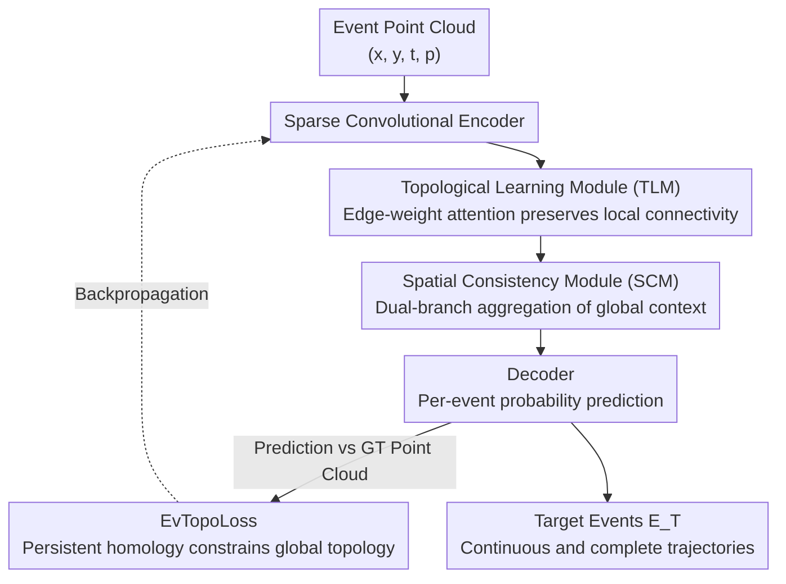

# Towards Persistence: Learning Topological Constraints for Event-based Small Object Detection

**Conference**: CVPR 2026  
**Paper**: [CVF Open Access](https://openaccess.thecvf.com/content/CVPR2026/html/He_Towards_Persistence_Learning_Topological_Constraints_for_Event_based_Small_Object_Detection_CVPR_2026_paper.html)  
**Area**: Object Detection / Event Camera / Small Object Detection  
**Keywords**: Event camera, small object detection, persistent homology, topological constraints, sparse convolution

## TL;DR
To address the issue of fractured small object trajectories in event camera point clouds, this paper proposes SpTopoNet. It employs a "Topological Learning Module + Spatial Consistency Module" to implicitly encode trajectory connectivity within the network, and an EvTopoLoss based on persistent homology to explicitly constrain the trajectory topology. This approach improves the IoU from 55.18% to 66.62% on the EV-UAV benchmark.

## Background & Motivation

**Background**: Small Object Detection (SOD) is critical in scenarios such as anti-UAV defense. However, traditional frame-based cameras are limited by frame rates of 30–60 Hz and a dynamic range of approximately 60 dB, leading to motion blur and loss of temporal information when capturing high-speed small objects. Event cameras record brightness changes asynchronously per pixel with a temporal resolution up to $10^6$ Hz, a dynamic range of 120 dB, and low data redundancy, making them naturally suited for high-speed dynamic perception. The current mainstream for event-based SOD treats the event stream as a spatio-temporal point cloud $(x, y, t, p)$ and utilizes sparse convolutions for per-event semantic segmentation to extract targets.

**Limitations of Prior Work**: Converting event streams into dense frames or voxel grids destroys the inherent sparsity and microsecond-level temporal precision of events, while introducing motion blur and static background redundancy. Although point-cloud-based methods preserve sparsity, they only perform **local neighborhood feature aggregation**, capturing short-range patterns while ignoring the **global trajectory structure** of object motion. Consequently, detected trajectories are often fragmented, leading to frequent missed detections during target turns or occlusions, resulting in temporal inconsistency.

**Key Challenge**: The appearance cues of small objects are extremely weak (most are smaller than $32\times32$ pixels), and their motion trajectories are non-linear and asynchronous. Relying solely on local features makes it impossible to distinguish between "continuous trajectories of real targets" and "randomly scattered background noise." While they appear similar at the pixel level, they differ fundamentally in their topological structure.

**Key Insight**: Through analysis using **persistent homology**, the authors found that target trajectories in event point clouds are continuous curves corresponding to **sparse persistent $H_0$ features** (connected components) and near-zero $H_1$ features (loops). In contrast, discrete and unstructured background noise corresponds to **dense $H_0$ features and a large number of spurious persistent $H_1$ loops**. That is, the connectivity of the trajectory itself is a quantifiable structural signal that can distinguish targets from noise.

**Core Idea**: Integrate topological constraints into both the **network architecture** and the **loss function**. The architecture uses attention mechanisms to implicitly preserve connectivity (avoiding the high cost of direct persistent homology calculation), while the loss function uses persistent homology to explicitly penalize fractures and spurious loops, forcing the network to output continuous and complete trajectories.

## Method

### Overall Architecture

SpTopoNet receives the raw event point cloud and outputs a binary classification (target/non-target) for each event. The task follows the definition of event segmentation: the event set $E = E_T \cup E_B \cup E_N$ is divided into target events $E_T$ (spatio-temporal continuous trajectories), background events $E_B$ (static background or camera motion), and noise $E_N$ (randomly scattered). The goal is to extract $E_T$ from the raw stream.

The entire network follows an encoder-decoder paradigm. The core consists of two parts: first, the insertion of **Topological Learning Modules (TLM)** across encoder layers to preserve connectivity at local scales using edge-weight attention; second, the use of a **Spatial Consistency Module (SCM)** for global context aggregation to reinforce long-range trajectory coherence. Since direct calculation of persistent homology within the network is computationally expensive, the authors only include persistent homology in the loss function (EvTopoLoss). Internally, the network "translates" topology into efficient graph and spatial attention to ensure real-time inference.

### Key Designs

**1. Topological Learning Module (TLM): Encoding "who should connect to whom" into local features via edge-weight attention**

The limitation is that on non-uniform event point clouds, standard attention only considers feature similarity and cannot distinguish between points on a true trajectory and noise points that happen to be spatially close. TLM injects an additional **spatial edge weight** into the standard attention scores: for each point $i$ and its $k$-nearest neighbors $N(i)$, the attention weight is:

$$\beta_{ij} = \frac{\exp\!\big(Q_i K_j^\top / \sqrt{d_k} + \mathrm{MLP}_{edge}(w_{ij})\big)}{\sum_{k \in N(i)} \exp\!\big(Q_i K_k^\top / \sqrt{d_k} + \mathrm{MLP}_{edge}(w_{ik})\big)}$$

where $w_{ij} = 1/\lVert x_i - x_j \rVert_2$ is an inverse distance encoding—closer points receive higher edge weights. Adding $\mathrm{MLP}_{edge}(w_{ij})$ to the logit before the softmax allows the model to explicitly reference "geometric adjacency strength," prioritizing feature aggregation along the trajectory direction and suppressing distant noise. After aggregation, LayerNorm and residual connections are applied, followed by bilinear interpolation upsampling back to the original resolution. Ablations show that placing TLM in shallow layers (layer 1) yields the greatest gain, as shallow layers preserve richer spatial structure and neighborhood connectivity information, whereas deep layers lose these fine-grained details during feature abstraction.

**2. Spatial Consistency Module (SCM): Suppressing outliers and complementing long-range coherence with global context**

While TLM handles local connectivity, it cannot manage long-range consistency (e.g., global patterns like a target moving at a constant linear velocity), and breaks or outliers may still occur. SCM processes input features using a dual-branch approach: the top branch performs global average pooling to obtain the global context $F_{global} = \frac{1}{N}\sum_{i=1}^{N} F_i^{in}$; the bottom branch generates spatial attention weights through a non-linear transformation, which then modulates the features of each point using the global context:

$$F_i^{out} = F_i^{in} + \lambda \cdot \big(\sigma(W_2 \cdot \mathrm{ReLU}(W_1 F_i^{in})) \odot F_{global}\big)$$

where $\sigma$ is the sigmoid function, $\odot$ denotes element-wise multiplication, and $\lambda$ is a scaling coefficient. Aggregating global context **conditioned on local features** (where the gate is calculated from $F_i^{in}$) and adding it back via a residual connection preserves details while suppressing outliers. Essentially, it allows each point to "glance at the global trajectory distribution" during decision-making, thereby enhancing spatio-temporal consistency. In ablation studies, SCM alone provides a gain comparable to TLM, indicating that global context is equally important.

**3. EvTopoLoss: Explicitly penalizing fractures and spurious loops using persistent homology**

Standard segmentation uses per-pixel BCE loss $L_{bce}(p,y) = -[y\log p + (1-y)\log(1-p)]$, which only evaluates point-wise classification and is **completely blind to global topology such as connectivity, holes, and clusters**. The paper provides an illustrative example: a trajectory with a single break (b1) and one with multiple breaks (b2) yield identical BCE values despite having vastly different topologies. Thus, the authors construct EvTopoLoss based on persistent homology. First, predictions and ground truth are binarized into point clouds $P_{pred} = \{e_i \mid p_i > \tau_{pred}\}$ and $P_{true} = \{e_j \mid y_j > \tau_{true}\}$. The loss contains two complementary terms $L_{evtopo} = L_{betti}^{(d)} + L_{wasserstein}^{(d)}$, where $d \in \{0, 1\}$ corresponds to connected components and loops, respectively.

**Betti Number Loss** constrains the count of topological features in each dimension: $L_{betti}^{(d)} = 0.5|\Delta\beta_d|^2$ (if $|\Delta\beta_d| \le 1$) or $|\Delta\beta_d| - 0.5$ (if $|\Delta\beta_d| > 1$), where $\Delta\beta_d = \beta_d(P_{pred}) - \beta_d(P_{true})$, and $\beta_d$ is the count of $d$-dimensional topological features with persistence exceeding a threshold $\varepsilon$. This term suppresses spurious fragments and loops introduced by noise (high $\beta_0, \beta_1$) while penalizing missed trajectory segments (low $\beta_0$). **Wasserstein Distance Loss** further requires the "significance distribution" of these features to match by comparing persistence diagrams: $L_{wasserstein}^{(d)} = \sqrt{\frac{1}{K}\sum_{i=1}^{K} w_i \cdot (\mathrm{pers}_1^{(i)} - \mathrm{pers}_2^{(i)})^2}$, where $\mathrm{pers} = \text{death} - \text{birth}$ measures the structural importance of each feature. Only the top-$K$ most persistent features are kept, with exponentially decaying weights $w_i$ biasing towards significant structures. Betti handles the count, while Wasserstein ensures the distribution of significance is correct, preventing the prediction of the right number of components with mismatched structural strengths. Finally, $L_{total} = L_{bce} + \lambda_{topo} L_{evtopo}$, with $\lambda_{topo}$ set to 0.05.

**4. Geometrically-aware Active Region Gradient: Making persistent homology loss differentiable and computable**

Persistent homology loss naturally faces two obstacles: matching predicted points to ground truth points for Wasserstein distance has $O(n^3)$ complexity and is non-differentiable. The author's observation is that **global optimal matching is unnecessary; local gradient assignment is sufficient for training**. By bypassing explicit matching, gradients are assigned directly to each predicted point as $\nabla_\pi L_{evtopo} = \sum_{p \in C(P_f)} \frac{\partial L_{evtopo}}{\partial \pi(p)}$, where $C(P_f)$ is the set of critical points in the filtered point cloud. To handle large-scale point clouds, an **active region mechanism** is introduced: gradients are calculated only within a narrow band near the decision threshold $A = \{p_i \mid \tau_{pred} - \delta < \pi(p_i) < \tau_{pred} + \delta\}$, where $\delta$ is the boundary width. The gradient for each point in the band is determined by geometric distance:

$$\frac{\partial L_{evtopo}}{\partial \pi(p_i)} = \tanh\!\big(2 \cdot (d_{min}^P(p_i) - d_{min}^T(p_i))\big) \cdot \eta$$

where $d_{min}^P$ and $d_{min}^T$ are the nearest distances from $p_i$ to the predicted and ground truth point clouds, respectively. The intuition is straightforward: active points near ground truth receive positive gradients and are "encouraged to remain," while points near the prediction but far from ground truth receive negative gradients and are "suppressed/removed." Active regions are processed in batches (size $\le B$). This concentrates computation on boundaries and guides gradients toward persistent features and their critical points using geometric distance, avoiding high costs and non-differentiability.

### Loss & Training
Total loss $L_{total} = L_{bce} + \lambda_{topo} L_{evtopo}$ with $\lambda_{topo} = 0.05$. Training for 50 epochs, batch size 1, using Adam optimizer with an initial learning rate of 0.001, decaying by 0.1 every 10 epochs. $\tau_{pred} = \tau_{true} = 0.5$ serves as the standard binarization threshold. Persistent homology features up to $H_1$ are extracted using Ripser. Evaluations use the best model on the validation set on an RTX 3090.

## Key Experimental Results

### Main Results
EV-UAV benchmark (147 sequences, 20.3 million events, multiple UAV maneuvers + various lighting/backgrounds, most targets $<32\times32$ pixels). Metrics: IoU, ACC, detection probability $P_d$, and false alarm rate $F_a$.

| Method | Rep. | IoU(%)↑ | ACC(%)↑ | $P_d$(%)↑ | $F_a$($10^{-4}$)↓ | Params | Runtime(ms) |
|------|------|---------|---------|-----------|-------------------|------|----------|
| RVT (CVPR23) | Voxel | 43.21 | 51.38 | 60.35 | 55.68 | 9.9M | 1737 |
| Spike-YOLO (ECCV24) | SNN | 43.94 | 48.26 | 59.62 | 55.38 | 69.0M | 1883 |
| COSeg (CVPR24) | Points | 51.89 | 60.93 | 71.32 | 9.21 | 23.4M | 364 |
| Ev-SpSegNet (ICCV25) | Points | 55.18 | 65.02 | 77.53 | 1.63 | 4.0M | 35.9 |
| **Ours** | Points | **66.62** | **74.43** | **83.36** | **1.29** | 4.4M | 56.5 |

Compared to the previous SOTA Ev-SpSegNet, IoU increased by 11.44 points and $P_d$ by approximately 5.83 points, while maintaining a lower false alarm rate. Overall, point-cloud-based methods outperform dense frame/voxel/SNN methods in both accuracy and efficiency; this work takes it a step further within the point-cloud paradigm, with the trade-off of a runtime increase from 35.9ms to 56.5ms (extra overhead from topological modules), which is still far faster than dense methods (typically 1000–3000ms).

### Ablation Study
Component ablation (TLM / SCM / $L_{evtopo}$ added sequentially):

| Config | IoU(%) | ACC(%) | $P_d$(%) | $F_a$($10^{-4}$) | Description |
|------|--------|--------|----------|------------------|------|
| Baseline | 52.77 | 58.41 | 75.15 | 2.31 | Vanilla backbone |
| + TLM | 63.32 | 69.50 | 81.01 | 1.73 | Local topology +10.55 IoU |
| + SCM | 62.50 | 68.98 | 81.68 | 1.49 | Global context, strong alone |
| + $L_{evtopo}$ | 61.47 | 66.55 | 77.23 | 1.44 | +8.7 IoU with loss only |
| Full | **66.62** | **74.44** | **83.37** | **1.29** | All three are complementary |

TLM layer ablation: using only layer 1 achieved 64.80 IoU (shallow gains are highest), while combining layers 1, 2, and 3 reached 66.62, showing that shallow layers preserve local topology while deep layers encode semantics. $\lambda_{topo} = 0.05$ was optimal on the validation set (IoU 67.17); values that were too small (0.01) yielded weak gains, while values that were too large (0.1) hindered convergence, dropping IoU to 54.19.

### Key Findings
- **Three components are independently effective**: Adding TLM, SCM, or $L_{evtopo}$ to the baseline individually increases IoU by 8–11 points and reduces false alarms, indicating that "local connectivity + global consistency + loss-level topological constraints" are complementary paths rather than redundant ones.
- **EvTopoLoss is plug-and-play**: Applying it to three different backbones (Ev-SpSegNet, 3D-UNet, PointNet++) consistently yielded improvements (e.g., +8.49 IoU, +4.91 $P_d$, and -21.76% $F_a$ for Ev-SpSegNet), proving the topological loss is a general trajectory integrity regularizer independent of specific architectures.
- **Topological constraints yield the greatest gains in complex noise and multi-object scenarios**: Visualizations show that baseline trajectories are severely fragmented, whereas topological constraints significantly improve continuity at turn points and occlusions, with a marked reduction in false alarms.

## Highlights & Insights
- **Operationalizing the observation that persistent homology distinguishes trajectories from noise into a trainable loss**: The topological signature of a real trajectory (sparse persistent $H_0$ + near-zero $H_1$) versus noise (dense $H_0$ + spurious persistent $H_1$) is an intuitive insight that translates directly into a Betti + Wasserstein dual loss—the standout "Aha!" moment of the paper.
- **Pragmatic division of labor between network and loss**: Since calculating persistent homology is expensive, the authors avoid placing it in the forward pass. Instead, they use cheap edge-weight attention/global attention for "implicit topology" in the network and real persistent homology for "explicit constraints" in the loss, balancing real-time inference with topological supervision.
- **Active Region + Tanh Geometric Gradient** solves the perennial problem of the non-differentiable $O(n^3)$ persistent homology loss: by abandoning global optimal matching and assigning gradients based on nearest distances to ground truth/prediction within a narrow band, this approximation is transferable to other point cloud/segmentation tasks using persistent homology as a loss.
- **The $1/\lVert x_i - x_j\rVert_2$ inverse distance encoding** in edge-weight attention is a lightweight and effective trick to inject geometric adjacency strength into attention logits, suitable for any point cloud task requiring "aggregation along structure and suppression of distant noise."

## Limitations & Future Work
- **Single dataset**: Evaluation is limited to the EV-UAV benchmark, although the authors acknowledge it is currently the only large-scale EVSOD benchmark. Generalization across different categories (non-UAV) or sensors remains unverified.
- **Topology assumption relies on "continuous target trajectories"**: The method leverages the prior that targets form a connected manifold in $(x, y, t)$. In cases of extremely intermittent motion or topological aliasing where multi-target trajectories cross and entangle, Betti/Wasserstein constraints might be counterproductive—a point not discussed in depth.
- **Overhead**: Runtime increased from 35.9ms to 56.5ms (approx. +57%). While still fast, this is a cost for ultra-real-time scenarios. Additionally, sensitivity to $\lambda_{topo}$ (0.05 being the sweet spot) suggests non-trivial hyperparameter tuning costs.
- **Batch size limited to 1**: Due to point cloud size and persistent homology computation, the training batch is small, potentially affecting BN-like statistics and training stability. This is a potential bottleneck for scaling to larger scenarios.

## Related Work & Insights
- **vs. Ev-SpSegNet (ICCV25, Point SOTA)**: Both use sparse convolutions for per-event segmentation. Ev-SpSegNet focuses on local neighborhood aggregation; this paper adds a "global trajectory topology" layer via TLM/SCM and persistent homology constraints, raising IoU from 55.18 to 66.62. The core difference is the upgrade from "local features" to "local + global topological structure."
- **vs. Dense/Voxel Methods (RVT, Spike-YOLO, etc.)**: These densify events into frames or voxels and apply CNNs/SNNs/Transformers, sacrificing microsecond precision and introducing motion blur. This work follows a pure sparse point cloud approach, superior in both accuracy and efficiency.
- **vs. Image-domain Topological Segmentation Losses (TopoLoss, TopoSeg, Betti matching, etc.)**: Previous topological losses used only birth-death times for matching, ignoring spatial geometry. This creates ambiguity on event point clouds with spatial coordinates and is computationally complex. This paper addresses these issues with **geometrically-aware gradients + active region mechanisms**, successfully applying topological losses to large-scale event point clouds.

## Rating
- Novelty: ⭐⭐⭐⭐⭐ First to integrate persistent homology into both network architecture and loss for event-based SOD, while solving differentiability and efficiency for event point clouds.
- Experimental Thoroughness: ⭐⭐⭐⭐ Comparison, ablation, layer-wise, weight sensitivity, and cross-backbone tests were conducted, but only on the single EV-UAV benchmark.
- Writing Quality: ⭐⭐⭐⭐ Motivation clearly explained via homology visualizations; formulas are complete and method logic is sound, though some notation is dense.
- Value: ⭐⭐⭐⭐⭐ EvTopoLoss is plug-and-play and yields gains across backbones; highly practical for high-speed small object scenarios like anti-UAV defense.

<!-- RELATED:START -->

## Related Papers

- [\[CVPR 2026\] Spike-driven Discrete Aggregation for Event-based Object Detection](spike-driven_discrete_aggregation_for_event-based_object_detection.md)
- [\[CVPR 2026\] BDNet: Bio-Inspired Dual-Backbone Small Object Detection Network](bdnetbio-inspired_dual-backbone_small_object_detection_network.md)
- [\[CVPR 2026\] CHAL: Causal-guided Hierarchical Anomaly-aware Learning for Moving Infrared Small Target Detection](chal_causal-guided_hierarchical_anomaly-aware_learning_for_moving_infrared_small.md)
- [\[CVPR 2026\] Beyond Duality: A Hybrid Framework of Leveraging Shared and Private Features for RGB-Event Object Detection](beyond_duality_a_hybrid_framework_of_leveraging_shared_and_private_features_for_.md)
- [\[CVPR 2026\] From Detection to Association: Learning Discriminative Object Embeddings for Multi-Object Tracking](from_detection_to_association_learning_discriminative_object_embeddings_for_mult.md)

<!-- RELATED:END -->
