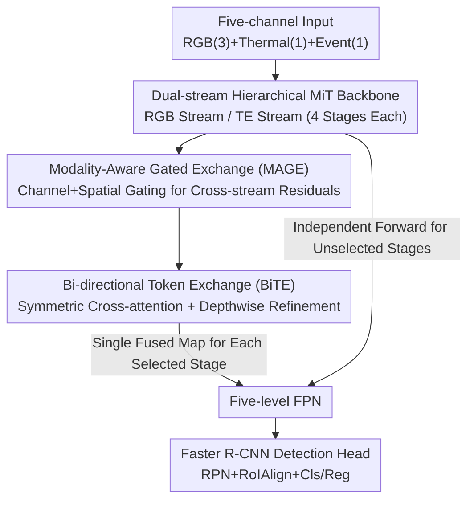

# Tri-Modal Fusion Transformers for UAV-based Object Detection

**Conference**: CVPR 2026  
**Paper**: [CVF Open Access](https://openaccess.thecvf.com/content/CVPR2026/html/Iaboni_Tri-Modal_Fusion_Transformers_for_UAV-based_Object_Detection_CVPR_2026_paper.html)  
**Code**: https://github.com/radlab-sketch/trimodal-uav-det (Available)  
**Area**: Object Detection / Multi-modal Fusion  
**Keywords**: UAV Detection, Tri-modal Fusion, Thermal Infrared, Event Camera, Hierarchical Transformer

## TL;DR
To address the failure of single sensors under low light, motion blur, and rapid scene changes in UAV applications, this paper employs a dual-stream hierarchical MiT Transformer to perform gated and bi-directional token exchange fusion across multiple resolution levels of the backbone for RGB, Thermal, and Event modalities. The authors release the first synchronized and aligned tri-modal UAV dataset (10,489 frames / 24,223 vehicle boxes). Through 61 sets of ablations, they systematically answer "at which layer and with which operator should tri-modal fusion occur," achieving an mAP of 84.24%.

## Background & Motivation
**Background**: In practical UAV perception, no single sensor is universally reliable—visible light cameras lose structural information under low light and motion, Thermal Infrared (LWIR) sensors saturate or blur during rapid maneuvers, and event cameras, while preserving microsecond-level temporal edges, produce sparse and noisy signals. While many studies pair RGB with one complementary modality (RGB-Thermal or RGB-Event), most detection pipelines are still built around RGB or, at most, dual-modalities.

**Limitations of Prior Work**: No single pair of modalities remains reliable under all adverse conditions; LWIR is relied upon at night, events during high-speed motion, and RGB during the day. Each covers only a subset of failure modes. However, "integrating three modalities into one detector" has not been systematically investigated. The challenge of tri-modal fusion goes beyond simple "channel stacking": LWIR reflects radiation contrast rather than texture, event streams encode asynchronous temporal changes without absolute intensity, and RGB provides high-resolution structure but collapses under illumination drift. These modalities differ in noise characteristics, spatial alignment sensitivity, temporal density, and semantic reliability.

**Key Challenge**: Early fusion (concatenating input channels) ignores these modality differences, while late fusion (merging high-level features) loses the ability to jointly shape representations at intermediate layers. Transformer backbones naturally provide interfaces for cross-modality exchange, but "at which resolution and with what mechanism to fuse" has never been systematically explored. A more practical obstacle is that existing RGB-T or RGB-E datasets do not provide synchronized tri-modal frames or resolution-aligned annotations; without data, controlled research is impossible.

**Goal**: To study tri-modal fusion as an **architecture design space**, decomposed into three controllable variables: fusion depth (layers), fusion mechanism (operators), and modality subsets. Simultaneously, to create a dataset that supports such controlled experiments.

**Key Insight**: Maintain independent streams for each modality to preserve modality-specific structures, **coupling them only at selected intermediate layers**. This allows for a clean study of "when, where, and how" fusion is most effective. All configurations expose the same interface to the downstream detection head, ensuring performance differences reflect only the fusion behavior.

**Core Idea**: Use a dual-stream hierarchical Transformer with pluggable fusion hooks, turning "where and how to fuse" into a knob that can be ablated step-by-step rather than maintaining a fixed end-to-end black box.

## Method

### Overall Architecture
The detector takes a five-channel tensor $X \in \mathbb{R}^{B \times 5 \times H \times W}$: channels 0-2 for RGB, channel 3 for Thermal, and channel 4 for the Event frame. The input is split into an RGB stream $X_{rgb}$ and a "Thermal-Event" (TE) stream $X_{TE}$. Each stream passes through a **weight-independent** four-stage MiT (Mix Transformer) backbone, producing multi-scale features at strides {4, 8, 16, 32}. In selected stages, a fusion block is inserted, consisting of two sub-modules: **MAGE** (Modality-Aware Gated Exchange) and **BiTE** (Bi-directional Token Exchange). These modules rectify and merge the two streams into a single feature map while **maintaining spatial resolution and channel width**. The fused features are fed into a standard five-level FPN, followed by a Faster R-CNN two-stage detection head.

The key ingenuity of this design is that since fusion does not change the feature shape (stride and width remain constant), the FPN and detection head **require no modifications** regardless of whether fusion is applied at a single layer, multiple layers, or all four layers. This provides the engineering prerequisite for ablating fusion as a pluggable operator. The paper also compares a three-stream scheme (RGB / Thermal / Event), finding that it increases parameters from 60.01M to 88.18M without meaningful accuracy gains, thus defaulting to the "RGB vs. TE" dual-stream scheme, which better fits UAV SWaP (Size, Weight, and Power) constraints.

### Key Designs

**1. Dual-stream Hierarchical Backbone + Resolution-aligned Fusion Hooks**

The limitation of early/late fusion is the inability to selectively couple modalities at intermediate layers or perform controlled "fusion depth" studies. This work runs an RGB stream and a TE stream through separate four-stage MiT backbones. Stage 1 uses $7\times7/s4$ overlapping patch embeddings, while stages 2-4 use $3\times3/s2$. Each transformer block uses pre-norm, spatial-reduction attention, and a depthwise $3\times3$ convolution between two FFN linear layers to restore local spatial coupling. Both streams follow identical resolution schedules (56→28→14→7 for a 224×224 input, with widths {64,128,320,512}), ensuring shape alignment at each stage. At the end of each stage, tokens are reshaped back to feature maps for the fusion module; **stages not selected for fusion simply proceed independently**. This turns the four stages into "resolution-aligned fusion slots," allowing clean comparisons of "single-layer vs. multi-layer vs. all-layer" configurations without breaking downstream interfaces.

**2. MAGE (Modality-Aware Gated Exchange): Rectifying Cross-stream Residuals**

Directly adding or concatenating streams allows noisy modalities to contaminate others. MAGE avoids this by first concatenating the streams into a joint descriptor $z = [x_{rgb} \,\|\, x_{TE}] \in \mathbb{R}^{B \times 2C \times H \times W}$, allowing gates to decide based on **joint evidence from both modalities** rather than single-stream statistics. Channel Gating: Global average and max pooling provide complementary summaries, followed by two-layer $1\times1$ MLPs (non-linearity + sigmoid) to generate directed per-channel gates $w^c_{TE\to rgb}, w^c_{rgb\to TE} \in [0,1]$. Spatial Gating: A lightweight $1\times1 \to \text{non-linear} \to 1\times1$ head predicts per-pixel masks $w^s_{TE\to rgb}, w^s_{rgb\to TE} \in [0,1]$ from $z$. The rectified features are:

$$\hat{x}_{rgb} = x_{rgb} + w^s_{TE\to rgb} \cdot \left(w^c_{TE\to rgb} \cdot x_{TE}\right), \quad \hat{x}_{TE} = x_{TE} + w^s_{rgb\to TE} \cdot \left(w^c_{rgb\to TE} \cdot x_{rgb}\right)$$

Crucially, the gates **only modulate cross-stream residual terms**, leaving the identity paths $x_{rgb}$ and $x_{TE}$ intact. This preserves modality-specific structures while enabling cross-modal enhancement only where evidence is consistent, suppressing noise transmission in specific regions.

**3. BiTE (Bi-directional Token Exchange): Merging via Symmetric Cross-attention**

MAGE only rectifies; the streams must still be merged. BiTE flattens $\hat{x}_{rgb}$ and $\hat{x}_{TE}$ into token sequences $T_{rgb}, T_{TE} \in \mathbb{R}^{B \times N \times C}$ ($N = HW$), projects Query/Key/Value, and updates each stream using **symmetric cross-attention**: $\tilde{T}_s = T_s + \mathrm{Softmax}\!\left(\frac{Q_s \bar{K}_s^\top}{\sqrt{d_k}}\right)\bar{V}_s$, where $s \in \{rgb, TE\}$ and $\bar{s}$ denotes the opposite stream. The residual updates introduce cross-modal context. Updated tokens are concatenated as $Z = [\tilde{T}_{rgb}; \tilde{T}_{TE}] \in \mathbb{R}^{B \times N \times 2C}$, reshaped back to a map, processed by a depthwise $3\times3$ convolution for locality, and compressed back to width $C$ via $1\times1$ projection to yield the fused map $u \in \mathbb{R}^{B \times C \times H \times W}$. This compression step allows BiTE to be inserted at any depth. Ablations show MAGE and BiTE are mutually essential: BiTE-only achieves 76.88% mAP, MAGE-only 81.01%, while the combination reaches 84.24%.

**4. Pluggable Fusion for Design Space Comparison: CSSA / GAFF**

A core contribution is treating the "fusion mechanism" as a replaceable variable. Besides MAGE+BiTE, the authors integrate two other operator families into the same backbone for comparison: **CSSA** (Channel Switching + Spatial Attention) is a lightweight alternative that score channels and switches them if below a threshold $\tau$, followed by a spatial gate. **GAFF** (Guided Attention Fusion) is a high-capacity alternative using squeeze-excitation and guided residual injections. All three families maintain stride and width. This design allows clean "Fusion Depth × Fusion Mechanism" comparisons under identical settings—concluding that CSSA suits shallow (s1) early fusion, GAFF suits deep (s3/s4) layers, while MAGE+BiTE is the strongest overall.

### Loss & Training
Models are trained for 15 epochs using SGD (0.9 momentum, $1\times10^{-4}$ weight decay), cosine learning rate with a 500-iteration linear warmup, and a base learning rate of 0.02 (global batch 16, scaled linearly). Inputs are used at their pre-aligned resolution of 301×391, padded to multiples of 32 for FPN compatibility. Anchors, proposal assignment, and loss settings are fixed across all experiments.

## Key Experimental Results

### Main Results
Dataset: 10,489 frames, 24,223 vehicle boxes (single class), 6,412 day + 4,077 night. Event frames are binned from polarity events in $\Delta t \approx 33.3$ ms windows. 61 total experiments were conducted.

**Backbone Capacity (MAGE+BiTE, Tri-modal Input)** — Performance is non-monotonic; MiT-B1 is optimal:

| Backbone | Params (M) | mAP | mAP50 |
|----------|------------|-----|-------|
| MiT-B0 | 27.79 | 80.63 | 97.85 |
| **MiT-B1** | 60.01 | **84.24** | **98.95** |
| MiT-B2 | 82.10 | 82.91 | 98.06 |
| MiT-B3 | 155.40 | 82.43 | 98.06 |
| MiT-B4 | 196.60 | 79.97 | 97.93 |

**Modality Ablation & External Baselines** (All use MiT-B1 + MAGE+BiTE):

| Configuration | mAP | mAP50 |
|---------------|-----|-------|
| RGB + Thermal (Ours strongest dual) | 83.42 | 98.22 |
| Thermal + Event | 74.86 | 96.95 |
| RGB + Event | 66.32 | 94.46 |
| YOLOv11-RGBT (External) | 82.08 | – |
| DetFusion (External) | 78.00 | – |
| Cross-dataset M3FD (RGB-T) | 81.79 | 97.36 |
| Cross-dataset RTDOD (RGB-T) | 69.21 | 93.87 |

Tri-modal (84.24%) consistently outperforms all dual-modalities. RGB+Thermal (83.42%) captures most gains, while Events mainly compensate for "missed detections due to motion blur" and "false positives from night-time thermal noise."

### Ablation Study
**Components of the Baseline Fusion Block** (MiT-B1 Tri-modal):

| Fusion Variant | mAP | Description |
|----------------|-----|-------------|
| BiTE-only | 76.88 | No reliability weighting; direct token exchange (-7.36) |
| MAGE-only | 81.01 | No token exchange; direct $2C\to C$ merge (-3.23) |
| MAGE+BiTE | 84.24 | Full Model |

**Depth vs. Mechanism**: Lightweight CSSA prefers shallow layers (s1 best at 83.44%), while high-capacity GAFF prefers deep layers (s4=83.41%). Multi-stage fusion (s1234) consistently performs worse than single-stage fusion, as repeated cross-scale switching tends to erode modality-specific structures.

### Key Findings
- **BiTE is more critical than MAGE**: BiTE-only drops to 76.88, indicating that token-level bi-directional exchange is the primary driver of fusion quality, though MAGE's gating provides necessary rectification.
- **Fusion depth is a decisive variable**: Mechanisms are depth-dependent. CSSA favors early fusion, GAFF favors late, and repeated multi-stage fusion generally leads to performance degradation.
- **Larger backbones do not equal better performance**: B4 (196.6M) performs worse than B1, suggesting that with fixed training schedules and medium-scale datasets, excess capacity leads to overfitting.
- **Modality contributions are unequal**: Thermal is the most informative auxiliary modality; Events provide "marginal gains" primarily in specific failure cases like motion blur.

## Highlights & Insights
- **"Fusion as a Design Space" Methodology**: By ensuring fusion blocks strictly maintain stride and width, the authors decoupled "Depth × Mechanism × Modality Subset" into independent knobs. This controlled experimental paradigm is rare in multi-modal fusion literature.
- **Gating the Residual Path**: Applying gates only to cross-stream residual terms rather than the identity path provides a structural guarantee for "modality identity protection" against clutter, which is more robust than simple addition/concatenation.
- **Dataset Contribution**: The first synchronized, pre-aligned, resolution-consistent RGB-T-E UAV dataset is a significant infrastructure contribution. The semi-automatic annotation protocol (YOLO proposals + manual audit) is rigorous.

## Limitations & Future Work
- **Single Class/Scene**: The dataset focuses only on "vehicles" in urban campus settings; generalization to pedestrians or complex terrains remains unverified.
- **Frame-based Event Representation**: By binning events into 33.3ms windows, the microsecond temporal resolution of event cameras is lost. The events are essentially treated as "another image."
- **Marginal Event Gains**: Most performance gains are attributed to RGB+Thermal. Whether adding an event camera is worth the additional SWaP cost depends on specific high-speed or night-time requirements.

## Related Work & Insights
- Compared to dual-modal methods (GAFF, CGFNet, CSSA), this work integrates three modalities into a unified architecture and uses these operators as controls within the same backbone.
- Unlike CMX-style frameworks that use fixed fusion strategies, this work explicitly opens four resolution-aligned hooks to systematically study the design space.

## Rating
- **Novelty**: ⭐⭐⭐⭐ First systematic tri-modal UAV detection framework; clean methodology of "fusion as design space." 
- **Experimental Thoroughness**: ⭐⭐⭐⭐⭐ 61 controlled ablations covering capacity, depth, mechanism, and modalities.
- **Writing Quality**: ⭐⭐⭐⭐ Clear motivation and rigorous logic; individual limitations of event representation could be discussed more explicitly.
- **Value**: ⭐⭐⭐⭐ The dataset and controlled benchmarks serve as solid infrastructure for the tri-modal fusion community.

<!-- RELATED:START -->

## Related Papers

- [\[CVPR 2026\] UAV-CB: A Complex-Background RGB-T Dataset and Local Frequency Bridge Network for UAV Detection](uav-cb_a_complex-background_rgb-t_dataset_and_local_frequency_bridge_network_for.md)
- [\[CVPR 2026\] Distribution-Aligned Multimodal Fusion for Robust Object Detection](distribution-aligned_multimodal_fusion_for_robust_object_detection.md)
- [\[CVPR 2026\] When Transformers Meet Mamba: A Hybrid Transformer-Mamba Network for Video Object Detection](when_transformers_meet_mamba_a_hybrid_transformer-mamba_network_for_video_object.md)
- [\[CVPR 2026\] Visual Prototype Conditioned Focal Region Generation for UAV-Based Object Detection](visual_prototype_conditioned_focal_region_generation_for_uav-based_object_detect.md)
- [\[CVPR 2026\] UAVGen: Visual Prototype Conditioned Focal Region Generation for UAV-Based Object Detection](uavgen_visual_prototype_conditioned_focal_region_generation_for_uav_based_object_detection.md)

<!-- RELATED:END -->
