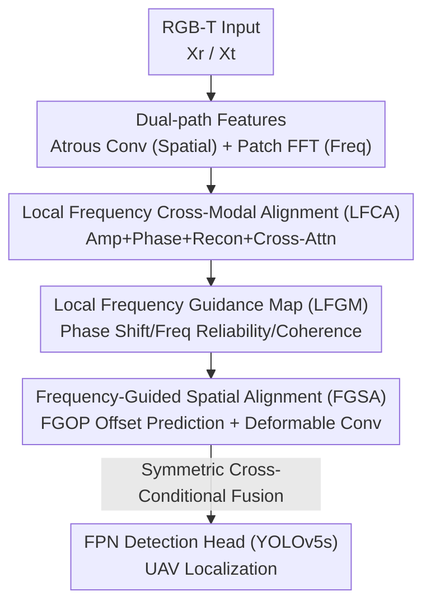

# UAV-CB: A Complex-Background RGB-T Dataset and Local Frequency Bridge Network for UAV Detection

**Conference**: CVPR 2026  
**Paper**: [CVF Open Access](https://openaccess.thecvf.com/content/CVPR2026/html/Huang_UAV-CB_A_Complex-Background_RGB-T_Dataset_and_Local_Frequency_Bridge_Network_CVPR_2026_paper.html)  
**Code**: https://github.com/hye999/UAV-CB (Dataset to be released)  
**Area**: Object Detection / RGB-T Multimodal  
**Keywords**: UAV detection, RGB-T fusion, Frequency domain modeling, Complex background, Camouflaged targets

## TL;DR
Aiming at the challenges of UAV detection in low-altitude complex backgrounds—characterized by "low contrast, weak boundaries, and high confusion with cluttered textures"—this paper constructs the UAV-CB dataset (3,442 image pairs, 5 background categories) with deliberately sampled camouflaged/complex scenes. It further proposes LFBNet, which performs alignment in the **local frequency domain**: first unifying the amplitude and phase of both modalities in the frequency domain, and then using frequency cues to guide spatial deformable registration. Ultimately, it achieves an AP(0.5:0.95) of 54.4% on UAV-CB, outperforming the previous best multimodal baseline C2Former by 5.3 points.

## Background & Motivation
**Background**: Low-altitude UAV detection is a critical front-end task for perception and countermeasure systems. Single-modality detectors (Faster R-CNN, YOLO series) and recent RGB-T multimodal solutions have been used to locate UAVs. Visible light provides texture, while thermal imaging is robust in low-light/night conditions, and their complementarity should theoretically improve robustness.

**Limitations of Prior Work**: In real-world low-altitude scenes, UAVs often "blend in" visually with structures such as buildings, vegetation, power lines, and clouds, presenting low contrast, weak edges, and strong confusion with background textures, leading to high false negatives and false positives. Although existing UAV datasets (Anti-UAV, DUT-Anti-UAV, etc.) involve diverse scenes, they **do not deliberately sample such camouflaged and complex background instances**. Most are oriented towards tracking tasks, failing to support failure mode analysis under authentic low-altitude complexity.

**Key Challenge**: Effectively "extracting" UAVs from complex backgrounds requires more discriminative cues than spatial texture. Frequency domain representations can suppress interference and amplify edge/structural differences, but direct fusion of frequency and spatial features faces two gaps: the **Frequency-Spatial Fusion Gap** (spatial features have local structure but lack a global spectral perspective, while global FFT loses local context) and the **Cross-Modal Discrepancy Gap** (inconsistent spectral characteristics between RGB and thermal imaging make alignment difficult).

**Goal**: (1) Establish an RGB-T UAV detection benchmark specifically focusing on complex backgrounds and camouflage; (2) Design a detection network capable of bridging the aforementioned two gaps simultaneously.

**Key Insight**: The authors observe that while RGB and thermal imaging differ in lighting and texture, they **share consistent geometric structures in the frequency domain**—high frequencies correspond to edge shapes, and low frequencies correspond to intensity energy. Thus, performing alignment in the "local frequency domain" leverages modality-insensitive frequency characteristics for cross-modal alignment while preserving local context through patch-wise operations.

**Core Idea**: Replace direct frequency-spatial fusion with "Local Frequency Bridging"—aligning the two modalities in local spectra (LFCA), and then using a frequency-difference-generated guidance map to drive spatial deformable registration (FGSA), serializing cross-modal alignment and spatial alignment into two stages.

## Method

### Overall Architecture
LFBNet takes a pair of RGB-T images $X_m\ (m\in\{r,t\})$ as input and outputs UAV detection boxes. The network first extracts complementary features in two branches: spatial features $F_m$ are obtained via multi-scale atrous convolutions; local frequency features are obtained by partitioning the image into patches $B_m^q$ followed by 2D FFT, yielding the complex spectrum for each block $\mathcal{F}^m_q=\mathbf{A}^m_q e^{j\boldsymbol{\Phi}^m_q}$ (Amplitude $\mathbf{A}$ + Phase $\boldsymbol{\Phi}$).

Subsequently, two core modules work in series: **LFCA** (Local Frequency Cross-Modal Alignment) aligns the modalities in the local frequency domain and generates a **Local Frequency Guidance Map (LFGM)**; LFGM then guides **FGSA** (Frequency-Guided Spatial Alignment) to perform frequency-aware deformable fusion in the spatial domain. The fused four-scale features (N=4) are fed into an FPN-based detection head (YOLOv5s) for localization. The overall pipeline follows a two-stage alignment: "Frequency Alignment → Frequency-Guided Spatial Alignment → Detection."

### Key Designs

**1. UAV-CB Dataset: Deliberately Sampling "Invisible" UAVs**

Existing datasets do not specifically cover camouflaged/complex backgrounds, making it impossible to analyze failure modes in real low-altitude scenes. Using the HP-DMS15 optoelectronic platform (coaxial RGB 1920×1080 + uncooled thermal 640×512, 8–14µm, hardware-synchronized for spatio-temporal alignment), the authors collected data from DJI Matrice 350 RTK and Matrice 4E. They **selectively extracted frames with strong background interference and obvious camouflage features** from massive raw footage, resulting in 3,442 RGB-T image pairs across five complex backgrounds: buildings, vegetation, power lines, clouds, and ground. Two notable design choices: first, **intentionally avoiding pixel-level registration**—since perfect alignment is nearly impossible in real systems, retaining parallax/sensor offsets is more realistic and forces the method to handle modal misalignment; second, most targets occupy <5% of the image area, emphasizing small object attributes. Data is split 6:2:2 with balanced distribution across background categories, scales, and models.

**2. LFCA: Unifying Energy and Structure in Local Spectra**

The root of the cross-modal discrepancy gap lies in the spectral inconsistency between RGB and thermal. LFCA exploits the commonality that "high frequencies manage edges and low frequencies manage energy" for a three-step alignment. **Amplitude alignment** first normalizes within each patch to remove scale bias $\tilde{\mathbf{A}}^m_q=\mathbf{A}^m_q/(\|\mathbf{A}^m_q\|_2+\epsilon)$, then adaptively mixes with learnable coefficients $\alpha_q\in[0,1]$ as $\mathbf{A}^a_q=\alpha_q\tilde{\mathbf{A}}^r_q+(1-\alpha_q)\tilde{\mathbf{A}}^t_q$, ensuring consistent energy amplitude under different lighting/emissivity. **Phase alignment** uses interpolation for coarse thermal geometry alignment and RGB edges for fine high-frequency structure:

$$\boldsymbol{\Phi}^a_q = \boldsymbol{\Phi}^t_q + \beta_q \cdot \mathrm{wrap}(\boldsymbol{\Phi}^r_q - \boldsymbol{\Phi}^t_q)$$

where $\mathrm{wrap}(\cdot)$ constrains phase differences to $[-\pi,\pi]$, and $\beta_q$ controls the contribution of RGB structural details. After alignment, $\mathcal{F}^a_q=\mathbf{A}^a_q e^{j\boldsymbol{\Phi}^a_q}$ is used to reconstruct the complex spectrum, which is aggregated back to the spatial domain via iFFT and overlap-add to obtain modality-consistent $\mathbf{F}_{\mathrm{align}}$. Finally, cross-attention injects the aligned frequency cues back into individual spatial features $\mathbf{F}^m_X=\mathrm{XAttn}(\mathbf{F}^m, \mathbf{F}_{\mathrm{align}})$. This frequency-domain alignment is more stable than direct spatial concatenation/attention.

**3. LFGM: Translating Spectral Differences into Spatially Readable Cues**

While LFCA handles frequency consistency, spatial misalignment from parallax and sensor offsets remains. To fix this, one must know "where it shifts, how much it shifts, and which modality to trust." LFGM encodes three complementary attributes for each patch into a 6D vector $\mathbf{G}^{(q)}_{\mathrm{freq}}=[d_x, d_y, S_\phi, C_{hf}, C_{lf}, Coh]$. Specifically, **phase displacement** uses sine/cosine of phase differences for direction and the L1 norm for intensity: $[d_x, d_y]=[\sin(\Delta\boldsymbol{\Phi}_q), \cos(\Delta\boldsymbol{\Phi}_q)]$, $S_\phi=\|\Delta\boldsymbol{\Phi}_q\|_1$; **frequency reliability** $C_{hf}, C_{lf}$ measures high/low-frequency energy ratios to determine which modality to trust; **spectral coherence** $Coh^{(q)}=|\sum\mathcal{F}^r_q(\mathcal{F}^t_q)^*|/\sqrt{\sum|\mathcal{F}^r_q|^2\sum|\mathcal{F}^t_q|^2}$ measures the correlation between the two modalities' spectra. All patch vectors are projected back to a dense pixel-level guidance map $\mathbf{G}_{\mathrm{freq}}$ via overlap-add, providing "frequency-informed" cues for offset prediction—acting as the bridge across the frequency-spatial gap.

**4. FGSA: Repairing Spatial Misalignment with Frequency-Guided Deformable Convolution**

Armed with $\mathbf{G}_{\mathrm{freq}}$, FGSA drives deformable registration. The **FGOP** (Frequency-Guided Offset Predictor) first performs gated modulation $\tilde{\mathbf{G}}=\sigma(\mathrm{Conv}_{1\times1}([\mathbf{F}^r_X, \mathbf{F}^t_X]))\odot\mathbf{G}_{\mathrm{freq}}$ to adaptively decide the usage of frequency priors, then predicts an offset field $\Delta\mathbf{p}=f_\theta([\mathbf{F}^r_X, \mathbf{F}^t_X, \tilde{\mathbf{G}}])$ via two layers of $3\times3$ convolutions and $1\times1$ projection. This offset, encoding frequency-informed geometric displacement, is fed into deformable convolutions for resampling: $\hat{\mathbf{F}}^m(p_0)=\sum_k w_k\,\mathcal{S}(\mathbf{F}^m_X, p_0+p_k+\Delta p_k(p_0))$. Finally, symmetric cross-conditional fusion allows bidirectional interaction: $\mathbf{F}_{\mathrm{out}}=\mathrm{Conv}_{3\times3}([\mathbf{F}^r, \hat{\mathbf{F}}^t])+\mathrm{Conv}_{3\times3}([\mathbf{F}^t, \hat{\mathbf{F}}^r])$, producing a geometrically aligned and spectrally consistent representation for the detection head. Compared to implicit learning, frequency cues provide explicit direction and intensity priors for offset prediction.

### Loss & Training
The detection head is based on YOLOv5s/FPN with standard detection losses. Training uses PyTorch on a single A100 (40GB), ResNet-50 backbone, $640\times512$ input, SGD (momentum 0.9, weight decay 5e-4, initial lr 0.01, cosine annealing), batch size 16, for 200 epochs on UAV-CB. Patch size is fixed at $16\times16$. For DroneVehicle, training lasts 400 epochs with $640\times640$ input for fair comparison. RGB images are cropped based on the thermal field of view for coarse registration before resizing.

## Key Experimental Results

### Main Results
On UAV-CB, LFBNet significantly leads both single-modality and multimodal detectors (AP, in %):

| Method | Modality | AP50 | AP75 | AP(0.5:0.95) | Param(M) | FLOPs(G) |
|------|------|------|------|------|------|------|
| RT-DETR (CVPR'24) | Visible | 73.4 | 43.7 | 44.2 | 12.0 | 98.6 |
| RT-DETR (CVPR'24) | Thermal | 79.5 | 52.7 | 49.2 | 12.0 | 98.6 |
| C2Former (TGRS'24) | RGB+T | 79.4 | 53.8 | 49.1 | 100.8 | 324.0 |
| SFDFusion (ArXiv'24) | RGB+T | 79.2 | 51.8 | 49.0 | 21.5 | 58.5 |
| **LFBNet (Ours)** | RGB+T | **84.6** | **57.2** | **54.4** | 30.2 | 65.2 |

LFBNet outperforms the previous best multimodal baseline C2Former by 5.3 points in AP(0.5:0.95) (54.4 vs 49.1) with only about 1/3 of the parameters and compute. It also beats SFDFusion (which also uses frequency information) by 5.4 points, indicating that "local frequency alignment + frequency-guided spatial fusion" is more effective than simple frequency introduction for modal alignment and camouflage resistance.

Cross-dataset generalization (Ground target RGB-T detection on DroneVehicle):

| Method | mAP50 (%) |
|------|------|
| C2Former (TGRS'24) | 72.8 |
| OAFA (CVPR'24) | 79.4 |
| **LFBNet (Ours)** | **80.1** |

Despite being designed for UAV-CB, LFBNet achieves the highest mAP50 when migrated to DroneVehicle (which has different sensors, views, and scenes), demonstrating that it learns generalizable RGB-T fusion principles rather than overfitting to UAV-CB.

### Ablation Study
Module-wise stacking on UAV-CB validation set (AP(0.5:0.95), %):

| Config | LFCA | FGSA | AP(0.5:0.95) | Gain | Note |
|------|------|------|------|------|------|
| YOLOv5s+Add | ✗ | ✗ | 38.5 | - | Baseline sum fusion |
| + LFCA only | ✓ | ✗ | 47.9 | +9.4 | Eliminates amplitude/phase inconsistency |
| + FGSA only | ✗ | ✓ | 49.3 | +10.8 | Fixes geometric mismatch via freq-guided sampling |
| Full LFBNet | ✓ | ✓ | 54.4 | +15.9 | Complementary effects |

### Key Findings
- **Both modules are strong individually and stronger together**: Adding only LFCA raises the baseline from 38.5 to 47.9 (+9.4), and adding only FGSA raises it to 49.3 (+10.8). Full integration reaches 54.4—LFCA provides modality-consistent spectral features, and FGSA refines spatial correspondence, showing clear complementarity.
- **Frequency domain alignment is functional, not a gimmick**: Outperforming SFDFusion by 5.4 points shows the advantage of "local patch frequency + translating spectral differences into explicit offset guidance."
- **Efficiency-friendly**: 30.2M parameters / 65.2 GFLOPs is far lower than C2Former's 100.8M / 324G, yet it achieves higher accuracy, making it more realistic for low-altitude real-time deployment.
- **Value of non-pixel-registered setting**: Intentionally retaining modal misalignment in the dataset allows FGSA's deformable alignment to prove its utility, mirroring real-world system constraints.

## Highlights & Insights
- **Shifting Alignment to Local Frequency Domain**: Utilizing the property that RGB and thermal share geometric structures in frequency and are relatively modality-insensitive, simultaneously aligning amplitude/phase in patch spectra proves more stable than spatial concatenation—a perspective transferable to other difficult-to-register multimodal fusion tasks (e.g., RGB-D, visible-SAR).
- **LFGM as a Masterstroke**: It translates abstract spectral differences into a 6D, spatially readable guidance map (Direction $d_x, d_y$, Intensity $S_\phi$, Frequency Reliability $C_{hf}, C_{lf}$, Coherence $Coh$), providing explicit priors for deformable sampling offsets rather than "blind learning." This "physical quantity guided deformable sampling" is highly reusable.
- **Methodological Awareness in Dataset Design**: Deliberate camouflage sampling + intentional lack of pixel registration turns the dataset into a lever for robust methodology rather than just a collection of samples.
- **Accuracy-Efficiency Win**: Surpassing a heavy Transformer baseline with one-third the compute suggests that "alignment quality" is more critical than "model capacity" for this task.

## Limitations & Future Work
- **Author Admission**: Future work needs to improve the domain adaptation capability of LFBNet and construct open-environment benchmarks to evaluate generalization under unseen weather/lighting/scenes.
- **Limited Data Scale**: 3,442 image pairs, a single platform, and two DJI models limit the model/sensor diversity, potentially affecting generalization to other UAVs or heterogenous sensors.
- **Missing Fine-grained Ablation**: Only AP(0.5:0.95) was provided for ablation. The contributions of the three steps in LFCA (Amp/Phase/Recon) and three components of LFGM weren't separately analyzed, nor was the sensitivity of learnable coefficients like $\alpha_q, \beta_q$.
- **Cost of Frequency Patching**: Discussion on the trade-off between patch size (fixed $16\times16$) and computational overhead, and whether patch boundaries introduce artifacts, is absent.

## Related Work & Insights
- **vs. Camouflaged Object Detection (COD)**: COD handles "visually non-salient targets" but usually for single-modality RGB and large static objects. This paper addresses multimodal, small, dynamic aerial objects, borrowing the "camouflage" perspective but using frequency mechanisms instead of boundary refinement.
- **vs. General RGB-T Fusion (C2Former / CMX)**: These methods mostly use attention/Transformers in the spatial domain for fusion. LFBNet switches to local frequency alignment + frequency-guided deformable registration, specifically tackling small UAV weak boundaries and modal misalignment with higher efficiency.
- **vs. Frequency Methods like SFDFusion**: Both use frequency, but the former focuses on global enhancement. This paper emphasizes "local" spectral alignment and explicit translation of spectral differences to spatial offset guidance, yielding a 5+ point gain.
- **vs. RGB-T Benchmarks like Anti-UAV**: Anti-UAV introduced RGB-T but was tracking-oriented and not specifically designed for complex backgrounds. UAV-CB fills this gap.

## Rating
- Novelty: ⭐⭐⭐⭐ Shifting alignment to the local frequency domain and using LFGM for offset guidance is a rare and self-consistent perspective in RGB-T fusion.
- Experimental Thoroughness: ⭐⭐⭐⭐ Sufficient main comparisons, cross-dataset generalization, and efficiency analysis; however, ablation for sub-components is sparse.
- Writing Quality: ⭐⭐⭐⭐ Clear logic from motivation to gaps to method; complete formulas and effective diagrams.
- Value: ⭐⭐⭐⭐ Both the dataset and method will be open-sourced, providing a practical benchmark and strong baseline for low-altitude anti-UAV perception.

<!-- RELATED:START -->

## Related Papers

- [\[CVPR 2026\] Tri-Modal Fusion Transformers for UAV-based Object Detection](tri-modal_fusion_transformers_for_uav-based_object_detection.md)
- [\[CVPR 2026\] Visual Prototype Conditioned Focal Region Generation for UAV-Based Object Detection](visual_prototype_conditioned_focal_region_generation_for_uav-based_object_detect.md)
- [\[AAAI 2026\] AerialMind: Towards Referring Multi-Object Tracking in UAV Scenarios](../../AAAI2026/object_detection/aerialmind_towards_referring_multi-object_tracking_in_uav_sc.md)
- [\[CVPR 2026\] FB-CLIP: Fine-Grained Zero-Shot Anomaly Detection with Foreground-Background Disentanglement](fb-clip_fine-grained_zero-shot_anomaly_detection_with_foreground-background_dise.md)
- [\[CVPR 2026\] Beyond Duality: A Hybrid Framework of Leveraging Shared and Private Features for RGB-Event Object Detection](beyond_duality_a_hybrid_framework_of_leveraging_shared_and_private_features_for_.md)

<!-- RELATED:END -->
