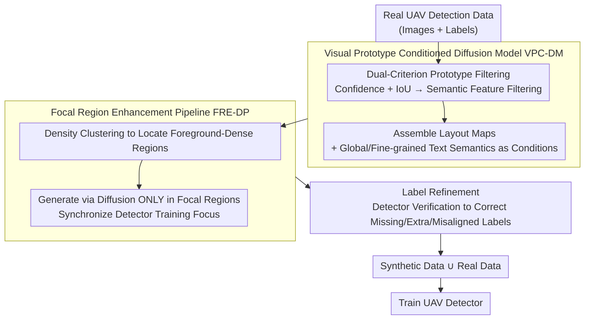

# UAVGen: Visual Prototype Conditioned Focal Region Generation for UAV-Based Object Detection

**Conference**: CVPR 2026  
**arXiv**: [2604.02966](https://arxiv.org/abs/2604.02966)  
**Code**: [https://github.com/Sirius-Li/UAVGen](https://github.com/Sirius-Li/UAVGen)  
**Area**: Object Detection / UAV Vision  
**Keywords**: UAV detection, layout-to-image generation, diffusion model, data augmentation, small object

## TL;DR

Proposes UAVGen, a layout-to-image data augmentation framework for UAV object detection, resolving low-quality small object generation, model capacity waste, and label inconsistency through a visual prototype conditioned diffusion model and a focal region enhancement pipeline.

## Background & Motivation

UAV object detection faces severe data scarcity, particularly in dynamically changing environments. While layout-to-image data augmentation methods based on diffusion models are effective in general detection, their performance is limited in UAV scenarios.

The authors analyze three core challenges:
1.  **Low-quality visual layouts**: Small object scales and frequent overlaps in UAV imagery lead to blurry or entangled cropped layout maps, affecting the clarity of conditioning signals for diffusion models.
2.  **Uneven model capacity allocation**: Objects in UAV images are concentrated in small areas, with large regions being low in information; diffusion models waste significant capacity on these uninformative regions.
3.  **Inconsistency between synthesized images and labels**: The randomness of the diffusion process causes synthesized images to deviate from input layouts, leading to missing generation, extra generation, and label misalignment, which is more severe in small object scenarios.

Existing methods directly apply general layout-to-image approaches to UAV detection without adapting to these specific challenges. UAVGen is the first data synthesis method specifically designed for training UAV detectors.

## Method

### Overall Architecture

UAVGen aims to address data scarcity in UAV detection and the failure of general layout-to-image augmentation in small object scenarios. It follows the paradigm of "training detectors on a joint set of diffusion-synthesized annotated data and real data," but introduces a customized pipeline targeting UAV pain points: first, the Visual Prototype Conditioned Diffusion Model (VPC-DM) filters clear prototypes to assemble layout maps, using them alongside text semantics as conditions to generate high-fidelity small object images; next, the Focal Region Enhancement Pipeline (FRE-DP) focuses both generation and detector training on foreground-dense small object regions to avoid wasting capacity on vast backgrounds; finally, Label Refinement corrects misalignments between synthesized images and annotations to produce augmented data ready for detector training. The following diagram illustrates the connected data flow:

### Key Designs

**1. Visual Prototype Conditioned Diffusion Model VPC-DM: Using filtered clear prototypes as conditions instead of blurry crops**

Due to small scales and overlaps, direct crops result in blurry layout maps. VPC-DM adopts a dual-criterion selection to construct prototypes: a pre-trained detector first identifies all objects, retaining candidates with high confidence and an $IoU$ above a threshold relative to ground truth boxes; a second filter based on semantic features ensures selected prototypes are visually clear and semantically distinct. These prototypes are assembled into layout images and used with global and fine-grained text semantics as diffusion conditions for high-fidelity small object generation.

**2. Focal Region Enhancement Pipeline FRE-DP: Generating only in dense small object areas to avoid wasting capacity on backgrounds**

In UAV images, objects are concentrated in small clusters while large background areas contain minimal information. FRE-DP locates foreground-dense regions via density clustering and restricts synthesis to these focal regions. Simultaneously, the detector training is focused here, significantly reducing redundant computation while improving small object generation quality in critical areas.

**3. Label Refinement Module: Using detectors to verify and remove synthesis noise**

The stochastic nature of diffusion can cause synthesized images to deviate from input layouts, resulting in three types of label errors: missing generation (label exists but no object generated), extra generation (objects generated without labels), and positional misalignment. Label Refinement serves as post-processing, using a detection model to re-detect synthesized images and match them against original labels to correct these errors, preventing label noise from polluting detector training.

### Loss & Training

The diffusion model follows the standard LDM training paradigm, conditioned on layout images constructed from visual prototypes and text prompts. The detector is trained on the joint set of original and synthetic data using standard detection losses.

## Key Experimental Results

### Main Results

| Dataset | Metric | Ours | Prev. SOTA | Gain |
|--------|------|-------------|----------|------|
| VisDrone (YOLO) | mAP | Significant improvement | Baseline methods | +3~5% |
| UAVDT | mAP | Optimal | General L2I methods | Obvious advantage |

### Ablation Study

| Configuration | Key Metric | Description |
|------|---------|------|
| w/o VPC-DM | mAP decreases | Visual prototypes are critical for generation quality |
| w/o FRE-DP | mAP decreases | Full-image generation is inefficient with poor small object quality |
| w/o Label Refinement | mAP decreases | Label noise significantly impacts training |

### Key Findings

- Quality filtering of visual prototypes is significantly more effective than using all raw cropped regions.
- Focal region generation strategies prevent wasting model capacity on expansive backgrounds.
- The Label Refinement step has a significant impact on final detection accuracy.

## Highlights & Insights

- Systematically adapts the layout-to-image data augmentation paradigm for UAV detection scenarios for the first time.
- The dual-criterion visual prototype selection is simple yet effective, integrating both detection confidence and semantic features.
- The focal region strategy cleverly bypasses interference from uninformative backgrounds in UAV imagery.
- Label Refinement as a post-processing step is simple but necessary, resolving label noise issues in synthetic data.

## Limitations & Future Work

- Relies on pre-trained detectors for prototype filtering and label refinement; the performance of these detectors influences the pipeline.
- Focal region selection strategies might lack robustness in extremely sparse scenes.
- Future work could explore end-to-end training of the entire augmentation-detection pipeline.

## Related Work & Insights

- Compared to general layout-to-image methods like GeoDiffusion and GLIGEN, UAVGen is deeply customized for UAV small object characteristics.
- The concept of Label Refinement can be extended to other synthetic data augmentation scenarios.

## Rating

- Novelty: ⭐⭐⭐⭐ — First synthetic data augmentation framework specifically for UAV detection.
- Technical Depth: ⭐⭐⭐⭐ — Strong systematic combination of visual prototypes, focal regions, and label refinement.
- Experimental Thoroughness: ⭐⭐⭐⭐ — Validated across multiple datasets and detectors.
- Value: ⭐⭐⭐⭐ — Directly addresses practical issues of data scarcity in UAV detection.

<!-- RELATED:START -->

## Related Papers

- [\[CVPR 2026\] Visual Prototype Conditioned Focal Region Generation for UAV-Based Object Detection](visual_prototype_conditioned_focal_region_generation_for_uav-based_object_detect.md)
- [\[CVPR 2026\] Tri-Modal Fusion Transformers for UAV-based Object Detection](tri-modal_fusion_transformers_for_uav-based_object_detection.md)
- [\[CVPR 2026\] UAV-CB: A Complex-Background RGB-T Dataset and Local Frequency Bridge Network for UAV Detection](uav-cb_a_complex-background_rgb-t_dataset_and_local_frequency_bridge_network_for.md)
- [\[CVPR 2026\] InvAD: Inversion-based Reconstruction-Free Anomaly Detection with Diffusion Models](invad_inversion-based_reconstruction-free_anomaly_detection_with_diffusion_model.md)
- [\[CVPR 2026\] Geometry-Aligned and Anomaly-Aware Reconstruction for 3D Anomaly Detection](geometry-aligned_and_anomaly-aware_reconstruction_for_3d_anomaly_detection.md)

<!-- RELATED:END -->
