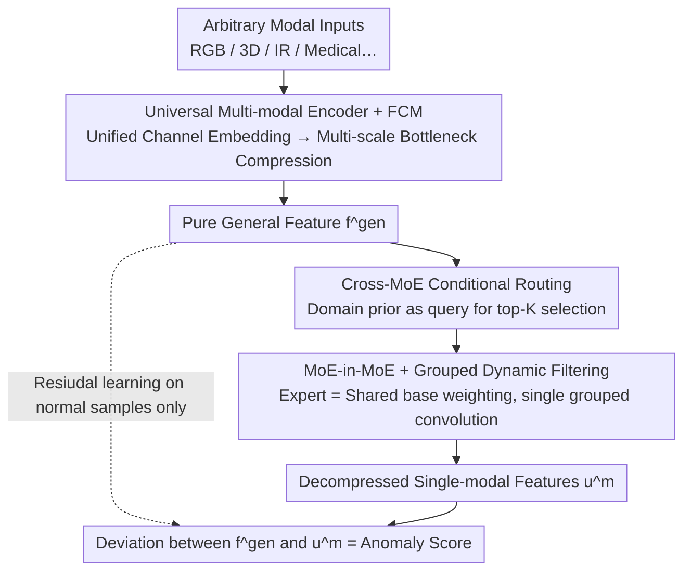

# UniMMAD: Unified Multi-Modal and Multi-Class Anomaly Detection via MoE-Driven Feature Decompression

**Conference**: CVPR2026  
**arXiv**: [2509.25934](https://arxiv.org/abs/2509.25934)  
**Code**: [yuanzhao-CVLAB/UniMMAD](https://github.com/yuanzhao-CVLAB/UniMMAD)  
**Area**: Object Detection  
**Keywords**: Anomaly Detection, Multi-Modal Fusion, Mixture-of-Experts, Feature Decompression, Unified Framework, Multi-Class Anomaly Detection

## TL;DR

UniMMAD is proposed as the first unified framework capable of handling multi-modal and multi-class anomaly detection using a single set of parameters. Its core is an MoE-driven feature decompression mechanism that adaptively decomposes general multi-modal encoded features into domain-specific single-modal reconstructions. It achieves SOTA performance across 9 datasets involving 3 domains, 12 modalities, and 66 categories.

## Background & Motivation

**Limitations of Prior Work**: Current anomaly detection methods treat modalities and categories as independent factors. Different modal combinations require training dedicated models, leading to deployment difficulties and massive memory overhead.

**Key Challenge of Shared Decoders**: Multi-class methods like UniAD and MambaAD use shared decoding paths. However, when facing large cross-domain variations (differences in appearance, lighting, scale, background, etc.), normality boundaries are distorted, resulting in severe domain interference and high false-positive rates.

**Goal**: Industrial product quality inspection requires coordination between different sensors (infrared cameras for internal damage, RGB+3D for color and geometry). Customizing models for every combination is impractical.

**Key Insight**: Trends in unified vision models like SegGPT and Spider demonstrate the possibility of processing multi-task scenarios with a single architecture, inspiring the migration of this paradigm to the anomaly detection field.

**Key Challenge in Heterogeneity**: In multi-modal and multi-class scenarios, appearance, lighting, scale, and anomaly semantics vary greatly, making consistent representation learning and anomaly discrimination extremely difficult.

**Goal for Efficiency**: A practical unified AD model requires high precision, fast inference, sparse computation, and the ability to adapt to new categories/modalities without catastrophic forgetting.

## Method

### Overall Architecture

UniMMAD processes multi-modal and multi-class anomaly detection with a single parameter set using a "General → Specific" paradigm: decompressing general multi-modal features into multiple single-modal features $f^{\text{gen}} \rightarrow \{u^m\}_{m=1}^M$. The model learns to predict the residual between $f^{\text{gen}}$ and each $u^m$ only on normal samples. During inference, anomalous regions cannot be correctly decompressed, and the deviation serves as the anomaly indicator. The mechanism is: a **Universal Multi-modal Encoder + FCM** compresses arbitrary modal combinations into pure general features $f^{\text{gen}}$, which are then adaptively decompressed back into single-modal features $u^m$ via **Cross-MoE Conditional Routing** based on domain conditions. The routers use **MoE-in-MoE + Grouped Dynamic Filtering** to maintain sparsity, reduce parameters, and minimize latency. This asymmetric "Compress General, Decompress Specific" design naturally avoids shortcut reconstructions.

### Key Designs

**1. Universal Multi-modal Encoder + Feature Compression Module (FCM): Compressing arbitrary combinations into pure general features**

Fragmented prior methods trained separate models for each modal combination, which is unsustainable for deployment. UniMMAD's encoder uses an input embedding layer to pad arbitrary modal inputs to a unified channel dimension $C$. Three residual blocks combined with cross-modal prior means extract and refine features. The FCM then employs a hierarchical bottleneck structure—internal multi-scale bottlenecks use parallel $1\times1$, $3\times3$, and $5\times5$ convolutions to preserve normal patterns while suppressing scale-sensitive anomalies; external bottlenecks perform fine-grained compression at higher semantic levels, outputting pure general features $f_1^{\text{gen}}, f_2^{\text{gen}}, f_3^{\text{gen}}$.

**2. Cross Mixture-of-Experts (C-MoE) Conditional Routing: Domain-context expert selection to inhibit anomaly leakage**

In multi-modal and multi-class settings, domain variations distort normality boundaries in shared paths. The C-MoE conditional router projects general features as keys/values and domain priors as queries. Convolution and global average pooling yield global statistics $g_l^m$, encapsulating domain-specific context to inhibit anomaly leakage. The gating function produces top-K expert indices and scores, paired with an annealing load-balancing loss $\mathcal{L}_{\text{MoE}}$ (decaying by $(1-e/E)^2$) to achieve "extensive activation early, stable routing late." Experts are split into fixed experts (capturing shared knowledge) and routed experts (providing task-specific capabilities).

**3. MoE-in-MoE + Grouped Dynamic Filtering: Maintaining sparsity while reducing parameters and latency**

Naive expert stacking explodes parameters and latency. Each routed expert (MoE-Leader) is designed as a weighted combination of shared base experts $W \in \mathbb{R}^{N_{\text{exp}} \times O \times I \times K_s \times K_s}$. MoE-Leaders only store combination weights $S \in \mathbb{R}^{N_{\text{exp}} \times O}$, **reducing parameters by approximately 75%**. During inference, value tensors are replicated and reshaped with groups $= K_{\text{route}}+1$, allowing a single grouped convolution to execute all expert filtering in parallel, significantly lowering latency.

### Loss & Training

- **Decompression Consistency Loss** $\mathcal{L}_{\text{DeC}}$: Measures the deviation between decompressed features and original single-modal features using negative cosine similarity, with a focal loss modulator $\gamma=2$ to enhance focus on minority classes.
- **Total Loss**: $\mathcal{L} = \mathcal{L}_{\text{DeC}} + \mathcal{L}_{\text{MoE}}$, optimized end-to-end.

## Key Experimental Results

### Main Results

Comprehensive evaluation across 9 datasets covering industrial (MVTec-3D, Eyecandies, MulSen-AD), medical (BraTs, UniMed), and traditional industrial (MVTec-AD, VisA) scenarios:

| Dataset | Metric | Prev. SOTA (Specialized) | Ours (UniMMAD) | Gain |
|--------|------|------------|---------|------|
| MVTec-3D | AUC_I / AUC_P | 92.4 / 98.9 (CFM) | **92.5 / 99.1** | Outperforms specialized |
| Eyecandies | AUC_I / AUC_P | 81.8 / 95.8 (CFM) | **85.6 / 96.9** | AUC_I +3.7% |
| MulSen-AD | AUC_I / AUC_P | 78.9 / 97.8 (TripleAD) | **85.5 / 97.9** | AUC_I +6.6% |
| BraTs | AUC_I / AUC_P | 91.8 / 95.7 (PatchCore+MMRD) | **95.8 / 97.5** | AUC_I +4.0% |
| UniMed | AUC_I / AUC_P | 96.1 / 92.7 (INP-Former) | **96.3 / 92.0** | Comparable |
| MVTec-AD | AUC_I / AUC_P | 99.2 / 98.2 (INP-Former) | **99.4 / 98.1** | AUC_I +0.2% |
| VisA | MF1_P | 44.4 (INP-Former) | **47.2** | +2.8% (Complex multi-instance) |

### Ablation Study

| Component | Mean AUC_I | Mean AUC_P | Mean MF1_P |
|------|-----------|-----------|-----------|
| Baseline | 75.6 | 86.6 | 28.5 |
| + FCM | 77.4 | 86.7 | 28.9 |
| + General→Specific | 84.3 | 96.1 | 37.1 |
| + C-MoE (Full) | **91.1** | **96.7** | **42.9** |
| w/o Cross-condition | 85.1 | 95.7 | 37.9 |
| w/o Routed Experts | 85.4 | 96.0 | 37.8 |
| w/o Fixed Expert | 89.4 | 96.5 | 41.5 |
| w/o Multi-scale Exp. | 88.9 | 96.4 | 41.2 |

### Key Findings

- **General→Specific paradigm yields the greatest contribution**: Its introduction improved AUC_I by 8.9% and AUC_P by 10.9%, proving the effectiveness of asymmetric decompression.
- **C-MoE provides a further 8.1% average AUC_I gain**, with cross-condition routing and routed experts identified as the most core designs.
- **Excellent Continual Learning**: By fine-tuning less than 10% of parameters (MoE-leader, conditional router, aggregation conv), performance on new tasks approaches joint training, with less than 8% degradation on old tasks.
- **Significant advantage over generalist models**: Ours consistently leads over models like AdaCLIP, MVFA, and AA-CLIP, especially in multi-modal scenarios.

## Highlights & Insights

- **First Unified Multi-modal Multi-class AD Framework**: A single parameter set covers 3 domains, 12 modalities, and 66 categories, offering high practical utility.
- **Sophisticated MoE-in-MoE Parameter Efficiency**: Routed experts store only $N_{\text{exp}} \times O$ combination weights, reducing parameters by 75% while maintaining sparse activation and fast inference.
- **Grouped Dynamic Filtering for Speed**: Merges multiple expert filters into a single operation via tensor reshaping and grouped convolution, ensuring efficient engineering implementation.
- **Annealing Load Balance Loss**: The $(1-e/E)^2$ decay coefficient achieves an "explore then stabilize" routing strategy, which is more elegant than fixed weights.
- **Experimental Thoroughness**: Extensive coverage including 9 datasets, detailed ablations, continual learning experiments, and qualitative analysis.

## Limitations & Future Work

- The prior generator relies on WideResNet50 pre-trained models; prior quality may be limited in non-natural image domains (e.g., industrial X-ray, specific medical modalities).
- Continual learning still requires a 1% mix of old data; it is not a completely replay-free solution.
- Inputs are fixed to $256 \times 256$, potentially causing information loss for tiny defects requiring high-resolution localization.
- Scalability of MoE-Leader count (32) and base expert count (8) in even larger-scale scenarios is not fully verified.
- Pixel-level MF1_P metrics remain relatively low (40-50%), indicating significant room for improvement in fine-grained segmentation.

## Related Work & Insights

- **Multi-modal AD**: M3DM uses patch contrastive learning for RGB+Pointcloud; CFM proposes lightweight cross-modal mapping; MMRD introduces normal modalities for inverse distillation. UniMMAD replaces parameter-independent fusion with a unified encoder.
- **Multi-class AD**: UniAD pioneered the shared-model multi-class paradigm; ViTAD/MambaAD improved backbones; INP-Former achieved top single-modal multi-class performance. UniMMAD addresses domain interference in shared decoders via MoE.
- **MoE in Vision**: V-MoE embeds MoE into ViT; DeepSeekMoE emphasizes parameter efficiency. UniMMAD’s Cross-condition routing and MoE-in-MoE are novel designs targeting AD heterogeneity.

## Rating

- Novelty: ⭐⭐⭐⭐⭐ (First unified multi-modal multi-class AD framework; General→Specific and C-MoE are novel designs)
- Experimental Thoroughness: ⭐⭐⭐⭐⭐ (9 datasets, 3 domains, 12 modalities, 66 classes, complete ablation + continual learning)
- Writing Quality: ⭐⭐⭐⭐ (Clear structure, rich visuals, but dense formulas)
- Value: ⭐⭐⭐⭐⭐ (The unified framework approach has direct utility for industrial AD deployment; MoE design is transferable)

<!-- RELATED:START -->

## Related Papers

- [\[AAAI 2026\] SM3Det: A Unified Model for Multi-Modal Remote Sensing Object Detection](../../AAAI2026/object_detection/sm3det_a_unified_model_for_multi-modal_remote_sensing_object_detection.md)
- [\[CVPR 2026\] A Semantically Disentangled Unified Model for Multi-category 3D Anomaly Detection](a_semantically_disentangled_unified_model_for_multi-category_3d_anomaly_detectio.md)
- [\[CVPR 2026\] GPFlow: Gaussian Prototype Probability Flow for Unsupervised Multi-Modal Anomaly Detection](gpflow_gaussian_prototype_probability_flow_for_unsupervised_multi-modal_anomaly_.md)
- [\[CVPR 2026\] Bidirectional Multimodal Prompt Learning with Scale-Aware Training for Few-Shot Multi-Class Anomaly Detection](bidirectional_multimodal_prompt_learning_with_scale-aware_training_for_few-shot_.md)
- [\[CVPR 2026\] Learning Multi-Modal Prototypes for Cross-Domain Few-Shot Object Detection](learning_multi-modal_prototypes_for_cross-domain_few-shot_object_detection.md)

<!-- RELATED:END -->
