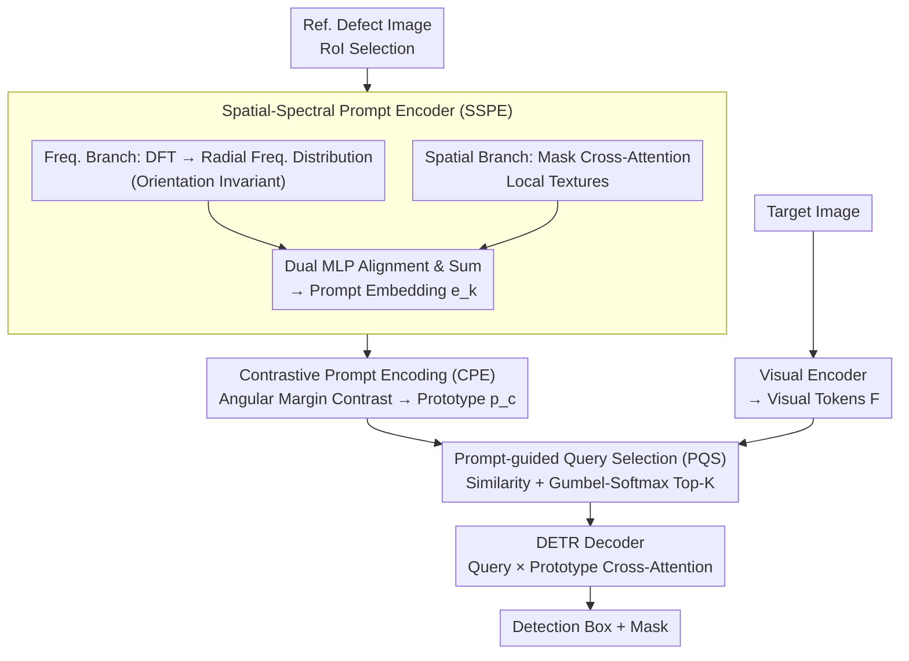

# UniSpector: Towards Universal Open-set Defect Recognition via Spectral-Contrastive Visual Prompting

**Conference**: CVPR 2026  
**arXiv**: [2604.02905](https://arxiv.org/abs/2604.02905)  
**Code**: [https://geonuk-kimmm.github.io/UniSpector](https://geonuk-kimmm.github.io/UniSpector)  
**Area**: Object Detection  
**Keywords**: Open-set Defect Detection, Frequency-domain Features, Contrastive Prompt Encoding, Visual Prompting, Industrial Inspection

## TL;DR

This paper proposes UniSpector, an open-set industrial defect detection framework. By integrating Spatial-Spectral Prompt Encoding (SSPE) and Angular-Margin Contrastive Prompt Encoding (CPE), it addresses the prompt embedding collapse issue. On the newly constructed Inspect Anything benchmark containing 360 defect categories, it outperforms the best baselines by 19.7% and 15.8% in AP50 for detection and segmentation, respectively.

## Background & Motivation

1. **Background**: Industrial quality inspection requires detecting various unseen defect types. Existing open-set detection methods (e.g., GroundingDINO, T-Rex2) are primarily designed for natural images and perform poorly in industrial scenarios—defects are often subtle texture/color anomalies with feature distributions vastly different from natural objects.
2. **Limitations of Prior Work**: (1) Visual prompting methods in industrial scenarios suffer from "prompt embedding collapse," where prompt vectors of different defect types overlap significantly in the embedding space; (2) existing methods only utilize spatial features, ignoring frequency-domain characteristics (e.g., periodic texture anomalies are more discriminative in the frequency spectrum).
3. **Key Challenge**: The visual differences in industrial defects are extremely subtle (often just tiny scratches, pits, or color variations). Pure spatial RoI features fail to capture these differences, causing prompt vectors of different classes to collapse into the same region.
4. **Goal**: To design a prompt encoding scheme capable of extracting discriminative defect features in both frequency and spatial domains and explicitly increasing the embedding distance between different defect categories through contrastive constraints.
5. **Key Insight**: Frequency-domain features (e.g., energy concentration patterns of periodic stripes in the spectrum) are more stable and discriminative than spatial pixels—an idea inspired by classical spectral analysis in signal processing.
6. **Core Idea**: A trinity of Spatial-Spectral Prompt Encoding (SSPE), Contrastive Prompt Encoding (CPE), and Prompt-guided Query Selection (PQS) to solve industrial open-set detection.

## Method

### Overall Architecture

UniSpector addresses the open-set problem of using a reference defect image to detect/segment similar defects. The primary difficulty lies in the extremely subtle visual differences of industrial defects and the tendency for pure spatial prompt vectors to collapse. The pipeline follows a DETR-like structure with a "prompt path" and a "target image path" that later converge. In the prompt path, the RoI is cropped from the reference image, features are extracted via SSPE across frequency and spatial domains to form prompt embeddings, which are then explicitly separated by CPE using angular margin contrastive loss to obtain category prototypes. In the target image path, the visual encoder processes the target image into visual tokens. The two paths merge at PQS, which selects the most relevant queries using similarity between prototypes and tokens. These queries are sent to the DETR decoder for cross-attention with prototypes, finally outputting detection boxes and segmentation masks. SSPE, CPE, and PQS respectively target "discriminative feature extraction," "embedding collapse prevention," and "accurate query selection."

### Key Designs

**1. Spatial-Spectral Prompt Encoder (SSPE): Recovering subtle differences via frequency spectrum**

Pure spatial RoI pixels struggle to distinguish defect classes. SSPE introduces a frequency branch alongside the spatial one: applying 2D DFT to RoI $R_k$ yields spectrum $F_k(u,v)=\text{DFT}(R_k)$, which is then aggregated into a radial frequency distribution

$$h_k(\rho) = \frac{1}{|\Gamma_\rho|}\sum_{(u,v) \in \Gamma_\rho}|F_k(u,v)|$$

Encoded by a radial frequency encoder to get $z_k^{\text{freq}}$. This radial aggregation is key—it averages the spectrum by distance $\rho$ to the origin, naturally removing orientation information and making it immune to random defect orientations. The spatial branch uses mask cross-attention for local textures $z_k^{\text{spatial}}$. The two are aligned and fused via dual MLPs: $\mathbf{e}_k = f_{\text{align}}(z_k^{\text{spatial}}) + v_{\text{align}}(z_k^{\text{freq}})$.

**2. Contrastive Prompt Encoding (CPE): Separating collapsed embeddings via angular margins**

Even with richer features, standard contrastive losses might yield loose decision boundaries. CPE adopts the angular margin approach from ArcFace: category prototypes $\mathbf{p}_c$ are computed as the mean of embeddings within a class, and a margin $m$ is added to the cosine similarity in the loss function:

$$\mathcal{L}_{\text{CPE}} = -\frac{1}{N}\sum_{k=1}^N \log\frac{\exp(\alpha\cos(\theta_{y_k,k}+m))}{\exp(\alpha\cos(\theta_{y_k,k}+m))+\sum_{c\neq y_k}\exp(\alpha\cos(\theta_{c,k}))}$$

where $\theta_{c,k}$ is the angle between $\mathbf{e}_k$ and $\mathbf{p}_c$. Adding a penalty $+m$ to the correct class forces samples to be closer to their prototype than the margin, ensuring intra-class compactness and inter-class separation.

**3. Prompt-guided Query Selection (PQS): Differentiable end-to-end query selection**

PQS uses cosine similarity between visual tokens $\mathcal{F}$ and category prototypes $\mathbf{p}$ as relevance scores. It employs Gumbel-Softmax for differentiable top-K selection, using a Straight-Through Estimator for discrete forward selection and gradient preservation backward. This ensures that the selection process explicitly depends on the prompt prototypes and can be optimized end-to-end with the detection loss.

### Loss & Training

The total loss consists of the CPE angular margin contrastive loss plus standard detection and segmentation losses. Both $\alpha$ (scaling factor) and $m$ (margin) are hyperparameters. The model is based on the DINOv architecture and trained on the InsA training set.

## Key Experimental Results

### Main Results

| Method | GC10 | MagTile | Real-IAD | MVTec | Avg. AP50↑ |
|------|------|---------|----------|-------|------------|
| GroundingDINO | 9.6 | 26.7 | 0.3 | 1.4 | 5.4 |
| DINOv† | 16.5 | 48.4 | 21.0 | 15.9 | 17.1 |
| T-Rex2† | 32.4 | 49.0 | 25.1 | 24.4 | 32.7 |
| YOLOE† | 10.7 | 43.3 | 17.2 | 25.8 | 17.4 |
| **UniSpector†** | **38.2** | **63.3** | **69.1** | **53.5** | **40.9** |

### Ablation Study

| Components | APb | AP50b | AP75b | APm | AP50m |
|------|-----|-------|-------|-----|-------|
| Baseline | 13.6 | 24.0 | 14.5 | 7.7 | 20.0 |
| +SSPE | 27.9 | 43.0 | 31.0 | 17.7 | 34.8 |
| +SSPE+CPE | 43.8 | 65.8 | 48.9 | 26.0 | 53.1 |
| +SSPE+CPE+PQS | **46.3** | **69.1** | **51.9** | **28.9** | **56.7** |

### Key Findings

- SSPE contributes the most (AP50b +19.0), with CPE further improving results by 22.8 and PQS adding 3.3—the cumulative effect far exceeds individual components.
- Cross-domain generalization (3CAD=14.1, VISION=15.3, VisA=32.8) is lower than in-domain but still significantly outperforms baselines.
- Close-set performance (90.0 AP50b) is competitive with specialized close-set detectors (YOLOv11 88.3, MaskDINO 91.7), indicating no sacrifice in accuracy for open-set capabilities.
- PQS differentiable top-K selection outperforms learnable parameters and heuristic top-K (GC10 AP50b: 38.2 vs 34.4/35.6).

## Highlights & Insights

- **Frequency-domain Integration**: The use of radial frequency for orientation invariance is a highly tailored design for industrial defects where orientation is unknown but frequency patterns are stable.
- **Construction of InsA Benchmark**: Unified evaluation with 67k images and 360 defect classes fills a gap in large-scale open-set industrial benchmarks.
- **Transfer of ArcFace Concepts**: Migrating angular margin contrastive learning to prompt encoding for defect detection is natural and highly effective.

## Limitations & Future Work

- Significant drop in cross-domain performance (in-domain 40.9 vs cross-domain ~20) due to lighting and texture variations across factories.
- Prompt quality depends on annotated reference images, which might involve high costs in industrial settings.
- Frequency features are sensitive to defect size—extremely small defects may lack sufficient signal in the spectrum.
- Inference requires reference defect images, lacking the flexibility of language-based prompting for describing new defect types.

## Related Work & Insights

- **vs T-Rex2**: T-Rex2 relies on pure spatial visual prompts, suffering from significant embedding collapse in industrial scenes. UniSpector fundamentally improves prompt discriminability via frequency features.
- **vs GroundingDINO**: Text-prompted methods perform poorly (AP50=5.4) as industrial defects are hard to describe accurately in natural language.
- **vs YOLOE**: Recent YOLO-based real-time detectors also struggle, suggesting that detection capabilities on natural images do not translate directly to industrial domains.

## Rating

- Novelty: ⭐⭐⭐⭐ Combination of frequency prompt encoding and angular margin contrast is novel.
- Experimental Thoroughness: ⭐⭐⭐⭐⭐ Comprehensive ablations, cross-domain tests, close-set comparisons, and a new benchmark.
- Writing Quality: ⭐⭐⭐⭐ Clear structure and well-founded motivation.
- Value: ⭐⭐⭐⭐ Addresses practical industrial needs with significant benchmark contributions and deployable methods.

<!-- RELATED:START -->

## Related Papers

- [\[CVPR 2026\] Evaluating Few-Shot Pill Recognition Under Visual Domain Shift](evaluating_few-shot_pill_recognition_under_visual_domain_shift.md)
- [\[CVPR 2026\] ViTPrompt: Training-Free Prompt Refinement with Visual Tokens for Open-Vocabulary Detection](vitprompt_training-free_prompt_refinement_with_visual_tokens_for_open-vocabulary.md)
- [\[CVPR 2026\] Prompt-Free Universal Region Proposal Network](prompt-free_universal_region_proposal_network.md)
- [\[ICML 2026\] Mixture Prototype Flow Matching for Open-Set Supervised Anomaly Detection](../../ICML2026/object_detection/mixture_prototype_flow_matching_for_open-set_supervised_anomaly_detection.md)
- [\[CVPR 2026\] SteelDefectX: A Coarse-to-Fine Vision-Language Dataset and Benchmark for Generalizable Steel Surface Defect Detection](steeldefectx_a_coarse-to-fine_vision-language_dataset_and_benchmark_for_generali.md)

<!-- RELATED:END -->
