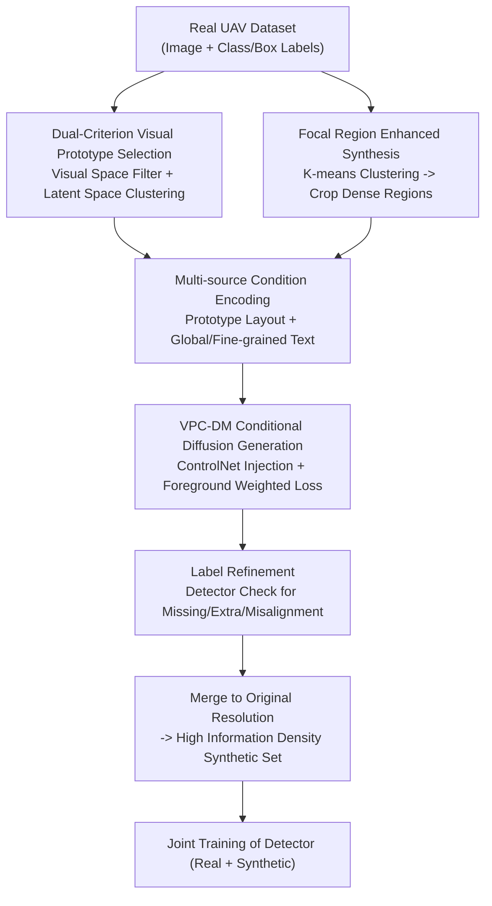

# Visual Prototype Conditioned Focal Region Generation for UAV-Based Object Detection

**Conference**: CVPR 2026  
**Paper**: [CVF Open Access](https://openaccess.thecvf.com/content/CVPR2026/html/Li_Visual_Prototype_Conditioned_Focal_Region_Generation_for_UAV-Based_Object_Detection_CVPR_2026_paper.html)  
**Code**: https://github.com/Sirius-Li/UAVGen  
**Area**: Object Detection / UAV Vision / Diffusion Model Data Augmentation  
**Keywords**: UAV object detection, layout-to-image, visual prototype, focal region, label refinement

## TL;DR
UAVGen uses diffusion models to synthesize annotated training data for UAV object detection. It replaces blurry small object layout conditions with high-quality reference instances via "visual prototypes," generates images only within target-dense "focal regions," and refines labels using a detector back-check. On VisDrone, it improved mAP from 24.5 to 25.9 using only 738 synthetic images.

## Background & Motivation

**Background**: The primary bottleneck in UAV aerial object detection is the scarcity of high-quality annotated data—flight scenes are dynamic and labeling costs are high. Recently, using diffusion models for "layout-to-image" data augmentation has become a new paradigm: given a layout (class + bounding box for each object), a corresponding annotated image is synthesized and used as additional training data. These methods (GeoDiffusion, AeroGen, etc.) have been validated on general detection benchmarks.

**Limitations of Prior Work**: This paradigm clearly fails in UAV scenarios—methods that improve performance in general detection often show no gains or even cause performance drops on VisDrone/UAVDT (In Table 2, GLIGEN, GeoDiffusion, and AeroGen actually lowered the mAP of the SOTA detector RemDet).

**Key Challenge**: The authors attribute this performance gap to three inherent characteristics of UAV images:

- **Low-quality layout conditions**: Limited by flight altitude and fixed perspective, objects are generally small, dense, and overlapping. Object patches cropped directly from real images are blurry and entangled, acting as unclear conditional signals that interfere with diffusion training and lead to low fidelity.
- **Model capacity wasted on uninformative areas**: In UAV images, objects are concentrated in small regions, while large portions are empty backgrounds. Diffusion models "averagely" distribute capacity to these low-information areas, failing to capture fine-grained features of small objects.
- **Misalignment between images and labels**: The diffusion process is inherently stochastic. Generated images may deviate from input layouts, causing "missing/extra/misaligned" objects, which is amplified in small-object-dominated UAV scenes, effectively injecting label noise into the training set.

**Goal & Key Insight**: Instead of forced generation on the full image, solve these three issues in three steps: "upgrade" layout conditions to high-fidelity prototypes, "focus" generation on target-dense regions, and "refine" synthetic labels.

**Core Idea**: Propose UAVGen, consisting of two modules: **VPC-DM (Visual Prototype Conditioned Diffusion Model)** to address low-quality conditions, and **FRE-DP (Focal Region Enhanced Data Pipeline)** to solve both capacity mismatch and label inconsistency. To the authors' knowledge, this is the first data synthesis method specifically designed for training UAV detectors.

## Method

### Overall Architecture

UAVGen follows the classic paradigm of "diffusion-driven data augmentation": a real dataset $D^{real}=\{(I_i^{real}, L_i^{real})\}$ is used to train a diffusion model $G_\theta$, which synthesizes new images $D^{syn}$ based on layout $L^{real}$ and auxiliary conditions; finally, $D^{real}\cup D^{syn}$ are used together to train the detector:

$$\phi^* = \arg\min_\phi \mathcal{L}_{det}\big(F_\phi(D^{real}\cup D^{syn})\big).$$

UAVGen inserts two modification points. **VPC-DM** focuses on "higher fidelity": it selects high-quality object instances from real data as "visual prototypes," concatenates them with global/fine-grained text into multi-source conditions, injects them via ControlNet, and uses a foreground-weighted loss. **FRE-DP** focuses on "higher accuracy and efficiency": it clusters dense object areas into "focal regions," generates only in these areas, merges them back, and then uses a pre-trained detector to refine labels by removing missing/extra/misaligned targets.

### Key Designs

**1. Dual-Criterion Visual Prototype Selection: Replacing blurry object patches with high-quality reference instances**

The pain point is direct—when training diffusion models for conditional generation, the standard practice is to crop all object regions as supervision. However, UAV objects are small and blurry, providing noisy signals. The authors' idea: use only "clean" objects as visual prototypes, selected through two sequential criteria.

The first layer filters for clear appearance and accurate localization in **visual space**. A pre-trained detector $D(\cdot)$ is run on $D^{real}$, grouping results by class $G^c=\{(b_i^{det}, s_i)\}$. Assuming confidence $s$ follows a normal distribution $N(\mu_c, \sigma_c^2)$, only candidates with **accurate localization (IoU≥$\tau^{det}$ with ground truth) and confidence higher than the $\alpha$ quantile** are kept:

$$\mathcal{V}^c=\{b_i^{real}\mid (b_i^{det}, s_i)\in G^c,\ \mathrm{IoU}(b_i^{real}, b_i^{det})\ge\tau^{det},\ s_i\ge\Phi_c^{-1}(\alpha)\}.$$

The second layer further clarifies fine-grained boundaries in **latent space**. Each candidate patch is encoded using a VAE encoder $\mathcal{E}_{img}$, and only candidates whose **latent embeddings are close enough to the class center $\mu^c$** are kept for the final prototype set $P^c$:

$$P^c=\{b\in\mathcal{V}^c\mid \|\mathcal{E}_{img}(b)-\mu^c\|^2<\tau^{lat}\},\quad \mu^c=\frac{1}{|\mathcal{V}^c|}\sum_{b\in\mathcal{V}^c}\mathcal{E}_{img}(b).$$

**2. Multi-source Condition Encoding: Layout maps of prototypes + Dual-layer text**

For each region $(b_j^{real}, c_j^{real})$ in the layout, a prototype $P_j$ is sampled from $P^c$, transformed, and **pasted onto a blank canvas at $b_j^{real}$**, resulting in a synthetic layout image $I_j^{blank}$. These are fused into a layout embedding $v_i$ using a 3D convolutional network.

Text side provides complementary prompts: global prompt $t^g$ for global embedding $e_i^g$, and object-level prompt $t^{c_j}$ for fine-grained layout embedding $e_i^f$ using gated attention $GA(\cdot)$ and Fourier positional encoding $\mathcal{F}(b_j)$:

$$e_i^f=GA\Big(\big\{\mathrm{MLP}([\mathcal{E}_{text}(t^{c_j});\mathcal{F}(b_j^{real})])\big\}_{j=1}^{n_i}\Big).$$

**3. ControlNet Injection and Foreground Weighted Loss**

$v_i$ and $e_i^f$ are injected through ControlNet. To address small object dominance, a spatial weight map $w$ derived from layout $L^{real}$ is used for foreground weighting:

$$\mathcal{L}_{layout}=w\odot\mathbb{E}_{x_0,t,\epsilon}\big[\|\epsilon-\epsilon_\theta(x_t, t\mid e_i^g, \mathcal{C}_i)\|^2\big],$$

where target area weights >1. This forces the model capacity toward small objects.

**4. Focal Region Enhancement + Label Refinement**

**Focal Region Generation**: K-means clusters object centers $p_j$ into $K$ centroids $m_k$; for each centroid, a focal region $B_k$ is determined by **overlap maximization**—finding the window that encapsulates the most complete object boxes:

$$B_k=\arg\max_{B\in\Omega(m_k)}\sum_j\mathbb{I}[b_j^{real}\cap B=b_j^{real}].$$

Generation is performed only on these dense regions, providing higher relative resolution for small objects.

**Label Refinement**: A detector $D(\cdot)$ runs on synthetic images to obtain $L^{det}$. ① **Missing objects**: Labels are removed if they don't match detected boxes. ② **Extra objects**: Detected boxes with confidence above $\beta$ are **added to labels**. ③ **Misalignment**: Labels are replaced with detected boxes if confidence exceeds $\gamma$.

### Loss & Training
The core training objective is the weighted denoising loss $\mathcal{L}_{layout}$. Based on the FLUX model: LR 1e-5, 60K steps, batch 8, single A800. Diffusion backbone, text encoder, and VAE are frozen, fine-tuning only the adapter parameters. Faster R-CNN serves as the pre-trained detector $D(\cdot)$.

## Key Experimental Results

### Main Results

Evaluated on VisDrone and UAVDT for both FID (lower is better) and AP (higher is better).

| Dataset | Method | FID↓ | mAP↑ | AP50↑ | APs↑ |
|--------|------|------|------|-------|------|
| VisDrone | Real only | - | 24.5 | 42.1 | 15.4 |
| VisDrone | GeoDiffusion | 57.96 | 24.7 | 42.9 | 15.4 |
| VisDrone | AeroGen | 48.04 | 24.9 | 43.3 | 15.6 |
| VisDrone | **UAVGen** | **34.34** | **25.9** | **44.8** | **16.7** |
| UAVDT | Real only | - | 14.5 | 26.1 | 10.3 |
| UAVDT | AeroGen | 31.99 | 15.0 | 28.3 | 10.7 |
| UAVDT | **UAVGen** | **29.73** | **16.6** | **30.9** | **11.7** |

Notably, UAVGen achieved these gains on VisDrone using **only 738 synthetic images**, whereas baselines used 6,474. It also successfully improved the SOTA detector RemDet-X (mAP +0.4), where other methods caused degradation.

### Ablation Study

Impact of modules: Visual Prototype (VP), Layout Embedding (LE), Focal Region (FR), and Label Refinement (LR).

| Gen. | VP | LE | FR | LR | mAP↑ | AP50↑ |
|------|----|----|----|----|------|-------|
| - | - | - | - | - | 24.5 | 42.1 |
| ✓ | - | - | - | - | 23.8 | 42.1 |
| ✓ | ✓ | ✓ | - | - | 25.2 | 43.8 |
| ✓ | ✓ | ✓ | ✓ | ✓ | **25.9** | **44.8** |

| Focal Region Resolution | mAP↑ | AP50↑ | AP75↑ |
|------|------|-------|------|
| 1024 | 25.3 | 43.9 | 25.3 |
| 512 | 25.6 | 44.7 | 25.4 |
| 256 | **25.9** | **44.8** | **26.0** |

### Key Findings
- **"Raw generation" is negative gain**: Without modules, mAP dropped from 24.5 to 23.8.
- **Lower focal resolution is better**: 1024 to 256 resolution improved mAP consistently because small objects appear relatively larger and clearer in smaller focal windows.
- **High data efficiency**: 100 images matched the performance of AeroGen using 6,474 images.

## Highlights & Insights
- **Selecting prototypes before generation**: Replacing "all samples" with "representative high-quality samples" purifies condition signals.
- **Focal regions respond to UAV sparsity**: Generating only in dense clusters saves computation and improves quality.
- **Refinement turns stochasticity into profit**: Extra objects are "recruited" as positive samples rather than discarded.
- **Effective for SOTA detectors**: Ensuring high fidelity and label purity is a prerequisite for augmentation to help strong models.

## Limitations & Future Work
- **Dependency on detector quality**: If the pre-trained detector is weak on certain classes, the whole pipeline absorbs that bias.
- **Limited benchmarks**: Robustness against drastic altitude/viewpoint changes remains to be fully explored.
- **Remote sensing generalization**: While planned, performance on remote sensing datasets hasn't been empirically presented yet.

## Related Work & Insights
- **vs GeoDiffusion / AeroGen**: UAVGen's three-step approach (Prototype + Focal + Refinement) overcomes the low fidelity and noise issues that cause prior methods to fail on small object tasks.
- **vs GLIGEN**: Adds a visual layout path to complement GLIGEN's text-based grounding.
- **Insight**: The finding that "augmentation commonly degrades strong detectors" highlights that synthetic data value depends entirely on label purity.

## Rating
- Novelty: ⭐⭐⭐⭐ First specialized synthesis framework for UAV detection; clever integration of existing tools.
- Experimental Thoroughness: ⭐⭐⭐⭐ Solid evidence across multiple benchmarks and detectors, though remote sensing extrapolation is missing.
- Writing Quality: ⭐⭐⭐⭐ Clear logic matching pain points to modules.
- Value: ⭐⭐⭐⭐ High practical value due to high data efficiency and success on SOTA models.

## Related Papers

- [\[CVPR 2026\] UAVGen: Visual Prototype Conditioned Focal Region Generation for UAV-Based Object Detection](uavgen_visual_prototype_conditioned_focal_region_generation_for_uav_based_object_detection.md)
- [\[CVPR 2026\] Tri-Modal Fusion Transformers for UAV-based Object Detection](tri-modal_fusion_transformers_for_uav-based_object_detection.md)
- [\[CVPR 2026\] UAV-CB: A Complex-Background RGB-T Dataset and Local Frequency Bridge Network for UAV Detection](uav-cb_a_complex-background_rgb-t_dataset_and_local_frequency_bridge_network_for.md)
- [\[CVPR 2026\] Prompt-Free Universal Region Proposal Network](prompt-free_universal_region_proposal_network.md)
- [\[CVPR 2026\] Beyond Prompt Degradation: Prototype-Guided Dual-Pool Prompting for Incremental Object Detection](beyond_prompt_degradation_prototype-guided_dual-pool_prompting_for_incremental_o.md)

<!-- RELATED:END -->

<!-- RELATED:START -->

## Related Papers

- [\[CVPR 2026\] UAVGen: Visual Prototype Conditioned Focal Region Generation for UAV-Based Object Detection](uavgen_visual_prototype_conditioned_focal_region_generation_for_uav_based_object_detection.md)
- [\[CVPR 2026\] Tri-Modal Fusion Transformers for UAV-based Object Detection](tri-modal_fusion_transformers_for_uav-based_object_detection.md)
- [\[CVPR 2026\] UAV-CB: A Complex-Background RGB-T Dataset and Local Frequency Bridge Network for UAV Detection](uav-cb_a_complex-background_rgb-t_dataset_and_local_frequency_bridge_network_for.md)
- [\[CVPR 2026\] Prompt-Free Universal Region Proposal Network](prompt-free_universal_region_proposal_network.md)
- [\[CVPR 2026\] Beyond Prompt Degradation: Prototype-Guided Dual-Pool Prompting for Incremental Object Detection](beyond_prompt_degradation_prototype-guided_dual-pool_prompting_for_incremental_o.md)

<!-- RELATED:END -->
