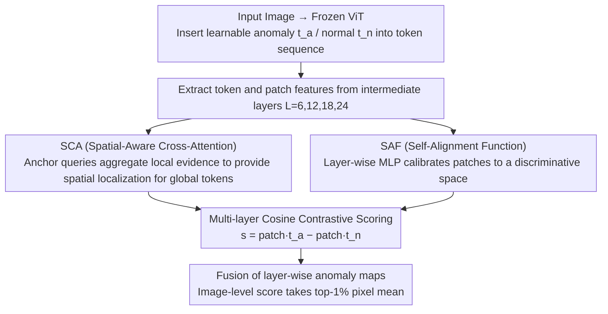

# VisualAD: Language-Free Zero-Shot Anomaly Detection via Vision Transformer

**Conference**: CVPR 2026  
**arXiv**: [2603.07952](https://arxiv.org/abs/2603.07952)  
**arXiv**: [2603.07952](https://arxiv.org/abs/2603.07952)  
**Code**: None  
**Area**: Object Detection  
**Keywords**: Zero-shot anomaly detection, Vision Transformer, Language-free branch, Learnable tokens, Industrial + Medical  

## TL;DR

The necessity of the text branch in Zero-Shot Anomaly Detection (ZSAD) is revisited, leading to the proposal of VisualAD—a pure vision framework. By inserting two learnable tokens (anomaly/normal) into a frozen ViT, combined with Spatial-Aware Cross-Attention and a Self-Alignment Function, the model achieves SOTA performance across 13 industrial and medical benchmarks without requiring a text encoder.

## Background & Motivation

- **ZSAD Challenge**: Requires detecting anomalies in unseen categories without relying on category-specific normal samples during training.
- **Mainstream Methods Depend on CLIP Text Branch**: Methods like AnomalyCLIP generate normal/abnormal prototypes through learnable text prompts and judge based on image-text similarity.
- **Core Problem**: If final decisions are determined solely by two sets of vectors ("normal" and "anomaly"), is the text modality truly indispensable?
- **Exploratory Experiments**: Removing the text encoder of AnomalyCLIP and directly optimizing two visual vectors revealed:
    - No significant decline in detection performance.
    - Trainable parameters were reduced by 99%+.
    - Training curves were more stable (whereas the text branch version exhibited severe fluctuations).
- **Conclusion**: Text prompts may only serve as an indirect channel to shape visual prototypes and are not strictly necessary.

## Method

### Overall Architecture

VisualAD addresses the skepticism regarding the necessity of the CLIP text branch in ZSAD. It introduces a pure vision framework: inserting two learnable tokens (anomaly $t_a$, normal $t_n$) into the frozen ViT token sequence, where $z_0 = [t_a, t_n, t_c, p_1, \ldots, p_N]$ ($t_c$ is the original class token). Features are extracted from intermediate layers $\mathcal{L} = \{6, 12, 18, 24\}$ through a **dual-path parallel** process: SCA provides spatial localization for global tokens, and SAF calibrates patches into the discriminative space. The two paths converge for cosine contrastive scoring, and layer-wise anomaly maps are fused. No text encoder is used throughout the process.

### Key Designs

**1. Spatial-Aware Cross-Attention (SCA): Providing Spatial Localization for Global Tokens**

The two learnable tokens are global and lack spatial information for localizing anomalies. SCA uses a small set of anchor queries $Q_{\text{anchor}} \in \mathbb{R}^{m \times d}$ ($m=4$) to aggregate local spatial evidence: $A_\ell = \text{softmax}\left(\frac{Q_{\text{anchor}} (P_\ell^{\text{pos}})^\top}{\sqrt{d}}\right),\ U_\ell = A_\ell P_\ell$. A token-guided gate $g(t) = \sigma(W_g t) \in \mathbb{R}^m$ then adaptively modulates the tokens: $\tilde{t}_\ell = t + \alpha \sum_{i=1}^{m} g_i(t) \cdot a_i$. SCA is instantiated independently at each layer, dynamically adjusting the spatial sensitivity of tokens per image, enabling global tokens to "see" local anomalies.

**2. Self-Alignment Function (SAF): Layer-wise Patch Feature Calibration**

Patch features from different layers of a frozen ViT may not be directly suited for anomaly discrimination. SAF uses a single-hidden-layer MLP at each layer for calibration: $\hat{P}_\ell = \mathcal{F}_\ell(P_\ell)$. This is the most critical component in ablation studies—removing it causes Pixel AP to drop from 28.4 to 3.5, demonstrating that aligning patch features to the token's discriminative space is the prerequisite for the pure vision approach.

**3. Multi-layer Cosine Contrastive Scoring: Direct Anomaly Judgment via Token Similarity Difference**

With calibrated patches and enhanced tokens, the anomaly score is computed as the difference in L2-normalized cosine similarities: $s_i^{(\ell)} = \langle \bar{\hat{p}}_i^{(\ell)}, \bar{t}_a^{(\ell)} \rangle - \langle \bar{\hat{p}}_i^{(\ell)}, \bar{t}_n^{(\ell)} \rangle$. An anomaly is identified if a patch is closer to the "anomaly" prototype than the "normal" prototype. Multi-layer results are fused by summation $H = \sum_{\ell \in \mathcal{L}} H_\ell$, and the image-level score is the mean of the top-1% pixels. Decisions are made using only two sets of visual vectors, confirming that the text branch can be omitted.

### Loss & Training

$$\mathcal{L} = \mathcal{L}_{\text{cls}} + \mathcal{L}_{\text{seg}} + \mathcal{L}_{\text{ctr}}$$

- $\mathcal{L}_{\text{cls}}$: Image-level BCE.
- $\mathcal{L}_{\text{seg}}$: Layer-wise Focal + Dice.
- $\mathcal{L}_{\text{ctr}}$: Cosine margin penalty, ensuring the angular distance between $t_a$ and $t_n$ is $> 120^\circ$.

Only $t_a, t_n$, SCA, and SAF are updated; the ViT backbone remains frozen.

## Key Experimental Results

### Industrial Domain Image-level AUROC

| Method | MVTec-AD | VisA | BTAD | KSDD2 | DAGM |
|------|----------|------|------|-------|------|
| WinCLIP | 90.4 | 75.6 | 68.2 | 93.5 | 91.8 |
| AnomalyCLIP | 91.6 | 81.0 | 88.7 | 91.9 | 98.0 |
| AdaCLIP | 92.0 | 79.7 | 90.0 | 94.9 | 98.3 |
| **VisualAD(CLIP)** | **92.2** | **84.7** | **94.9** | **98.0** | **99.5** |

### Medical Domain Image-level AUROC

| Method | OCT17 | BrainMR1 | Brain_AD | HIS |
|------|-------|----------|----------|-----|
| AnomalyCLIP | 63.7 | 96.4 | 69.0 | 55.2 |
| **VisualAD(CLIP)** | **88.9** | **96.7** | **80.8** | **60.1** |
| **VisualAD(DINOv2)** | **91.2** | 93.8 | **87.1** | 60.1 |

The improvement in the medical domain is particularly significant: AUROC on OCT17 increased from 63.7 to 91.2 (+27.5).

### Ablation Study

| Module | Image AUROC | Pixel AP |
|------|------------|----------|
| No SCA | 82.3 | 27.4 |
| No SAF | 50.5 | 3.5 |
| No SCA + No SAF | 48.0 | 0.8 |
| **Full** | **84.7** | **28.4** |

SAF is the key component; its absence leads to performance collapse.

### Backbone Flexibility

The framework seamlessly adapts to both CLIP and DINOv2 backbones. The DINOv2 version performs better in pixel-level segmentation, while the CLIP version is superior in image-level classification.

## Highlights & Insights

1. **Boldly Challenging Text Necessity**: Experiments prove that the CLIP text branch in ZSAD "might only be an indirect channel for shaping visual prototypes," with a 99% reduction in parameters.
2. **Minimalist and Elegant Design**: Only two learnable tokens and lightweight SCA/SAF are used, with the same pipeline for training and inference.
3. **Cross-Domain Zero-Shot Generalization**: Exhibits excellent performance under the "Industrial Training → Medical Inference" setting.
4. **Backbone Agnostic**: Compatible with both CLIP and DINOv2, showing strong extensibility.

## Limitations

- Limited improvement on some medical datasets (e.g., HIS), where visual priors for histopathological anomalies are weak.
- The choice of the number of anchor queries $m=4$ lacks in-depth analysis.
- Requires an auxiliary training set (normal + abnormal samples from VisA), so it is not entirely training-free.
- Pixel-level segmentation still lags behind some specialized methods on certain datasets.

## Rating

| Dimension | Rating |
|------|------|
| Novelty | ⭐⭐⭐⭐⭐ |
| Experimental Thoroughness | ⭐⭐⭐⭐⭐ |
| Writing Quality | ⭐⭐⭐⭐ |
| Value | ⭐⭐⭐⭐⭐ |

<!-- RELATED:START -->

## Related Papers

- [\[CVPR 2026\] AnomalyVFM -- Transforming Vision Foundation Models into Zero-Shot Anomaly Detectors](anomalyvfm_--_transforming_vision_foundation_models_into_zero-shot_anomaly_detec.md)
- [\[CVPR 2026\] Back to Point: Exploring Point-Language Models for Zero-Shot 3D Anomaly Detection](back_to_point_exploring_point-language_models_for_zero-shot_3d_anomaly_detection.md)
- [\[CVPR 2026\] MoECLIP: Patch-Specialized Experts for Zero-shot Anomaly Detection](moeclip_patch-specialized_experts_for_zero-shot_anomaly_detection.md)
- [\[CVPR 2026\] From Attraction to Equilibrium: Physics-Inspired Semantic Gravitons for Zero-Shot Anomaly Detection](from_attraction_to_equilibrium_physics-inspired_semantic_gravitons_for_zero-shot.md)
- [\[CVPR 2026\] FB-CLIP: Fine-Grained Zero-Shot Anomaly Detection with Foreground-Background Disentanglement](fb-clip_fine-grained_zero-shot_anomaly_detection_with_foreground-background_dise.md)

<!-- RELATED:END -->
