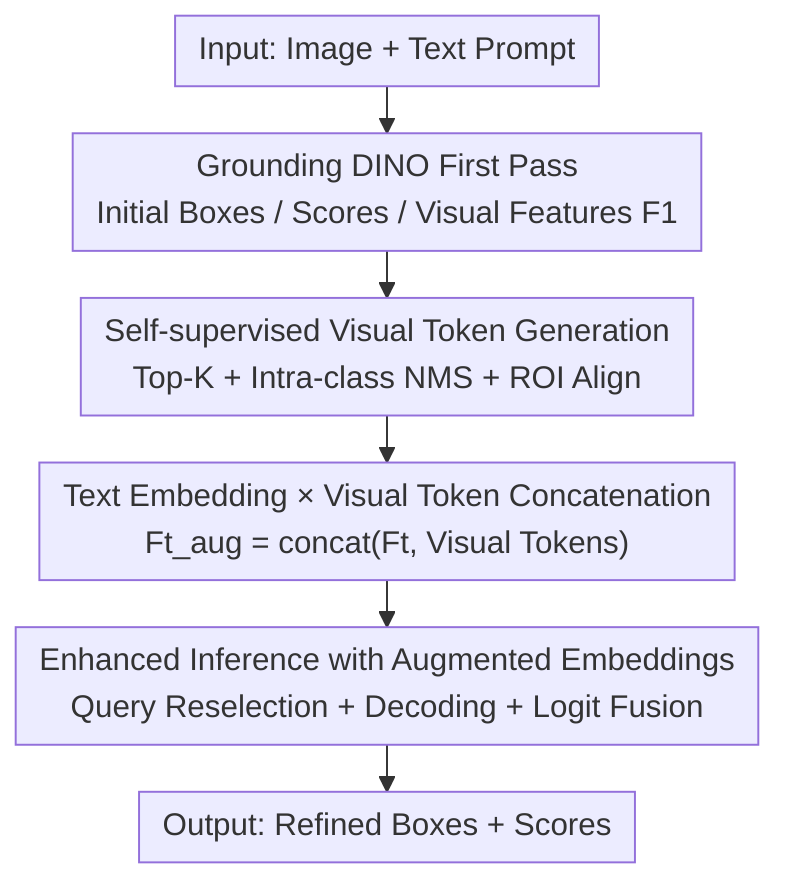

# ViTPrompt: Training-Free Prompt Refinement with Visual Tokens for Open-Vocabulary Detection

**Conference**: CVPR 2026  
**Paper**: [CVF Open Access](https://openaccess.thecvf.com/content/CVPR2026/html/Qin_ViTPrompt_Training-Free_Prompt_Refinement_with_Visual_Tokens_for_Open-Vocabulary_Detection_CVPR_2026_paper.html)  
**Code**: https://github.com/buerzlh/Test-timeAdaptation-for-Object-Detection (Available)  
**Area**: Object Detection  
**Keywords**: Open-vocabulary Detection, Test-time Adaptation, Visual Prompting, Grounding DINO, Training-free

## TL;DR
Addressing the issue where boxes remain unrefined under domain shift in open-vocabulary detection, ViTPrompt concatenates RoI visual tokens of high-confidence targets from the first-pass detection into the text prompts. By re-running Grounding DINO, it refreshes bounding boxes and classification scores simultaneously via a training-free two-stage inference, achieving SOTA on multiple ODD benchmarks.

## Background & Motivation
**Background**: Test-time adaptation for object detection (TTAOD) aims to maintain detector performance under distribution shifts (e.g., weather, lighting, scenes) without retraining. With the rise of Vision-Language Models (VLM) like CLIP and Grounding DINO, open-vocabulary detection—detecting arbitrary categories using arbitrary text prompts—has become possible, leading to the application of TTA in open-vocabulary scenarios.

**Limitations of Prior Work**: Existing methods, whether closed-set TTAOD based on Faster R-CNN (STFAR, MemCLR) or open-vocabulary TTAOD based on VLM (VLOD-TTA, BCA/BCA+), focus almost exclusively on "improving classification confidence"—using feature alignment, entropy minimization, or classifier recalibration—while **ignoring bounding boxes entirely**. Consequently, while scores may increase, boxes often remain misaligned due to scale distortion in fog or occlusion-induced boundary shifts, resulting in high-confidence but spatially inaccurate localization.

**Key Challenge**: Current VLM-based methods treat prompts as **static inputs**. Selection in Grounding DINO depends on the maximum similarity between "visual features $\times$ fixed text embeddings." If text embeddings $F_t$ fail to match domain-shifted visual features due to brevity, ambiguity, or domain gaps, the selected queries will exhibit both misclassification and localization drift. Although BCA+ is training-free, it only performs Bayesian caching at the **category level** and fails to modify language queries based on instance-level visual evidence, offering limited adaptability to blurred or corrupted proposals.

**Goal**: To **simultaneously** refine bounding boxes and classification scores at test time without backpropagation, parameter updates, or external memory, enabling real-time execution.

**Key Insight**: High-confidence detections from the first-pass forward inference carry valuable visual clues. Projecting these clues back into the language space to enrich the semantic context allows the cross-modal decoder to refocus on more relevant image regions during the second pass.

**Core Idea**: Enhance text prompts with "instance-level visual tokens" generated from the first-pass detections, then re-run the decoder. This mechanism refreshes both boxes and scores concurrently without modifying model weights.

## Method

### Overall Architecture
ViTPrompt is a **two-stage training-free inference pipeline** built on a frozen Grounding DINO. Given a test image $x_i$ and a text prompt (e.g., "truck . bicycle . person ."), the dual encoders of Grounding DINO first produce enhanced visual features $F_v \in \mathbb{R}^{N_I \times d}$ and text features $F_t \in \mathbb{R}^{K \times d}$ ($d=256$, $K$ is the number of categories). Language-guided query selection $I = \text{Top}_N(\text{Max}_{(-1)}(F_v F_t^\top))$ selects $N=900$ queries, processed by a DETR-like decoder to obtain boxes, classification logits, and confidence scores.

ViTPrompt adds two steps: **Stage 1** filters reliable instances and extracts visual tokens via RoI-Align. **Stage 2** concatenates these tokens into the text embeddings to form $F_t^{aug}$, which is then used to redo query selection and decoding. Finally, extended logits are fused back to the original $K$ classes. The pipeline requires only one additional forward pass without backpropagation or caching.

### Key Designs

**1. Self-supervised Visual Token Generation: Extracting features from "reliable instances"**

Stage 2 injects visual evidence into the prompt. To avoid noise from the $N=900$ initial proposals, a **filtering** step is performed. Proposals are sorted by score $s_q$, and the top-$K$ $\{b_k, p_k^{init}, s_k\}_{k=1}^K$ are used as anchor points. Let $C = \{\arg\max(p_k^{init})\}$ be the "salient categories" covered by these top-$K$. Proposals not in $C$ are discarded to restrict adaptation to domain-relevant semantics. Next, **intra-class NMS** is applied for each class $c \in C$:

$$\text{IoU}(b_q, b_k) = \frac{b_q \cap b_k}{b_q \cup b_k},$$

If $\text{IoU} > \theta$ ($\theta=0.6$) and $s_q < s_k$, $b_q$ is suppressed, resulting in a refined set $\{(b_m, p_m^{init}, s_m)\}_{m=1}^M$. Finally, fixed-length visual tokens $v_m = \text{ROIAlign}(F_1, b_m) \in \mathbb{R}^d$ are extracted from the **maximum scale feature map** $F_1 \in \mathbb{R}^{d \times H' \times W'}$.

**2. Text Embedding × Visual Token Concatenation: Injecting visual evidence into language prompts**

Instance visual tokens are concatenated to the original text embeddings along the row dimension:

$$F_t^{aug} = \text{concat}(F_t, [v_1; v_2; \dots; v_M]) \in \mathbb{R}^{(K+M) \times d}.$$

The original $F_t$ consists of **static, image-agnostic** language vectors. Concatenating $v_m$ provides "visual fingerprints" of specific targets in the current image. This supplies the "dynamic classifier" with image-conditioned category prototypes.

**3. Augmented Inference + Extended Logit Fusion: Simultaneous box and score refreshing**

Using $F_t^{aug}$, query indices are recomputed: $\hat I = \text{Top}_N(\text{Max}_{(-1)}(F_v(F_t^{aug})^\top))$. The new queries $\{\hat q_j\} = F_v[\hat I]$ are better aligned with domain-shifted visual features. The decoder then yields new proposal embeddings $\hat f_q$, extended logits $\hat l_q \in \mathbb{R}^{K+M}$, and **newly regressed boxes** $\hat b_q$ using the same regression head.

Since logits now have $K+M$ dimensions, they are mapped back to $K$ classes by taking the **maximum** value across the text dimension and corresponding visual token dimensions for each class $k$:

$$\bar l_q[k] = \max\Big(\{\hat l_q[k]\} \cup \{\hat l_q[K+m] \mid \arg\max(p_m^{init}) = k\}\Big).$$

The final score $\hat s_q = \max(\bar l_q)$ is filtered by $\hat s_q \ge \tau_2$. This max-fusion allows targets with low text-alignment scores to be "rescued" if they align well with visual tokens.

### Loss & Training
Fully training-free. Frozen pre-trained weights are used without gradient computation. Primary hyperparameters include top-$K$ visual tokens, NMS threshold $\theta=0.6$, and confidence thresholds $\tau_1 = \tau_2 = 0.2$.

## Key Experimental Results

### Main Results
Evaluated on three domain-shifted benchmarks using mAP50. FoggyCityscapes uses simulated physical fog; PASCAL-C / COCO-C involve 15 types of synthetic corruption across 5 severities.

| Benchmark (Swin-B) | Vanilla GDINO | TDA | BCA+ | **ViTPrompt** | **Gain** (vs BCA+) |
| :--- | :--- | :--- | :--- | :--- | :--- |
| FoggyCityscapes | 31.34 | 34.31 | 36.22 | **37.27** | +1.05 |
| PASCAL-C (avg) | 63.15 | 65.64 | 69.31 | **71.40** | +2.09 |
| COCO-C (avg) | 35.97 | 37.64 | 39.98 | **42.28** | +2.30 |

ViTPrompt also results in SOTA across every individual corruption type in PASCAL-C/COCO-C.

### Ablation Study

| Configuration | FoggyCityscapes | COCO-C (avg) | Description |
| :--- | :--- | :--- | :--- |
| Text-only | 28.89 | 25.57 | Static text embeddings only |
| ViTPrompt (Max Fusion) | 29.10 | 26.25 | Demonstrates visual fusion efficacy |

Efficiency (Swin-T): Params +0.05M (insignificant), FLOPs increase to 252.26G (~1.7×), but peak VRAM remains identical (2946MB).

### Key Findings
- **Localization Gain**: Improvement on mAP@0.5:0.95 (+3.37/+3.09) proves that ViTPrompt actually corrects coarse/misaligned boxes rather than just adjusting scores.
- **Robustness**: Performance is stable across NMS thresholds $\theta \in [0.2, 0.8]$, indicating gains are not merely from aggressive post-processing.
- **Scalability**: Gains from Swin-T to Swin-B are larger than those of competitors, showing better utilization of high-capacity features.

## Highlights & Insights
- **Region-aware Prompting**: Using high-confidence predictions to "teach" the model via self-supervised loops is elegant and requires no external CLIP or backpropagation.
- **Single-chain Refinement**: Boxes are re-regressed from the enhanced query embeddings. Classification and localization are refined through the same causal chain of prompt enhancement.
- **Test-time Prototypes**: The max-fusion of text and visual prototypes can be seen as a training-free test-time few-shot enhancement.

## Limitations & Future Work
- **Dependency on First-pass Quality**: Relies on top-$K$ detections. Severe domain shifts that cause total first-pass failure might introduce noise.
- **Computational Overhead**: 1.7× FLOPs due to two forward passes may be a burden for high-frame-rate deployment.
- **Model Specificity**: Validated on Grounding DINO; applicability to other OV detectors like GLIP or OV-DETR remains to be verified.

## Related Work & Insights
- **vs BCA / BCA+**: BCA+ performs category-level Bayesian caching. ViTPrompt works at the instance level to correct specific proposal errors and refine localization.
- **vs TDA**: TDA uses a lightweight cache for score refinement; ViTPrompt generates new classification hypotheses and boxes.
- **vs TPT**: TPT requires gradient-based prompt tuning. ViTPrompt uses token concatenation, avoiding backpropagation and keeping VRAM low.

## Rating
- Novelty: ⭐⭐⭐⭐ First to refine both boxes and scores in open-vocabulary TTAOD using visual-token-augmented prompts.
- Experimental Thoroughness: ⭐⭐⭐⭐ Comprehensive evaluation across multiple benchmarks and backbones.
- Writing Quality: ⭐⭐⭐⭐ Clear motivation and complete algorithmic description.
- Value: ⭐⭐⭐⭐ Plug-and-play, zero VRAM increase, and practical for OOD scenarios like autonomous driving.

<!-- RELATED:START -->

## Related Papers

- [\[CVPR 2026\] PET-DINO: Unifying Visual Cues into Grounding DINO with Prompt-Enriched Training](pet-dino_unifying_visual_cues_into_grounding_dino_with_prompt-enriched_training.md)
- [\[AAAI 2026\] Connecting the Dots: Training-Free Visual Grounding via Agentic Reasoning](../../AAAI2026/object_detection/connecting_the_dots_training-free_visual_grounding_via_agent.md)
- [\[CVPR 2026\] SubspaceAD: Training-Free Few-Shot Anomaly Detection via Subspace Modeling](subspacead_training-free_few-shot_anomaly_detection_via_subspace_modeling.md)
- [\[CVPR 2026\] WeDetect: Fast Open-Vocabulary Object Detection as Retrieval](wedetect_fast_open-vocabulary_object_detection_as_retrieval.md)
- [\[CVPR 2026\] Anomaly as Non-Conformity via Training-Free Graph Laplacian Energy Minimization](anomaly_as_non-conformity_via_training-free_graph_laplacian_energy_minimization.md)

<!-- RELATED:END -->
## Related Papers

- [\[CVPR 2026\] PET-DINO: Unifying Visual Cues into Grounding DINO with Prompt-Enriched Training](pet-dino_unifying_visual_cues_into_grounding_dino_with_prompt-enriched_training.md)
- [\[CVPR 2026\] WeDetect: Fast Open-Vocabulary Object Detection as Retrieval](wedetect_fast_open-vocabulary_object_detection_as_retrieval.md)
- [\[CVPR 2026\] SRA-Det: Learning Omni-Grained Open-Vocabulary Detection Beyond Category Names](sra-det_learning_omni-grained_open-vocabulary_detection_beyond_category_names.md)
- [\[CVPR 2026\] Prompt-Free Universal Region Proposal Network](prompt-free_universal_region_proposal_network.md)
- [\[CVPR 2026\] Consistency Beyond Contrast: Enhancing Open-Vocabulary Object Detection Robustness via Contextual Consistency Learning](consistency_beyond_contrast_enhancing_open-vocabulary_object_detection_robustnes.md)

<!-- RELATED:END -->
