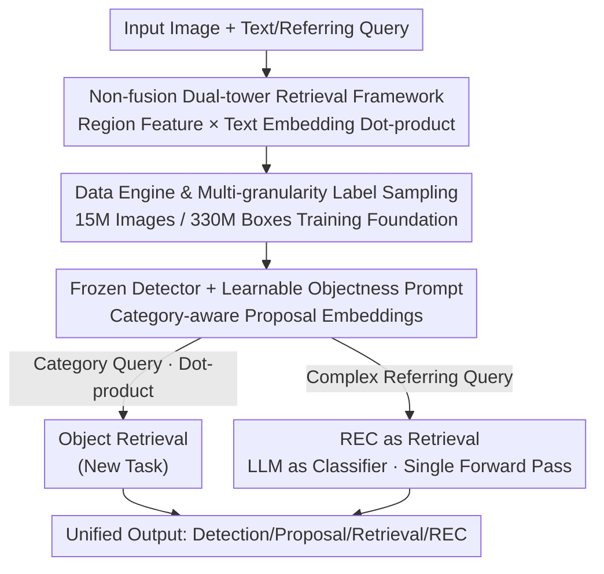

# WeDetect: Fast Open-Vocabulary Object Detection as Retrieval

**Conference**: CVPR 2026  
**Paper**: [CVF Open Access](https://openaccess.thecvf.com/content/CVPR2026/html/Fu_WeDetect_Fast_Open-Vocabulary_Object_Detection_as_Retrieval_CVPR_2026_paper.html)  
**Code**: https://github.com/WeChatCV/WeDetect  
**Area**: Open-Vocabulary Object Detection  
**Keywords**: Open-vocabulary detection, Dual-tower retrieval, REC, Proposal generation, CLIP

## TL;DR
This work treats open-vocabulary detection entirely as a "region × text" retrieval matching problem. It utilizes a non-fusion dual-tower structure, WeDetect, to achieve real-time SOTA detection. By freezing WeDetect, a general proposal generator WeDetect-Uni is derived (supporting the new task of local object retrieval). Finally, WeDetect-Ref reframes REC by transforming an LLM into a classifier for parallel scoring in a single forward pass, achieving both high precision and high throughput across 15 benchmarks.

## Background & Motivation
**Background**: Open-vocabulary object detection (OVD) aims to detect arbitrary categories using text prompts. Current high-precision methods (e.g., GLIP, Grounding-DINO, LLMDet) generally stack **deep cross-modal fusion layers** between the visual backbone and text encoder, allowing repetitive interactions between region features and query words for alignment.

**Limitations of Prior Work**: Fusion layers suffer from two major drawbacks. First, they are **slow**—fusion causes a surge in computational overhead. Second, **features are non-reusable**—fused visual features become "query-specific," requiring re-computation whenever the text prompt changes. For instance, Grounding-DINO running on LVIS with 1203 classes (chunk size 40) requires **31 forward passes** per image, resulting in high latency unsuitable for deployment.

**Key Challenge**: A fundamental conflict exists between high precision (deep fusion) and high efficiency (shared features) in existing paradigms. Fusion provides alignment but locks the model into query-specific computation.

**Goal**: To develop an open-vocabulary system that is fast, matches or exceeds the precision of fusion-based models, and supports multiple tasks (detection / proposal / retrieval / REC) using shared features.

**Key Insight**: The authors identify that the "non-fusion dual-tower paradigm" is essentially **retrieval**: recognition is performed via dot-product matching between image region features and text embeddings in a shared space. Once recognition is viewed as retrieval, visual features are decoupled from queries, enabling pre-extraction, caching, and cross-prompt reuse.

**Core Idea**: Unify the entire pipeline through "retrieval"—region features are computed once, and all downstream tasks (detection, proposal, object retrieval, REC) are reduced to "dot-product/scoring in shared space." This core logic supports the model family: WeDetect / WeDetect-Uni / WeDetect-Ref.

## Method

### Overall Architecture
WeDetect is a **model family based on the retrieval paradigm**, with three components sharing the same backbone:

1. **WeDetect**: A dual-tower real-time detector initialized with CLIP using a ConvNeXt backbone. Classification is done via dot-product of "image grid features × category text embeddings" with **no fusion layers**, serving as the foundation for the family.
2. **WeDetect-Uni**: Derived by freezing WeDetect and training a learnable objectness prompt, transforming it into a general proposal generator that requires no user text input. Notably, the proposal embeddings remain **category-aware**, enabling a new task: "object retrieval"—retrieving images containing specific small objects (e.g., cigarette butts) from a database.
3. **WeDetect-Ref**: Designed for complex Referring Expression Comprehension (REC). It uses WeDetect-Uni to extract candidate boxes and refines an LLM (Qwen3-VL) into a **classifier** to perform binary classification on each candidate box ("is it the target?"). This allows parallel scoring in a single forward pass, bypassing token-by-token decoding.

The data flow is serial: Image → WeDetect Detection / WeDetect-Uni Proposal Extraction → Proposals enter either Object Retrieval (dot-product) or WeDetect-Ref (LLM binary classification).

### Key Designs

**1. Non-fusion Dual-tower Retrieval Framework: Reducing recognition to a dot-product for reusable features and real-time speed**

To address the latency and non-reusability of fusion layers, WeDetect removes cross-modal fusion entirely. Architecturally, the text side uses XLM-RoBERTa for category encoding, while the visual side utilizes a YOLO-style ConvNeXt backbone + CSPRepBiFPAN neck + YOLO-World contrastive head to generate multi-scale features. Classification is performed via dot-product $s_{ij} = \langle v_i, t_j \rangle$ between image grid features and text embeddings, paired with region-text contrastive loss and box regression loss. This is effective because visual features and text queries are **decoupled**, allowing region features to be computed once and reused for any set of categories. ConvNeXt is chosen over the standard ViT because it naturally supports multi-scale features necessary for detection.

**2. Data Engine and Multi-granularity Label Sampling: High-quality data for fine-grained alignment**

In the non-fusion paradigm, alignment depends heavily on data quality. The authors built an automatic data engine: sampling 15M diverse images (SAM-1B / LAION / CC12M), using an objectness detector to **recall all possible boxes**, and employing a fine-tuned Qwen2.5-VL 7B to generate **hierarchical, instance-specific** labels (e.g., "animal, dog, a yellow dog"). This resulted in a dataset of 15M images and 330M boxes. During training, **multi-granularity label sampling** is used: for each object, a label is randomly sampled from the hierarchy, providing diverse supervision and constructing a dynamic vocabulary with abundant negative samples per batch.

**3. WeDetect-Uni: Frozen detector + objectness prompt for category-aware embeddings and object retrieval**

Unlike traditional class-agnostic proposal networks (e.g., RPN) where box embeddings are "class-insensitive," WeDetect-Uni **freezes** the WeDetect detector and trains only a general objectness prompt for classification (linear probing). Since the base features are highly discriminative, a single prompt achieves high recall. Crucially, because the detector is frozen, the embeddings of top proposals remain **category-aware**. This enables the **object retrieval** task: images are represented by a set of object embeddings rather than a global CLIP vector. Queries are resolved via dot-product $\mathrm{sim} = \langle e_{\text{box}}, e_{\text{query}} \rangle$, filling a gap in global image-level retrieval for "local, small objects."

**4. WeDetect-Ref: REC as retrieval, LLM as classifier**

Complex referring expressions exceed the linguistic capabilities of standard detectors. WeDetect-Ref reformulates REC as a retrieval task: extracting candidate boxes $\{B_i\}_{i=1}^n$ via WeDetect-Uni, using RoIAlign and a projector to compress them into tokens $\{o_i\}$. The image tokens $I$, query $q$, and object tokens $\{o_i\}$ are fed into the LLM, which uses a **binary classification head** on the object hidden states:

$$\{h_i\}_{i=1}^n = \mathrm{LLM}(I, q, \{o_i\}_{i=1}^n), \quad \{s_i\}_{i=1}^n = \mathrm{Sigmoid}(\mathrm{Classifier}(\{h_i\}))$$

This avoids the box regression inaccuracies of LLMs and **linear latency growth**, as all objects are scored in a single forward pass.

### Loss & Training
- **WeDetect**: Region-text contrastive loss (classification) + box regression loss. Three-stage training: image-level contrastive pre-training → frozen backbone training neck/head → full-parameter end-to-end.
- **WeDetect-Uni**: Frozen detector, linear-probing classification for the objectness prompt.
- **WeDetect-Ref**: Three-stage training (projector → region-aware tuning → region classification head training) using sigmoid focal loss + IoU soft labels.

## Key Experimental Results

### Main Results: Zero-shot Detection (Table 1, LVIS / COCO, FPS measured on COCO)
| Model | Backbone | #Params | FPS | LVIS-minival AP | LVIS AP | Notes |
|------|------|-------|-----|-----------------|---------|------|
| YOLO-World-L | YOLOv8-L | 48M | 54.6 | 35.4 | 26.8 | Real-time Baseline |
| **WeDetect-Tiny** | ConvNeXt-T | 33M | **62.5** | **37.4** | **31.4** | +2.0/+4.6 AP vs YOLO-World-L |
| T-Rex2 | Swin-L | — | — | 54.9 | 45.8 | Prev. SOTA |
| LLMDet | Swin-L | 343M | 2.1 | 50.6 | 42.0 | Fusion LMM |
| **WeDetect-Large** | ConvNeXt-L | 490M | 6.0 | **55.0** | **49.4** | +3.6 vs T-Rex2, +7.4 AP vs LLMDet |

The **WeDetect-Tiny** model outperforms YOLO-World-L in both precision and speed. The **Large** model achieves a new SOTA for non-fusion paradigms with 49.4 LVIS AP.

### Main Results: REC (Table 2, RefCOCO/+/g Top-1 acc, FPS on RefCOCO)
| Model | FPS | RefCOCO/+/g Avg | Notes |
|------|-----|------------------|------|
| Qwen3-VL 4B (Base) | 0.4 | 86.6 | Next-token decoding |
| Grounding-DINO-L | 3.1 | 86.6 | Traditional detector |
| **WeDetect-Ref 4B** | **5.3** | **93.2** | +6.6 vs Qwen3-VL 4B, ~13× speedup |
| **WeDetect-Ref 2B** | 6.6 | 91.3 | 2B outperforms larger models |

WeDetect-Ref 4B is the **first LMM to exceed 50 AP on COCO detection** (50.0 AP), matching traditional detectors, whereas Qwen2.5-VL 7B only reaches 17.7 AP due to next-token recall issues.

### Main Results: Object Retrieval (Table 4)
| Model | COCO F1 | LVIS Recall | Notes |
|------|---------|-------------|------|
| OpenAI CLIP | 46.4 | 30.4 | Image-level retrieval |
| FG-CLIP2 | 57.7 | 43.1 | Fine-grained optimized |
| **WeDetect-Large-Uni** | **83.6** | **57.5** | +37.2 F1 vs CLIP |

### Key Findings
- **Multi-granularity labels drive detection gains**: Removing fine-grained labels drops performance by 2.2 AP, while removing coarse labels drops it by 0.9 AP.
- **Negative supervision is vital for REC**: Adding negative detection data to WeDetect-Ref improves COCO AP by 5.4, primarily teaching the model to "reject" non-existent queries.
- **Single token representation is sufficient**: Compressing each object into 1 token yields similar precision to using 25 tokens while significantly reducing context length.

## Highlights & Insights
- **"Retrieval" as a Unifying Principle**: Detection, proposal, retrieval, and REC are unified as matching/scoring in a shared space, allowing high feature reusability.
- **Class-aware Proposals via Freezing**: By freezing the foundation and training only an objectness prompt, the model maintains category-aware embeddings for free, enabling object retrieval.
- **Reframing LLMs as Classifiers**: This design fixes the box regression and latency issues of LMMs in detection and REC.
- **Data Engine Verification**: Forcing the labeling MLLM to "not label" incorrect boxes effectively filters noise from the upstream proposal generator.

## Limitations & Future Work
- **Data Dependency**: The performance relies on the massive 15M image dataset; non-fusion paradigms are more sensitive to data quality than fusion-based ones.
- **Dependency on Proposal Quality**: The accuracy of WeDetect-Ref is capped by the recall of WeDetect-Uni.
- **Benchmark for Object Retrieval**: Lacks a unified baseline; currently relies on ad-hoc modifications of COCO/LVIS.

## Related Work & Insights
- **vs Grounding-DINO / GLIP**: WeDetect achieves higher accuracy (on LVIS) while being 3–6× faster by removing fusion, proving fusion isn't mandatory for SOTA OVD.
- **vs YOLO-World**: Shares the non-fusion/contrastive approach, but WeDetect pushes performance further through the ConvNeXt CLIP pre-training and specialized data engine.
- **vs CLIP**: WeDetect-Uni complements image-level retrieval by focusing on local, small object semantics where global vectors fail.

## Rating
- Novelty: ⭐⭐⭐⭐⭐ (Unifying 4 tasks under retrieval; LLM-as-classifier for REC).
- Experimental Thoroughness: ⭐⭐⭐⭐⭐ (15 benchmarks, speed/accuracy trade-offs, extensive ablation).
- Writing Quality: ⭐⭐⭐⭐ (Clear structure and logic).
- Value: ⭐⭐⭐⭐⭐ (Real-time SOTA, reusable features, open-source code for deployment).

<!-- RELATED:START -->

## Related Papers

- [\[CVPR 2026\] Consistency Beyond Contrast: Enhancing Open-Vocabulary Object Detection Robustness via Contextual Consistency Learning](consistency_beyond_contrast_enhancing_open-vocabulary_object_detection_robustnes.md)
- [\[CVPR 2026\] NoOVD: Novel Category Discovery and Embedding for Open-Vocabulary Object Detection](noovd_novel_category_discovery_and_embedding_for_open-vocabulary_object_detectio.md)
- [\[CVPR 2026\] Parameter-Efficient Semantic Augmentation for Enhancing Open-Vocabulary Object Detection](parameter-efficient_semantic_augmentation_for_enhancing_open-vocabulary_object_d.md)
- [\[CVPR 2026\] ViTPrompt: Training-Free Prompt Refinement with Visual Tokens for Open-Vocabulary Detection](vitprompt_training-free_prompt_refinement_with_visual_tokens_for_open-vocabulary.md)
- [\[CVPR 2026\] SRA-Det: Learning Omni-Grained Open-Vocabulary Detection Beyond Category Names](sra-det_learning_omni-grained_open-vocabulary_detection_beyond_category_names.md)

<!-- RELATED:END -->
