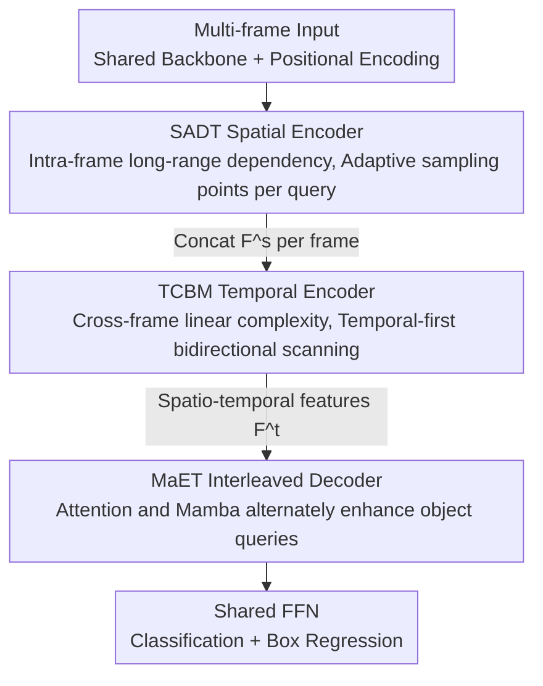

# When Transformers Meet Mamba: A Hybrid Transformer-Mamba Network for Video Object Detection

**Conference**: CVPR 2026  
**Paper**: [CVF Open Access](https://openaccess.thecvf.com/content/CVPR2026/html/Qi_When_Transformers_Meet_Mamba_A_Hybrid_Transformer-Mamba_Network_for_Video_CVPR_2026_paper.html)  
**Area**: Video Object Detection  
**Keywords**: Video object detection, Transformer-Mamba hybrid, State Space Model, Deformable Attention, Temporal modeling

## TL;DR
TMambaDet establishes a clear division of labor between Transformer and Mamba in video object detection: intra-frame spatial modeling is performed by an adaptive deformable Transformer, inter-frame temporal modeling is handled by a bidirectional Mamba with linear complexity, and the decoder interleaves both to align queries with spatio-temporal features. It achieves 87.9% mAP on ImageNet VID with ResNet-101 at 20.6 ms per frame.

## Background & Motivation

**Background**: The core dividend of video object detection is "temporality"—adjacent frames provide motion cues and semantic consistency, helping to detect occluded, blurred, and motion-blurred objects. Recent mainstream methods are Transformer-based (TransVOD, FAQ, CETR, PTSEFormer, etc.), which use spatial Transformers to aggregate intra-frame appearance features and temporal Transformers to propagate information across frames, leveraging the powerful long-range modeling capabilities of attention to improve performance.

**Limitations of Prior Work**: The attention mechanism in Transformers has quadratic complexity relative to sequence length. While intra-frame feature quantities are manageable, video object detection requires concatenating multiple frames (25 frames in this study) for cross-frame modeling. Feature volume grows linearly with the number of frames, causing attention computation to expand quadratically, making the temporal modeling step extremely expensive. Existing efficient Transformers (MobileViT, TinyViT) reduce complexity but at the cost of sacrificing some long-range modeling capabilities, making it difficult to balance efficiency and performance.

**Key Challenge**: A trade-off exists between long-range modeling capability and efficiency for long sequence processing. Transformers are strong in long-range modeling but inefficient; Mamba (a State Space Model) establishes long-range dependencies with **linear complexity**, making it highly efficient for cross-frame temporal modeling, though its fixed hidden state size often results in weaker in-context learning and multi-task generalization compared to Transformers. The advantages of the two are complementary, yet Mamba remains unexplored in video object detection.

**Goal / Key Insight**: Rather than choosing between "All-Transformer" or "All-Mamba," it is better to let each handle what it does best—the spatial dimension is handled by Transformer (fewer features, requires strong context), and the temporal dimension is handled by Mamba (many features, requires high efficiency). In the decoding stage, the two paradigms are interleaved to enhance queries.

**Core Idea**: By using a hybrid architecture of "Spatial Transformer + Temporal Mamba + Interleaved Decoder," the intra-frame long-range modeling and inter-frame efficient temporal modeling are decoupled to leverage their respective strengths. This is implemented as TMambaDet, the first Transformer-Mamba hybrid framework in the field of video object detection.

## Method

### Overall Architecture
TMambaDet is built upon Deformable DETR as a serial pipeline: "Backbone feature extraction → Spatial encoding → Temporal encoding → Interleaved decoding → Detection head." Each frame first passes through a shared backbone (ResNet-101 or Swin-B) to extract features, which are then projected and flattened into tokens. After adding positional encodings from Deformable DETR, these are fed into the **SADT spatial encoder**, which models intra-frame long-range dependencies and aggregates spatial features frame-by-frame to obtain spatial encoding features $F^s$. Multiple frames of $F^s$ are then concatenated and fed into the **TCBM temporal encoder** to aggregate temporal information across frames with linear complexity, yielding spatio-temporal encoding features $F^t$. $F^t$, along with the object queries predicted by Deformable DETR, enters the **MaET decoder**, where queries interact fully with spatio-temporal features for fine-grained alignment. Finally, a shared FFN performs classification and box regression on the decoded features.

The three core modules correspond to three types of "division of labor": SADT for spatial representation, TCBM for temporal representation, and MaET for instance-level query representation, sequentially enhancing features at different levels.

### Key Designs

**1. SADT Spatial Adaptive Deformable Transformer Encoder: Allocating more sampling points to complex objects**

In video frames, background occupies a large area. Applying a vanilla Transformer encoder would waste significant computation on useless regions. SADT improves upon the deformable attention of Deformable DETR (where each query only attends to a small set of sampling points specified by learnable offsets) to create **Multi-scale Adaptive Deformable Attention (MADAttn)**. While standard deformable attention uses a fixed number of sampling points for all queries regardless of whether they correspond to simple or complex objects, SADT adapts the number of sampling points **based on the query features**—assigning more points to complex objects (occluded, blurred) and fewer to simple ones.

Specifically, the multi-scale adaptive deformable attention is formulated as:
$$\text{MADAttn}(z_q,\hat p_q,\{x_l\}_{l=1}^{L})=\sum_{h=1}^{H}W_h\Big[\sum_{l=1}^{L}\sum_{k=1}^{K_q}O_{hlqk}\cdot W_h' x_l\big(\psi_l(\hat p_q)+\Delta p_{hlqk}\big)\Big],$$
where $z_q$ is the query feature, $\hat p_q$ is the normalized coordinate of the reference point, $O_{hlqk}$ represents normalized attention weights, $\Delta p_{hlqk}$ is the sampling offset, and $K_q$ is the total number of sampling points for that query. The number of points $K_q$ is predicted by a lightweight MLP with Sigmoid on the query feature to produce a sampling intensity score $\alpha\in(0,1)$, which is then linearly mapped to a discrete value:
$$K_q=\text{round}\big(K_{\min}+\alpha\cdot(K_{\max}-K_{\min})\big),$$
In this work, $K_{\min}=2, K_{\max}=8$. This dynamic allocation of computation according to object difficulty saves significant time at comparable mAP compared to fixed large $K$, and avoids under-sampling difficult objects compared to fixed small $K$.

**2. TCBM Temporal Cascaded Bidirectional Mamba Encoder: Temporal-first bidirectional scanning for linear complexity cross-frame modeling**

Cross-frame modeling is where complexity usually explodes—feature volume grows with the number of frames, and temporal attention in Transformers is quadratic. TCBM uses Mamba to reduce cross-frame dependency modeling to linear complexity. It takes $F^s$ from SADT, applies LayerNorm, and splits it into two paths: the first path uses Linear projection + Conv1d + **Temporal-First Forward SSM (TF-SSM)** to capture forward long-range temporal dependencies; the second path uses Linear projection + Activation. The two paths are fused via Hadamard product into a forward representation:
$$F^{mid}=\text{TF-SSM}(\text{Conv1d}(\text{Linear}(\text{LN}(F^s)))),\quad F^{fwd}=F^{mid}\otimes\sigma(\text{Linear}(\text{LN}(F^s))).$$
Subsequently, it **cascades** a set of isomorphic operations (LN + Linear + Conv1d + backward **TB-SSM**) to capture backward temporal dependencies in reverse spatial order, outputting the spatio-temporal features $F^t$.

Its core is a new **Temporal-First Bidirectional Scanning Algorithm**: let the features be $F^s_{i,j}$ (where $i$ is the temporal index and $j$ is the intra-frame spatial position). The forward scan fixes a spatial coordinate $j$, traverses the entire time axis first ($F^s_{0,0}, F^s_{1,0}, \dots, F^s_{N,0}$), then moves to the next spatial coordinate. The backward scan starts from the last spatial position $j=M$, traverses forward along the time axis, and iteratively regresses to $j=0$. Unlike the "spatial-first" scanning common in existing Mamba methods, TCBM explicitly prioritizes continuous scanning along the time dimension, allowing cross-frame dynamics at the same spatial location to be modeled coherently.

**3. MaET Mamba Interleaved Transformer Decoder: Refining queries by stacking Attention and Mamba in the decoder**

Existing methods for object query interaction with encoded features are largely limited to attention paradigms (variants of cross-attention, memory/guided cross-attention, etc.). MaET embeds Mamba into a standard Transformer decoder, **adding a multi-scale adaptive deformable attention layer and a cascaded bidirectional Mamba layer** to allow queries to benefit from both paradigms. Each decoding step follows this sequence: object queries first pass through multi-head self-attention for intra-query communication, then through MADAttn to aggregate context from encoded features $F^t$, and finally through cascaded bidirectional Mamba to integrate long-range context forward and backward:
$$Q_{SA}=\text{MHSAttn}(Q,Q,Q),\quad Q_{DA}=\text{MADAttn}(Q_{SA},P,F^t),\quad Q_{MA}=\text{CBi-Mamba}(Q_{DA}),$$
$Q_{MA}$ then passes through an FFN to produce spatio-temporal decoded features. Attention precisely aligns queries to informative regions in the encoded features, while Mamba efficiently supplements long-range context, their interleaving provides each query with richer instance-level semantics.

### Loss & Training
The loss follows Deformable DETR. Training uses a random sampling strategy where 4 additional frames are randomly sampled from the same video clip (plus the current frame); 25 frames are used during testing. On ImageNet VID, training is conducted on ImageNet VID + DET with the shorter side resized to 600. 140K iterations on 4 RTX 5090 GPUs using AdamW, with a learning rate of $1\times10^{-4}$ for the first 100K and $1\times10^{-5}$ for the remaining 40K. The number of object queries per frame is 60 for ImageNet VID and 300 for EPIC-KITCHENS-55.

## Key Experimental Results

### Main Results

ImageNet VID (mAP@IoU=0.5, Time⋆ re-measured on a single RTX 5090):

| Method | Backbone | mAP (%) | Time⋆ (ms) |
|------|------|---------|------------|
| TransVOD Lite | ResNet-101 | 80.5 | 28.4 |
| DGC-Net | ResNet-101 | 86.3 | — |
| TGBFormer | ResNet-101 | 86.5 | — |
| **Ours** | ResNet-101 | **87.9** | **20.6** |
| YOLOV++ | Swin-B | 90.7 | 15.7 |
| ODND | Swin-B | 91.3 | — |
| **Ours** | Swin-B | **92.1** | 39.0 |

With ResNet-101, it exceeds TGBFormer by 1.4 mAP, ClipVID by 3.2 mAP, and CETR by 8.3 mAP, with 20.6 ms being among the fastest in the group; with Swin-B, it reaches 92.1%, outperforming all competitors.

EPIC-KITCHENS-55 (Generalization verification):

| Method | Backbone | mAP (%) | Time (ms) |
|------|------|---------|-----------|
| LSTFE-Net | ResNet-101 | 41.9 | 85.9 |
| **Ours** | ResNet-101 | **45.1** | **23.2** |
| YOLOV++ | Swin-B | 48.3 | 18.7 |
| **Ours** | Swin-B | **50.8** | 41.3 |

It leads comprehensively under the same backbone, indicating that the gains from the hybrid architecture are not limited to a single dataset.

### Ablation Study

Contribution of components (baseline is Deformable DETR, subscripts denote gain relative to (a)):

| Config | SADT | TCBM | MaET | overall | fast (motion) |
|------|:----:|:----:|:----:|---------|---------------|
| (a) baseline | | | | 78.3 | 57.8 |
| (b) +SADT | ✓ | | | 80.6 | 62.5 |
| (c) +TCBM | | ✓ | | 83.8 | 67.5 |
| (d) +MaET | | | ✓ | 80.9 | 63.0 |
| (e) +TCBM+MaET | | ✓ | ✓ | 86.1 | 71.3 |
| (f) Full Model | ✓ | ✓ | ✓ | **87.9** | **73.1** (+15.3) |

SADT sampling mode (Fixed vs. Adaptive):

| Sampling Mode | ImageNet VID mAP (%) | Time (ms) |
|----------|----------------------|-----------|
| Fixed (K=2) | 85.3 | 15.3 |
| Fixed (K=4) | 87.4 | 21.1 |
| Fixed (K=6) | 87.6 | 30.2 |
| Fixed (K=8) | 87.5 | 40.0 |
| **Adaptive (Ours)** | **87.9** | **20.6** |

Scanning algorithm comparison:

| Algorithm | ImageNet VID mAP (%) | EPIC mAP (%) |
|------|----------------------|--------------|
| S4 Scan | 85.7 | 43.1 |
| S6 Scan | 86.4 | 43.8 |
| Bi-S6 Scan | 87.3 | 44.6 |
| **TPBS (Ours)** | **87.9** | **45.1** |

### Key Findings
- **TCBM temporal module contributes most**: Adding TCBM alone (c) increases the baseline from 78.3 to 83.8 (+5.5), significantly exceeding the addition of SADT (+2.3) or MaET (+2.6), confirming that "efficient cross-frame temporal modeling" is the primary bottleneck in video object detection.
- **Gains concentrated on fast-moving objects**: The full model improves on the "fast" subset from 57.8 to 73.1 (+15.3), a much larger gain than for "slow" (+6.9) or "medium" (+10.3) objects—the more intense the motion, the more necessary temporal aggregation becomes.
- **Adaptive sampling is an accuracy-efficiency sweet spot**: While larger fixed $K$ increases mAP, it slows down significantly (K=8 takes 40 ms); the adaptive mode achieves the highest 87.9 mAP in just 20.6 ms, proving dynamic allocation of sampling budget is more effective than brute-force increases.
- **Temporal-first scanning outperforms general Mamba scans**: TPBS provides a 0.6 mAP gain over Bi-S6 and 1.5 mAP over unidirectional S6, validating the benefit of prioritizing continuous scanning along the time dimension for video tasks.
- **Optimal layer depth**: Mamba encoder depth peaks at 3 layers (87.9 mAP); further increases lead to drops (4 layers at 87.7, 5 layers at 87.1).

## Highlights & Insights
- **Division of labor over single-paradigm choice**: The precise allocation of tasks between Transformer and Mamba based on "spatial vs temporal" feature volume differences is a clean design philosophy—Transformers handle fewer intra-frame tokens with strong context, while linear Mamba handles numerous cross-frame tokens efficiently.
- **The "small yet beautiful" adaptive sampling**: Using an MLP+Sigmoid to predict intensity $\alpha$ and mapping it to discrete $K_q$ creates a learnable computation allocation ("look more at hard objects"). This concept can be applied to other deformable attention detectors.
- **Temporal-first scanning**: While scan order is a key design in visual Mamba, this work moves against the mainstream by prioritizing the temporal axis over the spatial axis, explicitly encoding video temporal continuity into the SSM state propagation.
- **Interleaved Attention and Mamba in the decoder**: MaET's sequence of "Self-attn → Deformable-attn → Bidirectional Mamba" ensures queries are both precisely aligned and efficiently supplemented with long-range context, offering a new template for query refinement.

## Limitations & Future Work
- **Dependency on the Deformable DETR framework**: The system is built on Deformable DETR and relies on its initial object queries; gains from the hybrid architecture are partially capped by this base.
- **Heuristic hyperparameters**: $K_{\min}/K_{\max}$, layer counts (SADT 4, TCBM 3, MaET 4), and the 25-frame test window are empirically set and may require re-tuning for different scenarios.
- **Fixed window setting**: The model is tested with 25-frame windows; performance for strict online streaming or infinitely long videos regarding latency and memory is not discussed.
- **Limited generalization benchmarks**: Many comparative results on EPIC-KITCHENS-55 are the authors' own reproductions, which should be considered with a small caveat.

## Related Work & Insights
- **vs TransVOD / CETR / PTSEFormer (Full Transformer Video Detection)**: These use temporal Transformers for cross-frame propagation, suffering from quadratic complexity. TMambaDet replaces this with linear Mamba, offering better speed and longer temporal reach.
- **vs Deformable DETR / Adaptive DETR**: While Adaptive DETR allocates sampling points based on feature scale importance, TMambaDet predicts the number of points for **each individual query**, providing finer granularity tailored to "object difficulty."
- **vs Samba / Sigma / EAMamba (Visual Mamba)**: These apply Mamba to segmentation/restoration with various spatial scans. TMambaDet marks the first application to video object detection, introducing temporal-first scanning as a specialized adaptation for video tasks.

## Rating
- Novelty: ⭐⭐⭐⭐ First application of Transformer-Mamba hybrid to video detection; adaptive sampling and temporal-first scanning are innovative, though components are specialized combinations of existing ideas.
- Experimental Thoroughness: ⭐⭐⭐⭐⭐ Comprehensive ablation across two datasets, dual backbones, and various modules/scans. The motion speed bucket analysis is particularly convincing.
- Writing Quality: ⭐⭐⭐⭐ Clear structure, detailed formulas, and scanning algorithm descriptions. Solid correspondence between text and figures.
- Value: ⭐⭐⭐⭐ Provides a competitive solution for the accuracy-efficiency trade-off; the division of labor in this hybrid paradigm is transferable to other video tasks.

<!-- RELATED:START -->

## Related Papers

- [\[CVPR 2026\] D2FANet: Enhancing Video Object Detection with Dual-Domain Feature Aggregation Network](d2fanet_enhancing_video_object_detection_with_dual-domain_feature_aggregation_ne.md)
- [\[AAAI 2026\] Temporal Object-Aware Vision Transformer for Few-Shot Video Object Detection](../../AAAI2026/object_detection/temporal_object-aware_vision_transformer_for_few-shot_video_object_detection.md)
- [\[CVPR 2026\] DA-Mamba: Learning Domain-Aware State Space Model for Global-Local Alignment in Domain Adaptive Object Detection](da-mamba_learning_domain-aware_state_space_model_for_global-local_alignment_in_d.md)
- [\[CVPR 2026\] Tri-Modal Fusion Transformers for UAV-based Object Detection](tri-modal_fusion_transformers_for_uav-based_object_detection.md)
- [\[ICML 2025\] When Every Millisecond Counts: Real-Time Anomaly Detection via the Multimodal Asynchronous Hybrid Network](../../ICML2025/object_detection/when_every_millisecond_counts_real-time_anomaly_detection_via_the_multimodal_asy.md)

<!-- RELATED:END -->
