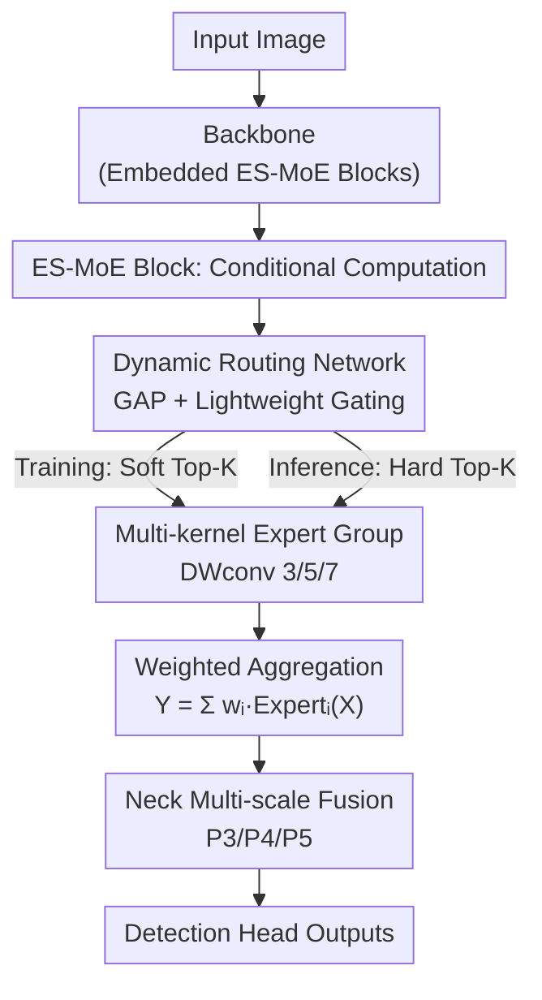

# YOLO-Master: MOE-Accelerated with Specialized Transformers for Enhanced Real-time Detection

**Conference**: CVPR 2026  
**Paper**: [CVF Open Access](https://openaccess.thecvf.com/content/CVPR2026/html/Lin_YOLO-Master_MOE-Accelerated_with_Specialized_Transformers_for_Enhanced_Real-time_Detection_CVPR_2026_paper.html)  
**Code**: https://github.com/Tencent/YOLO-Master  
**Area**: Object Detection  
**Keywords**: Real-time Detection, Sparse Mixture-of-Experts (MoE), Conditional Computation, Dynamic Routing, YOLO

## TL;DR
YOLO-Master integrates sparse MoE (ES-MoE blocks) into the YOLO backbone, enabling the network to dynamically activate different experts according to image complexity. It achieves 42.4% AP with a 1.62ms latency on MS COCO, surpassing YOLOv13-N by 0.8% mAP while being 18% faster.

## Background & Motivation
**Background**: The Real-time Object Detection (RTOD) field is largely dominated by the YOLO series. From YOLOv5 to YOLOv13, each generation pushes the "accuracy-speed" Pareto frontier slightly further by modifying the backbone (stronger features), the neck (better multi-scale fusion), or changing training strategies (NMS-free, selective attention).

**Limitations of Prior Work**: All these YOLO models rely on **static dense computation**—the same fixed network and computational budget are used regardless of whether the input is an empty highway or an aerial view crowded with small objects. Consequently, computational resources are wasted in simple scenes, while capacity remains insufficient for complex scenes, resulting in both computational redundancy and accuracy ceilings.

**Key Challenge**: Network capacity and computational budgets are **fixed at design time**, lacking a mechanism to dynamically allocate resources based on input content. A detector tuned for complex urban scenes is over-parametrized for simple scenes, while one tuned for speed lacks capacity for hard samples; the two cannot be optimized simultaneously.

**Key Insight**: The authors draw inspiration from Mixture-of-Experts (MoE) in Large Language Models—**sparse activation** allows different inputs to selectively activate a subset of parameters, improving both efficiency and adaptability. The goal is to migrate this conditional computation into real-time detection to "save where possible and spend where necessary." While prior attempts integrated MoE into ViT-based detectors, the overhead was too high for real-time performance.

**Core Idea**: A **lightweight sparse MoE block (ES-MoE)** is embedded into the YOLO CNN backbone. A GAP-driven dynamic routing network selectively activates a few experts based on scene complexity, breaking the static trade-off between "capacity vs. computation." This represents the first MoE conditional computation framework for lightweight real-time detectors.

## Method

### Overall Architecture
YOLO-Master uses recent YOLO architectures (e.g., YOLOv12) as a skeleton. The primary structural change involves replacing several convolution blocks with **ES-MoE (Efficient Sparse Mixture-of-Experts) blocks**. An input image passes through the backbone for feature extraction → neck for multi-scale fusion (P3/P4/P5) → head for bounding box prediction. This main branch is identical to standard YOLO; however, the ES-MoE blocks in the backbone **dynamically decide which experts to invoke based on the complexity of the image itself**.

The internal information flow of the ES-MoE block is: input feature map $X \in \mathbb{R}^{C\times H\times W}$ → (i) **Dynamic routing network** uses GAP to compress global information into descriptors and computes weights for each expert via lightweight gating → (ii) **Softmax Gating + Top-K Selection** picks the $K$ most relevant experts → (iii) The selected experts (Depthwise Separable Convolutions with different receptive fields) process the features → **Weighted aggregation** into an enhanced feature map $Y$. Crucially, different routing strategies are used for training and inference: Soft Top-K preserves gradients during training, while Hard Top-K ensures true sparsity during inference.

The paper also ablates the placement of ES-MoE: it can be placed in the backbone, neck, or both. Experiments found that **backbone-only placement is optimal** (neck-only dropped 2.6%, while both-placement collapsed to -5.9%).

### Key Designs

**1. ES-MoE Block: Enabling Conditional Computation Based on Scene Complexity**

To address the pain point where "static dense computation treats all inputs equally," ES-MoE replaces a convolutional block with a set of parallel experts and a router, allowing **capacity to scale dynamically with the input**. Given input $X$, the gating function $g_i(\cdot)$ computes weights for each expert and selects the Top-K experts ($K \ll E$) for sparse activation. The outputs are aggregated as follows:

$$w_i = \frac{\exp(g_i(X))}{\sum_{j=1}^{E}\exp(g_j(X))}, \qquad Y = \mathrm{Norm}\!\left(\sum_{i\in T_K} w_i\cdot \mathrm{Expert}_i(X)\right)$$

Where $T_K$ is the set of indices of the selected experts and $\mathrm{Norm}(\cdot)$ is normalization for stable aggregation. This allows simple scenes to use fewer experts and save computation, while complex scenes use more capacity—something attention-based methods cannot achieve, as attention only re-weights features without reducing the actual FLOPs.

**2. Multi-kernel Efficient Expert Group: Covering Multi-scales Without Slowing Inference**

If experts used standard convolutions, the parameters and FLOPs would explode as $E$ increases. The authors use **Depthwise Separable Convolution (DWconv)** as the basic unit for each expert, decoupling spatial filtering (depthwise) and channel fusion (pointwise) to remain lightweight:

$$\mathrm{Expert}_i(X) = \mathrm{DWconv}_{k_i,\,C_{in}\to C_{out}}(X)$$

Each expert uses a **different odd kernel size** $k_i\in\{3,5,7,\dots\}$, drawing on Inception's multi-kernel concept. This allows different experts to naturally excel at different scales. The router can then "dispatch as needed"—invoking small-kernel experts for dense small objects and large-kernel experts for large objects.

**3. GAP-driven Lightweight Gating Network: Preventing Routing Bottlenecks**

If routing decisions are too heavy, the saved computation is consumed by the gate. The authors employ a minimal gate: **GAP** compresses the feature map into a global descriptor $P=\mathrm{GAP}(X)\in\mathbb{R}^{C\times 1\times 1}$ (using global rather than local features for holistic image guidance), followed by two $1\times1$ convolutions:

$$\Lambda = \mathrm{Conv}^{out=E}_{1\times1}\big(\mathrm{SiLU}(\mathrm{Conv}^{out=C_{red}}_{1\times1}(P))\big)$$

With compression ratio $\gamma=8$. Crucially, the routing computation depends only on channel count $C$ and expert count $E$, and is **independent of spatial resolution $H\times W$**.

**4. Decoupled Routing Strategy: Soft Top-K for Training and Hard Top-K for Inference**

To solve the trade-off between inference sparsity and training gradient flow, a **decoupled strategy** is used. During training, **Soft Top-K** is applied: find Top-K indices $I_K$, construct a hard mask $M_K$, and re-normalize non-zero items from the initial softmax weights $\Omega'$:

$$\Omega_{train} = \frac{\Omega'\odot M_K}{\sum_{j}(\Omega')_j\odot(M_K)_j + \epsilon}$$

During inference, it switches to **Hard Top-K**: only the top $K$ logits are used for softmax, and other weights are set to zero, so only $K$ expert modules are actually invoked:

$$\Omega_{infer,i} = \begin{cases}\dfrac{\exp(\Lambda_i)}{\sum_{j\in I_K}\exp(\Lambda_j)} & i\in I_K \\[2mm] 0 & \text{otherwise}\end{cases}$$

## Loss & Training
The total loss is the standard YOLOv8 detection loss plus a custom load balancing loss for MoE: $L_{Total} = L_{YOLO} + \lambda_{LB}\cdot L_{LB}$. $L_{YOLO}=L_{cls}+L_{loc}+L_{DFL}$.

The load balancing loss $L_{LB}$ prevents **expert collapse**, where the router sends most inputs to a few "better initialized" experts. It computes the average utilization $\mu_i$ of each expert across the batch and uses MSE to push it toward a uniform distribution $1/E$:

$$L_{LB} = \frac{1}{E}\sum_{i=1}^{E}\left(\mu_i - \frac{1}{E}\right)^2$$

Ablations suggest that **removing DFL and using only the MoE loss (weight 1.5) yields the best results** (62.2% mAP).

## Key Experimental Results

### Main Results

| Dataset | Metric | YOLO-Master-N (Ours) | YOLOv13-N (Prev. SOTA) | Gain |
|--------|------|------|----------|------|
| MS COCO | mAP | 42.4% | 41.6% | +0.8% |
| PASCAL VOC | mAP | 62.1% | 60.7% | +1.4% |
| VisDrone | mAP | 19.6% | 17.5% | +2.1% |
| KITTI | mAP | 69.2% | 67.7% | +1.5% |
| SKU-110K | mAP | 58.2% | 57.5% | +0.7% |
| Efficiency | Latency | 1.62ms | 1.97ms | 18% Faster |

### Ablation Study

| Config | mAP | Params(M) | Description |
|------|---------|------|------|
| Baseline | 60.8% | 2.63 | Without ES-MoE |
| Neck-only | 58.2% | 2.49 | -2.6%, Lack of diverse input features |
| Full (both) | 54.9% | 2.76 | -5.9%, Conflicting gradients in cascaded routing |
| **Backbone-only** | **62.1%** | **2.66** | **+1.3%, Optimal** |

| Experts / Top-K | mAP / Sparsity | Conclusion |
|------|---------|------|
| 2 experts | 61.0% | Insufficient capacity |
| **4 experts** | **62.3%** | Optimal balance |
| 8 experts | 62.0% | Diminishing returns, over-parameterized |
| Top-1 | 61.3% / 75% | Insufficient representation |
| **Top-2** | **61.8% / 50%** | Sweet spot: Sparsity + Accuracy |
| Top-4 | 61.9% / 0% | Degenerates to dense mode |

### Key Findings
- **More ES-MoE is not always better**: Backbone-only is optimal. Cascaded routers interfere with each other's gradients, leading to poor expert specialization.
- **K=2 is the sweet spot**: Top-2 achieves nearly the highest accuracy with 50% sparsity.
- **4 experts are sufficient**: 8 experts increase parameters by 33% without gains, indicating that detection multi-scale variations are covered by moderate diversity.

## Highlights & Insights
- **Decoupled routing** is a practical design: Soft Top-K allows gradient flow during training while Hard Top-K enables true sparsity during inference.
- **Gating complexity is independent of spatial resolution**, which is the prerequisite for deploying MoE into real-time detectors.
- **"Placement > Quantity"**: Cascaded conditional computation modules can interfere with gradient specialization, suggesting that where modules are placed is more critical than how many are used.

## Limitations & Future Work
- **Validated only on Nano scale**: The primary results are for -N models. The gains on larger models (M/L/X) remain unclear.
- **Latency measuring**: 1.62ms is a theoretical value. Real-world NPU/TensorRT scheduling for sparse MoE often fails to reach theoretical speedups.
- **Title Misnomer**: The title mentions "Specialized Transformers," but the core method uses multi-kernel DWconv experts and convolutional gating rather than actual Transformer experts.

## Related Work & Insights
- **vs. YOLOv11/v12/v13**: These use static dense computation. YOLO-Master introduces conditional computation, allowing capacity to scale with input, particularly benefiting dense/small object scenes.
- **vs. RT-DETR**: RT-DETR uses Transformer architectures for accuracy-speed balance but remains static; YOLO-Master adds dynamic resource allocation.
- **vs. Attention**: Attention re-weights features statically (FLOPs unchanged), while MoE conditionally activates experts (FLOPs reduced).

## Rating
- Novelty: ⭐⭐⭐⭐ First MoE framework for lightweight RTOD.
- Experimental Thoroughness: ⭐⭐⭐⭐ Five datasets + comprehensive ablation, though limited to Nano scale.
- Writing Quality: ⭐⭐⭐⭐ Clear motivation, but the "Transformer" title is slightly misleading.
- Value: ⭐⭐⭐⭐ Improves YOLO accuracy without speed sacrifice, especially for dense scenes.

<!-- RELATED:START -->

## Related Papers

- [\[CVPR 2026\] YOLO-ULM: Ultra-Lightweight Models for Real-Time Object Detection](yolo-ulm_ultra-lightweight_models_for_real-time_object_detection.md)
- [\[CVPR 2026\] AKCMamba-YOLO: Selective State Space Models For Real-Time Object Detection](akcmamba-yolo_selective_state_space_models_for_real-time_object_detection.md)
- [\[AAAI 2026\] YOLO-IOD: Towards Real Time Incremental Object Detection](../../AAAI2026/object_detection/yolo-iod_towards_real_time_incremental_object_detection.md)
- [\[ICLR 2026\] RF-DETR: Neural Architecture Search for Real-Time Detection Transformers](../../ICLR2026/object_detection/rf-detr_neural_architecture_search_for_real-time_detection_transformers.md)
- [\[CVPR 2026\] MoECLIP: Patch-Specialized Experts for Zero-shot Anomaly Detection](moeclip_patch-specialized_experts_for_zero-shot_anomaly_detection.md)

<!-- RELATED:END -->
