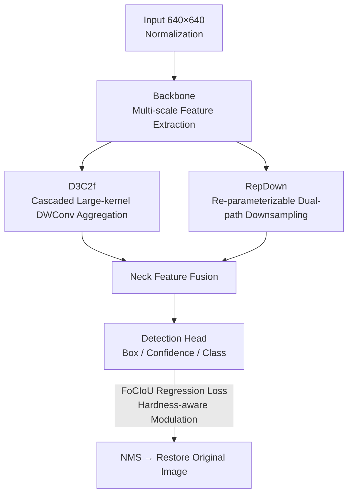

# YOLO-ULM: Ultra-Lightweight Models for Real-Time Object Detection

**Conference**: CVPR 2026  
**Paper**: [CVF Open Access](https://openaccess.thecvf.com/content/CVPR2026/html/Han_YOLO-ULM_Ultra-Lightweight_Models_for_Real-Time_Object_Detection_CVPR_2026_paper.html)  
**Code**: TBD  
**Area**: Object Detection  
**Keywords**: Real-Time Detection, Lightweight, Large-kernel Depthwise Convolution, Re-parameterized Downsampling, IoU Loss

## TL;DR
By replacing two types of high-cost operators in the YOLOv12 framework (feature aggregation replaced by D3C2f based on cascaded large-kernel depthwise convolutions; downsampling replaced by re-parameterizable dual-path RepDown) and incorporating a hardness-aware FoCIoU loss, an ultra-lightweight real-time detector is developed that achieves higher accuracy than YOLOv11/12/13 and RT-DETR with fewer parameters and lower computational cost when trained from scratch.

## Background & Motivation

**Background**: In real-time detection, the YOLO series has long occupied the optimal trade-off between speed and accuracy. Current mainstream approaches follow two routes: attention-based models (such as A2C2f in YOLOv12) have strong modeling capabilities but suffer from quadratic complexity and memory access bottlenecks that hinder real-time performance; CNN-based models (such as C2f in YOLOv8 and C3k2 in YOLOv11) are approximately 3 $\times$ faster than attention variants under equal computational power and remain the mainstay for deployment.

**Limitations of Prior Work**: The authors precisely identify three of the most computationally intensive stages in YOLO and quantify their inefficiencies using empirical data under uniform input settings. Taking feature aggregation as an example, for $X_{in}\in\mathbb{R}^{1024\times20\times20}$, C2f requires 7.35M parameters / 2.94G FLOPs due to stacking multiple Bottlenecks. C3k2 reduces this to 2.0G FLOPs but still maintains 4.99M parameters. A2C2f uses attention to compress FLOPs to 2.33G, but parameters increase to 5.81M, and memory access bottlenecks negate theoretical acceleration. In downsampling, standard Conv requires 4.72M parameters / 1.89G FLOPs; the dual-path ADown in YOLOv9 reduces parameters to 1.31M but introduces high-frequency information loss; SCDown in YOLOv10 is even more efficient (0.54M) but weakens local correlation. Regarding the loss function, CIoU relies on empirical tuning and suffers from training instability during sharp shape changes, lacks adaptive weighting for hard/easy samples, and tends to over-focus on easy samples.

**Key Challenge**: Existing lightweight methods pursue speed excessively while ignoring the loss of critical information during feature extraction and cross-stage spatial transformations. Consequently, they either sacrifice speed for accuracy or vice versa, lacking a unified paradigm that simultaneously saves parameters and computation without sacrificing performance.

**Goal**: Transform the three aforementioned inefficient stages into "dual-driven (efficiency + accuracy)" new operators to holistically reshape YOLO's feature aggregation, downsampling, and regression loss, creating an ultra-lightweight yet high-precision real-time detector.

**Core Idea**: Feature aggregation is redesigned using cascaded large-kernel depthwise convolutions (D3C2f), downsampling is redesigned using re-parameterizable dual-path depthwise convolutions (RepDown), and the regression loss is redesigned using a hardness-aware IoU term (FoCIoU). These three components are integrated into YOLOv12, with backbone channel expansion ratios adjusted as needed, resulting in YOLO-ULM and its faster Turbo version.

## Method

### Overall Architecture
YOLO-ULM does not reinvent the wheel but performs "surgical" modifications—swapping operators and adjusting parameters—on the YOLOv12 backbone-neck-head paradigm. Input images are uniformly scaled to $640\times640$ and normalized. The backbone extracts multi-scale features (where C3k2 degrades to C2f when `C3k=False`), the neck performs feature fusion, and the head predicts bounding boxes, confidence, and classes. Finally, NMS filters redundant boxes to restore the original image dimensions.

Changes are concentrated in three areas: ① Feature aggregation modules in the deeper network (high-dimensional channel space) are replaced with **D3C2f**, using large-kernel depthwise convolutions to compensate for the limited receptive field of small kernels in deep layers. ② Downsampling in the backbone and neck is replaced with **RepDown**, which uses a dual-path structure during training and re-parameterizes into a single-path $7\times7$ depthwise convolution during inference. ③ The regression loss is changed from CIoU to **FoCIoU**, adding hardness-aware dynamic gradient modulation. Additionally, the input channel expansion ratio for two "over-compressed" C3k2 modules (as shown in Fig. 2) was adjusted from 0.25 back to 0.5 to mitigate information over-compression, and the number of groups in Conv was recalibrated to alleviate inter-group communication bottlenecks. Five variants (N/S/M/L/X) are obtained via width scaling factors, and a Turbo series focusing on lower latency is derived by refining backbone parameters.

### Key Designs

**1. D3C2f: Compensating for Limited Deep Receptive Fields with Cascaded Large-kernel DWConvs**

The limitation is that C2f / C3k2 use small kernels across all pyramid levels, locking the receptive field in deep layers and hindering the capture of high-level semantics and large object detection; meanwhile, multi-branch Bottlenecks and full-channel convolutions introduce computational redundancy. The authors propose the D3 block—cascading three depthwise convolutions: first, a $3\times3$ Depthwise Separable Convolution (DSConv, consisting of $1\times1$ pointwise + $3\times3$ depthwise, with groups $C=eC_{in}$, where $e$ is the compression ratio) performs spatial and channel decoupling; then, a $7\times7$ large-kernel depthwise convolution expands the receptive field via grouping to supplement global modeling; since splitting cross-channel interaction into two independent stages weakens complex relationship modeling, a final $3\times3$ DSConv is cascaded to recover cross-channel-spatial interactions and fine-grained features; finally, residual connections stabilize gradients. Embedding D3 blocks into a C2f-like structure forms D3C2f: a sliced strategy splits intermediate features into halves—one goes directly to Concat, while the other passes through $N$ D3 blocks—reducing peak memory during concatenation.

Efficiency: For $C_{in}=C_{out}=C$, expansion ratio $e=0.5$, active shortcut, and $n=1$, the parameters and computation of D3C2f are reduced to $O(4.5C^2+67C)$ and $O(4.5HWC^2+67HWC)$, whereas C2f requires $O(7C^2)$ and $O(7HWC^2)$. When $C$ is large (typical of deep layers), D3C2f reduces computational cost by approximately 35.7% compared to C2f, justifying its deployment in high-dimensional channel spaces.

**2. RepDown: Heterogeneous Receptive Fields for Training, Single-path for Inference**

Standard Conv downsampling is parameter-redundant, while ADown's pooling redesign loses high-frequency information. RepDown designs "channel-spatial decoupling + heterogeneous receptive field parallel fusion": first, a $1\times1$ pointwise convolution increases channels at low cost $O(C_{in}C_{out}HW+2C_{out})$; then, two spatial paths with stride=2 are used—the main path uses $7\times7$ depthwise convolution for large-scale spatial pre-aggregation, and the auxiliary path uses $3\times3$ depthwise convolution to preserve high-frequency components like edge textures. Cross-scale semantic fusion is achieved via element-wise addition. If $C_{out}=2C_{in}=2C$, parameter sharing across dual paths allows parameters to grow only linearly $O(31HWC)$, reducing complexity from quadratic $O(C^2)$ in standard convolutions to linear $O(C)$.

The key lies in structural re-parameterization: during inference, the dual branches are aligned via zero-padding, and weights/biases are added element-wise to merge into a single $7\times7$ depthwise convolution. This retains multi-scale extraction capability during training while degrading to an efficient single-branch for inference. Overall, RepDown compresses downsampling parameters/computation to $O(2C^2+128C)$ and $O(2HWC^2+29HWC)$, significantly lower than Conv ($O(18C^2)$/$O(4.5HWC^2)$) or ADown ($O(5C^2+2C)$/$O(1.25HWC^2+4.6HWC)$).

**3. FoCIoU: CIoU with Hardness-aware Dynamic Gradient Modulation**

CIoU lacks an adaptive mechanism for hard and easy samples, leading to instability and a bias toward easy samples. FoCIoU retains the original CIoU formula $\text{CIoU}=\text{IoU}-\frac{\rho^2(b_{pred},b_{gt})}{c^2}-\alpha v$ (where $\rho$ is the center distance, $c$ is the diagonal of the minimum enclosing box, $v$ measures aspect ratio consistency, and $\alpha=\frac{v}{(1-\text{IoU})+v}$), and introduces a non-linear interval mapping $\text{IoU}_{MF}$ based on Focaler-IoU:

$$\text{IoU}_{MF}=\begin{cases}0, & \text{IoU}<m\\[2pt]\dfrac{(\text{IoU}-m)^\beta}{(n-m)^\beta}, & m\le\text{IoU}\le n\\[2pt]1, & \text{IoU}>n\end{cases}$$

Here, $\beta$ is a non-linear hardness-aware factor (larger $\beta$ emphasizes hard samples; $\beta=2$ is set to prevent overfitting), and $m,n\in[0,1]$ are interval endpoints. The final loss is $l_{FoCIoU}=1-\text{CIoU}+\text{IoU}-\text{IoU}_{MF}$, which aggregates all anchors normalized by category weights. The elegance lies in the difference term $\Delta=\text{IoU}-\text{IoU}_{MF}$ achieving dynamic gradient modulation: for easy samples (high IoU), $\Delta\to0$, causing the extra gradient term to vanish; for hard samples (low IoU), $\Delta\to1$, magnifying the gradient to increase focus—adaptively biasing training attention toward hard samples without adding any parameters or FLOPs.

### Loss & Training
All five variants are **trained from scratch (no pre-trained weights)** on COCO using SGD (momentum 0.937, weight decay $5\times10^{-4}$), with an initial learning rate of $1\times10^{-2}$ linearly decaying to $1\times10^{-4}$. Data augmentation includes Mosaic, Mixup, and copy-paste. Latency is measured on T4 GPU + TensorRT FP16. The Turbo version follows the same settings but refines backbone parameters for lower latency.

## Key Experimental Results

### Main Results
Comparison with SOTA real-time detectors on COCO `val` (mAP at IoU 0.50:0.95, Latency on T4 + TensorRT FP16):

| Variant | Model | FLOPs(G)↓ | Params(M)↓ | mAP↑ | Latency(ms)↓ |
|---------|-------|-----------|------------|------|--------------|
| N | YOLOv11-N | 6.5 | 2.6 | 39.4 | 1.50 |
| N | YOLOv12-N | 6.5 | 2.6 | 40.6 | 1.64 |
| N | YOLOv13-N | 6.5 | 2.5 | 41.6 | 1.97 |
| N | **YOLO-ULM-N** | 6.4 | **2.1** | **41.6** | 1.52 |
| N | **YOLO-ULM-Turbo-N** | 5.8 | 2.1 | 40.7 | **1.48** |
| S | RT-DETR-R18 | 60.0 | 20.0 | 46.5 | 4.58 |
| S | YOLOv12-S | 21.4 | 9.3 | 48.0 | 2.61 |
| S | **YOLO-ULM-S** | 21.2 | **7.4** | **48.1** | 2.55 |
| L | RT-DETR-R50 | 136.0 | 42.0 | 53.1 | 6.90 |
| L | YOLOv13-L | 88.4 | 27.6 | 53.4 | 8.63 |
| L | **YOLO-ULM-L** | 95.1 | **22.8** | **54.1** | 6.32 |
| X | YOLOv12-X | 199.0 | 59.1 | 55.2 | 11.79 |
| X | **YOLO-ULM-X** | 213.1 | **51.0** | **55.6** | 11.47 |

As shown, the N variant matches YOLOv13-N's 41.6% mAP with fewer parameters (2.1M vs 2.5M) while reducing latency from 1.97ms to 1.52ms (approx. 22.8% faster). Ours also outperforms YOLOv11/12-N by 2.2% / 1.0% respectively. The S variant YOLO-ULM-Turbo outperforms RT-DETR-R18 by 1.2% mAP with 68.7% fewer FLOPs and 64% fewer parameters. L/X variants exceed their counterparts in YOLOv11/12/13 by 0.4%~1.0% mAP with significantly fewer parameters.

### Ablation Study
Ablation of components on N / M variants (Row 1/6 are baselines):

| # | Variant | D3C2f | RepDown | FoCIoU | FLOPs(G) | Params(M) | mAP |
|---|---------|-------|---------|--------|----------|-----------|-----|
| 1 | Baseline-N | ✗ | ✗ | ✗ | 6.7 | 2.6 | 40.7 |
| 2 | Ours-N | ✓(7) | ✗ | ✗ | 6.7 | 2.6 | 40.9 |
| 3 | Ours-N | ✓(7) | ✓(7,P) | ✗ | 6.5 | 2.1 | 41.0 |
| 4 | Ours-N | ✓(7) | ✓(7,P) | ✓ | 6.5 | 2.1 | 41.2 |
| 5 | Ours-N | ✓(5) | ✓(7) | ✓ | 6.4 | 2.1 | 41.6 |
| 6 | Baseline-M | ✗ | ✗ | ✗ | 72.6 | 20.6 | 52.6 |
| 8 | Ours-M | ✓(7) | ✓(7,P) | ✗ | 70.2 | 16.0 | 52.5 |
| 9 | Ours-M | ✓(7) | ✓(7,P) | ✓ | 70.2 | 16.0 | 52.8 |

### Key Findings
- **RepDown is the primary parameter saver**: In the N variant, it reduces parameters from 2.6M to 2.1M (−3.0% relative to the whole model) and FLOPs by 19.2%; in the M variant, parameters drop from 20.2M to 16.0M (−20.8%) with minimal accuracy loss.
- **D3C2f improves accuracy at equal complexity**: Compared to C2f, it has 3.7% fewer parameters and 1.5% fewer FLOPs while achieving 0.1% higher mAP.
- **FoCIoU provides zero-cost gains**: Without adding parameters or FLOPs, N / M variants gain +0.2% / +0.3% mAP respectively, confirming the effectiveness of hardness-aware modulation.
- **Kernel size has a "sweet spot"**: $7\times7$ in RepDown performs better than $5\times5$ or $9\times9$. Excessive sizes lead to accuracy regression and increased latency.

## Highlights & Insights
- **Engineering Philosophy of "Swapping Operators, Not Paradigms"**: Instead of redesigning the entire network, the authors precisely replace the three least efficient stages. This D3C2f / RepDown approach is theoretically transferable to any YOLO variant.
- **Training-Inference Structure Decoupling**: RepDown learns heterogeneous receptive fields via dual paths during training and merges them into a single $7\times7$ path via re-parameterization for inference, successfully achieving both multi-scale expression and single-branch speed.
- **Nearly Free Hardness Modulation in Loss**: FoCIoU uses a simple difference term $\Delta=\text{IoU}-\text{IoU}_{MF}$ to achieve focal-style hard sample focusing without hyperparameter-sensitive extra branches.
- **Superiority of Training from Scratch**: Outperforming YOLOv11/12/13 and RT-DETR without pre-trained weights suggests that the gains stem from the architecture itself rather than data advantages.

## Limitations & Future Work
- **Small and Distributed Gains**: In many tiers, the mAP improvement is 0.4%~1.0%. The work is more about being "more efficient at the same accuracy" than a leap in performance.
- **Latency Gains are Inconsistent**: In the X variant, FLOPs (213.1G) are actually higher than YOLOv12-X (199.0G). Lightweighting is more evident in parameters than in computational load for larger models.
- **Single Dataset Validation**: Performance on small, dense objects (e.g., DOTA aerial images) or domain adaptation scenarios has not been verified.
- **Future Directions**: Exploring adaptive kernel sizes/compression ratios for D3C2f or dynamic scheduling of $\beta, m, n$ in FoCIoU during training.

## Related Work & Insights
- **vs YOLOv12 (A2C2f Attention)**: YOLOv12 uses lightweight attention-convolution hybrids, but memory access bottlenecks offset theoretical speedups. Ours returns to pure CNNs using large kernels to compensate for receptive fields, achieving lower parameters and latency.
- **vs YOLOv9 ADown / YOLOv10 SCDown**: While both save parameters, they sacrifice high-frequency information or local correlation. RepDown retains both via dual-path heterogeneous receptive fields and re-parameterization.
- **vs CIoU / Focaler-IoU**: By grafting Focaler's non-linear mapping onto CIoU's geometric constraints, Ours merges "geometric refinement" with "hard-easy sample adaptation."

## Rating
- Novelty: ⭐⭐⭐⭐ (Clever combinations of cascaded large kernels, re-parameterizable downsampling, and loss modulation.)
- Experimental Thoroughness: ⭐⭐⭐⭐ (Comprehensive across all tiers and components, though limited to COCO.)
- Writing Quality: ⭐⭐⭐⭐ (Quantified opening motivations and clear derivation of complexity.)
- Value: ⭐⭐⭐⭐ (Plug-and-play lightweight operators have direct industrial value.)

<!-- RELATED:START -->

## Related Papers

- [\[CVPR 2026\] AKCMamba-YOLO: Selective State Space Models For Real-Time Object Detection](akcmamba-yolo_selective_state_space_models_for_real-time_object_detection.md)
- [\[CVPR 2026\] YOLO-Master: MOE-Accelerated with Specialized Transformers for Enhanced Real-time Detection](yolo-master_moe-accelerated_with_specialized_transformers_for_enhanced_real-time.md)
- [\[AAAI 2026\] YOLO-IOD: Towards Real Time Incremental Object Detection](../../AAAI2026/object_detection/yolo-iod_towards_real_time_incremental_object_detection.md)
- [\[CVPR 2026\] Does YOLO Really Need to See Every Training Image in Every Epoch?](does_yolo_really_need_to_see_every_training_image_in_every_epoch.md)
- [\[CVPR 2026\] CD-Buffer: Complementary Dual-Buffer Framework for Test-Time Adaptation in Adverse Weather Object Detection](cd-buffer_complementary_dual-buffer_framework_for_test-time_adaptation_in_advers.md)

<!-- RELATED:END -->
