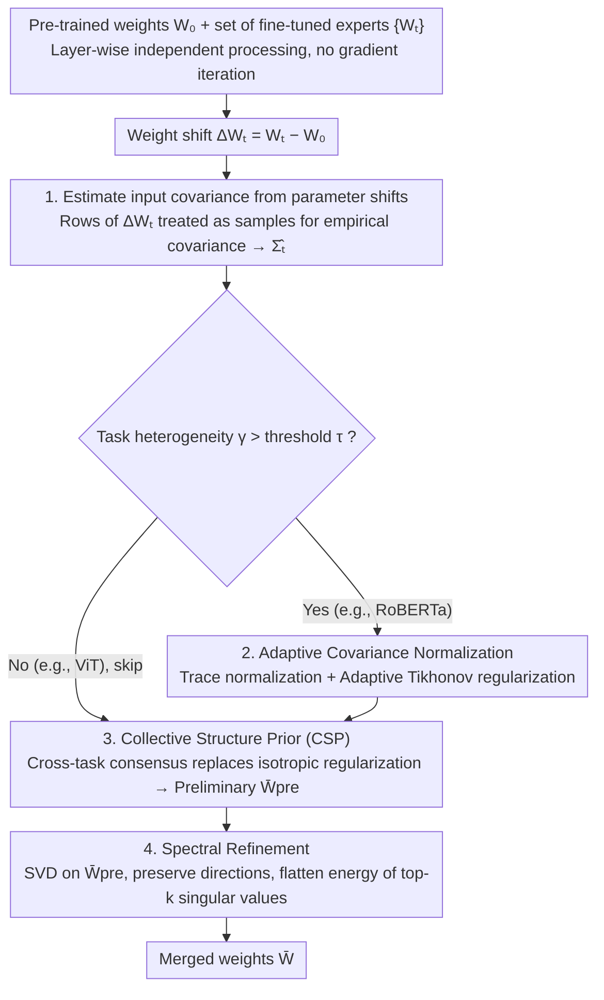

# ACE-Merging: Data-Free Model Merging with Adaptive Covariance Estimation

**Conference**: CVPR 2026  
**arXiv**: [2603.02945](https://arxiv.org/abs/2603.02945)  
**Code**: None  
**Area**: Optimization  
**Keywords**: Model merging, data-free, covariance estimation, spectral refinement, closed-form solution

## TL;DR
This paper theoretically proves that fine-tuned parameter differences contain input covariance information. Accordingly, it proposes ACE-Merging, which achieves data-free closed-form model merging through a three-step process: adaptive covariance estimation, collective structure priors, and spectral refinement. It achieves an average improvement of 4% on GPT-2 and 5% on RoBERTa-Base compared to previous methods.

## Background & Motivation

**Background**: The "pre-train then fine-tune" paradigm produces a large number of task-specific models. Model Merging aims to fuse multiple expert models into a single unified model to avoid expensive multi-task retraining. Existing methods fall into three categories: data-dependent (requires original data), test-time adaptation (high inference overhead), and data-free (most flexible).

**Limitations of Prior Work**: While data-free methods are most practical, approaches ranging from Task Arithmetic to TIES-Merging are merely heuristic operations in the parameter space (sign alignment, pruning, etc.). They treat the "symptoms" of interference without addressing the root cause—the statistical structural differences in task data distributions.

**Key Challenge**: The optimal merging formula $\bar{W} = (\sum_t W_t \Sigma_t)(\sum_t \Sigma_t)^{-1}$ requires the input covariance $\Sigma_t$ for each task. However, under the data-free setting, these statistics are exactly what is unavailable.

**Goal**: How to accurately estimate the input covariance for each task without any data access, thereby achieving theoretically grounded optimal merging.

**Key Insight**: The authors discovered that the rows of the weight shift $\Delta W_t$ produced by fine-tuning implicitly contain input covariance information—treating the rows of $\Delta W_t$ as independent samples, their empirical covariance is proportional to $\Sigma_t$.

**Core Idea**: The fine-tuned parameter differences themselves encode the input covariance. Thus, the theoretically optimal closed-form merging solution can be constructed by estimating these statistics without any data.

## Method

### Overall Architecture
The starting point for ACE-Merging is the well-known "ideal" merging formula $\bar{W} = (\sum_t W_t \Sigma_t)(\sum_t \Sigma_t)^{-1}$, which uses the input covariance $\Sigma_t$ of each task as weights for a weighted average. This is theoretically optimal, but the sole obstacle is the unavailability of $\Sigma_t$ in data-free settings. The entire pipeline of this paper is designed to "reconstruct" this covariance out of thin air and feed it into the closed-form solution. Given pre-trained weights $W_0$ and a set of fine-tuned experts $\{W_t\}$, the method processes layers independently: it first infers the covariance estimate for each task from the weight shift $\Delta W_t = W_t - W_0$, then adaptively normalizes based on scale differences between tasks, adds a cross-task shared structure prior to obtain a preliminary closed-form solution, and finally uses spectral refinement to remove ill-conditioned components to output the merged weights $\bar{W}$. There is no gradient iteration throughout the process.

### Key Designs

**1. Estimating input covariance from parameter shifts: Turning the "no data" deadlock into a computable quantity**

The fundamental obstacle to data-free merging is the unavailability of $\Sigma_t$. The theoretical core of this paper (Theorem 1) proves that $\Sigma_t \propto \text{Cov}_{\mathcal{D}_t}[\Delta W_t]$—the weight shifts left by fine-tuning already encode the second-order statistics of the input. Intuitively, because fine-tuning updates are small, the gradient can be linearized at $W_0$, yielding $\Delta W_t \approx -2\eta N_t \,\mathbb{E}[(W_0 x - y)x^\top]$, where the shift is directly linked to the input outer product $x x^\top$. Operationally, each row of $\Delta W_t$ is treated as an independent sample, and its empirical covariance is calculated:

$$\hat{\Sigma}_t \propto (\Delta W_t - \mathbf{1}\mu_t^\top)^\top (\Delta W_t - \mathbf{1}\mu_t^\top)$$

This step is the foundation of the entire method. It transforms "data-free merging" from an intractable heuristic problem into one with an explicit estimation target and a feasible closed-form solution. It also provides a unified explanation for prior work: WUDI-Merging implicitly uses a similar proxy $\hat{\Sigma}_t \propto \|\Delta W_t\|_F^{-2} (\Delta W_t)^\top \Delta W_t$, but relies on unstable iterative gradient descent, whereas this paper brings this quantity to the forefront for direct closed-form use.

**2. Adaptive Covariance Normalization: Preventing high-energy tasks from dominating**

Simply adding the $\hat{\Sigma}_t$ of each task into the merging formula poses a risk—the energy scales of $\Delta W_t$ across different tasks can vary significantly, allowing high-energy tasks to dominate the result. This paper quantifies this difference using a heterogeneity measure: $\gamma = \frac{\text{Var}_t[\log\|\Delta W_t\|_F^2]}{(\mathbb{E}_t[\log\|\Delta W_t\|_F^2])^2}$, which is the relative variance of the log-shift energy across tasks. Normalization is triggered only when $\gamma$ exceeds a threshold $\tau$: first, trace normalization flattens the total energy of each covariance $\hat{\Sigma}_{t,\text{scaled}} = \hat{\Sigma}_t / \text{Tr}(\hat{\Sigma}_t)$, then a scale-adaptive Tikhonov regularization $\hat{\Sigma}_{t,\text{reg}} = \hat{\Sigma}_{t,\text{scaled}} + \frac{\epsilon}{\text{Tr}(\hat{\Sigma}_t)} I$ stabilizes the inversion. Here, $\gamma$ acts as a gating switch: experiments show RoBERTa's heterogeneity ($\gamma > 0.3$) is much higher than ViT's ($\gamma < 0.25$), so the gate allows the method to automatically skip normalization for already homogeneous ViT tasks.

**3. Collective Structure Prior (CSP): Replacing isotropic regularization with cross-task consensus**

The $\epsilon I$ regularization from the previous step is isotropic, treating all feature dimensions equally and ignoring the true geometric structure of the input space. CSP constructs a low-rank consensus prior by broadcasting the column means of the scaled covariances across all tasks: $\mathbf{C}_{\text{agg}} = \mathbf{1} \cdot (\frac{1}{d_{\text{in}}} \mathbf{1}^\top \sum_t \hat{\Sigma}_{t,\text{scaled}})$. Replacing the standard regularization with this yields the preliminary solution:

$$\bar{W}_{\text{pre}} = \Big(\sum_t W_t \hat{\Sigma}_{t,\text{reg}}\Big)\Big(\sum_t \hat{\Sigma}_{t,\text{reg}} + \mathbf{C}_{\text{agg}}\Big)^{-1}$$

Compared to uniform $\epsilon I$, $\mathbf{C}_{\text{agg}}$ carries information about "which dimensions are collectively prioritized across tasks," allowing the regularization to selectively reinforce these shared important directions rather than indiscriminately suppressing all dimensions.

**4. Spectral Refinement: Correct directions, wrong energy—reallocating energy only**

The preliminary solution $\bar{W}_{\text{pre}}$ suffers from severe spectral ill-conditioning: its top 5% singular values account for over 99% of the energy, with a condition number as high as $8.7\times 10^5$. However, the key observation is that its principal directions are mostly correct (cosine similarity with the final solution $\approx 1$); only the energy distribution across singular values is flawed. Thus, instead of re-calculating, one only needs to preserve the directions and flatten the energy. Specifically, the structural residual $\Delta_{\text{res}} = \sum_t W_t (\hat{\Sigma}_{t,\text{scaled}} - \bar{\Sigma})$ is calculated, fused with $\bar{W}_{\text{pre}}$, and then subjected to SVD. The top-$k$ singular directions are re-weighted using their mean singular value $\sigma_{\text{iso}}$:

$$\Delta W_{\text{refine}} = \sigma_{\text{iso}}\, \mathbf{U}_{:,1:k} \mathbf{V}_{:,1:k}^\top, \qquad \bar{W} = \bar{W}_{\text{pre}} + \Delta W_{\text{refine}}$$

This "preserve direction, flatten energy" fix eliminates the pathology without destroying the geometric structure estimated in previous steps, providing the final performance boost in the ablation studies.

### Loss & Training
ACE-Merging is a pure closed-form method and does not involve any training or optimization iterations. Hyperparameters are fixed at $\tau=0.3$, $k_{\text{frac}}=0.3$, with $\epsilon$ adjusted per model family (GPT-2: $4\times 10^{-2}$, RoBERTa-Base: $2\times 10^{-4}$, others: $1\times 10^{-5}$).

## Key Experimental Results

### Main Results

**Vision Tasks (ViT-B/16, Average Accuracy %)**

| Tasks | Weight Avg | Task Arithmetic | CART | TSV-M | ACE-Merging | Gain |
|--------|-----------|----------------|------|-------|-------------|------|
| 8 tasks | 72.2 | 75.4 | 88.3 | 89.0 | **90.6** | +1.6 |
| 14 tasks | 69.5 | 70.5 | 84.1 | 84.6 | **86.1** | +1.5 |
| 20 tasks | 65.3 | 65.8 | 80.5 | 80.6 | **82.1** | +1.5 |

**Language Tasks (GPT-2, GLUE Avg %)**

| Method | CoLA | MNLI | MRPC | QNLI | QQP | RTE | SST-2 | Avg |
|------|------|------|------|------|-----|-----|-------|-----|
| Task Arithmetic | 68.7 | 68.6 | 69.6 | 70.5 | 81.8 | 47.3 | 83.6 | 70.0 |
| TSV-M | 65.6 | 75.4 | 58.6 | 64.4 | 86.2 | 55.6 | 85.7 | 70.2 |
| **ACE-Merging** | 70.3 | 69.9 | 71.8 | 76.7 | 79.0 | 62.5 | 88.5 | **74.1** |

### Ablation Study

| Configuration | RoBERTa-L | GPT-2 | ViT-B/16 (8tasks) | Notes |
|------|-----------|-------|-------------------|------|
| E1: Basic Closed-form | 80.05 | 68.72 | 89.91 | Closed-form only |
| E2: + Adaptive ε | 88.04 | 71.50 | 89.91 | Adaptive reg. is the largest contributor |
| E3: + Aggregate Prior | 86.79 | 71.51 | 90.60 | Structural prior assistance |
| E4: + Spectral Refinement | **91.68** | **74.09** | **90.60** | Final spectral refinement boost |

### Key Findings
- Adaptive regularization contributes the most—improving by nearly 8 percentage points from E1 to E2 on RoBERTa-L, indicating that balancing task heterogeneity is the core bottleneck.
- ViT automatically skips adaptive and spectral refinement stages due to low task heterogeneity ($\gamma < 0.3$) (E1≈E2, E3≈E4), validating the logic of the $\gamma$ gating mechanism.
- Hyperparameter sensitivity analysis shows stable performance within ranges $\gamma \in [0.1, 0.3]$ and $k_{\text{frac}} \in [0.1, 0.5]$, while $\epsilon$ is more sensitive.
- On RoBERTa-Base, ACE-Merging (90.4%) significantly outperforms WUDI-Merging (85.3%) and maintains a ~3% lead on RoBERTa-Large.

## Highlights & Insights
- **Elegant Theoretical Insight**: It transforms the fundamental barrier of data-free merging (missing covariance) into a quantity directly estimable from parameter differences, establishing a formal link: "fine-tuned weight difference ↔ input covariance." This perspective not only explains why ACE-Merging works but also unifies previous methods—Weight Averaging assumes $\Sigma_t = kI$, while WUDI-Merging implicitly uses $\|\Delta W_t\|_F^{-2} (\Delta W_t)^\top \Delta W_t$ as a proxy.
- **Closed-form vs. Iterative**: While WUDI-Merging requires gradient descent iterations, ACE-Merging is a true closed-form solution, offering higher computational efficiency and better stability.
- **Clever Spectral Refinement Observation**: The discovery that the initial closed-form solution has correct directions but extreme energy imbalance (top 5% singular values taking 99% energy) allows for a "preserve direction, redistribute energy" approach. This "correct direction, wrong magnitude" diagnostic logic is transferable to other matrix optimization problems.

## Limitations & Future Work
- $\epsilon$ needs to be manually set per model family (GPT-2, RoBERTa, and ViT each differ); the authors acknowledge that automatic estimation of $\epsilon$ is a future direction.
- The linear approximation $f(W,x) \approx Wx$ may be imprecise in deep non-linear networks, especially regarding attention layers.
- The assumption that "rows of $\Delta W_t$ can be treated as independent samples" may not hold in practice, as structural correlations exist between rows of weight matrices.
- Validated only on GLUE and vision classification tasks; generative tasks (e.g., LLM dialogue, code generation) have not been tested.
- Merging is performed layer-wise independently, ignoring cross-layer dependencies.

## Related Work & Insights
- **vs WUDI-Merging**: This paper reinterprets WUDI as a special case of ACE (norm-weighted covariance proxy) under a theoretical framework, and replaces WUDI's iterative optimization with a more stable and efficient closed-form solution.
- **vs TSV-M**: TSV-M uses SVD to decompose shared/task-specific subspaces heuristically; ACE models covariance directly with a more solid theoretical foundation.
- **vs RegMean**: RegMean is a data-dependent method using true covariance; ACE proves that covariance can be estimated without data to achieve comparable performance.
- The logic of covariance estimation + spectral correction can be extended to model aggregation problems in Federated Learning.

## Rating
- Novelty: ⭐⭐⭐⭐ Elegant theoretical contribution, though the core insight (parameter shift $\propto$ covariance) is not entirely unexpected.
- Experimental Thoroughness: ⭐⭐⭐⭐⭐ Vision + Language, multiple architectures/scales, complete ablations, and sensitivity analysis.
- Writing Quality: ⭐⭐⭐⭐⭐ Clear logical chain: Theory → Unified Framework → Method → Experiments.
- Value: ⭐⭐⭐⭐ Practical tool for data-free merging, though the need for manual $\epsilon$ tuning reduces out-of-the-box usability.

<!-- RELATED:START -->

## Related Papers

- [\[CVPR 2026\] Model Merging in the Essential Subspace](model_merging_in_the_essential_subspace.md)
- [\[CVPR 2026\] Label-Free Cross-Task LoRA Merging with Null-Space Compression](label-free_cross-task_lora_merging_with_null-space_compression.md)
- [\[CVPR 2026\] BD-Merging: Bias-Aware Dynamic Model Merging with Evidence-Guided Contrastive Learning](bd-merging_bias-aware_dynamic_model_merging_with_evidence-guided_contrastive_lea.md)
- [\[CVPR 2026\] Defending Unauthorized Model Merging via Dual-Stage Weight Protection](defending_unauthorized_model_merging_via_dual-stage_weight_protection.md)
- [\[CVPR 2026\] DC-Merge: Improving Model Merging with Directional Consistency](dc-merge_improving_model_merging_with_directional_consistency.md)

<!-- RELATED:END -->
