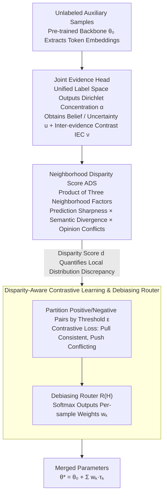

# BD-Merging: Bias-Aware Dynamic Model Merging with Evidence-Guided Contrastive Learning

**Conference**: CVPR 2026  
**arXiv**: [2603.03920](https://arxiv.org/abs/2603.03920)  
**Code**: None  
**Area**: Optimization
**Keywords**: Model Merging, Multi-Task Learning, Evidential Deep Learning, Distribution Shift, Contrastive Learning, uncertainty estimation

## TL;DR

The authors propose the BD-Merging framework, which utilizes Dirichlet evidence modeling, Neighborhood Disparity Score (ADS), and disparity-aware contrastive learning to train a debiasing router for adaptive assignment of model merging weights. This significantly improves the robustness and generalization of merged models under test-time distribution shifts and unseen tasks.

## Background & Motivation

**Rise of Model Merging**: Multi-task learning requires substantial data and computational resources, often limited by privacy concerns regarding data sharing. Model merging has emerged as an efficient alternative by integrating independently fine-tuned checkpoints to achieve multi-task capabilities without retraining.

**Neglect of Reliability under Distribution Shift**: Existing model merging methods generally assume that test data follows the same distribution as training or auxiliary data. However, in real-world scenarios, factors such as sensor noise, transmission distortion, and environmental changes cause test-time input distribution shifts, severely undermining the performance of merged models.

**Test-time Bias**: Experiments demonstrate that even minor natural perturbations cause a significant drop in accuracy for all existing methods (e.g., Task Arithmetic drops by 16.8% at L3 level), indicating a lack of robustness to input-level noise.

**Inadequate Generalization to Unseen Tasks**: AdaMerging achieves 90.79% on seen tasks but plummets to 49.83% on unseen tasks, exposing severe overfitting. Methods relying on auxiliary data may even amplify distribution gaps when distributions are mismatched.

**Lack of Fine-grained Sample-level Alignment**: Existing methods fail to capture sample-level distribution discrepancies, adjusting weights only at a global or task level. This prevents them from addressing conflicting knowledge and biased integration caused by heterogeneous distribution shifts.

**Key Insight**: Utilizing evidential uncertainty to capture distribution discrepancies and guiding adaptive representation alignment accordingly is the key breakthrough for solving the distribution shift problem in model merging.

## Method

### Overall Architecture

BD-Merging aims to solve the performance collapse of merged models when encountering distribution shifts or unseen tasks at test time. The core idea is to first quantify the abnormality of an input and then utilize a lightweight router to dynamically adjust merging weights for each sample. Specifically, the input passes through a pre-trained backbone to extract features. An evidence head attached to the backbone outputs a set of Dirichlet concentration parameters in a unified label space, deriving evidence quantities such as belief and uncertainty. Next, the Neighborhood Disparity Score (ADS) uses these quantities to measure the inconsistency between the current sample and its neighbors, distinguishing "in-distribution normal samples" from "perturbed/unseen abnormal samples." Finally, disparity-aware contrastive learning uses ADS to partition positive and negative sample pairs to train a debiasing router. This router outputs a set of merging weights $\{w_k\}$ for each sample (or layer), weighting multiple task vectors into the final parameters $\theta^* = \theta_0 + \sum_k w_k \tau_k$. The entire process is unsupervised and requires no labels.

### Key Designs

**1. Joint Evidence Head: Measuring "How Unreliable the Prediction Is" in Overlapping Label Spaces**

The most difficult aspect of test-time distribution shift is the magnification of semantic ambiguity in overlapping label spaces. A perturbed image might cause the model to oscillate between two adjacent classes. Traditional Evidential Deep Learning (EDL) only considers "total evidence" and "maximum class confidence," failing to distinguish this cross-task semantic drift. BD-Merging attaches an evidence head to the backbone, outputting Dirichlet concentration parameters $\boldsymbol{\alpha}$ in a unified label space $\mathcal{Y} = \bigcup_{k=1}^{K} \mathcal{Y}_k$, further calculating belief quality $b_c$, uncertainty $u$, and prediction probability $p_c$. A crucial enhancement is the introduction of the Inter-evidence Contrast (IEC) metric:

$$\nu = \frac{S}{\alpha_{\hat{c}^{(1)}}} \cdot \frac{L}{S} \cdot \frac{\alpha_{\hat{c}^{(2)}}}{\alpha_{\hat{c}^{(1)}}}$$

It integrates prediction concentration, inter-class competition, and semantic ambiguity into a single scalar. The first term assesses if the evidence for the best class stands out; the latter terms measure the contention between the second-highest and highest classes. By explicitly characterizing inter-class dependencies where the top two candidates are neck-and-neck, IEC identifies prediction failure types with finer granularity than single uncertainty metrics.

**2. Neighborhood Disparity Score (ADS): Mapping Local Distribution Discrepancies via Three Perspectives**

Sample-level evidence alone is insufficient; determining if a sample is "abnormal" requires comparing it with its neighbors. ADS defines a neighborhood set $\mathcal{A}_r(x_i)$ with radius $r$ for each sample $x_i$ and multiplies three complementary factors to form the disparity score $d_{ik}$. Any single factor would miss information; their combination provides a unified view of local discrepancy across uncertainty, semantics, and confidence conflicts.

The first factor, Prediction Sharpness, measures the overall epistemic uncertainty of the neighborhood—whether the neighbors' predictions are "sharp":

$$\mathrm{Sharp}(x_i) = \mathbb{E}_{x_j \in \mathcal{A}_r}\, \log\!\left(\frac{S_j}{\max_c \alpha_{jc}} - 1\right)$$

The second factor, Semantic Divergence, quantifies the deviation in class-level distribution between the target sample and its neighbors using $L_1$ distance after normalizing concentration parameters into probabilities:

$$\mathrm{Div}(x_i) = \mathbb{E}_{x_j \in \mathcal{N}_r}\, \left\| \frac{\boldsymbol{\alpha}_i}{S_i} - \frac{\boldsymbol{\alpha}_j}{S_j} \right\|_1$$

The third factor, Opinion Conflicts, identifies sample pairs that are "confident but contradictory"—it is amplified only when both samples have low uncertainty ($(1-u_i)(1-u_k) \approx 1$) yet their predictions do not match:

$$\mathrm{Conf}(x_i, x_k) = \sum_c |p_{ic} - p_{kc}| \cdot (1-u_i)(1-u_k)$$

Following the union of these factors, in-distribution samples yield low ADS, while perturbed or unseen tasks yield significantly higher ADS, providing a clean signal for contrastive partitioning.

**3. Disparity-Aware Contrastive Learning & Debiasing Router: Translating Disparity into Per-sample Weights**

A common flaw in fixed-weight merging is interference between heterogeneous tasks—a single set of weights for all inputs inevitably compromises performance. BD-Merging uses ADS to drive contrastive learning: using the threshold $\epsilon$, the neighborhood is split into positive sets $\mathcal{M}_r^+(i)$ ($d_{ik} < \epsilon$, distributionally consistent) and negative sets $\mathcal{M}_r^-(i)$ ($d_{ik} \geq \epsilon$, distributionally conflicting). The contrastive loss pulls consistent representations together and pushes conflicting ones apart, reorganizing the feature space by distribution alignment. A debiasing router (two-layer MLP) is trained on top, reading backbone token embeddings $\mathbf{H}$ to output per-sample merging weights:

$$\{w_{k}\} = \mathrm{softmax}\big(R(\mathbf{H})\big), \qquad \theta^* = \theta_0 + \sum_k w_k \cdot \tau_k$$

Thus, each input receives a customized task vector combination. Normal samples use robust ratios, while abnormal samples are shifted by the router toward more reliable task branches. This evidence-led dynamic allocation allows the merged model to adapt to unfamiliar distributions while reducing task interference.

## Loss & Training

The training process consists of two phases:

**Phase I: Evidence Head Training**

$$\mathcal{L}_{\mathrm{Head}} = \mathcal{L}_{\mathrm{Ent}} + \gamma \mathcal{L}_{\mathrm{Inv}}$$

- $\mathcal{L}_{\mathrm{Ent}}$: Entropy minimization + KL divergence regularization toward a non-informative prior to encourage sharp predictions while avoiding overconfidence.
- $\mathcal{L}_{\mathrm{Inv}}$: Inverse correlation loss to constrain the relationship between uncertainty $u$ and IEC $\nu$ as inversely proportional.

**Phase II: Router Training**

$$\mathcal{L}_{\mathrm{BD}} = \mathcal{L}_{\mathrm{Unsup}} + \eta \mathcal{L}_{Dis}$$

- $\mathcal{L}_{\mathrm{Unsup}}$: Shannon entropy minimization to enhance the certainty of merged predictions.
- $\mathcal{L}_{Dis}$: Disparity-aware contrastive loss partitioning positive/negative pairs based on ADS.

All regularization coefficients ($\lambda, \gamma, \eta$) are set to 0.1. Training lasts for 300 epochs with a batch size of 16.

## Key Experimental Results

**Table 1: Performance under Test-time Bias (ViT-B/32, Average Accuracy across 8 Tasks)**

| Method | Clean | L1 (↓) | L2 (↓) | L3 (↓) |
|------|-------|--------|--------|--------|
| Task Arithmetic | 69.09 | 64.07 (−7.3%) | 60.30 (−12.7%) | 57.50 (−16.8%) |
| Ties-Merging | 72.92 | 68.14 (−6.6%) | 64.34 (−11.8%) | 61.51 (−15.6%) |
| AdaMerging (Layer) | 74.33 | 69.00 (−7.2%) | 64.46 (−13.3%) | 61.22 (−17.6%) |
| Twin-Merging | 84.10 | 79.13 (−5.9%) | 74.17 (−11.8%) | 70.88 (−15.7%) |
| AdaMerging w/Surgery | 84.40 | 79.02 (−6.4%) | 74.33 (−11.9%) | 70.97 (−15.9%) |
| **BD-Merging (Layer)** | **87.15** | **83.31 (−4.4%)** | **78.78 (−9.6%)** | **75.36 (−13.5%)** |

BD-Merging performs best across all perturbation levels and exhibits the smallest performance degradation (L1 drop of only 4.4% vs 5.9%–7.3% for others).

**Table 2: Seen vs. Unseen Task Generalization (4 Seen + 4 Unseen)**

| Method | Seen Task Avg | Unseen Task Avg |
|------|-------------|-------------|
| AdaMerging | 90.79 | 49.83 |
| Twin-Merging | 93.06 | 53.03 |
| **BD-Merging** | **94.53** | **55.01** |

BD-Merging improves accuracy on both seen and unseen tasks, achieving the best balance between generalization and specialization.

**Table 3: Ablation Study (Clean / Corrupted L2)**

| Variant | Clean | Corrupted |
|------|-------|-----------|
| BD-Merging | 87.15 | 78.78 |
| w/o Router | 78.31 (−8.84) | 67.25 (−11.53) |
| w/o ADS | 84.48 (−2.67) | 75.44 (−3.34) |
| w/o $\mathcal{L}_{Dis}$ | 83.34 (−3.81) | 74.26 (−4.52) |
| w/o Div(·) | 85.36 (−1.79) | 76.28 (−2.50) |

The debiasing router is the most critical component (dropping ~9/11 points when removed). Among the three ADS factors, Div(·) contributes the most.

## Highlights & Insights

1.  **Precise Problem Definition**: This work is the first to systematically study the reliability of model merging under test-time distribution shifts, clearly identifying test-time bias and unseen task generalization as key challenges.
2.  **Synergy of Evidence Modeling and Contrastive Learning**: Uncertainty signals from EDL guide the positive/negative pair partitioning in contrastive learning, creating a closed loop: evidence modeling detects disparity → ADS quantifies disparity → contrastive learning utilizes disparity.
3.  **Efficiency-Performance Balance**: BD-Merging approaches the performance of individual fine-tuned models while maintaining significantly lower computational overhead than methods like AdaMerging w/Surgery.
4.  **Router Interpretability**: Weight distributions for different unseen tasks exhibit clear task-specific patterns (e.g., concentrated allocation for Cars vs. uniform for SUN397), providing intuitive interpretability.

## Limitations & Future Work

1.  **Limited to Image Classification**: Evaluation is restricted to 8 image classification datasets. Validation on other modalities like NLP or multi-modal tasks is lacking, leaving generalization uncertain.
2.  **Neighborhood Construction Overhead**: ADS requires computing neighborhood sets in feature space, which may impose additional computational burdens on large-scale datasets; scalability is not discussed.
3.  **Hyperparameter Sensitivity**: Parameters such as neighborhood radius $r$, threshold $\epsilon$, and multiple loss coefficients require tuning. The paper uses a simple 0.1 for most coefficients, but different scenarios may require finer adjustment.
4.  **Limited Improvement on Unseen Tasks**: Although BD-Merging outperforms baselines on unseen tasks (55.01% vs 53.03%), it remains far below the pre-trained model's performance (56.99%), leaving room for improvement.
5.  **Fixed Router Structure**: The two-layer MLP router is relatively simple; more complex attention mechanisms or mixture-of-experts structures could be explored.

## Related Work & Insights

-   **Task Arithmetic / Ties-Merging / DARE**: Static weight merging methods that do not consider input-level adaptation, showing poor robustness under distribution shifts. BD-Merging surpasses this fixed-weight paradigm via dynamic routing.
-   **AdaMerging**: Learns task/layer adaptive weights but is optimized based on auxiliary data, leading to overfitting when auxiliary and test distributions do not match. BD-Merging's evidence-guided mechanism models uncertainty directly on test features, reducing dependence on auxiliary data distributions.
-   **Twin-Merging**: Efficiently integrates modular knowledge but has limited accuracy. BD-Merging achieves a better balance between precision and efficiency.
-   **Surgery**: Improves merging quality via surgical adjustments but at a high computational cost. BD-Merging reaches similar accuracy with lower overhead.
-   **Evidential Deep Learning**: BD-Merging extends EDL from traditional OOD detection to the model merging scenario, opening new directions for EDL applications.

## Rating

-   **Novelty**: ⭐⭐⭐⭐ — Introduces evidence learning to model merging and designs a closed loop of ADS + contrastive learning; the approach is novel and the engineering is complete.
-   **Experimental Thoroughness**: ⭐⭐⭐⭐ — Extensive coverage of multi-level perturbations, seen/unseen tasks, ablations, router analysis, and multi-backbone validation, though lacking non-vision tasks.
-   **Writing Quality**: ⭐⭐⭐⭐ — Clear motivation, complete derivations, and rich visualizations; the transitions between problem definition and methodology are smooth.
-   **Value**: ⭐⭐⭐⭐ — The first systematic study of MM distribution shift robustness, offering significant reference value for real-world deployment.

<!-- RELATED:START -->

## Related Papers

- [\[CVPR 2026\] Model Merging in the Essential Subspace](model_merging_in_the_essential_subspace.md)
- [\[CVPR 2026\] ACE-Merging: Data-Free Model Merging with Adaptive Covariance Estimation](ace-merging_data-free_model_merging_with_adaptive_covariance_estimation.md)
- [\[CVPR 2026\] DC-Merge: Improving Model Merging with Directional Consistency](dc-merge_improving_model_merging_with_directional_consistency.md)
- [\[ICLR 2026\] How does the optimizer implicitly bias the model merging loss landscape?](../../ICLR2026/optimization/how_does_the_optimizer_implicitly_bias_the_model_merging_loss_landscape.md)
- [\[CVPR 2026\] Defending Unauthorized Model Merging via Dual-Stage Weight Protection](defending_unauthorized_model_merging_via_dual-stage_weight_protection.md)

<!-- RELATED:END -->
