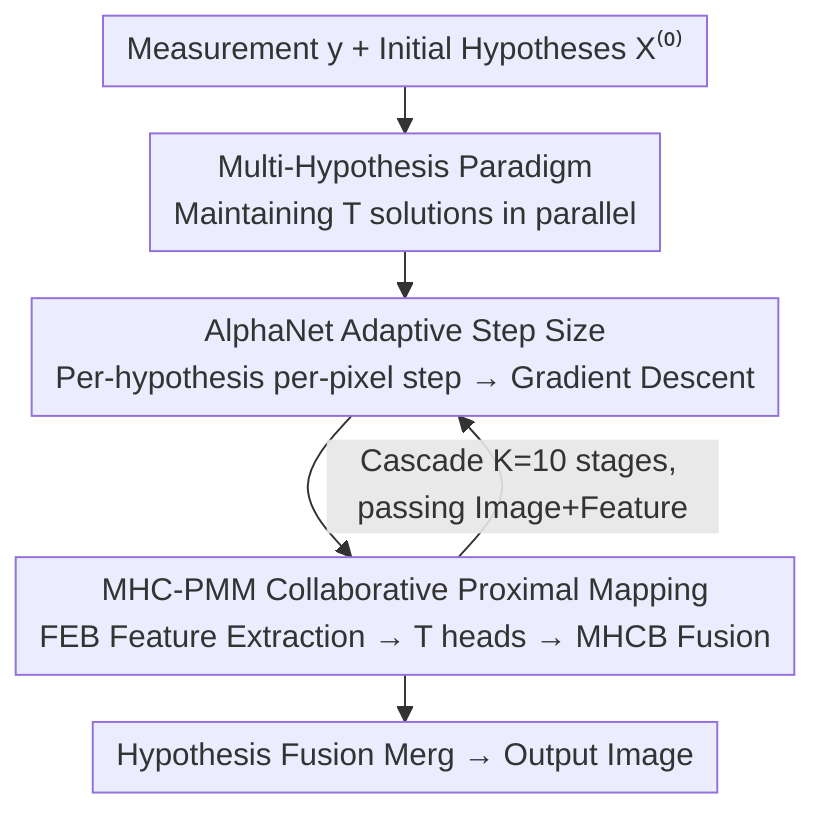

# Beyond Single Solution: Multi-Hypothesis Collaborative Deep Unfolding Network for Image Compressive Sensing

**Conference**: CVPR 2026  
**arXiv**: [2606.03666](https://arxiv.org/abs/2606.03666)  
**Code**: None (Not provided in the paper)  
**Area**: Image Compressive Sensing / Deep Unfolding Networks / Image Reconstruction  
**Keywords**: Compressive Sensing, Deep Unfolding, Multi-Hypothesis, Proximal Gradient Descent, Collaborative Optimization  

## TL;DR
Addressing the "underdetermined and non-unique" nature of the Compressive Sensing (CS) problem, this paper proposes MHC-DUN: a paradigm shift from reconstructing a single solution in traditional Deep Unfolding Networks (DUNs) to "reconstructing $T$ hypothesis solutions simultaneously with collaborative optimization." Specifically, AlphaNet predicts pixel-adaptive step sizes for each hypothesis in the gradient descent step, while MHCB captures inter-hypothesis correlations for fusion in the proximal mapping step. The method consistently outperforms current SOTA on Set11/Urban100/CS-MRI (e.g., achieving a 0.45 dB average PSNR gain over USB-Net on Set11).

## Background & Motivation

**Background**: Compressive sensing recovers the original signal $\mathbf{x}$ from linear measurements $\mathbf{y}=\mathbf{A}\mathbf{x}$ where the number of samples is far below the Nyquist rate. In the deep learning era, there are two main categories: Discriminative Block-based Networks (DBNs) that map measurements to images (simple but lacking interpretability) and Deep Unfolding Networks (DUNs) that "unfold" iterative optimization algorithms like ISTA/AMP/PGD into cascaded multi-stage networks. DUNs, such as OCTUF, CPP-Net, and USB-Net, are the mainstream for CS due to their theoretical foundations and end-to-end trainability.

**Limitations of Prior Work**: Almost all DUNs perform inference in a **single-solution space**—each stage maintains and outputs only one reconstruction result $\mathbf{x}^{(k)}$. However, for a CS sampling matrix $\mathbf{A}\in\mathbb{R}^{M\times N}$ where $M\ll N$, the Rank-Nullity Theorem states that $\operatorname{rank}(\mathbf{A})+\operatorname{nullity}(\mathbf{A})=N$. Thus, the null space dimensionality is $\operatorname{nullity}(\mathbf{A})=N-r\ge N-M>0$, implying that the solutions satisfying $\mathbf{A}\hat{\mathbf{x}}=\mathbf{y}$ form an affine subspace $\mathcal{S}=\{\hat{\mathbf{x}}+\mathbf{z}\mid \mathbf{z}\in\operatorname{Null}(\mathbf{A})\}$. **Mathematically, there are infinite valid solutions.** Forcing the network to "regress to a unique optimal solution" increases optimization difficulty and restricts reconstruction quality.

**Key Challenge**: The single-solution paradigm conflicts with the "inherently multi-solution" nature of CS problems. Furthermore, single-solution inference performs information extraction within a single feature domain, **failing to capture correlations between multiple potential solutions** and missing the opportunity for mutual information calibration.

**Goal**: Explicitly model the "multi-solution" aspect within the unfolding network. This involves maintaining a set of hypothesis solutions in parallel and ensuring they collaborate during both gradient descent and proximal mapping steps to eventually fuse into a high-quality result.

**Key Insight**: Starting from the two-step iteration of PGD (Proximal Gradient Descent)—the gradient descent step $\mathbf{r}^{(k)}=\mathbf{x}^{(k-1)}-\rho\mathbf{A}^{\rm T}(\mathbf{A}\mathbf{x}^{(k-1)}-\mathbf{y})$ and the proximal mapping step $\mathbf{x}^{(k)}=\operatorname{prox}_\lambda(\mathbf{r}^{(k)})$—the scalar solution $\mathbf{x}$ is replaced with a set of hypotheses $\mathbf{X}=\{x_1,\dots,x_T\}$, effectively "set-ifying" both steps.

**Core Idea**: Replace "regressing a single solution" with "collaboratively optimizing a group of diverse hypothesis solutions," utilizing the complementary information within solution ambiguity to fuse into a single result.

## Method

### Overall Architecture

MHC-DUN addresses the underdetermined nature of CS by rewriting the optimization objective to find a set of hypothesis solutions $\tilde{\mathbf{X}}=\{x_1,\dots,x_T\}$ and subsequently merging them:

$$\tilde{\mathbf{X}}=\arg\min_{\mathbf{X}}\tfrac{1}{2}\|\mathbf{A}\mathbf{X}-\mathbf{y}\|_2^2+\lambda\mathbf{\Psi}(\mathbf{X}),\qquad \tilde{\mathbf{x}}=\operatorname{Merg}(\tilde{\mathbf{X}})$$

where the regularization term $\mathbf{\Psi}(\mathbf{X})$ encodes both **intra-hypothesis** priors and **inter-hypothesis** correlation priors, and $\operatorname{Merg}(\cdot)$ aggregates the hypotheses. Unfolding the PGD for this multi-hypothesis objective yields a $K=10$ stage cascaded network. Each stage includes:

- **MHC-GDM (Multi-Hypothesis Collaborative Gradient Descent Module)**: Executes $\mathbf{R}^{(k)}=\mathbf{X}^{(k-1)}-\mathbf{P}^{(k)}\nabla f(\mathbf{X}^{(k-1)})$, where the step-size matrix $\mathbf{P}^{(k)}$ is predicted pixel-wise for all hypotheses by **AlphaNet**, allowing each hypothesis to follow its own step size.
- **MHC-PMM (Multi-Hypothesis Collaborative Proximal Mapping Module)**: Implements $\mathbf{X}^{(k+1)}=\mathcal{H}_R^{(k)}(\mathbf{R}^{(k)})$. It first extracts local and non-local features using FEB, generates $T$ hypotheses independently via reconstruction heads, and then uses **MHCB** to exploit inter-hypothesis correlations for collaborative fusion.

Deep features $\mathbf{F}^{(k)}$ are passed alongside reconstructed images between stages to prevent information loss. The training utilizes a composite loss constraining measurement fidelity, hypothesis diversity, and reconstruction accuracy.

### Key Designs

**1. Multi-Hypothesis Collaborative Optimization: Shifting from "One Solution" to "A Set of Solutions"**

This design directly addresses the conflict between the single-solution paradigm and the multi-solution nature of CS. Since the null space dimension of CS is always positive, an entire affine subspace of valid solutions exists around the optimal solution. Forcing convergence to a single point is difficult and wastes complementary information. This paper maintains $T$ hypotheses $\mathbf{X}=\{x_1,\dots,x_T\}$ at **every unfolding stage** and performs PGD operations on the entire set. During training, diversity is explicitly encouraged. Effectiveness: Multiple hypotheses act as probes in the affine subspace; the proximal mapping step corriges errors via inter-hypothesis correlations, and the final fusion benefits from accurate details across different hypotheses. Ablations show that increasing $T$ from 1 to 16 improves average PSNR by 0.30 dB (36.42 to 36.72), proving that multiple solutions provide gains rather than redundancy.

**2. AlphaNet: Predicting Per-Pixel Adaptive Step Sizes for Independent Gradient Updates**

Traditional PGD uses a preset scalar step size $\rho$. Even learnable DUNs usually employ one scalar $\rho^{(k)}$ per stage. This coarse granularity applies the same step size to all spatial locations and hypotheses, preventing individual paths of exploration. AlphaNet receives the hypotheses $\mathbf{X}^{(k-1)}$ and features $\mathbf{F}^{(k-1)}$ (combining image and feature domain information). It uses $1\times1$ Conv + ReLU for channel fusion $\mathbf{u}^{(k)}=\operatorname{ReLU}(\operatorname{Conv}(\operatorname{Cat}(\mathbf{F}^{(k-1)},\mathbf{X}^{(k-1)})))$, followed by an Alpha-Block with residual spatial attention $\mathbf{v}^{(k)}=\mathbf{u}^{(k)}+\operatorname{Conv}(\mathbf{u}^{(k)})\odot\operatorname{Sigmoid}(\operatorname{Conv}(\mathbf{u}^{(k)}))$ to recalibrate spatial responses. A final $3\times3$ Conv + Sigmoid outputs the **step-size map** $\mathbf{P}^{(k)}=\operatorname{Sigmoid}(\operatorname{Conv}(\mathbf{v}^{(k)}))$. This allows the network to adaptively "walk slower in flat areas, faster in textured areas," and "take different paths for different hypotheses." Removing AlphaNet in ablations leads to a 0.21 dB drop, the largest contribution among all components.

**3. MHC-PMM + MHCB: Collaborative Proximal Denoising with Intra- and Inter-Priors**

The proximal mapping step must independently denoise each hypothesis (intra-prior) while allowing them to exchange information (inter-prior)—a secondary capability lacking in single-solution DUNs. MHC-PMM first concatenates the gradient descent result $\mathbf{R}^{(k)}$ and prior features $\mathbf{F}^{(k-1)}$ into $\mathbf{q}^{(k)}$, which passes through $d=2$ **FEBs** (Feature Extraction Blocks). Each FEB uses a dual-branch structure: one branch uses convolutions for local priors, and the other uses Swin Transformer for non-local dependencies. The enhanced features $\mathbf{F}^{(k)}$ are fed into $T$ independent reconstruction heads to produce $\{\hat{x}_1^{(k)},\dots,\hat{x}_T^{(k)}\}$. Finally, the **MHCB (Multi-Hypothesis Collaborative Block)** merges them. MHCB employs **channel attention** for coarse-grained fusion and **spatial attention** for fine-grained fusion, modeling both intra-hypothesis structures and inter-hypothesis correlations. Ablations indicate: removing MHCB drops 0.17 dB; removing spatial attention within MHCB drops 0.13 dB, while removing channel attention drops 0.05 dB, highlighting spatial attention's role in capturing fine-grained inter-hypothesis priors.

### Loss & Training

A composite loss is applied at every stage, consisting of three terms:

$$\mathcal{L}(\mathbf{\Theta})=\frac{1}{K}\sum_{k=1}^{K}\big(\lambda_1\mathcal{L}_{data}^{(k)}+\lambda_2\mathcal{L}_{div}^{(k)}\big)+\mathcal{L}_{rec}$$

- **Data Fidelity Term** $\mathcal{L}_{data}^{(k)}=\frac{1}{T}\sum_{i=1}^T\|\mathbf{A}x_i^{(k)}-\mathbf{y}\|_2^2$: Constrains each hypothesis to remain consistent with observations in the compressed domain.
- **Diversity Regularization Term** $\mathcal{L}_{div}^{(k)}=\frac{1}{T(T-1)}\sum_{i}\sum_{j\ne i}\frac{\langle x_i^{(k)},x_j^{(k)}\rangle}{\|x_i^{(k)}\|_2\|x_j^{(k)}\|_2}$: Minimizes the pairwise cosine similarity between hypotheses to discourage redundancy and encourage complementarity.
- **Reconstruction Loss** $\mathcal{L}_{rec}=\|\tilde{\mathbf{x}}-\mathbf{x}\|_2^2$: Constrains the fused output $\tilde{\mathbf{x}}$ to match the ground truth.

Weights are set to $\lambda_1=0.50$ and $\lambda_2=0.01$. The model is trained on the WED dataset with $128\times128$ grayscale patches using the Adam optimizer (batch size 16, initial LR 1e-4 halved every 50 epochs, total 600 epochs/600k iterations) on an RTX 3090. Key hyperparameters: $K=10$ stages, $d=2$ FEBs per stage, $T=16$ hypotheses, 128 feature channels. A weight-shared variant is denoted as MHC-DUN*.

## Key Experimental Results

### Main Results

Comparison of average PSNR(dB)/SSIM on Set11 across different sampling rates (representative methods):

| Method | R=0.01 | R=0.10 | R=0.25 | R=0.40 | Average |
|------|--------|--------|--------|--------|------|
| CSformer (TIP'23, DBN) | 21.63/0.5905 | 29.21/0.8784 | 33.36/0.9490 | 37.20/0.9679 | 31.29/0.8676 |
| NL-CSNet (TMM'23, DBN) | 21.96/0.6005 | 30.05/0.8995 | 34.45/0.9513 | 37.71/0.9753 | 31.97/0.8774 |
| CPP-Net (CVPR'24, DUN) | 22.19/0.6135 | 31.27/0.9135 | 36.35/0.9631 | 39.53/0.9781 | 33.38/0.8876 |
| USB-Net (TIP'25, DUN) | 22.29/0.6168 | 31.31/0.9149 | 36.42/0.9632 | 39.64/0.9785 | 33.46/0.8887 |
| **MHC-DUN\*** (Shared) | 22.55/0.6387 | 31.82/0.9206 | 36.81/0.9646 | 40.04/0.9793 | 33.85/0.8947 |
| **MHC-DUN** | **22.63/0.6392** | **31.86/0.9208** | **36.87/0.9649** | **40.08/0.9796** | **33.91/0.8951** |

- **Vs. Best DBNs**: Higher than NL-CSNet/CSformer by 1.94/2.62 dB on Set11 and 1.57/2.13 dB on Urban100.
- **Vs. Best DUNs**: Higher than CPP-Net/USB-Net by 0.53/0.45 dB on Set11 and 1.20/1.04 dB on Urban100.
- **Generalization**: On CS-MRI (Brain), MHC-DUN achieves 38.03/0.9417, outperforming USB-Net (37.90/0.9412).

Complexity (256×256 input, CS rate 0.10):

| Method | GPU(s) | Params(M) | GFLOPs |
|------|--------|---------|--------|
| NesTD-Net | 0.1223 | 5.57 | 372.80 |
| CPP-Net | 0.1182 | 12.31 | 166.93 |
| USB-Net | 0.0554 | 15.47 | 95.89 |
| **MHC-DUN** | 0.0627 | 10.81 | 231.67 |
| **MHC-DUN\*** | **0.0512** | **3.68** | 231.67 |

Despite having 10.81M parameters, MHC-DUN's GPU inference time is only 0.06s (faster than NesTD-Net/CPP-Net). The weight-shared MHC-DUN* reduces parameters to 3.68M with the lowest latency while maintaining high performance.

### Ablation Study

Impact of three main components (Set11 average PSNR):

| Config | AlphaNet | MHCB | Loss | Avg PSNR | Description |
|------|----------|------|------|-----------|------|
| (a) | ✗ | ✗ | ✗ | 35.86 | Baseline (all removed) |
| (b) | ✗ | ✓ | ✓ | 36.06 | w/o AlphaNet (drops 0.21) |
| (c) | ✓ | ✗ | ✓ | 36.10 | w/o MHCB (drops 0.17) |
| (d) | ✓ | ✓ | ✗ | 36.17 | w/o Composite Loss (drops 0.10) |
| (e) | ✓ | ✓ | ✓ | **36.27** | Full Model |

Effect of the number of hypotheses $T$ (Set11 average PSNR):

| $T$ | 1 | 4 | 8 | 16 | 32 |
|-----|------|------|------|------|------|
| Avg PSNR | 36.42 | 36.53 | 36.63 | 36.72 | 36.74 |

### Key Findings
- **AlphaNet contributes most**: Removing it results in a 0.21 dB drop, highlighting that per-hypothesis per-pixel adaptive step sizes are central to multi-hypothesis gradient updates.
- **Gains saturate for hypotheses**: $T$ shows monotonic gains up to 16, but increasing $T$ from 16 to 32 provides negligible gains (0.02 dB).
- **Spatial Attention > Channel Attention in MHCB**: Removing spatial attention drops performance by 0.13 dB vs. 0.05 dB for channel attention, proving fine-grained spatial fusion is more critical.
- **Higher gains at higher sampling rates**: At R=0.40, MHC-DUN improves over USB-Net by 0.44 dB, while gains are smaller but still evident at lower rates (R=0.01).

## Highlights & Insights
- **Turning CS Pathologies into Resources**: Instead of suppressing ambiguity with regularization, this work treats the infinite valid solutions as a source of complementary information. It uses the Rank-Nullity theorem to turn "why maintain multiple hypotheses" into a clean mathematical argument.
- **Seamless Synergy with DUN**: The cascaded structure of DUN provides a natural host for refinement of a hypothesis set. The diversity regularization $\mathcal{L}_{div}$ is the "finishing touch" that prevents hypotheses from collapsing into identical solutions—this concept of "forcing diversity" is transferable to any ensemble-based reconstruction task.
- **Dual-Domain Information Consistency**: Both AlphaNet and MHC-PMM process concatenated image and feature domain data, a hallmark of high-performance DUNs utilized effectively here.
- **Practicality of the Weight-Shared Variant**: MHC-DUN* achieves SOTA performance with only 3.68M parameters, suggesting that the gains come from the multi-hypothesis paradigm rather than mere parameter stacking.

## Limitations & Future Work
- **Computational Overhead**: Maintaining $T=16$ hypotheses leads to higher GFLOPs (231.67) compared to USB-Net (95.89). While GPU parallelization hides the latency, the power consumption might be a concern for edge/low-power CS applications (e.g., single-pixel cameras).
- **Saturation of $T$**: The lack of significant gains beyond $T=16$ suggests current collaborative mechanisms may have an upper limit on how much "extra" hypothesis information can be utilized via attention-based fusion.
- **Simple Fusion Operators**: The current $\operatorname{Merg}$ and MHCB modules rely purely on attention without explicitly modeling region-wise uncertainty or confidence. Incorporating evidential fusion might unlock further potential.
- **Primitive Diversity Regularization**: Cosine similarity penalizes global directionality but doesn't guarantee hypotheses are complementary in "error-prone" local regions.

## Related Work & Insights
- **Vs. Single-Solution DUNs (OCTUF / CPP-Net / USB-Net)**: These methods pass image+feature data between stages but only maintain one solution. MHC-DUN "set-ifies" every step, providing a significant 0.45–0.53 dB PSNR margin on Set11.
- **Vs. Early DUNs (ISTA-Net / AMP-Net)**: Early models focus only on image domains and single solutions. MHC-DUN integrates both dual-domain feature passing and multi-hypothesis collaboration.
- **Vs. Traditional Multi-Hypothesis Ideas**: The paper transplants "multi-hypothesis prediction" (common in video coding) into deep CS within the interpretable PGD framework. The gradient descent step manages "how hypotheses explore," and the proximal mapping step manages "how hypotheses calibrate each other."

## Rating
- Novelty: ⭐⭐⭐⭐⭐ Excellent theoretical grounding using the Rank-Nullity theorem and a systematic upgrade of the DUN paradigm.
- Experimental Thoroughness: ⭐⭐⭐⭐ Extensive testing on three datasets across five rates with comprehensive ablations. Could explore more diverse loss formulations.
- Writing Quality: ⭐⭐⭐⭐ Clear logical flow (Pathology → Multiple Solutions → Collaboration). Diagrams are informative.
- Value: ⭐⭐⭐⭐ Sets a new SOTA and provides a design pattern applicable to other ill-posed inverse problems (deblurring, super-resolution, MRI).

<!-- RELATED:START -->

## Related Papers

- [\[ICLR 2026\] Hierarchical Multi-Stage Recovery Framework for Kronecker Compressed Sensing](../../ICLR2026/optimization/hierarchical_multi-stage_recovery_framework_for_kronecker_compressed_sensing.md)
- [\[AAAI 2026\] Parametrized Multi-Agent Routing via Deep Attention Models](../../AAAI2026/optimization/parametrized_multi-agent_routing_via_deep_attention_models.md)
- [\[ICLR 2026\] Personalized Collaborative Learning with Affinity-Based Variance Reduction](../../ICLR2026/optimization/personalized_collaborative_learning_with_affinity-based_variance_reduction.md)
- [\[ICLR 2026\] NExCO: Native Solution Expansion for Diffusion-based Combinatorial Optimization](../../ICLR2026/optimization/nexco_native_solution_expansion_for_diffusion-based_combinatorial_optimization.md)
- [\[ICML 2026\] Gradient Descent with Large Step Size Restores Symmetry in Deep Linear Networks with Multi-Pathway](../../ICML2026/optimization/gradient_descent_with_large_step_size_restores_symmetry_in_deep_linear_networks_.md)

<!-- RELATED:END -->
