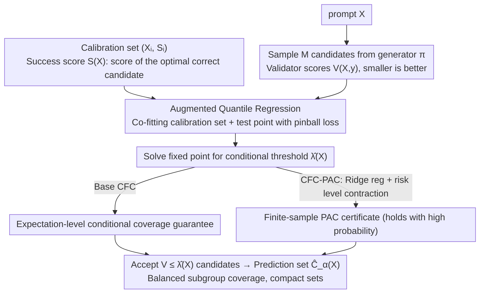

# Conditional Factuality Controlled LLMs with Generalization Certificates via Conformal Sampling

**Conference**: CVPR 2026  
**arXiv**: [2603.27403](https://arxiv.org/abs/2603.27403)  
**Code**: [GitHub](https://github.com/) (Mentioned in paper)  
**Area**: Optimization  
**Keywords**: Conformal Prediction, Conditional Coverage, LLM Hallucination Control, Set-valued Prediction, PAC Guarantees

## TL;DR

Ours proposes CFC (Conditional Factuality Control), a post-hoc conformal framework that learns feature-conditioned acceptance thresholds via augmented quantile regression. It provides conditional coverage guarantees for LLM/VLM sampled outputs, significantly improving reliability for difficult subgroups while maintaining compact prediction sets.

## Background & Motivation

Large Language Models (LLMs) have made significant progress in reasoning and generation tasks, but hallucinations remain a major obstacle to reliability. The core issues faced by existing uncertainty control methods are:

1.  **Insufficient marginal guarantees of Conformal Prediction (CP)**: Standard CP uses a single global threshold, providing only marginal coverage guarantees—meaning the average coverage across all prompts is met, but **difficult problems may be systematically under-covered while easy problems are over-covered**.
2.  **Masked heterogeneity**: Coverage for difficult problems, such as long mathematical queries or rare entities, can be much lower than the target, while easy problems have unnecessarily high coverage, leading to bloated prediction sets.
3.  **Conditional coverage is the true requirement**: Safety-critical applications require guarantees that coverage holds not just on average, but across specific features or subgroups.

The motivation for CFC is to replace the global threshold with a **feature-conditioned threshold**, allowing the acceptance criteria to adapt to prompt difficulty—using more relaxed thresholds for difficult problems and stricter ones for easy problems.

## Method

### Overall Architecture

CFC is a purely post-hoc layer that does not require fine-tuning the base generative model. The workflow is as follows:
1. Given a prompt $X$, sample $M$ candidate answers from the base generator.
2. Use a validator to score each candidate $V(X, y) \in [0,1]$ (smaller is better).
3. Define the latent success score $S(X) = \inf\{V(X,y) : y \in C(X), A(X,y)=1\}$.
4. Learn the conditional threshold $\hat{\lambda}_\alpha(X)$ via augmented quantile regression.
5. Accept all candidates with scores below the threshold: $\hat{C}_\alpha(X) = \{y : V(X,y) \leq \hat{\lambda}_\alpha(X)\}$.

### Key Designs

**1. Augmented Quantile Regression: Adaptive thresholds based on prompt difficulty**

The root cause of standard CP failure is a global threshold serving both hard and easy problems, resulting in systematic under-coverage for the former. CFC replaces this scalar threshold with a function determined by the feature map $\Phi(X)$. Following the functional conditional conformal framework of Gibbs et al., this function is fitted using quantile regression. Specifically, for each test candidate score $s \in [0,1]$, the calibration set and the test point are jointly fed into an augmented pinball loss to find the optimal coefficients:

$$\beta_s = \arg\min_\beta \Big[\tfrac{1}{N+1}\sum_{i=1}^N \rho_{1-\alpha}(S_i - \Phi(X_i)^\top\beta) + \tfrac{1}{N+1}\rho_{1-\alpha}(s - \Phi(X_{N+1})^\top\beta)\Big]$$

where $\rho_{1-\alpha}(u) = u(1-\alpha - \mathbb{1}\{u<0\})$ is the pinball (quantile) loss. Including the test point in the loss is the "augmented" part—it aligns the threshold construction with the exchangeability of conformal prediction, yielding exact rather than approximate coverage guarantees. The deployment threshold is the maximum fixed point $\hat{\lambda}_\alpha(X) = \sup\{s \in [0,1] : s \leq g_X(s)\}$. Consequently, difficult prompts (e.g., long math problems) automatically receive more relaxed thresholds via $\Phi(X)$ to maintain coverage, while easy prompts receive tighter thresholds to reduce set size, explicitly smoothing the subgroup heterogeneity.

**2. CFC-PAC Variant: Upgrading expectation-level guarantees to high-probability guarantees**

Base CFC provides coverage that holds in expectation, but safety-critical scenarios often require "high-probability" commitments. CFC-PAC adds a ridge regularization term $\tfrac{\lambda}{2}\|\beta\|_2^2$ to the quantile regression to stabilize fitting under high variance and actively contracts the nominal risk level: using $\alpha_{eff} = \alpha - \varepsilon_N(\delta)$ instead of $\alpha$. The trade-off is a more conservative threshold and slightly larger prediction sets, in exchange for a finite-sample PAC certificate—true coverage of the deployment rule is no less than $1-\alpha$ with probability at least $1-\delta$. The slack term $\varepsilon_N(\delta) = O(\sqrt{\log(1/\delta)/N})$ shrinks as the calibration sample size $N$ increases, meaning the conservatism paid for this high-probability guarantee diminishes with more data.

**3. Efficiency Analysis: Why conditional thresholds are more reliable and compact**

Intuitively, "relaxing thresholds for hard problems" might seem to increase the overall size of prediction sets. However, the paper proves that under mild assumptions (monotonicity and concavity of the score distribution), the **expected prediction set size** of the conditional rule is strictly smaller than that of the marginal CP rule. The key insight is that a global threshold is a suboptimal compromise: it is too loose for easy problems and too tight for hard problems. The conditional rule reallocates this margin precisely—using tighter thresholds for simple prompts to accept fewer candidates and looser thresholds for hard prompts to capture coverage. Jensen’s inequality (leveraging the concavity of score distributions) guarantees that this reallocation leads to a smaller overall expected set.

### Loss & Training

- The core optimization objective is the pinball loss (quantile regression loss), which does not involve neural network training.
- Selection of feature map $\Phi(X)$: GSM8K uses a quadratic basis $[1, T(X), T(X)^2]$ (where $T(X)$ is the average validator loss); TriviaQA uses feature maps defined by answer distribution entropy and validator loss.
- Purely post-hoc method, no fine-tuning of any model required.

## Key Experimental Results

### Main Results

**Synthetic Data ($\alpha=0.10$):**

| Method | ECR | APSS↓ | GSC↑ |
|------|-----|-------|------|
| TopK | 90.6 | 16.00 | 58.2 |
| ICP | 90.2 | 16.71 | 57.4 |
| Learnt CP | 90.2 | 15.72 | 84.3 |
| **CFC** | **90.3** | **15.53** | **88.7** |
| **CFC-PAC** | **90.8** | **15.87** | **89.1** |

**GSM8K ($\alpha=0.05$):**

| Method | ECR | APSS↓ | GSC↑ |
|------|-----|-------|------|
| ICP | 95.09 | 4.73 | 79.85 |
| CFC | 94.82 | **2.35** | **88.48** |
| CFC-PAC | 95.24 | 4.59 | **88.79** |

**Flickr8k VLM ($\alpha=0.03$):**

| Method | ECR | APSS↓ | GSC↑ |
|------|-----|-------|------|
| ICP | 95.58 | 1.84 | 85.21 |
| **CFC-PAC** | **97.27** | 1.42 | **95.21** |

### Ablation Study

| Configuration | Key Metric | Description |
|------|---------|------|
| Learnt CP only (No conformal correction) | GSC 84.3 | Learned thresholds help but are insufficient |
| CFC + conformal correction | GSC 88.7 | Exact conformal correction further improves subgroup reliability |
| Entropy-linear Φ | GSC 45.1 (CFC) | Choice of feature map has a significant impact |
| Chosen Φ | GSC 62.8 (CFC) | Reasonable feature mapping is key |
| N=5 vs N=20 sampling | APSS 2.35 vs 7.97 | Larger sampling budget bloats prediction sets with limited GSC gain |

### Key Findings

1.  **Conditional thresholds effectively flatten subgroup coverage**: Across all datasets, CFC significantly mitigates under-coverage in the most difficult subgroups.
2.  **Efficiency advantage**: CFC produces smaller prediction sets while maintaining coverage (APSS drops from 4.73 to 2.35 on GSM8K).
3.  **VLM Transferability**: The same post-hoc layer is directly applied to Qwen2-VL-7B-Instruct without modification.
4.  **Feature map design is critical**: Proper difficulty proxies (e.g., mean validator loss) significantly impact performance.
5.  **PAC variants are more conservative but reliable**: CFC-PAC stays closer to the target coverage at the cost of slightly larger prediction sets.

## Highlights & Insights

- **Theory-Practice Unity**: Conditional coverage guarantees, PAC certificates, and efficiency analysis are integrated into a rigorous framework with thorough experimental validation.
-  **Minimalist Design**: Post-hoc, training-free, and model-agnostic—can be directly applied to any LLM/VLM sampling pipeline.
- **Elegant Efficiency Analysis**: Proves that conditional rules are more efficient than marginal rules via convexity arguments and Jensen’s inequality.
- **High Utility**: Significant improvements are achieved with just 5 candidates and simple quadratic feature maps.
- **Division of Labor: CFC vs CFC-PAC**: CFC is most space-efficient, while CFC-PAC most closely adheres to target coverage; users can choose based on needs.

## Limitations & Future Work

1.  **Feature maps require manual design**: The choice of $\Phi(X)$ depends on domain knowledge (e.g., using validator loss as a difficulty proxy); automated feature selection is worth exploring.
2.  **Assumption of exchangeability**: The calibration and test sets must satisfy exchangeability, which may fail in covariate shift scenarios.
3.  **Dependence on external validators**: Validator quality directly impacts CFC performance, but the paper does not discuss validator uncertainty itself.
4.  **Convergence of quantile regression in high dimensions**: The paper uses low-dimensional features (1-3 dimensions); the sample complexity for high-dimensional feature maps remains to be analyzed.
5.  **Validation on small-to-mid scale LLMs**: Testing was limited to Llama-3-8B and Qwen2-VL-7B; performance on larger models is unknown.

## Related Work & Insights

- Built upon the functional conditional conformal framework of Gibbs et al. (2023), with the core contribution being its adaptation to the LLM sampling context.
- Compatible with Best-of-N decoding and pass@N evaluation paradigms; CFC can be seen as a reliability enhancement for these strategies.
- Discussions on conditional vs. marginal coverage are valuable for any AI system requiring uncertainty quantification.
- PAC-Bayes style finite-sample guarantees provide tools for compliance auditing during deployment stages.

## Rating

- Novelty: ⭐⭐⭐⭐ — Adapting conditional CP to LLMs is innovative but not a completely new paradigm.
- Experimental Thoroughness: ⭐⭐⭐⭐ — Triple validation across synthetic, real-world, and VLM tasks with sufficient ablations.
- Writing Quality: ⭐⭐⭐⭐⭐ — Math derivations are clear, illustrations are intuitive, and the logic from motivation to method is seamless.
- Value: ⭐⭐⭐⭐ — Provides a practical and theoretically grounded tool for reliable LLM deployment.

<!-- RELATED:START -->

## Related Papers

- [\[ICML 2026\] Colorful Pinball: Density-Weighted Quantile Regression for Conditional Guarantee of Conformal Prediction](../../ICML2026/optimization/colorful_pinball_density-weighted_quantile_regression_for_conditional_guarantee_.md)
- [\[CVPR 2026\] Semi-Supervised Conformal Prediction With Unlabeled Nonconformity Score](semi-supervised_conformal_prediction_with_unlabeled_nonconformity_score.md)
- [\[CVPR 2026\] FedAdamom: Adaptive Momentum for Improved Generalization in Federated Optimization](fedadamom_adaptive_momentum_for_improved_generalization_in_federated_optimizatio.md)
- [\[ICML 2025\] FedSWA: Improving Generalization in Federated Learning with Highly Heterogeneous Data via Momentum-Based Stochastic Controlled Weight Averaging](../../ICML2025/optimization/fedswa_improving_generalization_in_federated_learning_with_highly_heterogeneous_.md)
- [\[CVPR 2026\] HFedATM: Hierarchical Federated Domain Generalization via Optimal Transport and Regularized Mean Aggregation](hfedatm_hierarchical_federated_domain_generalization_via_optimal_transport_and_r.md)

<!-- RELATED:END -->
