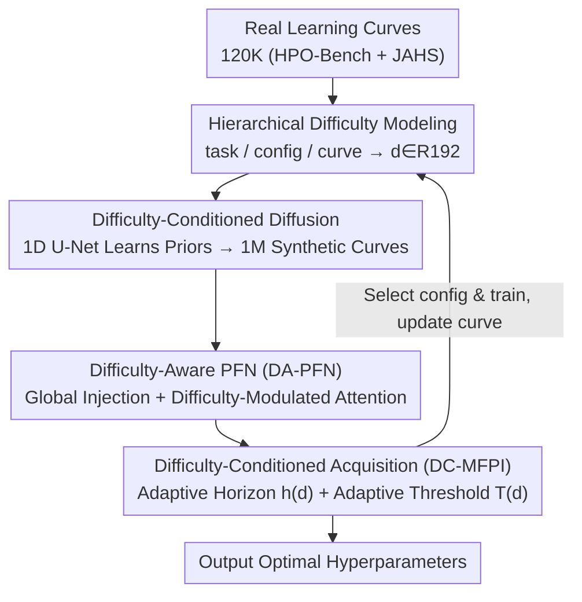

# DABO: Difficulty-Aware Bayesian Optimization with Diffusion-Learned Priors

**Conference**: CVPR 2026  
**Paper**: [CVF Open Access](https://openaccess.thecvf.com/content/CVPR2026/html/Li_DABO_Difficulty-Aware_Bayesian_Optimization_with_Diffusion-Learned_Priors_CVPR_2026_paper.html)  
**Code**: Not disclosed  
**Area**: Bayesian Optimization / Hyperparameter Optimization  
**Keywords**: Hyperparameter Optimization, Freeze-Thaw Bayesian Optimization, Difficulty-Aware, Conditional Diffusion Models, PFN Proxy Models  

## TL;DR
DABO treats "optimization difficulty" as a first-class conditional variable throughout the entire freeze-thaw hyperparameter optimization (HPO) pipeline. By utilizing a three-level difficulty characterization and a conditional diffusion model to generate 1 million synthetic learning curves with difficulty labels, it trains a difficulty-aware PFN proxy and an adaptive acquisition function. DABO achieves an average regret reduction of 11–18% compared to the current SOTA (ifBO) across 75 tasks, with greater gains observed on harder tasks.

## Background & Motivation
**Background**: Hyperparameter optimization (HPO) in deep learning is expensive because each configuration requires actual training. Multi-fidelity methods (Hyperband, ASHA, BOHB) use low-fidelity approximations to save costs, but coarse-grained promotion schedules often prematurely terminate promising configurations. Freeze-thaw Bayesian optimization is more flexible, allowing configurations to be "frozen/thawed" and budgets to be allocated in fine-grained steps. The current strongest method, ifBO, utilizes Prior-data Fitted Networks (PFNs) for single-forward-pass Bayesian inference, which is 10–100 times faster than online training proxies and is widely recognized as the SOTA.

**Limitations of Prior Work**: All existing methods, including ifBO, are **difficulty-agnostic**—treating all tasks and configurations identically and ignoring huge differences in difficulty between various hyperparameter landscapes. This results in wasted budget in simple smooth regions and insufficient exploration in complex rugged areas. The comparison in Figure 1 of the paper is intuitive: difficulty-agnostic ifBO performs adequately on smooth tasks but nearly collapses on rugged high-difficulty tasks, whereas the difficulty-aware method achieves 43% lower regret there.

**Key Challenge**: Difficulty-blindness occurs simultaneously at three levels: proxy models use uniform architectures regardless of landscape complexity; acquisition functions use the same exploration horizons and thresholds for both easy and difficult configurations; and data generation relies on manually designed parametric priors (e.g., power law, exponential), which fail to represent difficulty-related curve dynamics like multi-stage convergence or configuration-sensitive plateaus.

**Goal**: Systematically inject "difficulty" into the entire HPO pipeline—ensuring that data generation, proxy modeling, and decision-making stages are all "aware" of the current difficulty.

**Key Insight**: Drawing inspiration from fitness landscape analysis (ruggedness, modality) and meta-learning theory, the authors propose that difficulty can be **explicitly measured hierarchically** without requiring a learned encoder. Simultaneously, learned, data-driven priors are used to replace manual parametric priors.

**Core Idea**: Establish "optimization difficulty" as a first-class conditional variable throughout the process: quantify difficulty hierarchically → learn difficulty-aware priors from real curves using a conditional diffusion model → develop difficulty-aware proxies + difficulty-adaptive acquisition functions to shift resource allocation from "configuration-centric" to "difficulty-centric."

## Method

### Overall Architecture
DABO addresses the "difficulty-blindness" in freeze-thaw HPO through **offline and online** phases. Offline phase: hierarchical difficulty descriptors are calculated from real learning curves to train a difficulty-conditioned diffusion model. This model synthesizes 1 million difficulty-labeled curves to train the difficulty-aware proxy, DA-PFN. Online phase: DA-PFN is deployed with the difficulty-adaptive acquisition function DC-MFPI. At each step, it calculates current difficulty, predicts performance at an adaptive horizon, and selects the optimal configuration for further training until the budget is exhausted.

The four core components form a chain: "how to calculate difficulty → how to inject difficulty into data → how to inject difficulty into proxies → how to inject difficulty into decisions":

### Key Designs

**1. Hierarchical Difficulty Modeling: Decomposing "How Hard" into Global, Local, and Curve Levels**

A root cause of difficulty-blindness is the lack of a unified metric for landscape ruggedness. DABO quantifies difficulty at three levels using **explicit feature extraction without learned encoders**. The top level, **task complexity**, characterizes the global search space: given multiple configuration curves $D=\{(\lambda_i,C_i)\}$, it calculates reachable performance span $\phi_1=\max_i C_i[b_i]-\min_i C_i[b_i]$, trajectory diversity $\phi_2=\frac{1}{N(N-1)}\sum_{i\neq j}\mathrm{DTW}(C_i,C_j)$ (using Dynamic Time Warping for visual differences), and convergence heterogeneity $\phi_3=\mathrm{Std}_i\big((C_i[b_i]-C_i[1])/b_i\big)$. The middle level, **configuration sensitivity**, quantifies local ruggedness by analyzing the variance of final performance $\psi_1$ and normalized performance gradients $\psi_2(\lambda)=\frac{1}{k}\sum_{j\in N_k(\lambda)}\frac{|C_j[b_{max}]-\bar C[b_{max}]|}{\|\lambda_j-\lambda\|_2+\epsilon}$ among $k$ nearest neighbors ($k=10$). The finest level, **curve characteristics**, reads signals from single partial curves: average improvement rate $\omega_1$, relative volatility $\omega_2$, and saturation $\omega_3$. Each group of features passes through an MLP with 128 hidden units to yield 64-dimensional embeddings, concatenated into a full descriptor:

$$d(\lambda,t)=[d_{task};\,d_{cfg}(\lambda);\,d_{crv}(t)]\in\mathbb{R}^{192}$$

**2. Difficulty-Conditioned Diffusion: Replacing Manual Baselines with Learned Curve Distributions**

The performance ceiling of ifBO is limited by its synthetic training data, which occupies only a few parametric forms (power law, exponential, etc.). DABO learns a **diffusion model conditioned on hyperparameters $\lambda$ and difficulty $d$** from approximately 120,000 real curves. The forward process adds $T=1000$ steps of Gaussian noise to clean curves $C_0\in\mathbb{R}^{b_{max}}$ ($b_{max}=50$). The reverse process uses a **1D U-Net** to learn the conditional distribution $p(C|\lambda,d)$, injecting conditions via **cross-attention** at each resolution. The objective is standard denoising score matching:

$$L_{diff}=\big\|\epsilon-\epsilon_\theta(\sqrt{\bar\alpha_t}C_0+\sqrt{1-\bar\alpha_t}\epsilon,\,t,\,\lambda,\,d)\big\|^2$$

After training, 1 million difficulty-labeled curves are generated across 2000 tasks. The diffusion prior is more expressive and data-driven than parametric priors, reducing the distance to real data by 2.3x (measured by FCD/MMD).

**3. Difficulty-Aware PFN (DA-PFN): Hierarchical In-Context Inference**

The proxy performs Bayesian inference on learning curves in a single forward pass. Inputs consist of observed context $H=\{(\lambda_i,t_i,f_i)\}$ and a query $(\lambda_q,t_q)$. DABO introduces **global difficulty injection** (adding a bias scaled by $d_{task}$ to all tokens in the first layer) and **difficulty-modulated attention** to the Transformer architecture:

$$\mathrm{Attn}(Q,K,V,D)=\mathrm{softmax}\!\Big(\frac{QK^\top}{\sqrt{d_k}}\odot S\Big)V,\quad S_{ij}=1+\gamma\cdot\exp(-\|D_i-D_j\|^2)$$

This forces the model to attend more to context points with similar difficulty, achieving hierarchical in-context learning. DA-PFN automatically increases uncertainty for difficult configurations, avoiding the overconfidence typical of FT-PFN.

**4. Difficulty-Conditional Acquisition (DC-MFPI): Dynamically Adjusting Decisions**

DABO uses two difficulty-conditioned hyperparameters. The **adaptive horizon** decays exponentially with configuration difficulty: $h(d)=\max\big(1,\lfloor b_{max}\cdot\exp(-\alpha\|d_{cfg}\|_2)\rfloor\big)$. Difficult configurations receive shorter horizons for frequent re-evaluation, while easy ones use long horizons. The **adaptive threshold** relaxes with task difficulty: $T(d)=f_{best}+\tau(\|d_{task}\|)\cdot(1-f_{best})$. Complex tasks use loose thresholds to encourage exploration. These combine into **DC-MFPI (Difficulty-Conditioned Multi-fidelity Probability of Improvement)**:

$$\mathrm{DC\text{-}MFPI}(\lambda)=\frac{1}{K}\sum_{k=1}^{K}\mathbb{I}[f_k>T(d)],\quad f_k\sim p_\theta(\cdot\mid H,\lambda,b_\lambda+h(d),d)$$

### Loss & Training
The diffusion model is trained using AdamW (lr $2\times10^{-4}$) for 500 epochs. DA-PFN is trained using episodic sampling with AdamW (lr $10^{-4}$) for 300 epochs. Total training time is 1056 GPU-hours, which is a one-time, amortizable cost.

## Key Experimental Results

### Main Results
Evaluated on 75 tasks (LCBench, PD1, Taskset) with a budget of $B=1000$ steps and 10 seeds.

**Proxy Quality** (held-out curves, higher Log-Lik and lower MSE are better):

| Method | LCBench Log-Lik↑ | LCBench MSE↓ | PD1 Log-Lik↑ | Taskset Log-Lik↑ | Inference (s) |
|------|------|------|------|------|------|
| FT-PFN (ifBO) | 2.12 | 0.004 | 1.13 | 3.02 | 0.72 |
| **DA-PFN (Ours)** | **2.84** | **0.0034** | **2.50** | **3.31** | 2.05 |

**End-to-End HPO Regret** ($B=1000$, lower is better):

| Method | LCBench | PD1 | Taskset |
|------|------|------|------|
| ifBO (Prev. SOTA) | 0.016 | 0.034 | 0.044 |
| **DABO (Ours)** | **0.014** | **0.028** | **0.039** |

Ours reduced regret relative to ifBO by **12.5% / 17.6% / 11.4%** respectively.

### Ablation Study
On LCBench, the contributions of Diff (Diffusion), DA (DA-PFN), and Acq (Acquisition) were analyzed:

| Configuration | Regret↓ | Gain vs. ifBO |
|------|------|------|
| ifBO (Baseline) | 0.016 | — |
| Only DA | 0.0148 | 7.5% |
| **Full (Ours)** | **0.0140** | **12.5%** |

### Key Findings
- **Difficulty Awareness (DA) is the largest contributor (7.5%)**, followed by diffusion data generation (5%).
- **Higher difficulty leads to higher gains**: Regret improvement correlates with task difficulty ($r=0.804$). Improvement exceeded 20% in 12 out of 75 tasks, mostly complex ones like ImageNet-ResNet.
- **Data Fidelity**: Diffusion-generated curves are 2.3x closer to real data than parametric priors.

## Highlights & Insights
- **Difficulty as a First-Class Variable**: Using a unified descriptor to condition all components ensures a coherent and effective pipeline, a paradigm transferable to other iterative optimization tasks like NAS.
- **Learned vs. Manual Priors**: This is the first work to use conditional diffusion for learning curve synthesis, removing the "prior expressivity" bottleneck of PFNs.
- **Calibrated Uncertainty**: DA-PFN avoids overconfidence by automatically adjusting its posterior based on configuration difficulty.

## Limitations & Future Work
- **High Offline Cost**: 1056 GPU-hours is substantial, though amortizable.
- **Online Overhead**: Calculating difficulty adds ~130ms per step (largely due to k-NN), which is negligible relative to model training but could be optimized.
- **Generalization Borders**: While zero-overlap is maintained with the test set, performance on entirely new architecture families remains to be fully verified.

## Related Work & Insights
- **vs. ifBO**: DABO upgrades the "difficulty-blind" paradigm of ifBO to "difficulty-aware," providing significant advantages on complex tasks.
- **vs. Fitness Landscape Analysis**: DABO converts traditional static analysis tools into active optimization drivers.

## Rating
- Novelty: ⭐⭐⭐⭐⭐ 
- Experimental Thoroughness: ⭐⭐⭐⭐ 
- Writing Quality: ⭐⭐⭐⭐⭐ 
- Value: ⭐⭐⭐⭐ 

<!-- RELATED:START -->

## Related Papers

- [\[ICLR 2026\] Incorporating Expert Priors into Bayesian Optimization via Dynamic Mean Decay](../../ICLR2026/optimization/incorporating_expert_priors_into_bayesian_optimization_via_dynamic_mean_decay.md)
- [\[ICML 2026\] Cost-Aware Stopping for Bayesian Optimization](../../ICML2026/optimization/cost-aware_stopping_for_bayesian_optimization.md)
- [\[ICLR 2026\] Symmetry-Aware Bayesian Optimization via Max Kernels](../../ICLR2026/optimization/symmetry-aware_bayesian_optimization_via_max_kernels.md)
- [\[ICLR 2026\] Diffusion-DFL: Decision-focused Diffusion Models for Stochastic Optimization](../../ICLR2026/optimization/diffusion-dfl_decision-focused_diffusion_models_for_stochastic_optimization.md)
- [\[ICLR 2026\] Celo2: Towards Learned Optimization Free Lunch](../../ICLR2026/optimization/celo2_towards_learned_optimization_free_lunch.md)

<!-- RELATED:END -->
