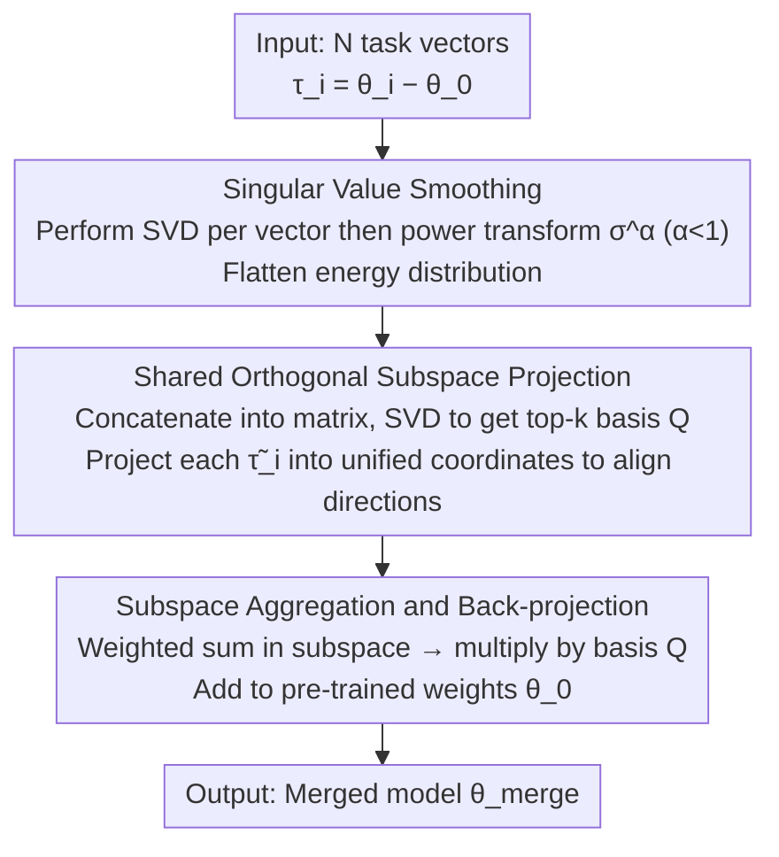

# DC-Merge: Improving Model Merging with Directional Consistency

**Conference**: CVPR 2026 (Main Track)  
**arXiv**: [2603.06242](https://arxiv.org/abs/2603.06242)  
**Code**: [https://github.com/Tobeginwith/DC-Merge](https://github.com/Tobeginwith/DC-Merge)  
**Area**: Optimization
**Keywords**: model merging, task vector, singular value decomposition, directional consistency, LoRA

## TL;DR
DC-Merge discovers that the key to model merging lies in maintaining **directional consistency in singular space** between the merged multi-task vector and the original single-task vectors. Through a two-step process of singular value smoothing and projection onto a shared orthogonal subspace, it achieves SOTA results on both Vision and Vision-Language tasks.

## Background & Motivation

### Background
Model merging aims to integrate multiple task-adapted models into a single unified model that inherits knowledge from all tasks. Existing methods such as Task Arithmetic, TIES, and DARE implement merging by perform weighted averaging or pruning on task vectors (fine-tuned parameters minus pre-trained parameters).

### Limitations of Prior Work

**Uneven energy distribution**: In the SVD decomposition of task vectors, a few large singular values dominate the total energy (e.g., the top 5% of singular values may account for 90%+ of the energy). During merging, weak but semantically important components are ignored.

**Geometric direction inconsistency**: The geometric directions of different task vectors in the parameter space conflict with each other. Direct merging distorts the directional structure of each task vector.

### Key Challenge
Simple weighted averaging or pruning is too coarse when processing directional information in high-dimensional parameter spaces—they cannot guarantee that the merged result maintains directional consistency with each individual task vector in singular space.

### Core Idea
Maintain **Directional Consistency** through two steps: first, smooth the singular values of each task vector to balance the energy distribution; second, project the energy-balanced task vectors onto a shared orthogonal subspace to align their geometric directions.

## Method

### Overall Architecture
DC-Merge addresses the problem of merging $N$ single-task models into one multi-task model without allowing dominant tasks to overwhelm the others. The input consists of $N$ task vectors $\{\boldsymbol{\tau}_i\}_{i=1}^N$, where each $\boldsymbol{\tau}_i = \boldsymbol{\theta}_i - \boldsymbol{\theta}_0$ is the fine-tuned weight minus the pre-trained weight. The pipeline first performs SVD on each task vector individually and flattens the singular values to bring the energy of large and small components closer. Then, it computes an orthogonal subspace shared by all task vectors and projects them into this unified coordinate system to align geometric directions. Finally, it performs weighted aggregation in this unified space before projecting back to the original parameter space to obtain the merged weights. All three steps center on the same objective: making the merged result's direction in singular space as close as possible to each original task vector—the "Directional Consistency" defined by the authors.

### Key Designs

**1. Singular Value Smoothing: Balancing energy distribution to prevent dominance by large singular values**

In the SVD of a task vector, the top 5% of singular values often account for over 90% of the total energy. During merging, these strong components obscure weaker but semantically important ones. DC-Merge first performs SVD on each $\boldsymbol{\tau}_i = \mathbf{U}_i \boldsymbol{\Sigma}_i \mathbf{V}_i^\top$, then applies a power transformation $\sigma_j \leftarrow \sigma_j^\alpha$ to each singular value (with $\alpha < 1$, e.g., $\alpha = 0.5$). Since the power function suppresses large numbers more than small numbers when $\alpha < 1$, large singular values are lowered while small ones are relatively raised, making the energy distribution more uniform. This step only modifies singular values without touching the directions of singular vectors, incurring almost zero computational overhead while allowing weak components to regain influence in subsequent aggregation—a level of singular space processing that Task Arithmetic and TIES do not reach.

**2. Shared Orthogonal Subspace Projection: Providing a unified coordinate system to align directions**

The singular bases $\mathbf{U}_i, \mathbf{V}_i$ of different tasks point in different directions; direct averaging disrupts their respective directional structures. Instead of handling directions individually, this step identifies a set of orthogonal bases $\mathbf{Q}$ shared by all tasks that minimizes the reconstruction error after projecting the smoothed task vectors $\tilde{\boldsymbol{\tau}}_i$:

$$\min_{\mathbf{Q}} \sum_{i=1}^N \|\tilde{\boldsymbol{\tau}}_i - \mathbf{Q}\mathbf{Q}^\top \tilde{\boldsymbol{\tau}}_i\|_F^2$$

In practice, this is solved by concatenating all $\tilde{\boldsymbol{\tau}}_i$ into a large matrix and performing SVD, taking the top $k$ singular vectors as $\mathbf{Q}$. The resulting subspace provides a unified coordinate system while preserving as much task information as possible. Once projected, the task vectors are aligned to the same set of bases, preventing the mutual distortion caused by direct averaging.

**3. Subspace Aggregation and Back-projection: Merging in the aligned coordinate system**

Once directions are aligned, aggregation becomes safe. The projected coordinates $\mathbf{Q}^\top\tilde{\boldsymbol{\tau}}_i$ are weighted and summed within the subspace, then multiplied by the basis $\mathbf{Q}$ to project back to the original parameter space and added to the pre-trained weights:

$$\hat{\boldsymbol{\tau}} = \lambda \sum_{i=1}^N \mathbf{Q}^\top \tilde{\boldsymbol{\tau}}_i, \qquad \boldsymbol{\theta}_{merge} = \boldsymbol{\theta}_0 + \mathbf{Q}\hat{\boldsymbol{\tau}}$$

Because the entire aggregation occurs within the unified subspace, the merged result naturally falls within a space consistent with the directions of the individual task vectors, requiring no additional directional constraints or post-processing for correction.

### Loss & Training
DC-Merge is a **completely training-free** post-processing method—it requires no additional data or fine-tuning. The only hyperparameters are the smoothing exponent $\alpha$ and the subspace dimension $k$, both selected via a small validation set.

## Key Experimental Results

### Main Results: Vision Tasks (8-task merging, ViT-B/32)

| Method | Avg Accuracy (%) | Vs. Pretrained |
|------|---------------|-----------------|
| Pretrained | 48.3 | — |
| Task Arithmetic | 55.4 | +7.1 |
| TIES | 56.3 | +8.0 |
| DARE | 57.0 | +8.7 |
| Consensus | 57.8 | +9.5 |
| **DC-Merge** | **59.6** | **+11.3** |

### Ablation Study

| Config | Avg Accuracy (%) | Description |
|------|---------------|------|
| Full DC-Merge | 59.6 | Complete method |
| w/o SVD Smoothing | 57.8 | Dropped 1.8% |
| w/o Subspace Projection | 56.5 | Dropped 3.1% |
| w/o Both (baseline) | 55.4 | Equivalent to Task Arithmetic |

### LoRA Merging Results

| Method | Vision-Language Avg (%) |
|------|------------------------|
| LoRA Arithmetic | 72.1 |
| DARE-LoRA | 73.5 |
| **DC-Merge-LoRA** | **75.8** |

### Key Findings
- Subspace projection is the most critical module (contributing 3.1%), while SVD smoothing contributes 1.8%; the two are complementary.
- Performance is stable within the range $\alpha \in [0.3, 0.6]$, showing low sensitivity to hyperparameters.
- DC-Merge consistently outperforms baselines in both LoRA and Full Fine-tuning scenarios.
- The improvement is more significant in Vision-Language scenarios (e.g., CLIP fine-tuning).

## Highlights & Insights
- **Understanding model merging from the perspective of directional consistency in singular space**—this viewpoint is more profound than "pruning conflicting parameters" or "weight averaging" and provides a stronger theoretical foundation.
- **Elegance of SVD smoothing**—a simple power transformation effectively balances energy distribution with almost no computational cost.
- **Generalizable shared subspace projection**—the idea is not limited to task vector merging; it can be applied to any scenario requiring the "merging of multiple high-dimensional vectors while maintaining directionality."
- **Training-free**—requires no extra data or computation; pure post-processing and plug-and-play.

## Limitations & Future Work
- The subspace dimension $k$ must be selected via a validation set, which is inconvenient for scenarios without validation data.
- The computational overhead of SVD may be high for extremely large models (e.g., 70B+ LLMs).
- Validated only on ViT and CLIP series; not yet extended to decoder-only LLMs.
- When the number of tasks is very large (>20), a shared subspace may not satisfy the directional constraints of all task vectors simultaneously.
- Does not discuss robustness when task vector quality varies significantly (e.g., some tasks are poorly fine-tuned).

## Related Work & Insights
- **vs Task Arithmetic**: Task Arithmetic simply averages task vectors without considering singular space structures. DC-Merge adds directional constraints, improving performance by over 4 percentage points.
- **vs TIES/DARE**: TIES/DARE handle conflicts through pruning or random dropping, which are "subtractive" strategies. DC-Merge is a "transformative" strategy—it preserves parameters but transforms them into a directionally consistent space.
- **vs RegMean/Fisher Merging**: These methods require additional data for regularization, while DC-Merge does not.
- **Insight**: The idea of singular value smoothing could be transferred to LoRA initialization—if one ensures a uniform singular value distribution during LoRA training, it might naturally be better suited for subsequent merging.

## Rating
- Novelty: ⭐⭐⭐⭐ The unified understanding of model merging from a directional consistency perspective is novel, though the two technical modules (SVD smoothing, subspace projection) are not new themselves.
- Experimental Thoroughness: ⭐⭐⭐⭐ Covers Vision and VL scenarios, both Full FT and LoRA settings, with complete ablation studies.
- Writing Quality: ⭐⭐⭐⭐ Clear problem definition with logical flow from analysis to solution to experiments.
- Value: ⭐⭐⭐⭐ Addresses a core problem in model merging with a highly practical training-free attribute.

<!-- RELATED:START -->

## Related Papers

- [\[CVPR 2026\] Model Merging in the Essential Subspace](model_merging_in_the_essential_subspace.md)
- [\[CVPR 2026\] BD-Merging: Bias-Aware Dynamic Model Merging with Evidence-Guided Contrastive Learning](bd-merging_bias-aware_dynamic_model_merging_with_evidence-guided_contrastive_lea.md)
- [\[CVPR 2026\] ACE-Merging: Data-Free Model Merging with Adaptive Covariance Estimation](ace-merging_data-free_model_merging_with_adaptive_covariance_estimation.md)
- [\[CVPR 2026\] Defending Unauthorized Model Merging via Dual-Stage Weight Protection](defending_unauthorized_model_merging_via_dual-stage_weight_protection.md)
- [\[CVPR 2025\] Model Poisoning Attacks to Federated Learning via Multi-Round Consistency](../../CVPR2025/optimization/model_poisoning_attacks_to_federated_learning_via_multi-round_consistency.md)

<!-- RELATED:END -->
