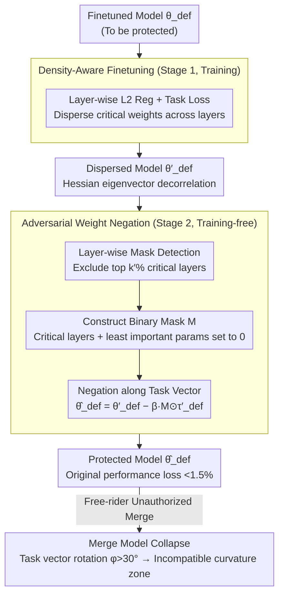

# Defending Unauthorized Model Merging via Dual-Stage Weight Protection

**Conference**: CVPR 2026  
**arXiv**: [2511.11851](https://arxiv.org/abs/2511.11851)  
**Code**: None (Not yet open-sourced)  
**Area**: Optimization  
**Keywords**: Model Merging Defense, Intellectual Property Protection, Weight Protection, Adversarial Perturbation, Model Security

## TL;DR
Ours proposes MergeGuard, an active dual-stage weight protection framework: Stage 1 disperses task-critical weights through L2 regularization, and Stage 2 injects structured perturbations to disrupt merging compatibility. It maintains <1.5% original performance loss for the protected model while causing up to 90% accuracy degradation in merged models.

## Background & Motivation
**Background**: The pre-training-finetuning paradigm has become the cornerstone of modern AI, with open repositories like Hugging Face and GitHub hosting thousands of public models. Model merging techniques (WA, TA, TIES, AdaMerging, etc.) allow for the direct construction of multi-task models via parameter-level combination without additional training.

**Limitations of Prior Work**: Free-riders can download fine-tuned models under specific licenses and merge them to create new multi-capability models for redistribution or commercial use. The parameter mixing inherently hides the source of each weight, making intellectual property (IP) infringement difficult to track and hold accountable.

**Key Challenge**: Defenders can only modify the parameters of their own models and cannot predict the attacker's model, merging strategy, or target task, leading to high defense uncertainty. Simultaneously, a balance must be struck between maintaining the original task accuracy and suppressing the effectiveness of the merged model.

**Goal**: Design an active defense mechanism such that any subsequent unauthorized model merging leads to functional degradation while maintaining the original model's task performance.

**Key Insight**: It is observed that modern model merging methods (TIES, AdaMerging) rely on sparsifying and dispersing task parameters to reduce interference. MergeGuard exploits this in reverse by first dispersing and then perturbing weights to produce destructive interference during merging.

**Core Idea**: Reshape parameter geometry through density-aware finetuning to disperse weights and adversarial weight negation to inject perturbations, placing the merged model in an "incompatible curvature region."

## Method

### Overall Architecture

MergeGuard is an active defense where the defender only modifies the parameters of their model $\theta_{def}$ to invalidate any subsequent unauthorized merging while preserving accuracy. The process consists of two stages: Stage 1 (Density-Aware Finetuning, training-based) uses L2 regularization to uniformly disperse task-critical weights across layers; Stage 2 (Adversarial Weight Negation, training-free) selectively injects perturbations along the task vector direction. This two-step process reshapes the parameter geometry to a state that forces merged models into "incompatible curvature regions." Theoretical analysis of curvature incompatibility further explains why subtle rotations are sufficient to collapse any merge.

### Key Designs

**1. Density-Aware Finetuning (Stage 1): Reversing the Sparsification Assumption of Merging Methods**

Modern merging methods (TIES, AdaMerging) rely on sparsifying task parameters to reduce interference. MergeGuard reverses this by adding layer-wise L2 regularization to the standard cross-entropy loss:

$$L_{Total} = L_{CE} + \alpha \sum_{\ell=1}^{L} \|\theta^{(\ell)}\|_2^2$$

(Classification loss + L2 for vision tasks; next-token prediction loss + L2 for LLMs). L2 is applied independently per layer to smooth large weights and spread important information. More dispersed weights are more susceptible to amplification, dilution, or interference during subsequent merging, destabilizing the merge at its source.

**2. Adversarial Weight Negation (Stage 2): Training-free Rotation of Task Vector Direction**

Dispersion alone is insufficient; merging compatibility must be actively disrupted without re-training. Stage 2 involves three steps: first, layer-wise mask detection identifies top $k'\%$ critical layers by measuring accuracy drop after masking; second, a binary mask $M$ is constructed to set critical layers and the $(1-k)(1-k')\%$ least important parameters to 0, with others set to 1; finally, a shift is applied along the task vector: $\hat{\theta}_{def} = \theta'_{def} - \beta \cdot M \odot \tau'_{def}$, where $\tau'_{def} = \theta'_{def} - \theta_{pre}$ is the defender's task vector (excluding specific tokens/norms in LLMs to prevent collapse). This rotates directions only on selected parameters, minimizing impact on original accuracy while significantly disrupting merging.

**3. Theoretical Analysis of Curvature Incompatible: Why Small Rotations Suffice**

The merging interference increment can be approximated as:

$$\Delta \mathcal{L}_{merge} \approx \lambda_1 \lambda_2 \|\tau'_{def}\| \|\tau_{fr}\| (1 - \cos\phi)$$

Even a task vector rotation angle $\phi > 30°$ is sufficient to push the merged model out of the shared basin, causing destructive interference. Stage 1 decorrelates the eigenvectors corresponding to large Hessian eigenvalues, and Stage 2 further rotates the task vector direction; combined, they push $\phi$ into the failure zone.

### Loss & Training

All experiments used fixed $k'=10$, $k=0.1$, $\alpha=0.01$, and $\beta=1$, requiring no task-specific parameter tuning.

## Key Experimental Results

### Main Results: ViT-L-14 Image Classification — Accuracy Before/After Protection and After Merging

| Dataset | Fine-tuned Model $\theta_{def}$ | Protected Model $\hat{\theta}_{def}$ | Merged Acc (TA) $\theta_{merge}$ | Merged Acc (TA) $\hat{\theta}_{merge}$ |
|--------|----------------------|---------------------------|----------------------------|---------------------------------|
| RESISC45 | 97.37 | 97.25 | 86.6 | **56.50** |
| EuroSAT | 99.81 | 95.46 | 94.1 | **54.94** |
| GTSRB | 99.24 | 98.25 | 86.7 | **12.91** |
| MNIST | 99.69 | 99.27 | 98.9 | **11.35** |
| DTD | 84.15 | 82.16 | 65.6 | **46.65** |

The accuracy loss of the protected model itself is <4.4%, but the merged accuracy drops significantly (e.g., GTSRB: 86.7 → 12.9, MNIST: 98.9 → 11.4).

### Comparison with Baseline (Average Accuracy Drop under TA Merging)

| Method | Avg. Accuracy of Protected Model | Avg. Accuracy Drop After Merging |
|------|----------------|-------------------|
| PaRaMS (Only Baseline) | ~Comparable to original | **30.76** |
| **MergeGuard (Ours)** | ~Comparable to original (<1.5% loss) | **52.11** |

Ours achieves an average accuracy drop that is **21.35 percentage points** higher than PaRaMS.

### Key Findings
- Results are even more significant on LLMs: Gemma-2 on GSM8K dropped from 69.6% to 1.52%, and HumanEval dropped from 64.02% to 21.34%.
- Effective against all mainstream merging methods (WA/TA/TIES/ADA)—while ADA is the most difficult to defend, it still causes significant degradation.
- Two adaptive attacks failed to crack the defense: (i) subtracting a scaled copy of protected parameters; (ii) orthogonal projection after estimating the perturbation vector—both failed because task information was dispersed and perturbations were unobservable.
- Fixed hyperparameters allow working across tasks/architectures without specific tuning.

## Highlights & Insights
- **Ingenious Defense Strategy**: Reverses the sparsification assumption that merging methods rely on—"anti-sparsifying" to disperse weights first and then injecting directional antagonism.
- **Solid Theoretical Support**: Curvature incompatibility analysis provides clear intuition (task subspace rotation + basin separation).
- **High Practicality**: Stage 2 is completely training-free with fixed hyperparameters, making it universal across various architectures like ViT, Llama-2, Gemma-2, and Mistral.
- **First Systematic Defense**: The only active defense work besides PaRaMS, significantly outperforming it.

## Limitations & Future Work
- Only targets full-parameter finetuning; not applicable to PEFT methods (LoRA, shallow tuning) as PEFT does not expose the full task vector.
- L2 regularization may affect the model's representational capacity on complex tasks (e.g., 4.4% accuracy drop on EuroSAT).
- Assumes attackers use parameter-level merging—if attackers switch to knowledge distillation, the defense becomes invalid (admitted by the paper, though distillation is noted for its high cost).
- Layer importance ranking in Stage 2 is based on global mask accuracy drop; finer-grained importance metrics might be superior.

## Related Work & Insights
- **Model Merging Methods**: WA → TA → TIES → AdaMerging → DARE. While continuously improving merging quality, they increase IP risks.
- **PaRaMS**: The only predecessor, maintaining functional equivalence while disrupting merging through parameter rearrangement and random multi-head scaling. Ours shows stronger effects.
- **Model Watermarking/Fingerprinting**: Passive detection methods that complement the active defense of Ours.
- **Inspiration**: An "arms race" between defense and attack—future attackers might design merging strategies capable of handling dispersed weights.

## Rating ⭐
- Novelty: ⭐⭐⭐⭐ — The dual-stage "dispersion + rotation" defense strategy is novel with clear theoretical analysis.
- Experimental Thoroughness: ⭐⭐⭐⭐⭐ — Covers multiple vision/language architectures, multiple merging methods, adaptive attacks, and SD image generation.
- Writing Quality: ⭐⭐⭐⭐ — Clear modeling of attack/defense scenarios and rigorous theoretical derivation.
- Value: ⭐⭐⭐⭐ — Significant practical implications for model IP protection, filling a gap in active defense.

<!-- RELATED:START -->

## Related Papers

- [\[CVPR 2026\] Model Merging in the Essential Subspace](model_merging_in_the_essential_subspace.md)
- [\[CVPR 2026\] ACE-Merging: Data-Free Model Merging with Adaptive Covariance Estimation](ace-merging_data-free_model_merging_with_adaptive_covariance_estimation.md)
- [\[CVPR 2026\] BD-Merging: Bias-Aware Dynamic Model Merging with Evidence-Guided Contrastive Learning](bd-merging_bias-aware_dynamic_model_merging_with_evidence-guided_contrastive_lea.md)
- [\[CVPR 2026\] DC-Merge: Improving Model Merging with Directional Consistency](dc-merge_improving_model_merging_with_directional_consistency.md)
- [\[CVPR 2026\] Learning to Learn Weight Generation via Local Consistency Diffusion](learning_to_learn_weight_generation_via_local_consistency_diffusion.md)

<!-- RELATED:END -->
