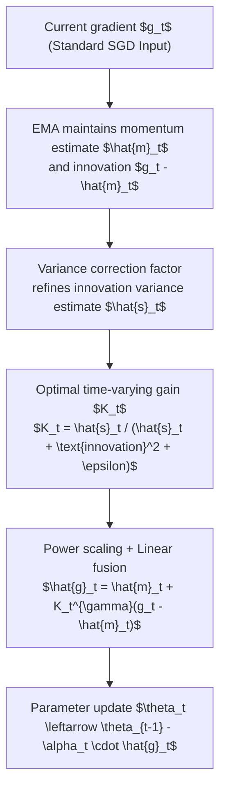

# Dynamic Momentum Recalibration in Online Gradient Learning

**Conference**: CVPR 2026  
**arXiv**: [2603.06120](https://arxiv.org/abs/2603.06120)  
**Code**: [GitHub](https://github.com/LilYau350/SGDF-Optimizer)  
**Area**: Optimization  
**Keywords**: optimizer, momentum, bias-variance tradeoff, optimal linear filter, gradient estimation

## TL;DR
This paper reveals the inherent flaws of fixed momentum coefficients in the bias-variance tradeoff from a signal processing perspective. It proposes the SGDF optimizer, which dynamically balances noise suppression and signal preservation in gradient estimation by calculating an optimal time-varying gain online (based on the Minimum Mean Square Error principle), outperforming SGD with momentum and Adam variants across various vision tasks.

## Background & Motivation

**Background**: SGD and its momentum variants (EMA/CM), along with adaptive methods (Adam/AdamW), form the foundation of deep learning optimization. Momentum methods smooth noise via historical gradients, while adaptive methods scale learning rates using second moments.

**Limitations of Prior Work**: Analysis using the SDE framework reveals that EMA ($u=1-\beta$) serves as a low-pass filter; as $\beta \to 1$, variance decreases but bias diverges (accumulating outdated gradients). CM ($u=1$) is more aggressive, with both bias and variance diverging as $\beta \to 1$. Both methods are locked into a preset bias-variance tradeoff by fixed coefficients, failing to adapt to dynamically changing noise and curvature during training.

**Key Challenge**: Structurally reducing variance inevitably amplifies bias, while reducing bias inevitably increases exposure to higher variance—this is the fundamental dilemma of static momentum coefficients.

**Goal**: Design an adaptive gain that minimizes bias by reducing momentum dependence during low-variance stages and leverages momentum heavily to filter noise during high-variance stages.

**Key Insight**: Starting from optimal linear filtering (Kalman Filter concepts), the historical momentum estimate and the current gradient observation are treated as two Gaussian sources of uncertainty for fusion.

**Core Idea**: Calculate a time-varying gain $K_t$ online using the Minimum Mean Square Error (MMSE) principle to achieve optimal linear fusion of the momentum estimate and the current gradient.

## Method

### Overall Architecture
SGDF replaces the fixed momentum coefficient with a **time-varying gain $K_t$ calculated online at each step**, allowing the optimizer to decide how much to trust historical momentum versus the current gradient. The overall process remains compatible with standard SGD+Momentum: first, EMA maintains the first moment $\hat{m}_t$ and the "innovation" variance $\hat{s}_t$, which is refined using a **variance correction factor**; then, the optimal gain $K_t$ is calculated based on the deviation $(g_t - \hat{m}_t)$ between the current gradient $g_t$ and the momentum estimate; finally, after **power scaling**, the momentum estimate and current gradient are linearly fused to obtain $\hat{g}_t$, which updates the parameters. Crucially, $K_t$ is not a preset constant but is determined in real-time by the variance ratio of the two uncertainty sources—mirroring the "prediction + observation" fusion logic in a Kalman Filter.

### Key Designs

**1. Optimal Time-Varying Gain: Replacing Fixed Coefficients with the MMSE Principle**

The core dilemma identified is that EMA and CM lock themselves into a specific bias-variance tradeoff using a fixed $\beta$. The SGDF solution formulates gradient estimation as a linear interpolation of the momentum estimate and an "innovation" correction:

$$\hat{g}_t = \hat{m}_t + K_t\,(g_t - \hat{m}_t),$$

where $(g_t - \hat{m}_t)$ represents the deviation of the current gradient from historical estimates (the "innovation" term). By taking the derivative of $\text{Var}(\hat{g}_t)$ with respect to $K_t$ and setting it to zero, the optimal gain is solved as:

$$K_t^* = \frac{\text{Var}(\hat{m}_t)}{\text{Var}(\hat{m}_t) + \text{Var}(g_t)}.$$

In implementation, $\hat{s}_t$ (EMA of $s_t$) estimates the momentum uncertainty $\text{Var}(\hat{m}_t)$, and the current innovation squared estimates the observation variance, resulting in $K_t = \hat{s}_t / (\hat{s}_t + (g_t-\hat{m}_t)^2 + \epsilon)$. The intuition is straightforward: when historical momentum is uncertain (large $\hat{s}_t$), the gain increases to trust the current gradient more; when observation noise is high (large innovation squared), the gain decreases to rely on historical momentum.

**2. Variance Correction Factor: Aligning Innovation Variance with True Values**

The quality of $K_t$ depends on the accuracy of the variance estimate $\hat{s}_t$. Directly applying Adam-style bias correction results in significant bias for innovation variance. SGDF uses the factor $(1-\beta_1)(1-\beta_1^{2t})/(1+\beta_1)$ to correct the EMA second moment, providing a more precise estimate under the "independent gradients, bounded variance" assumption. This factor accounts for both the warm-up bias (via $\beta_1^{2t}$) and the steady-state factor, better fitting the statistical properties of innovation sequences.

**3. Power Scaling ($\gamma=1/2$): Preserving Signals under High Noise**

Under heavy noise, the raw $K_t$ can be suppressed to near zero, causing the optimizer to lose the current gradient signal and become uncomfortably sluggish. SGDF replaces $K_t$ with $K_t^\gamma$ (where $\gamma=1/2$), rewriting fusion as $\hat{g}_t = \hat{m}_t + K_t^{\gamma}(g_t-\hat{m}_t)$. Taking the square root effectively modulates the effective observation variance to $\sqrt{\text{Var}(g_t)}$, raising the lower bound of the gain and expanding its response range to signals.

### Loss & Training
- Hyperparameters inherit standard Adam settings: $\beta_1=0.9, \beta_2=0.999, \epsilon=10^{-8}$, with learning rates searched in the same range as SGD.
- Convergence rates are $O(\sqrt{T})$ for convex cases and $O(\log T / \sqrt{T})$ for non-convex cases, consistent with Adam-like methods.
- Extensible to the Adam framework (replacing Adam's first-moment estimate), improving generalization in certain tasks.

## Key Experimental Results

### Main Results

**CIFAR-10/100 Image Classification (VGG/ResNet/DenseNet)**

| Method | VGG11-C10 | ResNet34-C10 | DenseNet121-C100 |
|--------|-----------|--------------|------------------|
| SGD | ~93.5 | ~95.5 | ~77.0 |
| Adam | ~92.8 | ~94.8 | ~76.5 |
| AdaBelief | ~93.2 | ~95.3 | ~77.2 |
| **SGDF** | **~93.8** | **~95.8** | **~77.8** |

**ImageNet ResNet18 Top-1/Top-5**

| Method | Top-1 | Top-5 |
|--------|-------|-------|
| SGD | 70.23 | 89.35 |
| AdaBelief | 70.08 | 89.37 |
| **SGDF** | **70.5+** | **89.6+** |

### Ablation Study

| Configuration | Effect | Description |
|---------------|--------|-------------|
| Full SGDF | Best | Includes variance correction + power scaling |
| w/o Variance Correction | Drop | Correction factor improves $K_t$ estimation quality |
| w/o Power Scaling ($\gamma=1$) | Drop | Original $K_t$ is too conservative under high noise |
| SGDF extended to Adam | Gain | Replaces Adam's first moment, improving generalization |

### Key Findings
- SGDF shows more pronounced advantages on VGG (without residual connections), suggesting greater help for networks with higher gradient noise or difficult propagation.
- Can be seamlessly extended to the Adam framework, improving Adam's generalization in some tasks.
- Gain $K_t$ is larger early in training (relying on current gradients) and decreases later (relying on historical momentum), aligning with intuition.

## Highlights & Insights
- **Momentum Essence via SDE Framework**: Unified analysis of EMA and CM using Stochastic Differential Equations quantifies "parameter drift bias," which was previously overlooked.
- **Elegant Correspondence to Optimal Linear Filtering**: Corresponds the Kalman Filter concept precisely to gradient estimation—fusion of momentum prediction and current observation, with gain determined by the uncertainty ratio.
- **Statistical Interpretation of Gaussian Fusion**: SGDF is equivalent to the multiplicative fusion of two Gaussian distributions; the fused variance is strictly smaller than either source variance, theoretically guaranteeing monotonic improvement in estimation quality.

## Limitations & Future Work
- Maintaining $s_t$ and calculating $K_t$ at each step adds a small amount of computational and memory overhead.
- The independence assumption (independence of $\hat{m}_t$ and $g_t$) does not strictly hold in practice.
- Experiments focused on CV tasks; effectiveness in NLP/LLM training remains unknown.
- Whether $\gamma=1/2$ is optimal for all scenarios is unclear; adaptive $\gamma$ could be explored.

## Related Work & Insights
- **vs Adam**: Adam uses second moments for learning rate adaptation; SGDF uses first-moment variance for gain adaptation—addressing issues at different levels.
- **vs AdaBelief**: AdaBelief also uses innovation $(g_t - m_t)^2$ for variance estimation but applies it to learning rate scaling; SGDF uses it to calculate optimal fusion gain.
- **vs Sophia**: Second-order methods use Hessian information with high cost; SGDF achieves similar adaptive effects using only first-order information.

## Rating
- Novelty: ⭐⭐⭐⭐⭐ The SDE analysis and optimal linear filter correspondence are highly elegant.
- Experimental Thoroughness: ⭐⭐⭐⭐ Validated on multiple architectures and tasks, though lacking NLP experiments.
- Writing Quality: ⭐⭐⭐⭐ Detailed theoretical derivations, though some parts are slightly verbose.
- Value: ⭐⭐⭐⭐ Provides new theoretical tools and practical methods for optimizer design.

<!-- RELATED:START -->

## Related Papers

- [\[CVPR 2026\] BD-Merging: Bias-Aware Dynamic Model Merging with Evidence-Guided Contrastive Learning](bd-merging_bias-aware_dynamic_model_merging_with_evidence-guided_contrastive_lea.md)
- [\[CVPR 2026\] FedAdamom: Adaptive Momentum for Improved Generalization in Federated Optimization](fedadamom_adaptive_momentum_for_improved_generalization_in_federated_optimizatio.md)
- [\[NeurIPS 2025\] Nonlinearly Preconditioned Gradient Methods: Momentum and Stochastic Analysis](../../NeurIPS2025/optimization/nonlinearly_preconditioned_gradient_methods_momentum_and_stochastic_analysis.md)
- [\[CVPR 2026\] From Selection to Scheduling: Federated Geometry-Aware Correction Makes Exemplar Replay Work Better under Continual Dynamic Heterogeneity](from_selection_to_scheduling_federated_geometry-aware_correction_makes_exemplar_.md)
- [\[ICML 2026\] A General Framework for Dynamic Consistent Submodular Maximization](../../ICML2026/optimization/a_general_framework_for_dynamic_consistent_submodular_maximization.md)

<!-- RELATED:END -->
