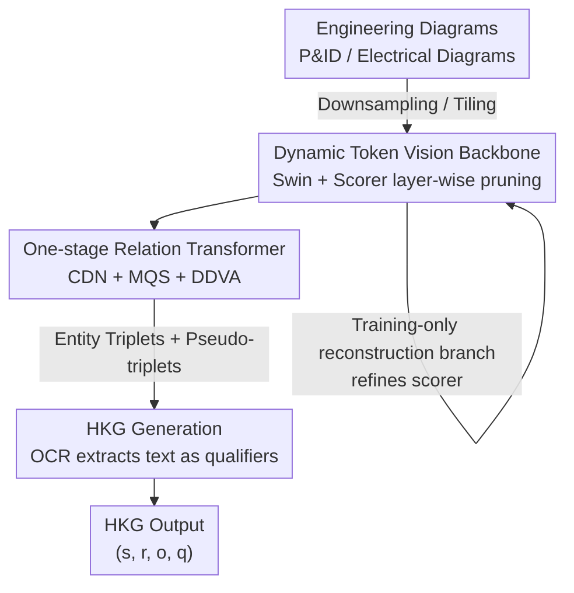

# End-to-End Hyper-Relational Information Extraction for Engineering Diagrams via Dynamically Tokenized Relation Transformer

**Conference**: CVPR 2026  
**Paper**: [CVF Open Access](https://openaccess.thecvf.com/content/CVPR2026/html/Bai_End-to-End_Hyper-Relational_Information_Extraction_for_Engineering_Diagrams_via_Dynamically_Tokenized_CVPR_2026_paper.html)  
**Code**: https://github.com/Tianyou-Bai/DTRT-Diagram-Parsing-in-Scene-Graph  
**Area**: Document Understanding / Scene Graph Generation  
**Keywords**: Engineering diagram parsing, Hyper-relational knowledge graph, One-stage scene graph generation, Dynamic token pruning, P&ID  

## TL;DR
This work reframes the parsing of engineering diagrams (P&ID, Electrical Diagrams) from a multi-model workflow of detecting symbols, lines, and text separately into a one-time scene graph generation task. By employing a vision backbone with dynamic token pruning and a one-stage Relation Transformer (DTRT), the system end-to-end outputs a Hyper-Relational Knowledge Graph (HKG) containing "entities + connectivity + text qualifiers." On P&ID datasets, it achieves 94.84% SGDET R@2000 with approximately 1/8 the computational cost of two-stage methods.

## Background & Motivation
**Background**: Engineering diagrams (P&ID, electrical diagrams, single-line diagrams) are core carriers for industrial processes, recording equipment, parameters, topological connections, and control logic. However, most exist as paper or scanned documents, leading to an urgent need for digitalization. Existing parsing methods typically follow an "object detection" route: using models like YOLO or DETR to separately detect symbols, lines, and text boxes before stitching them into a structure.

**Limitations of Prior Work**: The authors identify three specific issues. First, symbols, lines, and text often require independent models, leading to long and inefficient workflows. Second, engineering diagrams have extremely high resolutions (often 8K or 10K), causing massive computational overhead for existing models. Third, pure object detection frameworks only locate low-level semantics (where components are and their categories) but cannot establish connections between symbols or correspondences between symbols and their text labels, resulting in a collection of boxes rather than searchable structured knowledge.

**Key Challenge**: The truly valuable information in diagrams lies in implicit semantics such as **topological connections + text qualifiers (models, parameters)**, which are precisely what detection frameworks struggle to produce. Simultaneously, over 70% of the massive visual tokens from high-resolution inputs have extremely low information content yet are still processed uniformly in expensive calculations.

**Goal**: To develop an end-to-end framework that simultaneously addresses (1) tedious multi-model workflows, (2) computational explosion from ultra-high resolution, and (3) the lack of high-level semantics like connections and text qualifiers.

**Key Insight**: Since the objective is "components + relations + text," the problem is essentially a **scene graph** generation task. By treating the "lines connecting two symbols" as connection relations $r_{ss}$ and "symbols and their text labels" as qualifier relations $q_{st}$, the detection task is reformulated as a scene graph task. This bypasses the difficult problems of long straight-line detection and irregular bounding box detection.

**Core Idea**: Utilize a one-stage Relation Transformer to directly generate (subject, predicate, object) triplets, avoiding the $O(n^2)$ complexity of relation prediction. A "scorer-reconstructor" is integrated into the vision backbone to prune 70% of useless tokens, ultimately outputting a **Hyper-Relational Knowledge Graph (HKG)** with text qualifiers.

## Method

### Overall Architecture
DTRT (Dynamically Tokenized Relation Transformer) integrates several components to solve workflow complexity, excessive computation, and missing high-level semantics. An engineering diagram first undergoes non-destructive preprocessing (downsampling or tiling to preserve detail). It then enters the **dynamically tokenized vision backbone**—based on Swin Transformer—where an MLP scorer is inserted at the end of each stage to score and prune low-value tokens. During training, a Transformer reconstruction branch is attached to assist the scorer's convergence. The pruned features are sent to a **one-stage Relation Transformer**, which uses a feature encoder for global context, followed by an entity decoder and triplet decoder to directly generate and iteratively refine triplets such as $[e_{s_i}, r_{s_is_j}, e_{s_j}]$. Finally, "symbol-text" pseudo-triplets are identified, and text content is extracted via OCR to be attached to entities and relations as qualifiers, assembling the HKG $\{\hat{s}, \hat{r}, \hat{o}, \hat{q}\}$.

The fundamental reformulation represents diagram $d$ as a combination of symbol entities $e_s$, line entities $e_l$, and text entities $e_t$, converting connecting lines into relations $r_{ss}$ and symbol-text correspondences into qualifier relations $q_{st}$. This builds a relation-labeled dataset $D=\{[e_s, e_t, r_{ss}, q_{st}]_1, \dots\}$, converting the entire detection task into scene graph generation.

### Key Designs

**1. Scene Graph Reformulation: Converting "Multi-model Detection" to One-time Relation Prediction**

This step addresses the root problem of multi-model stitching and the inability of detection to capture relations. Instead of detecting "lines" (which are long, thin, and irregular), the authors label "lines connecting two symbols" as relations $r_{ss}$ (categorized as solid or non-solid lines) and "text labels near symbols" as qualifier relations $q_{st}$. The diagram is thus represented as $D=\{[e_s, e_t, r_{ss}, q_{st}]\}$. This approach offers dual benefits: it outputs structured high-level semantics (what is connected to what, what the parameters are) without complex post-processing, and it bypasses the notoriously difficult line detection tasks.

**2. Scorer-Reconstructor Dynamic Token Pruning: Discarding 70% Useless Tokens**

For high-resolution diagrams, over 70% of tokens have low information yet consume full power. DTRT inserts lightweight MLP scorers at the end of each stage of the Swin backbone. Token features go through the MLP to get $z_l=\mathrm{MLP}(x_{i+1})$, followed by global pooling $z_g=\frac{\sum_i \hat{D}[i]\cdot z_l[i]}{\sum_i \hat{D}[i]}$ based on current masks. The combined $z=[z_l, z_g]^T$ predicts retention probability $\pi=\mathrm{Softmax}(\mathrm{MLP}(z))$. Gumbel-Softmax enables differentiable binary pruning decisions to update the mask $\hat{D}\leftarrow\hat{D}\odot\mathrm{Gumbel\text{-}Softmax}(\pi)$. Each stage retains the top $\rho_r$ (typically 0.7) tokens.

To solve the difficulty of training the scorer due to initial poor matching of entity queries, a **Transformer Reconstruction Branch** is included during training. Pruned features $x^*_{s+1}$ and masked tokens $x^m_{s+1}$ are fed into a reconstructor to recover the original diagram $d_{rc}$. A pixel-level reconstruction loss $L_r=\frac{1}{NC}\sum_i\sum_c(d_{rc}[i][c]-d[i][c])^2$ provides supervision for the scorer. The total loss combines reconstruction, entity, and relation terms: $L=\lambda_{rc}L_{rc}+\lambda_e L_e+\lambda_{re}L_{re}$. This branch exists only during training, allowing the scorer to converge faster and protect critical tokens like long lines and text.

**3. One-stage Relation Transformer: Direct Triplet Output to Avoid $O(n^2)$ Complexity**

Diagrams contain a massive number of relations. Two-stage scene graph methods match relation queries to every pair of entity queries, leading to $O(N^2)$ complexity. DTRT uses a one-stage approach where the triplet decoder directly generates and refines $\{\hat{s},\hat{r},\hat{o}\}$. Three major improvements are used: **Mixed Query Selection (MQS)** selects high-confidence entity candidates from the encoder features; **Contrastive Denoising (CDN)** uses low-noise positive and high-noise negative samples to force the model to cluster similar entities in feature space; and **Relation-aware Deformable Decoupled Visual Attention (DDVA)** locates relevant regions between subjects and objects to focus attention on "the connecting area between symbols."

**4. HKG Generation: Converting Text Labels into Entity Qualifiers**

Standard triplets $(s, r, o)$ cannot accommodate additional info like "valve model XX." DTRT identifies **pseudo-triplets** formed by qualifier relations $r_{st}$ within the generated graph. OCR (PaddleOCR) extracts the text content $\hat{q}_i=\{\hat{s}_i, \hat{r}_{st}, \hat{o}_k\}$, which is then attached to the corresponding entities and relations to form hyper-relational triplets $\{\hat{s}_i, \hat{r}_{ss}, \hat{o}_j, \hat{q}_i\}$. This result is the Hyper-Relational Knowledge Graph $\{\hat{s}, \hat{r}, \hat{o}, \hat{q}\}$.

### Loss & Training
The total loss is $L=\lambda_{rc}L_{rc}+\lambda_e L_e+\lambda_{re}L_{re}$. Architecture hyperparameters include $\{L_r{=}3, L_e{=}6, L_t{=}9, \rho_r{=}0.7, \sigma_{small}{=}0.03, \sigma_{large}{=}0.15, \Delta p_b{=}0.8, \lambda_p{=}0.6\}$. The backbone uses pre-trained tiny Swin, and OCR uses pre-trained PaddleOCR. Training utilizes AdamW with a base learning rate of $1\times10^{-4}$ and cosine annealing.

## Key Experimental Results

Datasets: Reformulated P&ID dataset (762 8K images, 16 entity classes) and ED electrical diagram dataset (4768 images, 12 entity classes). Metrics include AP/AR for entity detection and Recall@R/Recall@N for scene graph generation.

### Main Results

Relation extraction (scene graph) comparison on the P&ID dataset (SGDET setting):

| Method | SGDET R@2000 | SGCLS R@R | GFLOPs |
|------|------|------|------|
| RelTR | 79.17 | 83.41 | 287.8 |
| Relationformer (Two-stage) | 91.58 | 87.72 | 791.9 |
| SGTR | 76.94 | 80.76 | 749.3 |
| **DTRT (Ours)** | **94.84** | **88.62** | **90.5** |

Electrical Diagram (ED) dataset:

| Method | SGDET R@200 | SGCLS R@200 | GFLOPs |
|------|------|------|------|
| RelTR | 77.91 | 90.98 | 209.9 |
| Relationformer | 89.15 | 97.29 | 589.4 |
| SGTR | 77.12 | 90.65 | 561.1 |
| **DTRT (Ours)** | **92.52** | 97.63 | **67.3** |

DTRT leads significantly in the difficult SGDET setting, with computational costs reduced to ~1/8 of two-stage methods.

> ⚠️ The abstract mentions "P&ID R@1000 94.84%," but Table 5 shows 94.84% corresponds to SGDET R@2000. The abstract likely contains a typo regarding the R@1000 metric.

### Ablation Study

Incremental gains for Relation Transformer (P&ID):

| Config | AP50 | SGDET R@2000 |
|------|------|------|
| baseline | 90.12 | 79.24 |
| +DN | 93.94 | 82.45 |
| +DN +DDVA | 94.51 | 87.98 |
| +DN +DDVA +CDN | 97.86 | 92.11 |
| +DN +DDVA +CDN +MQS (Full) | **99.01** | **94.84** |

### Key Findings
- **Reconstruction branch is critical for dynamic pruning**: Without it, the GFLOPs drop but error rates (OCR CER) spike, as the MLP scorer fails to recognize thin lines and text alone. The reconstruction loss forces the model to preserve these critical low-level details.
- **DDVA contributes most to relation prediction**: It provides up to a 7.16% improvement by precisely targeting the interaction regions between subjects and objects.
- **ED is more challenging than P&ID**: Despite the complex connections and lower annotation quality, DTRT maintains high performance, showing strong generalization.

## Highlights & Insights
- **Reframing "hard to detect" as "easy to predict relations"**: Long lines and irregular boxes are detection nightmares. Treating them as relations and text as qualifiers bypasses these bottlenecks.
- **Qualifier mechanism makes Knowledge Graphs practical**: Standard triplets only describe connectivity; HKG uses qualifiers to store parameters like "pressure" and "model," significantly increasing utility for downstream industrial agents.
- **Pruning + Reconstruction combination is transferable**: The "training-time reconstruction branch for inference-time zero-cost pruning" strategy is effective for any high-resolution document parsing task containing fine structures.

## Limitations & Future Work
- Small data scale (762 P&ID images) and heavy reliance on custom annotations.
- High dependency on external OCR; OCR errors directly propagate to the HKG.
- Lack of comparison with proprietary industrial parsing pipelines.

## Related Work & Insights
- **vs Relationformer**: DTRT's one-stage approach eliminates the $O(N^2)$ matching complexity, being 8x faster while more accurate.
- **vs SGTR**: DTRT uses DDVA to focus on connection regions, whereas SGTR relies more on distance and category similarity, leading to lower recall.
- **vs DynamicViT/EViT**: These general pruning methods struggle with document details; DTRT's generative reconstruction constraint makes pruning viable for high-resolution diagrams.

## Rating
- Novelty: ⭐⭐⭐⭐ Reframing parsing as hyper-relational scene graph generation is innovative.
- Experimental Thoroughness: ⭐⭐⭐⭐ Solid metrics across two datasets, though data size and commercial baseline comparisons are limited.
- Writing Quality: ⭐⭐⭐⭐ Clear formulas and flow, despite the minor typo in the abstract.
- Value: ⭐⭐⭐⭐ End-to-end, low-computation solution addresses a real industrial pain point.

<!-- RELATED:START -->

<!-- RELATED:END -->

## Related Papers

- [\[CVPR 2026\] Bias at the End of the Score](bias_at_the_end_of_the_score.md)
- [\[ICML 2026\] CyberGym-E2E: Scalable Real-World Benchmark for AI Agents' End-to-End Cybersecurity Capabilities](../../ICML2026/others/cybergym-e2e_scalable_real-world_benchmark_for_ai_agents_end-to-end_cybersecurit.md)
- [\[ACL 2025\] Behavioural vs. Representational Systematicity in End-to-End Models: An Opinionated Survey](../../ACL2025/others/behavioural_vs_representational_systematicity_in_end-to-end_models_an_opinionate.md)
- [\[CVPR 2026\] 3D-Object Perception Transformer (3PT)](3d-object_perception_transformer_3pt.md)
- [\[CVPR 2026\] Robust Spiking Neural Networks by Temporal Mutual Information](robust_spiking_neural_networks_by_temporal_mutual_information.md)

<!-- RELATED:END -->
