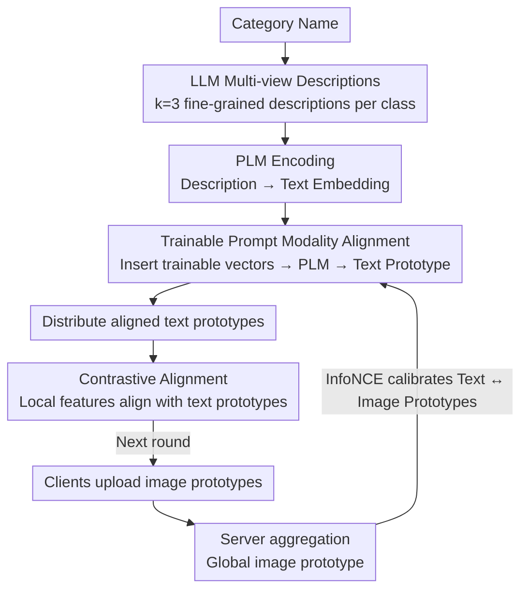

# Enhancing Visual Representation with Textual Semantics: Textual Semantics-Powered Prototypes for Heterogeneous Federated Learning

**Conference**: CVPR 2026 Highlight  
**arXiv**: [2503.13543](https://arxiv.org/abs/2503.13543)  
**Code**: [GitHub](https://github.com/XinghaoWu/FedTSP)  
**Area**: Optimization  
**Keywords**: Federated Learning, Prototypical Learning, Semantic Relations, Pre-trained Language Models, Data Heterogeneity

## TL;DR

Addressing the issue where existing Federated Prototypical Learning methods destroy inter-class semantic relations, the proposed FedTSP method utilizes pre-trained language models to construct textual prototypes that preserve semantic structures, significantly improving performance and accelerating convergence in heterogeneous federated learning.

## Background & Motivation

Federated Prototypical Learning (FedPL) is an effective strategy for handling data heterogeneity in federated learning. The core idea is to facilitate clients in collaboratively constructing global prototypes and aligning local features with them. Existing methods (e.g., AlignFed, FedTGP) typically seek to maximize the inter-class distance between prototypes to enhance discriminativeness. However, this approach overlooks a critical issue: while increasing inter-class distance, it inevitably destroys the semantic relationships between classes.

For example, "horse" and "dog" are semantically similar animal categories, and their prototype distance should be smaller than the distance between "horse" and "truck." However, prototypes uniformly distributed on a hypersphere cannot preserve this hierarchical semantic structure. The authors verified this finding through two quantitative indicators: Spearman correlation coefficient and semantic gap.

It is difficult to learn semantic relations directly from limited and heterogeneous client data. However, Pre-trained Language Models (PLMs) like BERT have already captured rich semantic relations on large-scale text corpora. This inspires the **Core Idea** of this paper: can textual semantic knowledge be injected into federated learning prototypes to preserve inter-class relations even under heterogeneous data?

## Method

### Overall Architecture

FedTSP aims to solve the problem where existing FedPL methods flatten the inter-class semantic structure (like "horses and dogs being closer than horses and trucks") by aggressively widening prototype gaps for discriminativeness. The breakthrough lies in no longer learning prototypes solely from client data but importing existing semantic structures from an external "semantic teacher"—a Pre-trained Language Model (PLM). The pipeline is as follows: first, an LLM generates multiple textual descriptions for each category; then, a PLM (BERT or CLIP text tower) encodes these descriptions into **textual prototypes** with semantic structures. Since these prototypes are semantically correct but not in the image space, a trainable prompt is used on the server to calibrate textual prototypes to the aggregated **image prototypes**. Finally, clients use a contrastive loss rather than $L2$ to align local features with these semantically-preserved textual prototypes, thereby propagating the semantic structure into their personalized models. In each iteration: clients upload image prototypes → server aligns and distributes textual prototypes → clients align local features, repeating until convergence.

### Key Designs

**1. LLM Multi-view Descriptions: Providing a Contextual "Semantic ID"**

Manual prompts like "A photo of a {CLASS}" differ only by the class name, resulting in PLM-encoded prototypes that mostly reflect word embeddings with thin semantic context and potential ambiguity (e.g., "apple" as fruit vs. company). FedTSP uses an LLM to generate $k=3$ fine-grained descriptions covering different aspects for each category, using the template "A photo of {CLASS}: {description}." Multi-view descriptions supplement context from perspectives like appearance, habits, and taxonomy, allowing the encoded textual prototypes to truly carry information about inter-class similarities and resolve lexical ambiguity.

**2. Trainable Prompt Modality Alignment: Enabling BERT without Image Pre-training**

Textual prototypes have the correct semantic structure, but PLMs (especially BERT) were never exposed to images during pre-training. Text features and client image features reside in two non-aligned spaces; direct alignment would fail due to the modality gap. The approach inserts a set of trainable embedding vectors into the first $m$ positions of the text embedding sequence. On the server, an InfoNCE loss is used to train this prompt so that textual prototypes align with aggregated image prototypes:

$$\mathcal{L}_{\text{prompt}} = -\sum_{c} \log \frac{\exp(\text{sim}(t_c, p_c)/\tau)}{\sum_{c'} \exp(\text{sim}(t_c, p_{c'})/\tau)}$$

where $t_c$ is the textual prototype of class $c$ and $p_c$ is the aggregated image prototype. This preserves the inherent semantic structure of the PLM while calibrating the text tower into the visual space—explaining why BERT can approach CLIP's performance despite lacking vision-language pre-training.

**3. Contrastive Alignment instead of L2: Ranking is More Reliable than Absolute Distance**

The baseline similarity between prototypes generated by PLMs is inherently high—measurements show that even the two most dissimilar classes have a similarity of $0.73$, causing the entire set of prototypes to cluster in a small region of the hypersphere. Using $L2$ distance to pull local features toward textual prototypes would treat "irrelevant classes with 0.73 similarity" as truly similar, misleading the model. FedTSP therefore abandons absolute distance in favor of a contrastive learning loss, focusing only on the ranking of **relative** inter-class similarities: ensuring the similarity of a local feature to its ground-truth prototype is higher than to all others, with sensitivity to relative differences adjusted by the temperature parameter $\tau$. Semantic structure is transmitted via relative "who should be closer to whom" relationships rather than being skewed by high absolute similarity.

### Loss & Training

The server uses InfoNCE loss to update the trainable prompt, aligning textual prototypes with aggregated image prototypes. Clients simultaneously optimize a cross-entropy classification loss and a contrastive alignment loss (where temperature $\tau$ controls sensitivity to relative similarity). For scenarios where class names might leak privacy, the authors provide a Differential Privacy (DP) extension: injecting Gaussian noise into text embeddings to satisfy $(\epsilon,\delta)$-DP guarantees. Experiments show nearly no performance loss when $\epsilon \geq 1$.

## Key Experimental Results

### Main Results

| Dataset | Metric | FedTSP-BERT (Ours) | Prev. SOTA | Gain |
|--------|------|-------------|----------|------|
| CIFAR-10 ($\alpha=0.1$) | Acc | 87.52% | 86.80% (FedKD) | +0.72% |
| CIFAR-100 ($\alpha=0.1$) | Acc | 46.08% | 42.82% (FedMRL) | +3.26% |
| TinyImageNet ($\alpha=0.1$) | Acc | 34.82% (CLIP) | 32.79% (FedKD) | +2.03% |

### Ablation Study

| Configuration | Key Metrics | Description |
|------|----------|------|
| Contrastive Learning vs. L2 Alignment | +2-3% | Contrastive learning is better suited for high baseline similarity |
| LLM Descriptions vs. Manual Template | +1-2% | Fine-grained descriptions provide richer semantic context |
| CLIP vs. BERT | Close | BERT lacks image pre-training but can bridge the gap via trainable prompts |

### Key Findings

- FedTSP shows more significant gains under strong heterogeneity ($\alpha=0.1$), indicating that textual prototypes are more robust to heterogeneous data.
- FedTSP-BERT shows larger improvements in Top-5 accuracy, suggesting effective semantic relations: even when misclassified, results tend to fall into semantically similar classes.
- The privacy-preserving version maintains performance with almost no impact when $\epsilon \geq 1$.

## Highlights & Insights

- Introduces a novel perspective by incorporating semantic knowledge from PLM/LLM into federated prototypical learning for the first time.
- Identifies and quantifies the problem of semantic relation destruction in existing methods.
- FedTSP is compatible with different PLMs such as CLIP and BERT, and does not depend on CLIP’s vision-language alignment.
- Capable of simultaneously handling both data heterogeneity and model heterogeneity.

## Limitations & Future Work

- Deploying PLMs on the server increases server-side computational costs.
- The quality of LLM-generated descriptions depends on the clarity of category names.
- Did not explore larger-scale datasets (e.g., ImageNet) or more diverse PLM architectures.
- The privacy protection extension only considers class name privacy and does not cover broader privacy scenarios.

## Related Work & Insights

- **vs. FedProto/FedTGP**: These methods aggregate prototypes from client data or maximize inter-class distance, destroying semantic relations; FedTSP constructs prototypes from the textual modality, naturally preserving semantic structure.
- **vs. CLIP-based FL**: CLIP-based methods aim to enhance CLIP itself; FedTSP transfers semantic knowledge to lightweight client models without relying on CLIP's visual encoder.
- **vs. FedETF/FedNH**: Using fixed ETF/uniform distribution classifiers as prototypes cannot encode semantic relations.

## Rating

- Novelty: ⭐⭐⭐⭐ Unique perspective by introducing PLM semantic knowledge into FedPL.
- Experimental Thoroughness: ⭐⭐⭐⭐ Multiple datasets, varying heterogeneity settings, multiple PLMs, and complete ablation studies.
- Writing Quality: ⭐⭐⭐⭐ Clear motivation, intuitive visualization, and sophisticated design of semantic alignment and gap metrics.
- Value: ⭐⭐⭐⭐ Provides a new paradigm for leveraging the semantic knowledge of language models in Federated Learning.

<!-- RELATED:START -->

## Related Papers

- [\[ICML 2026\] Learning Context-Conditioned Predicate Semantics via Prototype Feedback](../../ICML2026/optimization/learning_context-conditioned_predicate_semantics_via_prototype_feedback.md)
- [\[CVPR 2026\] FedRG: Unleashing the Representation Geometry for Federated Learning with Noisy Clients](fedrg_unleashing_the_representation_geometry_for_federated_learning_with_noisy_c.md)
- [\[ICLR 2026\] Incentives in Federated Learning with Heterogeneous Agents](../../ICLR2026/optimization/incentives_in_federated_learning_with_heterogeneous_agents.md)
- [\[CVPR 2026\] HyperNAS: Enhancing Architecture Representation for NAS Predictor via Hypernetwork](hypernas_enhancing_architecture_representation_for_nas_predictor_via_hypernetwor.md)
- [\[AAAI 2026\] SMoFi: Step-wise Momentum Fusion for Split Federated Learning on Heterogeneous Data](../../AAAI2026/optimization/smofi_step-wise_momentum_fusion_for_split_federated_learning_on_heterogeneous_da.md)

<!-- RELATED:END -->
