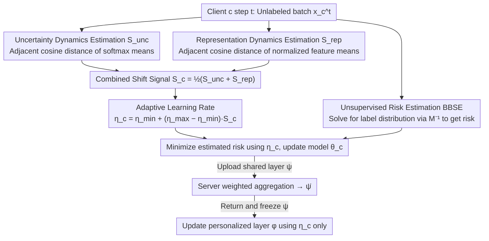

# Fed-ADE: Adaptive Learning Rate for Federated Post-adaptation under Distribution Shift

**Conference**: CVPR2026  
**arXiv**: [2603.01040](https://arxiv.org/abs/2603.01040)  
**Code**: [h2w1/Fed-ADE](https://github.com/h2w1/Fed-ADE)  
**Area**: Optimization  
**Keywords**: federated learning, distribution shift, adaptive learning rate, online adaptation, unsupervised adaptation

## TL;DR

Proposes the Fed-ADE framework, which utilizes two lightweight distribution shift signals—uncertainty dynamics estimation and representation dynamics estimation—to adaptively adjust the learning rate for each client at each time step, achieving unsupervised post-deployment adaptation in federated learning.

## Background & Motivation

**Prevalence of post-deployment distribution shift**: Edge devices (smartphones, IoT, autonomous driving) continuously receive non-stationary data streams, leading to rapid degradation of pre-trained models due to distribution shifts.

**Dual challenges of heterogeneity**: Federated learning faces both shift heterogeneity (each client experiences distribution shifts with different temporal dynamics) and data heterogeneity (differences in scale and domain of clients' local data).

**Fatal flaws of fixed learning rates**: A learning rate that is too small leads to underfitting, while one that is too large leads to divergence; using a uniform fixed learning rate across hundreds of heterogeneous clients cannot adapt to their respective distribution shift speeds.

**Unsupervised constraints**: Ground truth labels are unavailable after deployment, making learning rate selection more difficult as traditional loss-based scheduling strategies cannot be used directly.

**Limitations of Prior Work**: Methods like Fed-POE rely on multi-model ensembles or expensive hyperparameter searches, introducing extra communication and computational overhead; centralized methods (ATLAS, FTH) fail to leverage shared knowledge across clients.

**Core Problem**: How to automatically select an appropriate learning rate for each client in an unlabeled, heterogeneous, and time-varying distribution shift federated scenario?

## Method

### Overall Architecture

Fed-ADE adopts a partial-sharing personalized federated learning architecture: each client model $\theta_c$ is divided into a shared layer $\psi_c$ (communicated with the server) and a personalized layer $\phi_c$ (retained locally). In each communication round: (1) Clients update all parameters using the adaptive learning rate $\eta_c^t$; (2) Upload $\psi_c$ to the server for weighted aggregation; (3) Receive the aggregated $\bar{\psi}$ and freeze the shared layer, updating only the personalized layer with the adaptive learning rate. The core innovation lies in the adaptive calculation of the learning rate:

$$\eta_c^t = \eta_{\min} + (\eta_{\max} - \eta_{\min}) \cdot \mathcal{S}_c^t$$

where $\mathcal{S}_c^t \in [0,1]$ is a comprehensive distribution shift signal combined from two complementary estimators: $\mathcal{S}_c^t = \frac{1}{2}(\mathcal{S}_{\text{unc}}^t + \mathcal{S}_{\text{rep}}^t)$. The difficulty of the method lies not in the update rule itself, but in how to measure the "amount of shift" without labels. Four designs resolve how to measure signals, estimate risk, and ensure theoretical optimality.

### Key Designs

**1. Uncertainty Dynamics Estimation: Sensing label shift via temporal changes in prediction confidence**

Labels are unavailable after deployment, but the most direct shift signal is hidden in the model's own output. Fed-ADE averages the softmax vectors of all samples in the current batch to obtain a class-level average confidence summary $\mathbf{q}_c^t = \frac{1}{|\mathbf{x}_c^t|} \sum_{x} \mathcal{H}(\theta_c; x)$. This requires no labels and acts as an entropy proxy. When a label shift occurs in the category distribution, the direction of this average vector shifts. The magnitude of change is quantified using the cosine distance between two adjacent steps:

$$\mathcal{S}_{\text{unc}}^t = 1 - \cos(\mathbf{q}_c^{t-1}, \mathbf{q}_c^t)$$

Batch-level averaging is used instead of single-sample metrics to eliminate random jitter, ensuring the signal reflects distribution-level migration. The estimation only requires caching the previous step's $\mathbf{q}_c^{t-1}$, making the memory overhead $O(|\mathcal{I}|)$ (number of classes), which is light enough for edge clients.

**2. Representation Dynamics Estimation: Capturing covariate shift in the embedding space**

The label shift signal monitors the output, but covariate shifts like image noise or domain changes may not immediately reflect in the softmax. Therefore, a complementary signal from the feature end is required. Features extracted by the shared layer are $\ell_2$ normalized and batch-averaged: $\mathbf{z}_c^t = \frac{1}{|\mathbf{x}_c^t|} \sum_x \frac{h_{\psi_c}(x)}{\|h_{\psi_c}(x)\|_2}$. The shift in feature direction is measured via cosine distance:

$$\mathcal{S}_{\text{rep}}^t = \frac{1}{2}\bigl(1 - \cos(\mathbf{z}_z^{t-1}, \mathbf{z}_c^t)\bigr)$$

$\ell_2$ normalization is critical as it makes the cosine distance sensitive only to changes in feature direction rather than scale. The $\frac{1}{2}$ scaling squashes the value range from $[0,2]$ back to $[0,1]$, allowing it to be averaged with the uncertainty signal. This signal is computed locally without labels, with an additional memory cost of only $O(d)$ (feature dimension).

**3. Unsupervised Risk Estimation: Solving for label distribution via BBSE without labels**

Model updates require an optimization objective, but expected risk cannot be calculated in unlabeled scenarios. Fed-ADE utilizes Black-box Shift Estimation (BBSE) to resolve this: the server pre-calculates a confusion matrix $\mathbf{M}$ using labeled pre-training data. The client then counts the pseudo-label distribution $\mathbf{Q}_{c,\hat{y}}^t$ of the current batch to solve for the true label distribution:

$$\mathbf{Q}_{c,y}^t \approx \mathbf{M}^{-1} \mathbf{Q}_{c,\hat{y}}^t$$

With this distribution, the supervised risk can be decomposed into a weighted sum of category-specific sub-risks, using the estimated label distribution as weights to obtain the unsupervised risk estimate $\widehat{\mathcal{F}}_c^t(\theta_c)$. Initial sub-risks for each category can be replaced by empirical values from pre-training data.

**4. Theoretical Guarantees: Linking shift proxies to dynamic regret for min-max optimality**

The paper proves that the cumulative shift proxy $\bar{\mathcal{S}}_c$ accurately approximates the true distribution shift (Theorem 1 & 2), linking observable proxy signals to unobservable true shift magnitudes. Based on this, when the learning rate is set to $\eta^* = \Theta(T^{-1/3} \bar{\mathcal{S}}_c^{1/3})$, the dynamic regret satisfies:

$$\mathbb{E}[\text{Reg}_T] = \mathcal{O}(\bar{\mathcal{S}}_c^{1/3} T^{2/3})$$

This matches the min-max optimal bound for online learning under unsupervised label shift. It demonstrates that the "faster the shift, the larger the learning rate" intuition is not just empirical tuning, but an optimal strategy approaching theoretical lower bounds in non-stationary environments.

## Key Experimental Results

**Table 1: Label Shift Scenarios (Average Accuracy %)**

| Dataset | Shift Type | FTH | ATLAS | Fed-POE | FedCCFA | FixLR(Mid) | **Fed-ADE** |
|---------|------------|-----|-------|---------|---------|------------|-------------|
| Tiny ImageNet | Lin. | 78.2 | 76.5 | 87.1 | 84.7 | 88.2 | **89.1** |
| Tiny ImageNet | Sin. | 77.9 | 76.8 | 87.5 | 84.8 | 88.0 | **88.9** |
| CIFAR-10 | Lin. | 31.4 | 36.5 | 71.3 | 65.8 | 70.8 | **73.8** |
| CIFAR-10 | Sin. | 40.3 | 43.7 | 71.4 | 65.8 | 70.5 | **73.6** |
| LAMA | Lin. | 68.3 | 79.5 | 85.4 | 95.6 | 95.2 | **95.8** |
| LAMA | Squ. | 70.5 | 79.8 | 84.2 | 92.0 | 95.4 | **96.4** |

**Main Results**: Fed-ADE achieves the best performance across all label shift scenarios, with an average improvement of 1-3% over FixLR and 2-4% over Fed-POE.

**Table 2: Covariate Shift Scenarios + Ablation Study**

| Dataset | Shift Type | FTH | ATLAS | Fed-POE | FixLR(Mid) | **Fed-ADE** |
|---------|------------|-----|-------|---------|------------|-------------|
| CIFAR-10-C | Lin. | 23.7 | 13.9 | 44.5 | 63.9 | **64.4** |
| CIFAR-10-C | Squ. | 23.8 | 14.1 | 48.5 | 64.5 | **65.4** |
| CIFAR-100-C | Lin. | 9.2 | 3.5 | 27.3 | 43.4 | **45.8** |
| CIFAR-100-C | Sin. | 7.6 | 2.9 | 27.5 | 42.1 | **46.7** |

**Ablation Study** (CIFAR-10 Lin.): Fed-ADE(full) 73.8% > w/o $\mathcal{S}_{\text{unc}}$ 71.3% > w/o $\mathcal{S}_{\text{rep}}$ 73.1% > Fixed LR 70.8%. The two signals are complementary: $\mathcal{S}_{\text{unc}}$ is more sensitive to label shift, while $\mathcal{S}_{\text{rep}}$ is more sensitive to covariate shift.

**Key Findings**: Fed-ADE wall time averages ≈109 seconds, which is 17–24x faster than localized methods and approximately 2x faster than FedCCFA.

## Highlights & Insights

1.  **Extremely Lightweight Design**: The two shift estimators only need to cache the previous step's mean vector ($O(|\mathcal{I}|) + O(d)$), requiring no extra communication, no labels, and no model ensembles.
2.  **Theory & Practice Unity**: Proved that $\mathcal{S}_c^t$ approximates true distribution shift and derived a min-max optimal dynamic regret of $\mathcal{O}(\bar{\mathcal{S}}_c^{1/3} T^{2/3})$.
3.  **Superiority of Cosine Similarity**: Ablations show cosine similarity outperforms KL divergence, Wasserstein distance, and Bayesian CPD because it is bounded, direction-based, and more robust to pseudo-label noise and class imbalance.
4.  **Cross-modal Generalization**: Performs excellently on both image (Tiny ImageNet, CIFAR-10/100, CIFAR-C) and text (LAMA) benchmarks.
5.  **Robustness to Pre-training Distribution**: Fed-ADE maintains stable performance even when pre-training data follows Gaussian or exponential decay distributions (rather than uniform).

## Limitations & Future Work

1.  **Equal-weighted Combination of Signals**: $\mathcal{S}_c^t = \frac{1}{2}(\mathcal{S}_{\text{unc}}^t + \mathcal{S}_{\text{rep}}^t)$ is a simple average; it does not adaptively weight based on shift types, which might be inferior to automatic weighting (e.g., attention mechanisms).
2.  **Limited Shift Types**: Currently only validated on label shift and covariate shift, without addressing more complex types like concept drift ($P(y|x)$ changes).
3.  **Manual Setting of $\eta_{\min}$ and $\eta_{\max}$**: Although robust to hyperparameters, different benchmarks used different boundary values without an automatic selection strategy.
4.  **Fixed Client Count**: The study used 100 clients; performance and convergence in large-scale (1000+) or very few client scenarios remain unexplored.
5.  **BBSE Confusion Matrix Dependency**: Requires pre-training data to compute $\mathbf{M}$; if pre-training data is unavailable or non-representative, estimation quality may suffer.

## Related Work & Insights

-   **Comparison with ATLAS/FTH**: Localized methods perform poorly in federated scenarios (only 30-40% on CIFAR-10), indicating cross-client knowledge sharing is vital.
-   **Comparison with Fed-POE**: Fed-POE improves adaptation via ensembles but has high computational costs and lacks shift awareness; Fed-ADE is more efficient by directly regulating the learning rate.
-   **Inspiration for TTA / Continual Learning**: The idea of uncertainty + representation dual-signal detection for shifts can be transferred to test-time adaptation and continual learning.
-   **New Paradigm for Adaptive Learning Rates**: Unlike Adam-like methods based on gradient statistics, Fed-ADE adjusts the learning rate based on data distribution change signals.

## Rating

-   **Novelty**: ⭐⭐⭐⭐ — The use of two complementary lightweight shift signals to drive adaptive learning rates is novel.
-   **Experimental Thoroughness**: ⭐⭐⭐⭐⭐ — Comprehensive, covering 5 datasets, 2 shift types, 4 temporal schedules, and multiple ablations.
-   **Writing Quality**: ⭐⭐⭐⭐ — Clear structure and rigorous theory, though high information density in Table 1 slightly affects readability.
-   **Value**: ⭐⭐⭐⭐ — Addresses the practical pain point of learning rate selection in federated post-deployment adaptation with theoretical guarantees and high efficiency.

<!-- RELATED:START -->

## Related Papers

- [\[ICLR 2026\] Federated Learning with Profile Mapping under Distribution Shifts and Drifts](../../ICLR2026/optimization/federated_learning_with_profile_mapping_under_distribution_shifts_and_drifts.md)
- [\[CVPR 2025\] Federated Learning with Domain Shift Eraser](../../CVPR2025/optimization/federated_learning_with_domain_shift_eraser.md)
- [\[NeurIPS 2025\] FLUX: Efficient Descriptor-Driven Clustered Federated Learning under Arbitrary Distribution Shifts](../../NeurIPS2025/optimization/flux_efficient_descriptor-driven_clustered_federated_learning_under_arbitrary_di.md)
- [\[ICML 2026\] Distribution Alignment for One-Shot Federated Learning via Optimal Transport](../../ICML2026/optimization/distribution_alignment_for_one-shot_federated_learning_via_optimal_transport.md)
- [\[ICLR 2026\] Bayesian Evidence-Driven Prototype Evolution for Federated Domain Adaptation](../../ICLR2026/optimization/bayesian_evidence-driven_prototype_evolution_for_federated_domain_adaptation.md)

<!-- RELATED:END -->
