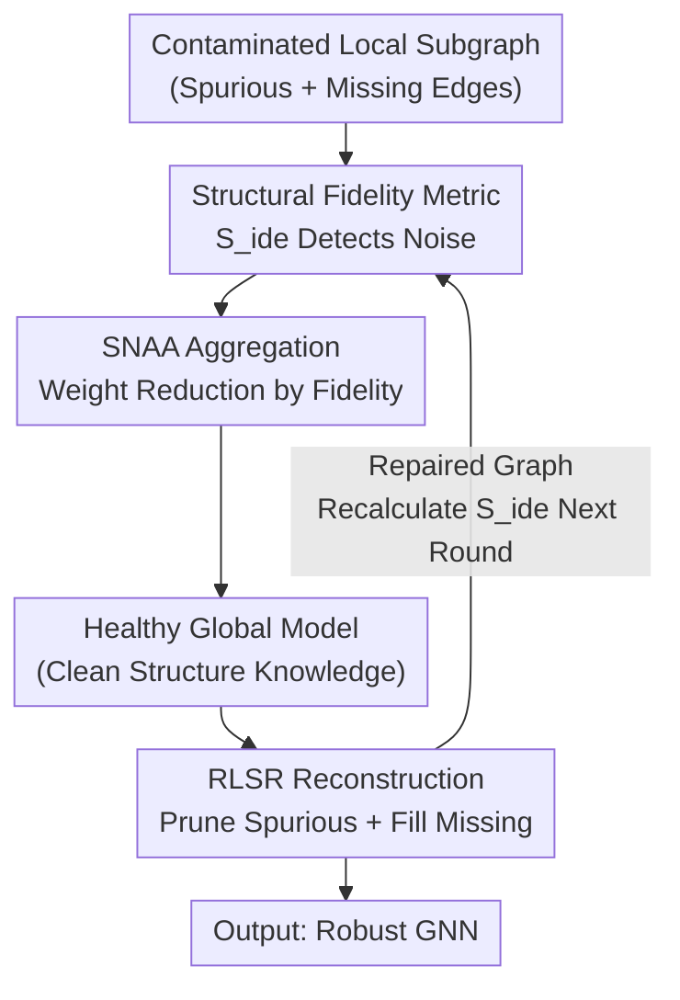

# FedSDR: Federated Graph Learning with Structural Noise Detection and Reconstruction

**Conference**: CVPR 2026  
**Paper**: [CVF Open Access](https://openaccess.thecvf.com/content/CVPR2026/html/Liu_FedSDR_Federated_Graph_Learning_with_Structural_Noise_Detection_and_Reconstruction_CVPR_2026_paper.html)  
**Code**: https://github.com/Subtleazure/FedSDR  
**Area**: Federated Graph Learning / Graph Neural Networks  
**Keywords**: Federated Graph Learning, Structural Noise, Spectral Graph Theory, Robust Aggregation, Graph Structure Reconstruction

## TL;DR
Addressing the neglected issue of "client graph structure contaminated by random edge addition/deletion" in subgraph federated learning, FedSDR employs a spectral-domain structural fidelity metric $S_{\text{ide}}$ to identify and downweight contaminated clients during aggregation (SNAA). It then leverages feature similarity from the healthy global model to perform "spurious edge pruning + missing edge completion" (RLSR) on local damaged graphs, outperforming 17 federated baselines across 7 datasets.

## Background & Motivation

**Background**: Federated Graph Learning (FGL) combines federated learning with Graph Neural Networks (GNNs), allowing multiple clients to collaboratively train GNNs without exchanging raw graph data. It has become a dominant paradigm in privacy-sensitive scenarios such as healthcare, finance, and social networks. The core of GNNs is message-passing, where node representations heavily depend on the graph topology.

**Limitations of Prior Work**: In reality, graph data often introduces **structural noise** during collection and storage—large-scale, random additions of spurious edges and loss of real edges. For instance, bot accounts in social networks create numerous fake following relationships. This noise damages FGL at two levels: (1) **Global**: Message passing in contaminated clients is distorted, and uploaded model updates carry "harmful knowledge," polluting the global model and causing knowledge conflicts between clients; (2) **Local**: When the global model is deployed back to contaminated clients, missing edges cut off information paths from critical neighbors, while spurious edges introduce misleading neighbors, leading to biased node representations, unreliable inference, and significant performance drops.

**Key Challenge**: Existing robust FGL methods target either **adversarial attacks** (overestimating the malicious intent of threats) or **natural topological heterogeneity** (mistaking random noise for benign non-IID distributions). Random structural noise "disguises itself as benign heterogeneity," slipping through the detection blind spots of both categories—it lacks the explicit patterns of malicious attacks and is more destructive than mere distribution differences. Experiments (Fig. 2a) show that even standard methods like FedAvg fail under a single contaminated client.

**Key Insight**: Starting from **spectral graph theory**, the authors hypothesize that structural noise leaves detectable anomalies in the spectral domain. The intuition: real-world graphs exhibit "disassortative mixing" (hub nodes connecting to leaf nodes) with high degree variance; random edge additions/deletions push the topology toward Erdős–Rényi random graphs, where degree distributions become uniform and degree variance decreases. Thus, a scalar metric sensitive to "degree variance" can be constructed to distinguish contaminated clients (verified in Fig. 2b, where contaminated clients show significantly lower metrics).

**Core Idea**: First, use the spectral fidelity metric to "identify and downweight" contaminated clients during aggregation (treating the global level). Then, use feature consistency from the healthy global model to "prune spurious edges and fill missing edges" for local structure repair (treating the local level). These two components reinforce each other to form FedSDR, a dual-pronged approach of detection + reconstruction.

## Method

### Overall Architecture

FedSDR follows a standard federated cycle of "local client training + weighted server aggregation" but injects mechanisms to resist structural noise. **SNAA (Structural Noise-Aware Aggregation) runs on the server side**: each client calculates its local structural fidelity $S_{\text{ide}}^k$ and uploads it; the server redistributes aggregation weights to suppress contributions from suspicious clients, resulting in a healthy global model reflecting clean structures. **RLSR (Robust Local Structure Reconstruction) runs on the client side**: clients use the healthy global model to compute node embeddings and construct a feature similarity matrix. Following the principle that "real edges should have high similarity, while noise edges deviate," it prunes low-similarity spurious edges and fills high-similarity missing edges to reconstruct a graph aligned with the global consensus. The repaired graph, in turn, improves the accuracy of $S_{\text{ide}}$ in the next round—creating a positive feedback loop.

### Key Designs

**1. Structural Fidelity Metric $S_{\text{ide}}$: Compressing "Graph Contamination" into a Comparable Scalar**

To determine if a client is contaminated without exposing raw graphs, the authors use the Laplacian matrix $\mathbf{L}=\mathbf{D}-\mathbf{A}$ to construct a spectral metric. For client $k$:

$$S_{\text{ide}}^k = \frac{\langle \mathbf{D}^{k^T}\mathbf{L}^k\mathbf{D}^k, \mathbf{1}\rangle_F}{\langle \mathbf{D}^{k^T}\mathbf{D}^k, \mathbf{1}\rangle_F}$$

where $\langle\cdot,\cdot\rangle_F$ is the Frobenius inner product and $\mathbf{1}$ is the all-ones matrix. The numerator simplifies to the Laplacian quadratic form $\mathbf{d}^T\mathbf{L}\mathbf{d}=\sum_{(u,v)\in\mathcal{E}}(d_u-d_v)^2$ ($d_u$ is the degree of node $u$), making $S_{\text{ide}}$ proportional to the sum of squared degree differences between connected nodes. Real-world disassortative mixing makes $(d_{\text{hub}}-d_{\text{leaf}})^2$ large and $S_{\text{ide}}$ high; random noise uniformizes degree distribution, collapsing $S_{\text{ide}}$. This transforms structure evaluation into a locally computable, privacy-safe, and horizontally comparable scalar signal.

**2. SNAA (Structural Noise-Aware Aggregation): Redistributing Weights to Trust Clean Clients**

Standard FedAvg aggregates by data volume, allowing contaminated clients to inject harmful knowledge. SNAA dynamically downweights based on fidelity. It first calculates the bias relative to the global weighted average: $\delta_k = S_{\text{ide}}^k - \frac{\sum_i N_i S_{\text{ide}}^i}{\sum_j N_j}$, where lower $\delta_k$ indicates heavier noise. After min-max normalization $\gamma(\delta_k, \boldsymbol{\delta})$, it uses a negative exponential for aggregation weights:

$$w_k = \frac{\exp(-\gamma(\delta_k,\boldsymbol{\delta}))}{\sum_{i=1}^K \exp(-\gamma(\delta_i,\boldsymbol{\delta}))}$$

This smoothly assigns higher weights to clean clients. Local training includes label smoothing ($\frac{\epsilon}{2}\|\mathbf{Z}\|_2^2$) and proximal regularization $\lambda\|\theta_k^t-\theta^t\|_2^2$ to mitigate catastrophic forgetting, with Gaussian noise injected for $(\epsilon, \delta)$-differential privacy.

**3. RLSR (Robust Local Structure Reconstruction): Pruning and Filling via Healthy Feature Similarity**

Downweighting alone discards useful knowledge from contaminated clients, and local performance remains poor. RLSR leverages the insight that real edges connect nodes with high feature similarity under a healthy global model. Using embeddings $\mathbf{H}^k$ from $f_\theta$, a cosine similarity matrix $\mathbf{C}^k$ is constructed.

**Pruning**: A threshold $\tau_p^k$ is set as the $\alpha$-quantile of similarities of existing edges; edges below this are pruned. **Reconnection**: The same number of edges $\alpha|\mathcal{E}^k|$ are added between non-adjacent node pairs with the highest similarity. The resulting adjacency matrix is:

$$\tilde{\mathbf{A}}^k_{uv}=\begin{cases}0 & \mathbf{A}^k_{uv}=1\ \&\ \mathbf{C}^k_{uv}<\tau_p^k\\ 1 & \mathbf{A}^k_{uv}=0\ \&\ u\neq v\ \&\ \mathbf{C}^k_{uv}\geq\tau_r^k\\ \mathbf{A}^k_{uv} & \text{otherwise}\end{cases}$$

This "equal-volume swap" removes noise while preserving graph density and valid local patterns, aligning local structures with global consensus.

### Loss & Training
The local loss is $\mathcal{L}(\theta_k^t)=\frac{1}{|\mathcal{M}_{\text{train}}|}\sum_{v}\ell(\mathbf{Z}_v^k,y_v^k)+\frac{\epsilon}{2}\|\mathbf{Z}\|_2^{2}+\lambda\|\theta_k^t-\theta^t\|_2^2$. Updates include Gaussian mechanism noise $\mathcal{N}(0,(\frac{B\sigma}{|\mathcal{M}_{\text{train}}|})^2\mathbf{I})$ for differential privacy. Default settings: contamination ratio (proportion of dirty clients) at 1.0, noise intensity (ratio of random edges) at 0.5, and pruning ratio $\alpha=0.3$.

## Key Experimental Results

### Main Results
Average test accuracy (%) across 7 datasets compared to 17 baselines:

| Dataset | FedAvg | MOON | FedGTA | FedIIH | **FedSDR** |
|:---|:---:|:---:|:---:|:---:|:---:|
| PubMed | 78.41 | 68.55 | 78.04 | 78.34 | **82.57** |
| Coauthor-CS | 82.01 | 75.91 | 81.24 | 79.34 | **82.29** |
| Coauthor-Phy | 86.37 | 88.14 | 85.77 | 87.03 | **89.37** |
| Actor | 31.28 | 31.14 | 31.03 | 30.73 | **32.36** |
| Roman-empire | 41.72 | 42.51 | 40.65 | 39.84 | **48.33** |
| ogbn-mag | 42.74 | 42.96 | 42.52 | 42.16 | **47.41** |
| ogbn-products | 72.66 | 67.94 | 71.52 | 71.70 | **78.57** |

The gains are most significant on heterophilic datasets (Roman-empire +6.6 vs FedAvg). Basic algorithms like FedAvg often outperformed complex ones (e.g., Scaffold), indicating that severe structural noise breaks most existing FGL designs.

### Ablation Study
Tested on PubMed, Actor, and ogbn-products:

| SNAA | RLSR | PubMed | Actor | ogbn-products |
|:---:|:---:|:---:|:---:|:---:|
| ✗ | ✗ | 78.41 | 31.28 | 72.66 |
| ✓ | ✗ | 81.82 | 31.56 | 74.25 |
| ✗ | ✓ | 82.26 | 32.07 | 75.92 |
| ✓ | ✓ | **82.57** | **32.36** | **78.57** |

### Key Findings
- **Synergy between components**: In ogbn-products, the combined gain (78.57) is much higher than the sum of individual gains (74.25 and 75.92), confirming the positive feedback between repair and detection.
- **Fidelity metric separability**: Fig. 2b confirms $S_{\text{ide}}$ clearly distinguishes contaminated clients.
- **Robustness**: FedSDR remains stable as noise intensity increases, while FedAvg performance decays rapidly.
- **Pruning ratio $\alpha$**: Performance is stable across 0.2 to 1.0, and increasing $\alpha$ consistently improves results, showing the model's ability to differentiate noise from meaningful edges.

## Highlights & Insights
- **Spectral Scalar Translation**: Translating "graph contamination" into $S_{\text{ide}}\propto\sum(d_u-d_v)^2$ is elegant. It uses only local degree info, protecting privacy while providing a universal signal. The intuition that random noise collapses degree variance is a transferable insight.
- **Detection-Reconstruction Loop**: SNAA provides a healthy global model -> RLSR repairs graphs -> Repaired graphs improve detection. This closed-loop system is more effective than simple stacking.
- **Conservation of Density**: The decision to keep pruning and reconnection volumes equal avoids the "too sparse to communicate" trap common in pruning-only methods.
- **Problem Framing**: Explicitly distinguishing "random structural noise" from "attacks" or "heterogeneity" fills a critical gap in robust FGL research.

## Limitations & Future Work
- **Global Model Dependency**: RLSR depends on global model quality. If contamination is so high that SNAA cannot recover a clean global consensus, reconstruction might amplify errors. ⚠️
- **Idealized Noise Model**: Experiments use purely random edge swaps. Real-world noise might have structural preferences (e.g., bots targeting specific hubs), which might not trigger the same spectral collapse.
- **Global Hyperparameter $\alpha$**: Using a fixed $\alpha$ for all clients may be suboptimal; an adaptive per-client $\alpha$ derived from $S_{\text{ide}}$ would be more precise.
- **Low-order Metric**: $S_{\text{ide}}$ only captures degree-level anomalies. Higher-order spectral features could be introduced to detect noise that preserves degree distributions.

## Related Work & Insights
- **vs FedSage+ / FED-PUB**: These assume original topologies are intact and focus on cross-subgraph link completion. They lack the diagnostic and repair capabilities for contaminated local graphs.
- **vs FedATH / AdaFGL**: These target topological heterogeneity but mistake random noise for benign non-IID patterns, making them ineffective under heavy noise.
- **vs FedTGE / RHFL**: These focus on malicious byzantine/backdoor attacks. They fail to detect the "non-malicious but massive and random" nature of structural noise. FedSDR fills this gap by focusing on spectral fidelity rather than attack patterns.

## Rating
- Novelty: ⭐⭐⭐⭐⭐ 
- Experimental Thoroughness: ⭐⭐⭐⭐ 
- Writing Quality: ⭐⭐⭐⭐ 
- Value: ⭐⭐⭐⭐ 

<!-- RELATED:START -->

## Related Papers

- [\[CVPR 2026\] FedSST: Rethinking Fair Federated Graph Learning under Structural Shift](fedsst_rethinking_fair_federated_graph_learning_under_structural_shift.md)
- [\[CVPR 2026\] Revisiting Learning with Noisy Labels: Active Forgetting and Noise Suppression](revisiting_learning_with_noisy_labels_active_forgetting_and_noise_suppression.md)
- [\[CVPR 2026\] Few-for-Many Personalized Federated Learning](few-for-many_personalized_federated_learning.md)
- [\[CVPR 2026\] Single-Round Scalable Analytic Federated Learning](single-round_scalable_analytic_federated_learning.md)
- [\[CVPR 2026\] Domain Sensitive Federated Learning with Fisher-Informed Pruning](domain_sensitive_federated_learning_with_fisher-informed_pruning.md)

<!-- RELATED:END -->
