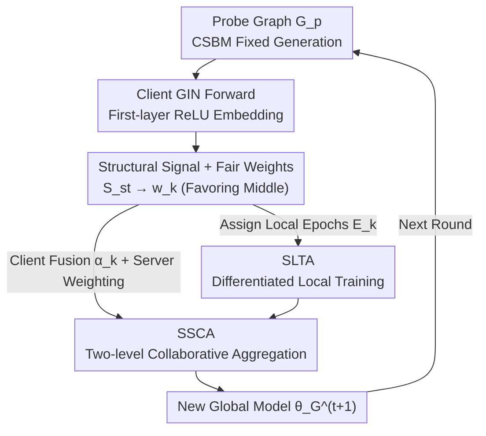

# FedSST: Rethinking Fair Federated Graph Learning under Structural Shift

**Conference**: CVPR 2026  
**Paper**: [CVF Open Access](https://openaccess.thecvf.com/content/CVPR2026/html/Zhao_FedSST_Rethinking_Fair_Federated_Graph_Learning_under_Structural_Shift_CVPR_2026_paper.html)  
**Code**: Not disclosed  
**Area**: Federated Optimization / Federated Graph Learning  
**Keywords**: Federated Graph Learning, Generalization Fairness, Structural Heterogeneity, Adaptive Aggregation, Probe Graph  

## TL;DR
FedSST utilizes a shared "probe graph" to detect the structural preferences of GNNs across different clients, compresses this into a scalar signal mapped to fair weights that favor "intermediate clients," and uses these weights to drive both differentiated local training assignment (SLTA) and two-level adaptive aggregation (SSCA). This approach simultaneously improves average accuracy and reduces inter-client accuracy variance in cross-domain graph classification.

## Background & Motivation
**Background**: Federated Graph Learning (FGL) enables multiple clients possessing graph data to collaboratively train GNNs without sharing raw graphs. However, in real-world cross-domain scenarios, there are significant differences in graph topology—molecular graphs, social networks, biological graphs, and scene graphs exhibit vastly different connectivity patterns. This **topological heterogeneity** is far more challenging than the feature/label non-IID issues typically encountered in general federated learning.

**Limitations of Prior Work**: Topological heterogeneity causes the global model to be dominated by a small group of "dominant clients," thereby damaging **generalization fairness** (i.e., the balance of test accuracy across clients). The authors decompose this into two specific issues: (1) **Global aggregation bias**, where standard FedAvg weighted by data volume or model alignment amplifies clients with simple structures or gradients consistent with the global trend, while suppressing structurally rare but valuable minority clients; (2) **Blind local optimization**, where all clients use a uniform local training intensity, causing clients already aligned with the global model to overfit local biases while structurally unique clients remain under-trained and struggle to converge.

**Key Challenge**: Most existing FGL methods (FedStar, FedSSP, FedIGL, etc.) improve **overall performance** through spectral or invariant features, but lack a **standardized, privacy-preserving structural metric** to measure the "functional contribution" of each client. Consequently, they cannot explicitly rebalance structural contributions during aggregation nor adjust local training according to demand. Fairness methods like q-FedAvg or AFL rely solely on loss signals and are structure-agnostic, which might inadvertently penalize clients with high local accuracy but valuable structural knowledge.

**Core Idea**: Construct a **unified structural signal** $S_{st}$ to quantify the degree to which each client deviates from the global structural distribution. This is non-linearly mapped to fair weights $w_k$ that favor "middle-ground clients." The same $w_k$ is then used to direct both local training assignment and global aggregation—a single signal driving two adaptive mechanisms to solve aggregation bias and blind optimization in a unified manner.

## Method

### Overall Architecture
FedSST is a structural-aware adaptive fairness optimization framework. Each communication round $t$ consists of three steps: ① The server distributes a fixed probe graph; each client $k$ performs a forward pass using its current GIN model and returns a scalar structural metric $S_{st}(k)$ derived from the output embeddings. The server maps all $S_{st}$ values to fair weights $w_k$ (favoring structurally intermediate clients). ② $w_k$ drives **SLTA**, calculating the number of local training epochs $E_k$ for each client (more training for higher potential contributors, less for extremes). ③ After clients complete $E_k$ local epochs, $w_k$ drives **SSCA** for two-level fusion: first, local and global models are weighted by $\alpha_k$ at the client side before uploading; then, the server performs a weighted average of the uploaded models using $w_k$. The structural communication overhead is only a single 32-bit scalar, with $O(1)$ complexity.

### Key Designs

**1. Structural Signal and Fair Weights: Compressing "client structural deviation" into a scalar using a probe graph and non-linearly favoring intermediate clients.**

Quantifying topological heterogeneity is challenging due to privacy constraints that prevent direct comparison of client graphs. FedSST uses a **Community/Contextual Stochastic Block Model (CSBM)** to generate a fixed probe graph $G_p$ ( $n=20$ nodes, average degree $d=3$, homophily $0.75$, feature dimension $p=128$) shared by all clients. Node features are synthesized from community signals and Gaussian noise: $x_i = \sqrt{\mu/n}\, y_i\, u + Z_i/\sqrt{p}$. Since GNN parameters implicitly encode learned structural preferences, models from different clients yield different embedding patterns when processing this unified probe. Each client $k$ uses its current GIN for a forward pass on $G_p$, extracts the embedding $H_k$ after the first layer’s ReLU, performs $\ell_2$ normalization, calculates a cosine similarity matrix $S_k = H_{k,\text{norm}}H_{k,\text{norm}}^\top$, constructs a degree vector $d_k = S_k \mathbf{1}$ and Laplacian $L_k = \mathrm{diag}(d_k) - S_k$, and finally obtains a **graph smoothness metric**:

$$S_{st}(k) = \frac{d_k^\top L_k d_k}{d_k^\top d_k + \varepsilon}.$$

Compared to FedStar or FedSSP which require transmitting high-dimensional encoder parameters, this approach only returns a 32-bit scalar, making structural communication costs nearly zero with $O(1)$ complexity. After receiving all $S_{st}(k)$, the server normalizes them into relative distances $d_k = (S_{st}(k)-S_{\min})/(S_{\max}-S_{\min}+\delta) \in [0,1]$, and uses a three-term composite scoring function:

$$\text{score}_k = \text{base} + \lambda_{\text{far}}\big(1 - e^{-k_{\text{far}}d_k}\big) + \lambda_{\text{mid}}\exp\!\Big(-\tfrac{(d_k-\mu_{\text{mid}})^2}{2\sigma_{\text{mid}}^2}\Big).$$

The terms serve distinct purposes: the **baseline term** (base) ensures minimal participation for all clients; the **remote compensation term** acknowledgment of structurally rare clients' potential value; and the **Gaussian term** centered at $\mu_{\text{mid}}=0.5$ provides the largest weight amplification to structurally intermediate clients. This reflects the core insight: intermediate clients provide the best balance between "information gain" and "training stability," neither overfitting like globally-aligned clients nor deviating the model like extreme structural clients. Finally, the weights are thresholded and normalized such that $\sum_j w_j = 1$.

**2. SLTA (Signal-driven Local Training Assignment): Allowing high-potential clients to train more and extreme ones to train less to achieve convergence fairness through compute allocation.**

To address the "blind optimization" caused by uniform local training intensity, SLTA no longer requires all clients to run the same number of epochs. Instead, it uses the fair weight $w_k$ as a signal to assign local training epochs based on contribution potential:

$$E_k = \max\Big(E_{\min},\ \min\big(\mathrm{round}(E_{\text{base}}(1+\lambda_{\text{reg}}w_k)),\ E_{\max}\big)\Big).$$

Clients with higher $w_k$ (structurally intermediate, contributing more to global convergence) receive more local epochs to fully optimize beneficial local models. Clients with low $w_k$ (structurally extreme) receive only baseline epochs to prevent over-optimization from deviating the global model. $E_{\min}/E_{\max}$ prevents under/over-training, and $\lambda_{\text{reg}}$ controls weight influence. The cost is a slight increase in local computation for intermediate clients in exchange for a significant reduction in total communication rounds (achieving convergence within 100 rounds compared to 200 for most baselines).

**3. SSCA (Structural Signal Collaborative Aggregation): Client-side fusion based on trust + Server-side weighted averaging to prevent aggregation bias.**

While SLTA determines "how much to train," SSCA addresses "how to aggregate after training" using the same $w_k$ across two levels. **First level (Client-side Adaptive Local Fusion)**: After running $E_k$ epochs to obtain $\theta_k^{\text{local}}$, the client calculates a specific fusion coefficient $\alpha_k = \alpha_{\min} + (\alpha_{\max}-\alpha_{\min})\cdot w_k$ and fuses the local model with the received global model before uploading:

$$\theta_k^{\text{integration}} = \alpha_k\,\theta_G + (1-\alpha_k)\,\theta_k^{\text{local}}.$$

$\alpha_k$ reflects "trust in the global model": clients with high $w_k$ use larger $\alpha_k$ to absorb more global knowledge for convergence; clients with low $w_k$ (structurally distant) use smaller $\alpha_k$ to retain more local personalized knowledge, preventing unique structural insights from being overwritten by the global model. **Second level (Server-side)**: The server collects all $\theta_k^{\text{integration}}$ and performs a weighted average using normalized $\tilde{w}_k = w_k/\sum_j w_j$:

$$\theta_G^{(t+1)} = \sum_k \tilde{w}_k\,\theta_k^{\text{integration}}.$$

This way, the same non-linear mapping amplifies intermediate clients and suppresses extreme ones during aggregation, correcting the bias where "dominant clients" govern the global model, while achieving "fair and stable" fusion through client-side personalized preservation.

## Key Experimental Results

### Main Results
Cross-domain graph classification was conducted across four domain datasets (Small Molecules SM / Bioinfo BIO / Social Networks SN / Visual CV), with each client holding an independent dataset under five heterogeneity settings. Two core metrics: **AVG↑** (average test accuracy across all clients) and **STD↓** (standard deviation of client accuracy, measuring generalization fairness). 2-layer GIN, 200 communication rounds, average of the last 5 rounds over 5 seeds.

| Setting | Metric | FedSST | Next Best Baseline | Comparison |
|------|------|--------|---------------|------|
| SM (Single Domain) | AVG↑ / STD↓ | **82.29** / **10.37** | 79.43(FedIGL) / 10.95(APPLE) | AVG +2.86, Lowest STD |
| SM-BIO | AVG↑ / STD↓ | **76.17** / 13.86 | 72.83(FedSSP) / 13.18(GCFL) | AVG +3.34 |
| SM-CV | AVG↑ / STD↓ | 82.17 / **10.81** | 83.70(FedSSP) / 11.12(AFL) | Lowest STD, 2nd Best AVG |
| BIO-SM-SN | AVG↑ / STD↓ | **73.86** / 14.53 | 72.58(FedSSP) / 13.91(Local) | Highest AVG |
| SM-SN-CV | AVG↑ / STD↓ | **79.48** / 13.29 | 79.07(FedSSP) / 13.53(AFL) | Highest AVG |

FedSST achieves the highest AVG and lowest STD in most settings. Notably, classic FedAvg underperforms relative to purely local training (Local) in strong topological heterogeneity scenarios, highlighting the weakness of traditional FL in handling structural non-IID. While loss-based methods like q-FedAvg/AFL outperform FedAvg, they lack structural awareness; the authors argue that structural signals are a more effective foundation for fairness than loss reweighting.

### Ablation Study
Ablation of SSCA and SLTA using SM, SM-CV, and SM-SN-CV settings:

| SSCA | SLTA | SM (AVG/STD) | SM-CV (AVG/STD) | SM-SN-CV (AVG/STD) |
|------|------|--------------|------------------|---------------------|
| ✗ | ✗ | 75.04 / 13.64 | 75.81 / 14.00 | 74.15 / 14.60 |
| ✓ | ✗ | 78.75 / 12.56 | 79.84 / 11.72 | 77.36 / 13.80 |
| ✗ | ✓ | 80.07 / 12.22 | 78.90 / 12.46 | 74.98 / 14.16 |
| ✓ | ✓ | **82.29 / 10.37** | **83.17 / 10.81** | **79.48 / 13.29** |

Applying SLTA or SSCA individually improves both accuracy and fairness, with the combination yielding the best results. (Note: The AVG for the full model in SM-CV is reported as 82.17 in the main table and 83.17 in the ablation table; refer to the original paper for consistency).

### Key Findings
- **Convergence Efficiency**: SLTA allows FedSST to converge to peak accuracy/minimum variance in approximately 100 rounds, compared to 200 for most baselines. This represents a trade-off where moderate local computation increases are offset by significant communication round reductions.
- **Hyperparameter Sensitivity**: $\alpha_{\max}$ for SSCA remains stable at an optimal 0.9 across all settings. Conversely, $\lambda_{\text{reg}}$ for SLTA is sensitive to heterogeneity: optimal values for SM/SM-CV/SM-SN-CV were 20/25/30, respectively, showing stronger intensity adjustments are needed for higher heterogeneity.
- **Structural Signals vs. Loss Signals**: Structural reweighting generally outperformed loss reweighting (q-FedAvg/AFL) in terms of STD, suggesting that structural signals are a more reliable "anchor" for fairness in topological heterogeneity scenarios.

## Highlights & Insights
- **Probe graphs convert incomparable structures into comparable scalars**: Instead of directly comparing private graphs, unified synthetic "probes" are used to observe embedding smoothness. This bypasses privacy constraints with a communication cost of just one 32-bit scalar—a concept applicable to any scenario requiring client comparison without data sharing.
- **Non-linear weights favoring the "middle"**: Moving beyond simple "rarity-based" or "alignment-based" weighting, the use of a Gaussian term centered on intermediate structural segments recognizes that these clients provide the best balance between information gain and convergence stability.
- **A single signal driving orthogonal mechanisms**: $w_k$ simultaneously governs training intensity (SLTA) and fusion strategy (SSCA), ensuring the training and aggregation phases are aligned under a consistent metric.

## Limitations & Future Work
- **Reliance on Probe Graph Synthesis**: CSBM probe parameters (e.g., 0.75 homophily) are manually set. Whether single-layer GIN embedding smoothness reliably distinguishes structural contributions in graphs with extremely low homophily or high heterophily requires further verification.
- **Limited Task Scope**: Validation focused on inter-graph classification. The method’s performance on intra-graph tasks (subgraph completion) or node classification remains unproven.
- **Manual $\lambda_{\text{reg}}$ Tuning**: Since the optimal $\lambda_{\text{reg}}$ varies with heterogeneity, an adaptive determination mechanism is currently missing.
- **Structural Signal Granularity**: Compressing structural preferences into a single scalar might discard fine-grained multi-modal structural information; higher-dimensional structural signatures could offer improvements.

## Related Work & Insights
- **vs. FedStar / FedSSP**: These rely on transmitting high-dimensional structural encoder parameters to improve performance. FedSST transmits a scalar signal and explicitly targets "fairness" by rebalancing contributions at both training and aggregation stages with $O(1)$ structural communication costs.
- **vs. q-FedAvg / AFL**: While both pursue generalization fairness via loss-based reweighting (min-max or protecting the worst-performing client), they are structure-agnostic and may penalize structurally valuable clients. FedSST's structural signal is shown to be more effective in reducing STD.
- **vs. FedProx / SCAFFOLD**: Traditional FL uses proximal terms or control variables to correct client drift for a single global model, failing in strong topological heterogeneity. FedSST allows for personalized preservation through client-side adaptive fusion $\alpha_k$, balancing global commonality and local specificity.

## Rating
- Novelty: ⭐⭐⭐⭐ The combination of scalar structural signals from probe graphs, middle-favoring weights, and a dual-mechanism approach is novel and addresses a core FGL fairness issue.
- Experimental Thoroughness: ⭐⭐⭐⭐ Extensive cross-domain settings, 12 baselines, and ablation/convergence/hyperparameter studies; however, limited to graph classification.
- Writing Quality: ⭐⭐⭐⭐ Clear logical progression from motivation to mechanism to formula; strong mapping between the framework and mechanisms.
- Value: ⭐⭐⭐⭐ Providing a low-cost, deployable structural signal for fairness offers practical reference value for cross-domain FGL.

<!-- RELATED:START -->

## Related Papers

- [\[CVPR 2026\] FedSDR: Federated Graph Learning with Structural Noise Detection and Reconstruction](fedsdr_federated_graph_learning_with_structural_noise_detection_and_reconstructi.md)
- [\[CVPR 2026\] Fed-ADE: Adaptive Learning Rate for Federated Post-adaptation under Distribution Shift](fed-ade_adaptive_learning_rate_for_federated_post-adaptation_under_distribution_.md)
- [\[CVPR 2025\] Federated Learning with Domain Shift Eraser](../../CVPR2025/optimization/federated_learning_with_domain_shift_eraser.md)
- [\[ICLR 2026\] Rethinking Consistent Multi-Label Classification Under Inexact Supervision](../../ICLR2026/optimization/rethinking_consistent_multi-label_classification_under_inexact_supervision.md)
- [\[CVPR 2026\] Few-for-Many Personalized Federated Learning](few-for-many_personalized_federated_learning.md)

<!-- RELATED:END -->
