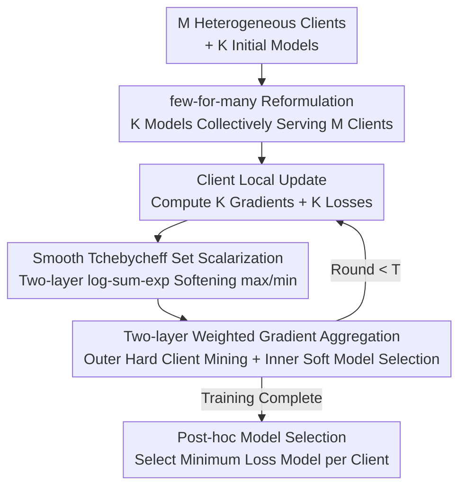

# Few-for-Many Personalized Federated Learning

**Conference**: CVPR 2026  
**Paper**: [CVF Open Access](https://openaccess.thecvf.com/content/CVPR2026/html/Guo_Few-for-Many_Personalized_Federated_Learning_CVPR_2026_paper.html)  
**Code**: https://github.com/pgg3/FedFew  
**Area**: Personalized Federated Learning / Multi-Objective Optimization  
**Keywords**: Personalized Federated Learning, Multi-Objective Optimization, Pareto Optimality, Tchebycheff Set Scalarization, Model Diversity  

## TL;DR
The study reformulates Personalized Federated Learning (PFL) as a "few-for-many" ($K \ll M$) multi-objective optimization problem, where $K$ shared models serve $M$ clients. By employing differentiable Smooth Tchebycheff Set Scalarization (STCH-Set) for joint training, the method stably outperforms existing approaches across vision, NLP, and medical imaging datasets using as few as 3 models.

## Background & Motivation

**Background**: PFL aims to train models tailored to the local data distributions of clients under privacy constraints. Prevailing approaches are categorized into single-global-model methods (FedAvg/FedProx), one-model-per-client methods (FedRep/Ditto/APFL), and multi-model clustering methods maintained by the server (IFCA/CFL/FedSoft).

**Limitations of Prior Work**: When client distributions $P_i \neq P_j$, updates beneficial to one client often harm another, representing $M$ conflicting objectives. Ideally, "optimal personalization" requires $M$ distinct models on the Pareto frontier. However, maintaining $M$ independent models in a federation of hundreds or thousands of clients incurs unsustainable communication and computation overhead. Multi-objective methods (FedMGDA, FedMTL) only yield a **single** compromise solution on the frontier, failing to achieve per-client optimality. Heuristic clustering or interpolation methods, while providing multiple models, lack Pareto optimality guarantees and rely on manual grouping or sensitive hyperparameter tuning.

**Key Challenge**: A fundamental trade-off exists between personalization quality (requiring more models to approximate the Pareto frontier) and scalability/communication cost (where model count scales linearly with $M$). Approximating the entire Pareto frontier to $\varepsilon$-accuracy requires $O((1/\varepsilon)^{M-1})$ models—an impossible $10^{18}$ models for $M=10$ and $\varepsilon=0.01$.

**Goal**: To provide near-optimal personalization with theoretical guarantees while decoupling the number of models from the total number of clients $M$.

**Key Insight**: The authors observe that achieving optimal personalization does **not** require approximating the entire continuous Pareto frontier, but only $M$ discrete points on it (one per client). These $M$ points can be "covered" by far fewer than $M$ shared models because many client optima are close to each other. Thus, the problem is reduced to "maintaining $K$ models and allowing each client to select the most suitable one."

**Core Idea**: PFL is reformulated as a **few-for-many (K-for-M)** set optimization—maintaining $K \ll M$ server models to collectively serve all clients. Smooth scalarization transforms "discrete model selection" into a differentiable objective, enabling gradient descent to automatically discover optimal model diversity.

## Method

### Overall Architecture
FedFew takes $M$ heterogeneous clients and $K$ initial models (experimentally $K=3$) as input, outputting a set of $K$ trained models $\Theta=\{\theta_1,\dots,\theta_K\}$ and the optimal model index $k_i^*$ for each client. The process consists of two stages: The **training phase** iteratively performs "local computation of $K$ gradients + $K$ losses $\to$ server aggregation using STCH-Set weights $\to$ model updates" over $T$ communication rounds. **Post-training**, each client evaluates all $K$ models locally and selects the one with the minimum loss as its personalized model.

Crucially, the "model selection" per client is a discrete choice incompatible with standard gradient optimization. FedFew uses two-layer log-sum-exp smoothing to soften both the inner $\min_k$ (client model selection) and the outer $\max_i$ (cross-client Tchebycheff worst-case term) into differentiable forms. The entire K-for-M objective becomes a scalar function optimizable via SGD, where model selection is "softened" into a loss-based weighting, allowing model diversity to emerge naturally without hard assignments during training.

### Key Designs

**1. few-for-many (K-for-M) Reformulation: Dimensionality Reduction of Model Space**

To address the conflict between ideal personalization (requiring $M$ models) and scalability, the authors rewrite the original $M$-objective problem $\min_\theta [L_1(\theta),\dots,L_M(\theta)]$ as a set optimization: maintain $\Theta=\{\theta_1,\dots,\theta_K\}$, where each client $i$ is served by the model minimizing its local loss. The objective becomes:

$$\min_\Theta\ F(\Theta) = \Big[\min_{k}L_1(\theta_k),\ \dots,\ \min_{k}L_M(\theta_k)\Big]^T.$$

The model count $K$ serves as a tunable knob: $K=1$ degrades to FedAvg, $K=M$ recovers per-client models, and $1 < K < M$ is the operating range. A convergence theorem is provided, where the average error is decomposed into two vanishing terms:

$$\frac{1}{M}\sum_{i=1}^{M}\Big(\mathbb{E}[\min_{k}L_i(\theta_k)] - L_i(\theta_i^*)\Big) \le \underbrace{\frac{M-K}{M}\Delta_{\text{het}}}_{\text{Pareto Coverage Gap}} + \underbrace{O\!\Big(\sqrt{Kd/n}\Big)}_{\text{Statistical Error}},$$

where $\Delta_{\text{het}}$ denotes maximum pairwise heterogeneity, $d$ is model complexity, and $n$ is the average sample size. The first term shrinks as $K$ increases, while the second vanishes as $n \to \infty$. This distinguishes the approach from heuristic clustering, providing theoretical guarantees for the learned model set.

**2. Smooth Tchebycheff Set Scalarization (STCH-Set): Differentiable Selection**

To solve the nested $\min/\max$ objective, Tchebycheff Set Scalarization (TCH-Set) first aggregates multiple objectives into a scalar: $g_{\text{TCH-Set}}(\Theta|\lambda)=\max_i \lambda_i(\min_k L_i(\theta_k)-z_i^*)$. This ensures Pareto optimality and handles heterogeneous objectives without explicit weighted aggregation. However, both $\max_i$ and $\min_k$ are non-differentiable.

Two-layer log-sum-exp smoothing is applied: $\max_i x_i \approx \mu\log\sum_i e^{x_i/\mu}$ and $\min_i x_i \approx -\mu\log\sum_i e^{-x_i/\mu}$. Setting $\lambda_i=1, z_i^*=0$ yields the differentiable objective:

$$g_{\text{STCH-Set}}(\Theta) = \mu\log\sum_{i=1}^{M}\Big(\sum_{k=1}^{K}\exp\!\big(-L_i(\theta_k)/\mu\big)\Big)^{-1},$$

where $\mu>0$ controls smoothness. As $\mu \to 0$, it unbiasedly approximates the min-max objective with an error of $O(\mu\log M+\mu\log K)$, though optimization becomes harder due to sharper gradients.

**3. Two-layer Weighted Gradients: Mining Hard Clients and Soft Model Selection**

Calculating the gradient of $g_{\text{STCH-Set}}$ with respect to $\theta_k$ reveals the mechanism behind FedFew:

$$\nabla_{\theta_k}g_{\text{STCH-Set}} = \sum_{i=1}^{M}\alpha_i\cdot w_{ik}\cdot\nabla_{\theta_k}L_i(\theta_k).$$

Let $S_i=\sum_{k}\exp(-L_i(\theta_k)/\mu)$. The **outer weight** $\alpha_i = S_i^{-1}/\sum_j S_j^{-1}$ acts as **hard client mining**, assigning higher weights to clients performing poorly across all models. The **inner weight** $w_{ik}=\exp(-L_i(\theta_k)/\mu)/S_i$ performs **soft model selection**, directing weights toward the model with the lowest loss for each client. This allowing $K$ models to specialize into sub-clusters automatically.

**4. Federated Training and Post-hoc Model Selection**

In each communication round, the server broadcasts $\Theta$. Clients perform $E$ local updates for all $K$ models, returning $K$ gradients $g_{ik}$ and $K$ scalar losses $L_i(\theta_k)$. The server computes $\{\alpha_i, w_{ik}\}$ to aggregate $\nabla_{\theta_k}g_{\text{STCH-Set}}=\sum_i\alpha_i w_{ik}g_{ik}$. Per-client communication cost is $O(Kd)$, which is independent of $M$. After training, a **post-hoc model selection** is conducted: each client picks $k_i^*=\arg\min_k L_i(\theta_k^{(T)})$ as its final personalized model.

## Key Experimental Results

### Main Results
Evaluated on seven datasets (CIFAR-10/100, TinyImageNet, AG News, FEMNIST, and medical datasets Kvasir/FedISIC) with $K=3$. FedFew consistently ranks first or second (Accuracy %):

| Dataset (Setting) | Ours (FedFew) | Prev. SOTA | Gain |
|--------|------|------|------|
| CIFAR-100 Pathological $M=20$ | **64.98** | FedRep 61.46 | +3.52 |
| CIFAR-100 Practical $M=20$ | **53.69** | 46.67 | +7.02 |
| TinyImageNet $M=10$ | **30.31** | FedRep 27.24 | +3.07 |
| AG News $M=20$ | **96.07** | FedRep 94.68 | +1.39 |
| CIFAR-10 Practical $M=20$ | **88.26** | APFL 87.36 | +0.90 |

On real-world medical imaging, FedFew leads in both average and worst-case accuracy:

| Dataset | Method | Avg±Std | Min | Max |
|--------|------|---------|-----|-----|
| Kvasir | FedFew | **92.84±6.08** | **83.90** | 99.77 |
| Kvasir | IFCA | 82.05±21.88 | 40.24 | 100.00 |
| FedISIC | FedFew | **69.57±14.59** | **55.40** | 95.35 |
| FedISIC | IFCA | 53.61±20.45 | 23.23 | 85.74 |

Notably, multi-objective approaches like FedFew and FedMTL show significantly higher **worst-case client accuracy**, highlighting the value of "safeguarding" tail clients.

### Ablation Study
On CIFAR-10 (Dirichlet $\alpha=0.5, M=20$), investigating $K$ and communication-computation trade-offs:

| Configuration | Key Metrics | Description |
|------|---------|------|
| $K=1 \sim 10$ | Accuracy 89.4 \sim 91.3% | Consistently exceeds FedAvg (61.2%); $K=1$ is highest at 91.3% |
| Increasing $K$ | Slower convergence | Larger parameter space hinders convergence within fixed rounds |
| Local Epochs $E=1 \sim 16$ | Accuracy 87.8 \sim 88.3% | Performance is stable with more local work |
| $E=16$ | Faster convergence | Local computation effectively reduces communication rounds |

### Key Findings
- **Non-monotonicity of $K$**: On more homogeneous data (CIFAR-10), $K=1$ performed best. This suggests $K$ should be chosen based on heterogeneity and training budgets, as too many models expand the parameter space unnecessarily.
- **Multi-objective Gains**: The primary advantage of FedFew lies in improving the accuracy of the worst-performing clients through hard client mining ($\alpha_i$).
- **Communication Compression**: Increasing local epochs ($E=16$) maintains accuracy while significantly reducing communication rounds, making it ideal for bandwidth-constrained environments.

## Highlights & Insights
- **Explicit parameterization of the "Personalization vs. Scalability" trade-off** as a knob $K$, backed by a convergence bound with a Pareto coverage gap.
- **Two-layer log-sum-exp smoothing** is a versatile trick that converts discrete combinatorial optimization into a differentiable form, naturally deriving dual weights for hard client mining and soft model selection.
- **Soft training and hard inference** is a pragmatic design: soft weights maintain gradient continuity and collaboration during training, while hard selection ensures personalization quality during deployment.

## Limitations & Future Work
- **Automatic $K$ Selection**: No mechanism is provided to automatically determine the optimal $K$, which remains a preset hyperparameter.
- **Computational Cost**: Clients must perform $E$ local epochs for all $K$ models, which might be burdensome for weak edge devices.
- **Hyperparameter $\mu$**: The trade-off between approximation tightness and optimization difficulty controlled by $\mu$ needs more practical guidance.
- **Post-hoc Selection Stability**: Model selection depends on local validation/training sets; performance may be unstable when local data is extremely scarce.

## Related Work & Insights
- **vs. IFCA / CFL (Hard Clustering)**: These use hard assignments, creating non-convex, discontinuous optimization landscapes without convergence guarantees. FedFew ensures convergence to Pareto-stable points via smoothing.
- **vs. FedMGDA / FedMTL (Single-solution MOO)**: These provide only one compromise solution. FedFew maintains $K$ solutions to cover the client distribution more effectively.
- **vs. FedRep / Ditto / APFL (One-model-per-client)**: These suffer from $O(M)$ scalability issues and overfit on small local data. FedFew achieves a better trade-off between collaboration and personalization.

## Rating
- Novelty: ⭐⭐⭐⭐⭐ Original reformulation of PFL to few-for-many set optimization.
- Experimental Thoroughness: ⭐⭐⭐⭐ Broad datasets, yet lacks verification on extremely large $M$.
- Writing Quality: ⭐⭐⭐⭐⭐ Clear chain of logic from motivation to theory and implementation.
- Value: ⭐⭐⭐⭐⭐ Strong performance with $K=3$ systems makes it highly practical for heterogeneous FL.

<!-- RELATED:START -->

## Related Papers

- [\[CVPR 2026\] Generalized and Personalized Federated Learning with Black-Box Foundation Models via Orthogonal Transformations](generalized_and_personalized_federated_learning_with_black-box_foundation_models.md)
- [\[ICLR 2026\] Personalized Collaborative Learning with Affinity-Based Variance Reduction](../../ICLR2026/optimization/personalized_collaborative_learning_with_affinity-based_variance_reduction.md)
- [\[NeurIPS 2025\] Personalized Subgraph Federated Learning with Differentiable Auxiliary Projections](../../NeurIPS2025/optimization/personalized_subgraph_federated_learning_with_differentiable_auxiliary_projectio.md)
- [\[AAAI 2026\] Personalized Federated Learning with Bidirectional Communication Compression via One-Bit Random Sketching](../../AAAI2026/optimization/personalized_federated_learning_with_bidirectional_communication_compression_via.md)
- [\[ICML 2025\] Understanding the Statistical Accuracy-Communication Trade-off in Personalized Federated Learning with Minimax Guarantees](../../ICML2025/optimization/understanding_the_statistical_accuracy-communication_trade-off_in_personalized_f.md)

<!-- RELATED:END -->
