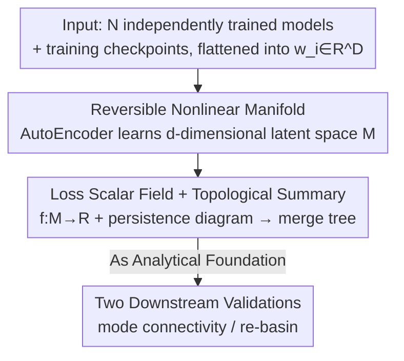

# Globscope: Toward a Global View of the Loss Landscape

**Conference**: CVPR 2026  
**Paper**: [CVF Open Access](https://openaccess.thecvf.com/content/CVPR2026/html/Mustaq_Globscope_Toward_a_Global_View_of_the_Loss_Landscape_CVPR_2026_paper.html)  
**Code**: None (Not provided in the paper)  
**Area**: Optimization / Loss Landscape Analysis / Visualization  
**Keywords**: Loss landscape, global visualization, autoencoder, merge tree, mode connectivity  

## TL;DR
This work utilizes a **reversible autoencoder** to compress a set of independently trained networks (each flattened into a parameter vector) into a 2D latent space. A topological analysis (merge tree) is then performed on this latent space by treating "loss" as a scalar field. This provides the first global loss landscape visualization capable of accommodating **multiple minima/basins and their connectivity**, successfully reproducing theoretical phenomena such as mode connectivity and permutation symmetry (re-basin).

## Background & Motivation
**Background**: The loss landscape is a high-dimensional surface defined by the loss function $L(\theta)$ over the parameter space $\theta$. Its geometry encodes critical information regarding generalization, optimization difficulty, and model similarity. However, the million-dimensional parameter space cannot be viewed directly, necessitating dimensionality reduction for visualization. Classical approaches (Goodfellow's linear interpolation, filter-wise normalization, Hessian principal curvature directions) are almost exclusively **local analyses**, characterizing only the surface shape near a **single** trained solution.

**Limitations of Prior Work**: Local methods are inherently incapable of visualizing the "relationships between multiple solutions." To perform **global analysis** (identifying which basins independently trained models fall into and how these basins connect), existing tools are either metric-based (CKA similarity, mode connectivity scalars, LossLens graph views), which provide numerical values rather than continuous geometric images, or based on cluster embeddings (t-SNE / Isomap), which group models into clusters but **fail to render the geometric organization and connectivity of basins**.

**Key Challenge**: A valid global landscape visualization must simultaneously satisfy two conflicting conditions: (i) representing multiple minima and their basins in the **same coordinate system**; and (ii) **inverse mapping**, allowing points in the reduced space to be mapped back to the original parameter space to evaluate the actual loss. Linear methods (PCA) offer straightforward inverse mapping but cannot represent nonlinear structures induced by multiple solutions; nonlinear methods (Kernel-PCA, UMAP) have sufficient expressivity but often lack reliable inverse transformations, resulting in global maps with no meaningful geometric information. Thus, "nonlinear expressivity" and "invertibility for loss calculation" have not been simultaneously achieved.

**Goal**: To create the first **continuous, reversible, and geometry-aware** global loss landscape visualization tool that can accommodate multiple minima while decoding latent space points back into weights to evaluate real loss.

**Key Insight**: The authors observe that an AutoEncoder (AE) naturally possesses an "encoder + reversible decoder" structure. The encoder provides a low-dimensional embedding for expressivity, while the decoder provides the inverse mapping for loss calculation. An additional layer of Topological Data Analysis (merge tree) is used to condense the continuous landscape into a readable hierarchical structure.

**Core Idea**: Use a **reversible AE to learn a low-dimensional parameter manifold** instead of linear projections or non-reversible nonlinear projections. Perform topological summarization on the manifold using a **merge tree**, enabling a "global loss landscape" that is both visible and calculable for the first time.

## Method

### Overall Architecture
The input consists of a **batch** of independently trained neural networks (including checkpoints sampled at intervals along a training trajectory and different variants retrained with modified hyperparameters like batch size, learning rate, and weight decay). Each model's trainable parameters are flattened into a one-dimensional vector $w_i \in \mathbb{R}^D$. The pipeline transforms these high-dimensional vectors into a readable global landscape map in three steps: first, an AutoEncoder compresses $\{w_i\}$ into a $d$-dimensional latent space ($d \ll D$, with $d=2$ in main experiments) to obtain a manifold $M$; second, each latent point on $M$ is decoded back to weights to calculate its loss, forming a scalar field $f: M \to \mathbb{R}$; third, a persistence diagram is calculated to denoise and simplify the scalar field, followed by the construction of a merge tree to condense the landscape into a hierarchy of "minima-saddles-basins." The resulting manifold and tree serve as an **analytical foundation** for projecting mode connectivity curves and visualizing where re-basined models fall.

### Key Designs

**1. Reversible Nonlinear Manifold: Achieving Expressivity and Inverse Mapping via AutoEncoder**

This step addresses the conflict between nonlinear expressivity and invertibility. The authors feed the model set $\{w_i\}_{i=1}^N$ into an autoencoder $A=(E,D)$, where the encoder $E:\mathbb{R}^D\to\mathbb{R}^d$ maps high-dimensional parameters to a $d$-dimensional latent representation, and the decoder $D:\mathbb{R}^d\to\mathbb{R}^D$ reconstructs it back to the original space. The encoder consists of three hidden layers that narrow progressively (widths 128, 64, 16), followed by a latent layer with $d<16$. The training objective is the mean squared reconstruction loss:

$$\mathcal{L}_{rec} = \frac{1}{N}\sum_{i=1}^{N}\bigl\|\,w_i - D(E(w_i))\,\bigr\|_2^2 = \mathrm{MSE}(W,\hat{W}).$$

AE is chosen over PCA because PCA is linear and cannot accommodate the nonlinear structures induced by multiple independent solutions. While Kernel-PCA and UMAP are nonlinear, their inverse transforms are approximate and unstable, leading to high reconstruction errors and latent spaces without readable basin geometry (see Table 1). The AE's decoder $D$ provides a **learned inverse mapping with minimal error**, allowing any point in the latent space to be decoded back to weights for loss evaluation—a prerequisite for a landscape that is both "visible and calculable." Furthermore, unlike prior work that fixed the AE latent space at 2D, this work allows $d$ to be flexible (e.g., 2, 3, or 4), enabling the analysis of high-dimensional nonlinear structures.

**2. Loss Scalar Field + Merge Tree Topological Summary: Condensing the Landscape into a Readable Tree**

A continuous manifold alone is not sufficiently intuitive; it is difficult to visually count basins or identify connections through saddle points. The authors define a scalar function $f:M\to\mathbb{R}$ on the manifold $M$ by assigning the "loss value of the decoded model" to each latent point. A **merge tree (specifically a join tree)** is used to describe the topology of this scalar field. It tracks how connected components of the **sublevel sets** $M_a=\{x\in M\mid f(x)\le a\}$ appear and merge as the threshold $a$ increases. New components emerge at local minima and merge at saddle points, forming a tree $T_J$. The **root node** corresponds to the global maximum, **leaf nodes** represent independent basins/local minima, and **internal nodes** are saddle points connecting adjacent basins. To avoid noise, a **persistence diagram** is used to select significant topological features for simplification (implemented using ParaView's Topology Toolkit, TTK). This step translates a "continuous color landscape map" into a hierarchical structure, making basin counts and connectivity clear.

**3. Application as Analytical Foundation: Verifying Geometric Faithfulness via Mode Connectivity and Re-basin**

A tool is only as good as its fidelity to the original loss geometry, which is tested using two theoretically characterized phenomena. First, **mode connectivity**: Garipov et al. showed that two optimal solutions are often connected by a path of nearly constant low loss. The authors calculate these paths between seven ResNet56 variants and project intermediate points onto the 2D landscape to see if they follow low-loss corridors. Second, **permutation symmetry / re-basin**: Independently trained models can be linearly connected after accounting for interlayer permutation invariance. Using DEEP-ALIGN to calculate alignment matrices, one model is re-basined into another's basin. These are projected onto the landscape to verify if the re-basined network falls into the same basin as its partner. These applications use the landscape as a "microscope" to **reproduce and visualize** known theories, both validating the tool's geometric faithfulness and providing qualitative visual evidence for these phenomena.

### Loss & Training
The sole training objective is the reconstruction loss $\mathcal{L}_{rec}$ (MSE of parameter vectors) without extra regularization. The merge tree construction is a post-processing step on the learned manifold (persistence + simplification + TTK extraction).

## Key Experimental Results

### Main Results
Evaluation is performed on seven ResNet56 variants (A–G, generated by varying batch size, learning rate, and weight decay) trained on CIFAR-10, including checkpoints every 10 epochs. The first metric is **reconstruction error** (measuring inverse mapping reliability), where AE outperforms Kernel-PCA and UMAP by several orders of magnitude:

| Method | Reconstruction Loss (ResNet56, ~8.57M params, CIFAR-10) |
|----------|------|
| Kernel-PCA | 0.004270 |
| UMAP | 0.501484 |
| **AutoEncoder (Ours)** | **0.000007** |

Qualitatively (Figure 3), UMAP and Kernel-PCA produce continuous spaces but fail to show basin geometry. The AE manifold clearly separates basins of different variants, consistent with clustering methods (MDS, Isomap), with variant D isolated in a corner. The merge tree on the AE manifold yields exactly **seven leaf nodes**, corresponding to the seven variants, capturing all major minima and saddles.

### Downstream Validation
**Mode Connectivity Projection** (Table 2): Comparing the real loss of points on the path generated by the mode connectivity algorithm with the loss of their projections on the 2D landscape shows highly consistent ranges with a Median Absolute Error (MAE) $<0.01$:

| Model Pair | MC Curve Loss Range | Landscape Projection Loss Range | MAE |
|--------|------|------|------|
| G–A | 2.308–2.335 | 2.304–2.331 | 0.007 |
| G–B | 2.305–2.352 | 2.317–2.353 | 0.016 |
| G–C | 2.304–2.322 | 2.310–2.326 | 0.011 |
| G–D | 2.308–2.322 | 2.305–2.335 | 0.011 |
| G–E | 2.306–2.322 | 2.305–2.323 | 0.006 |
| G–F | 2.305–2.358 | 2.307–2.358 | 0.014 |

In contrast, Kernel-PCA fails to separate basins, and UMAP breaks internal geometry, causing curves to oscillate wildly. Only AE provides smooth, interpretable trajectories fitting known connectivity.

**Re-basin Visualization**: Using DEEP-ALIGN on 32 pairs of independently trained MNIST-MLP models (64 checkpoints) to build a joint landscape. Upon applying the alignment permutation, re-basined networks **consistently fall into the same basin as their partner model**, matching theoretical predictions. While UMAP can cluster re-basined models, its recorded loss ranges are extreme due to unstable inverse transforms; Kernel-PCA fails to produce a meaningful landscape. Projecting the entire training trajectory after applying the same permutation shows a smooth evolution toward the aligned model, indicating stable alignment throughout training—a behavior more clearly rendered by the AE manifold.

### Key Findings
- **Invertibility is the Watershed**: AE reconstruction loss (7e-6) is 3–5 orders of magnitude lower than Kernel-PCA/UMAP. This determines whether latent points can yield trustworthy loss values, explaining the distortion in UMAP where loss ranges often reach tens of thousands.
- **Merge Tree Leaves = Number of Variants (7)**: The topological summary's critical point structure is self-consistent with the model set, indicating that the manifold neither merges distinct basins nor creates artifacts.
- **Reproduction of Known Theories**: MAE $<0.01$ for mode connectivity and re-basined models falling into shared basins provide dual evidence that the learned manifold is faithful to the original loss geometry.

## Highlights & Insights
- **Using the AE Decoder as an "Inverse Mapping" is the Masterstroke**: Visualization has long been hindered by the trade-off between nonlinearity and invertibility. Treating the AE reconstruction capability as the inverse transform for loss evaluation bypasses the instability of approximate inverses in Kernel-PCA/UMAP—a transferable idea for any scenario requiring calculation of objectives in high-dimensional space after reduction.
- **Loss as a Scalar Field + Merge Tree**: This transforms the qualitative task of "guessing basins from scatter plots" into the quantitative task of "counting basins from a tree," enabling analysis of global structures beyond 2D.
- The most significant observation is that this tool provides the first continuous geometric visualization for theories like mode connectivity and re-basin, which previously relied solely on scalar metrics.

## Limitations & Future Work
- **Latent Dimension Limited by Sampling**: The authors acknowledge that as $d$ increases, sampling requirements grow exponentially. Main results are limited to $d=2$, with 3D results relegated to the appendix. True high-dimensional global structures remain difficult to analyze.
- **Lack of Objective Proof for Globally Optimal Paths**: The paper admits there is no effective way to verify if the paths in the grid are truly the lowest-loss paths; the overlap with mode connectivity is only visual/range-based evidence, and rigorous proof of optimality is missing.
- **Requirement to Retrain AE**: The manifold is learned specifically for a given set of models. Changing models or architectures (only ResNet56/MNIST-MLP were tested) requires retraining the AE. Scalability to large models is unknown.
- Improvement ideas include introducing regularization to explicitly preserve loss distances or using more controllable Normalizing Flows instead of AE for more stable high-dimensional inverse mappings.

## Related Work & Insights
- **vs. Local Visualization (Goodfellow, etc.)**: These characterize curvature in the neighborhood of a single solution. This work provides a global view across multiple solutions, revealing basin connectivity—a transition from "local slices" to a "global map."
- **vs. Metric Methods (CKA / LossLens)**: Metric methods yield numbers or graph structures but no continuous geometry and cannot synthesize new points in parameter space. This work provides a continuous reversible manifold that reveals geometric details unreachable by metrics.
- **vs. Nonlinear Dimensionality Reduction (UMAP / t-SNE)**: These methods either have unreliable inverse transforms or lack them entirely. This work uses AE's low-error decoder to achieve both expressivity and invertibility.
- **vs. Elhamod & Karpatne's AE Landscape**: This work adopts the AE reduction idea but removes the "2D latent space" restriction and adds merge tree topological summaries, upgrading simple embeddings into a tool for global topological analysis.

## Rating
- Novelty: ⭐⭐⭐⭐ First projectable global landscape with reversible loss evaluation; the clean use of the AE decoder is highly effective.
- Experimental Thoroughness: ⭐⭐⭐ Strong evidence from reconstruction error and theoretical reproduction, but model coverage is limited to small-scale ResNet56/MNIST-MLP.
- Writing Quality: ⭐⭐⭐⭐ Clear motivational logic (local vs. global, expressivity vs. reversibility); natural integration of merge trees.
- Value: ⭐⭐⭐⭐ Provides a geometric foundation for decision-making in model merging, federated learning, and hyperparameter selection.

<!-- RELATED:START -->

## Related Papers

- [\[ICLR 2026\] Rolling Ball Optimizer: Learning by Ironing Out Loss Landscape Wrinkles](../../ICLR2026/optimization/rolling_ball_optimizer_learning_by_ironing_out_loss_landscape_wrinkles.md)
- [\[ICML 2026\] Sharp Description of Local Minima in the Loss Landscape of High-Dimensional Two-Layer ReLU Networks](../../ICML2026/optimization/sharp_description_of_local_minima_in_the_loss_landscape_of_high-dimensional_two-.md)
- [\[ICML 2026\] Taming the Loss Landscape of PINNs with Noisy Feynman-Kac Supervision: Operator Preconditioning and Non-Asymptotic Error Bounds](../../ICML2026/optimization/taming_the_loss_landscape_of_pinns_with_noisy_feynman-kac_supervision_operator_p.md)
- [\[NeurIPS 2025\] Gradient Descent as Loss Landscape Navigation: a Normative Framework for Deriving Learning Rules](../../NeurIPS2025/optimization/gradient_descent_as_loss_landscape_navigation_a_normative_framework_for_deriving.md)
- [\[ICML 2025\] A Unified View on Learning Unnormalized Distributions via Noise-Contrastive Estimation](../../ICML2025/optimization/a_unified_view_on_learning_unnormalized_distributions_via_noise-contrastive_esti.md)

<!-- RELATED:END -->
