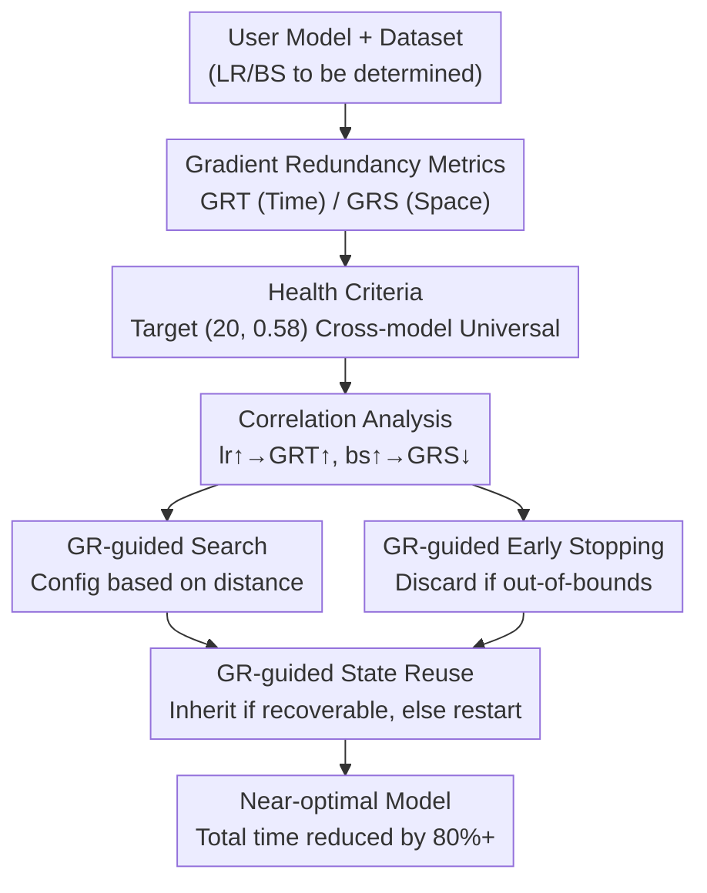

# GR-Gauge: Cost-efficient Training Configuration By Gauging the Gradient Redundancy

**Conference**: CVPR 2026  
**Paper**: [CVF Open Access](https://openaccess.thecvf.com/content/CVPR2026/html/Wang_GR-Gauge_Cost-efficient_Training_Configuration_By_Gauging_the_Gradient_Redundancy_CVPR_2026_paper.html)  
**Code**: None  
**Area**: Optimization / Hyperparameter Optimization / Efficient Training  
**Keywords**: Hyperparameter Optimization, Gradient Redundancy, Learning Rate, Batch Size, Training-as-a-Service  

## TL;DR
Training is modeled as a "gradient voting process in both time and sample dimensions." The authors propose gradient redundancy metrics $GR_T$ and $GR_S$ as a universal "health gauge" across models. This gauge guides hyperparameter search, early stopping, and state reuse for learning rate and batch size, reducing the total time to reach target accuracy by up to 80%+ without requiring expensive validation sets.

## Background & Motivation
**Background**: An increasing number of non-expert users (individuals, startups) utilize "Training-as-a-Service" (TaaS) on the cloud to train models by providing only weights, datasets, and validation metrics. For service providers, the key is to automatically configure the two most critical hyperparameters: **learning rate (LR) and batch size (BS)**. Suboptimal configurations drastically increase the time needed to reach target accuracy. Furthermore, the "Critical Learning Period" phenomenon suggests that errors in early-stage hyperparameters can cause **permanent performance degradation** that cannot be recovered later.

**Limitations of Prior Work**: Mainstream Hyperparameter Optimization (HPO) methods—such as Grid/Random Search, Bayesian Optimization (BO) for searching, and Successive Halving / Hyperband / BOHB for scheduling—rely almost exclusively on **external validation metrics** (e.g., accuracy, F1). The authors identify three disadvantages: ① Validation is expensive and slow on large datasets; ② Validation curves may be poorly shaped in early training (good hyperparameters might perform poorly initially), leading to "false-positive" early stopping; ③ Validation metrics only indicate that a configuration is poor without providing the **direction for the next search iteration**.

**Key Challenge**: HPO seeks to be "universal across all hyperparameters" by using agnostic external signals, but this universality comes at the cost of efficiency. When the target hyperparameters are narrowed down to LR and BS, it is possible to **sacrifice this generality for efficiency** by utilizing internal, easily accessible gradient signals.

**Key Insight**: Training is reconsidered as a **two-dimensional gradient voting process**. In the time dimension, global gradients from different iterations vote for the "parameter update direction"; in the spatial dimension, local gradients of different samples within a mini-batch vote for the "update direction of the current iteration." For efficient voting, gradients must neither be "redundant" (highly consistent voters wasting computation) nor "antagonistic" (gradients fighting, leading to oscillations). Both states indicate "unhealthy" and inefficient training.

**Core Idea**: This "health" is quantified using **gradient redundancy**, defining metrics $GR_T$ (time) and $GR_S$ (space). The authors observe that "health zones" are highly stable across different models ($GR_T \approx 20, GR_S \in [0.5, 0.65]$). Thus, this gauge can serve as a **cross-model universal target** to guide HPO regarding which LR/BS to search, when to stop early, and whether to reuse previous states.

## Method

### Overall Architecture
The core logic of GR-Gauge consists of two stages: **Gauging** (defining and validating the two metrics) and **Applying** (using the gauge to guide three HPO actions).

In the first stage, the motivation analysis establishes two things: (1) Definition of $GR_T$ (Temporal) and $GR_S$ (Spatial) metrics; (2) Empirical validation across five representative models (ResNet18, NeuMF, BERT, Stable-Diffusion, Llama-3.2-3B), confirming that $(GR_T, GR_S)$ measured during the early "Critical Learning Period" (e.g., iteration 50) predicts final efficiency and shares a nearly universal health target $(GR_T^*, GR_S^*) = (20, 0.58)$.

In the second stage, this gauge is integrated into HPO. A correlation analysis reveals that while $GR_T/GR_S$ cannot be tuned directly, they have a **monotonic relationship** with LR and BS: increasing LR increases $GR_T$, and increasing BS decreases $GR_S$. By measuring the gap from the target, the direction and magnitude of LR/BS adjustments can be derived. Based on this, GR-Gauge performs three actions: **GR-guided early stopping**, **GR-guided search**, and **GR-guided state reuse** (inheriting weights between configurations when possible).

### Key Designs

**1. Gradient Redundancy $GR_T$ / $GR_S$: Quantifying Health into Measurable Scalars**

These metrics replace expensive validation with readily available gradient statistics to characterize training health.

Temporal Redundancy $GR_T$ measures the consistency of global gradients across iterations, drawing from Adam/AdaGrad moment concepts:

$$GR_T(t) = d \cdot \frac{\hat{v}_t}{\hat{m}_t^2}$$

where $d$ is the gradient dimension, and $\hat{m}_t, \hat{v}_t$ are the bias-corrected first and second moments. Intuitively, $\hat m_t^2$ represents the energy of the "average gradient," while $\hat v_t$ represents the average of the "squared gradients." Their ratio captures how divergent gradient directions are across iterations.

Spatial Redundancy $GR_S$ measures the consistency of local gradients across samples within a batch:

$$GR_S(t) = \frac{\left\| \sum_{i=1}^{B} g_{ti}^2 \right\|_1}{\left\| \sum_{i=1}^{B} g_{ti} \right\|_2^2}$$

where $B$ is the global batch size. The numerator is the sum of squared gradients (total energy), and the denominator is the squared norm of the sum (directional consistency). Greater consistency results in a smaller ratio. Crucially, as these are calculated on **raw gradients** before optimizer-specific transformations (like momentum), they serve as a **shared target for different optimizers**.

**2. Cross-model Universal Health Criteria: The (20, 0.58) Target**

The authors visualized different (LR, BS) pairs using a metric called **AUPC** (Area-Under-Performance-Curve). Results show that every model possesses a (GRT, GRS) **health zone** yielding high AUPC, confirming that excessive or insufficient redundancy is inefficient. More importantly, these zones are **highly similar across models**—$GR_T$ targets center around 20, and $GR_S$ targets average 0.58. 

**3. GR-guided Three-action HPO**

Leveraging the **monotonic correlation** (Theorem 1/2 in the paper: $\frac{\partial}{\partial \eta}\mathbb{E}[GR_T] > 0$ and $\frac{\partial}{\partial B}\mathbb{E}[GR_S] < 0$):

- **Scheduling**: Check $GR_T/GR_S$ every $k$ (default 5) iterations. Trial failure is declared if the metrics stay outside the health zone after an initial warmup.
- **Searching**: Adjust configurations based on the distance to $(20, 0.58)$. If $GR_T$ is low, increase LR; if $GR_S$ is high, decrease BS. Adjustments follow a power-law scaling (e.g., $LR \times (GR_T^*/GR_T)^{1/\xi_T}$).
- **State-reuse**: Instead of restarting trials from scratch, GR-Gauge attempts to **inherit the previous training state**. If the GR metrics return to the health zone within a grace period, the trial continues, saving significant computational resources.

To ensure low overhead, $GR_S$ is calculated at a **per-device** granularity, and metrics are estimated using a **sampled subset of $L = 5\times10^7$ parameters**.

### Loss & Training
Ours does not modify the training objective and acts as a wrapper for AdamW. Health checks are concentrated within the **Critical Learning Period** (identified via gradient norm threshold 0.01, approx. the first 10% of iterations). New hyperparameters like $k, T, \xi_T, \xi_S$ are verified to be model-insensitive and use universal default values.

## Key Experimental Results

### Main Results
GPU-Time required to reach validation targets (normalized to GR-Gauge = 1×):

| Model | Target | RS | SH | HB | BOHB | CFO | GR-Gauge |
|------|------|------|------|------|------|------|----------|
| ResNet18 | 85% | 9.13× | 8.56× | 7.81× | 7.53× | 3.54× | **977s** |
| BERT | 85% | 18.5× | 9.27× | 7.86× | 7.95× | 3.32× | **11000s** |
| Diffusion | 92% | N/A | 3.55× | 3.61× | 2.50× | 2.08× | **2350s** |
| Llama3 | 59% | N/A | 2.62× | 1.83× | 1.30× | 2.56× | **75300s** |

GR-Gauge saves up to 63.6% time compared to the second-best performer (BOHB) on ResNet18. Under fixed GPU-Time budgets, GR-Gauge achieves significantly higher validation performance (e.g., 87.47% F1 on BERT vs <75% for others).

### Ablation Study
Relative time increase to reach target when components are removed:

| Configuration | ResNet18 | BERT | Llama3 | Description |
|------|------|------|------|------|
| no-R | 1.17× | 3.39× | 2.32× | Without state-reuse |
| no-RS | 1.46× | 4.45× | 4.71× | Without reuse and search guidance |
| no-RT | 1.96× | 7.95× | 2.47× | Without all guidance (slowest) |
| GR-Gauge | 1.00× | 1.00× | 1.00× | Full implementation |

### Key Findings
- **All three components are vital**: Removing any guidance (early stopping, search, or reuse) degrades efficiency. Early stopping and search guidance are particularly impactful.
- **State-reuse has negligible accuracy costs**: The performance difference between state-reuse and training from scratch is minimal (e.g., 90.75% vs 89.51% on ResNet).
- **Insensitivity to framework hyperparameters**: Default values for $k$ and $\xi$ work well across all tested models.
- **Low overhead**: The metric calculation cost is typically <4% of total training time.

## Highlights & Insights
- **"2D Gradient Voting" Perspective**: Separating temporal and spatial consistency allows for a precise diagnosis of training health (oscillations vs. redundancy).
- **Universal Health Target**: Finding that $(20, 0.58)$ works across ResNet, BERT, and LLMs transforms hyperparameter tuning from "trial and error" to "aiming for a fixed target."
- **Optimizer Independence**: By calculating GR on raw gradients, the method remains effective regardless of whether AdamW, SGD, or others are used.
- **Exploration of State Reuse**: Reusing weights between configurations is a clever, under-explored strategy for significantly reducing HPO search costs.

## Limitations & Future Work
- **Config Scope**: Limited to LR and BS; architectural hyperparameters (layers, width) may not follow these gradient signals.
- **Target Generality**: While $(20, 0.58)$ is verified on 5 models, its universality in Reinforcement Learning or ultra-large-scale distributed training requires further study.
- **Minor Accuracy Trade-off**: State reuse might incur a slight precision loss in extremely sensitive scenarios.
- **Diminishing Returns on Small Budgets**: Efficiency gains are less pronounced for extremely short training tasks (e.g., <200s).

## Related Work & Insights
- **Comparison to BOHB/HB**: Unlike standard HPO which treats the model as a black box using external metrics, GR-Gauge uses internal gradient signals to provide search direction.
- **Comparison to CFO**: While CFO scales hyperparameters online, its success depends on initial config; GR-Gauge ensures the config starts and stays in the health zone during the critical early stage.

## Rating
- Novelty: ⭐⭐⭐⭐⭐ 
- Experimental Thoroughness: ⭐⭐⭐⭐ 
- Writing Quality: ⭐⭐⭐⭐ 
- Value: ⭐⭐⭐⭐⭐ 

<!-- RELATED:START -->

## Related Papers

- [\[NeurIPS 2025\] Cost-Sensitive Freeze-thaw Bayesian Optimization for Efficient Hyperparameter Tuning](../../NeurIPS2025/optimization/cost-sensitive_freeze-thaw_bayesian_optimization_for_efficient_hyperparameter_tu.md)
- [\[ICML 2026\] Cost-Aware Stopping for Bayesian Optimization](../../ICML2026/optimization/cost-aware_stopping_for_bayesian_optimization.md)
- [\[ICLR 2026\] NeuCLIP: Efficient Large-Scale CLIP Training with Neural Normalizer Optimization](../../ICLR2026/optimization/neuclip_efficient_large-scale_clip_training_with_neural_normalizer_optimization.md)
- [\[ICLR 2026\] CurES: From Gradient Analysis to Efficient Curriculum Learning for Reasoning LLMs](../../ICLR2026/optimization/cures_from_gradient_analysis_to_efficient_curriculum_learning_for_reasoning_llms.md)
- [\[AAAI 2026\] Cost-Minimized Label-Flipping Poisoning Attack to LLM Alignment](../../AAAI2026/optimization/cost-minimized_label-flipping_poisoning_attack_to_llm_alignment.md)

<!-- RELATED:END -->
## Related Papers

- [\[CVPR 2026\] InTrain: Intrinsic Trainability for Zero-Cost Neural Architecture Search](intrain_intrinsic_trainability_for_zero-cost_neural_architecture_search.md)
- [\[NeurIPS 2025\] Cost-Sensitive Freeze-thaw Bayesian Optimization for Efficient Hyperparameter Tuning](../../NeurIPS2025/optimization/cost-sensitive_freeze-thaw_bayesian_optimization_for_efficient_hyperparameter_tu.md)
- [\[ICML 2026\] Cost-Aware Stopping for Bayesian Optimization](../../ICML2026/optimization/cost-aware_stopping_for_bayesian_optimization.md)
- [\[CVPR 2026\] Dynamic Momentum Recalibration in Online Gradient Learning](dynamic_momentum_recalibration_in_online_gradient_learning.md)
- [\[AAAI 2026\] Beyond the Mean: Fisher-Orthogonal Projection for Natural Gradient Descent in Large Batch Training](../../AAAI2026/optimization/beyond_the_mean_fisher-orthogonal_projection_for_natural_gradient_descent_in_lar.md)

<!-- RELATED:END -->
