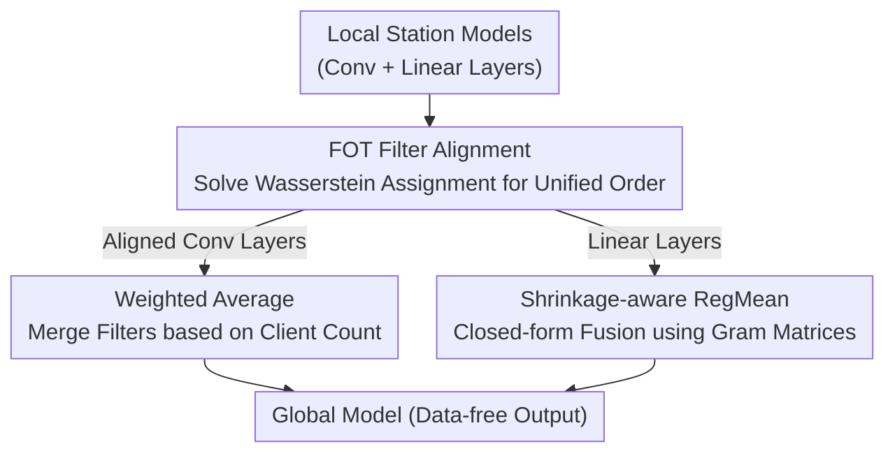

# HFedATM: Hierarchical Federated Domain Generalization via Optimal Transport and Regularized Mean Aggregation

**Conference**: CVPR 2026  
**Paper**: [CVF Open Access](https://openaccess.thecvf.com/content/CVPR2026/html/Nguyen_HFedATM_Hierarchical_Federated_Domain_Generalization_via_Optimal_Transport_and_Regularized_CVPR_2026_paper.html)  
**Code**: Not provided  
**Area**: Optimization / Federated Learning  
**Keywords**: Federated Learning, Domain Generalization, Optimal Transport, Hierarchical Aggregation, RegMean

## TL;DR
This paper formally defines "Hierarchical Federated Domain Generalization (HFedDG)" for the first time and derives a generalization error bound decomposed into three levels: client, station, and server. It proposes HFedATM—a data-free, plug-and-play method that modifies only the server aggregation step. It utilizes Filter-wise Optimal Transport (FOT) to align convolutional filters across stations and Shrinkage-aware RegMean for closed-form fusion of linear layers. HFedATM consistently improves baselines such as FedAvg, FedProx, FedSR, and FedIIR across vision and NLP benchmarks.

## Background & Motivation
**Background**: Federated Learning (FL) enables collaborative training without sharing raw data. As client counts scale, single-center servers become communication and computation bottlenecks, leading to "Hierarchical Federated Learning (HFL)" where an intermediary layer of stations is inserted for aggregation to improve scalability.

**Limitations of Prior Work**: While HFL addresses scalability, it does not solve "domain shift"—where models perform well on training domains but fail on unseen ones. Existing "Federated Domain Generalization (FedDG)" methods (e.g., FedSR, FedIIR, FedProx) assume a single-server architecture. HFL variants like FedRC or MTGC improve aggregation but require exchanging intermediate statistics or multi-layer gradients, **violating the "data-free" (no data/statistics leakage) constraint** inherent to DG scenarios and lacking theoretical guarantees.

**Key Challenge**: The hierarchical structure introduces an extra layer of "inter-station distribution divergence." Naive weight averaging forces semantically misaligned filters and statistically incompatible linear layers together, amplifying this divergence. The core issue is achieving semantic alignment during cross-station aggregation while remaining data-free.

**Goal**: (1) Formalize HFedDG and derive a decomposable generalization error bound to identify how hierarchical structures affect DG. (2) Design a data-free aggregation method that requires no changes to client-side training and can be integrated into any FedDG baseline to compress inter-station divergence.

**Key Insight**: Starting from the error bound, once local FedDG training minimizes intra-station risk, the generalization gap is primarily dominated by inter-station divergence $(\eta, \omega)$. Thus, the gap can be narrowed at the aggregation step without modifying clients.

**Core Idea**: Inter-station divergence stems from convolutional filter **index misalignment** and station-specific **channel correlations** in linear layers. Align the former using Optimal Transport and fuse the latter using activation-geometry-aware RegMean to close the inter-station gap.

## Method

### Overall Architecture
HFedATM operates exclusively during the "station → server" aggregation phase. It takes locally trained weights from stations as input and outputs a more generalized global model. Client-side training remains identical to standard methods, allowing HFedATM to be applied atop FedAvg, FedProx, FedSR, or FedIIR.

The process consists of two steps: **First**, FOT (Filter-wise Optimal Transport) solves a Wasserstein assignment problem to reorder convolutional filters across all stations into a unified, semantically consistent sequence. **Second**, aggregation occurs in the aligned feature space: convolutional layers (now aligned) are fused via weighted averaging, while linear layers are fused using Shrinkage-aware RegMean. RegMean utilizes Gram matrices uploaded by clients to perform closed-form fusion, respecting activation geometry rather than simple parameter averaging. These steps target the two types of divergence in the error bound: FOT reduces $\omega$ (width of inter-station feature space) and RegMean reduces $\eta$ (residual divergence of linear layers). No raw data is leaked; only aligned weights and (optionally DP-noised) Gram matrices are transmitted.

### Key Designs

**1. Hierarchical Generalization Bound: Identifying Inter-station Divergence as the Root Cause**

The paper formalizes HFedDG (Definition 1: Station set $E$, Client set $C_e$ per station, unseen target domain $P^\star_{XY}$) and generalizes the single-server DG bound into a three-tier decomposition (Theorem 1). The upper bound is:

$$D_{\text{target}}(h) \le \sum_{e}\sum_{i}\rho^\star_{e,i}D_{e,i}(h) + \tfrac{1}{2}\sum_e \rho^\star_e\omega_e + \tfrac{1}{2}\omega + \sum_e \rho^\star_e\eta_e + \eta + \lambda_{\mathcal{H}}(P^\star_X, P^\dagger_X)$$

Where $D_{e,i}(h)$ is client-level risk, $(\eta_e, \omega_e)$ represents intra-station divergence/width, and $(\eta, \omega)$ represents inter-station divergence/width. The value of this decomposition is that when local training uses strong FedDG methods, $D_{e,i}(h)$ is minimized, and the generalization gap is dominated by divergence—specifically the inter-station terms $(\eta, \omega)$ unique to the hierarchical setting. Theorem 2 further shows that HFedATM produces a hypothesis satisfying a tighter target domain bound than naive averaging.

**2. FOT Alignment: Using Optimal Transport to Align Cross-station Convolutional Filters**

Convolutional filter indices are arbitrary; index-wise averaging blurs semantically different filters. FOT flattens and $\ell_2$-normalizes each kernel at layer $l$ to get $\widetilde{w}^{(l)}_e[a]$. It constructs a cost matrix $D^{(l)}_{e,e'}(a,b)=\lVert\widetilde{w}^{(l)}_e[a]-\widetilde{w}^{(l)}_{e'}[b]\rVert_2^2$ using squared Euclidean distance. Fixing station 1 as a reference, it solves the discrete optimal transport (assignment) problem for every other station:

$$\Pi^{(l)}_{1,e}=\arg\min_{\Pi\in U}\;\langle\Pi, D^{(l)}_{1,e}\rangle,\quad U=\{\Pi\mid \Pi\mathbf{1}=\mathbf{1},\ \Pi^\top\mathbf{1}=\mathbf{1},\ \Pi\ge 0\}$$

This finds a one-to-one permutation (solvable via Sinkhorn) which is applied back to the weights $W^{(l)}_e\leftarrow\Pi^{(l)}_{1,e}W^{(l)}_e$. This ensures filters at identical indices represent the same visual primitives. After alignment, weights are merged via weighted arithmetic mean $\overline{W}^{(l)}[a]=\sum_e\gamma_e W^{(l)}_e[a]/\sum_e\gamma_e$ where $\gamma_e=|S_e|$.

**3. Shrinkage-aware RegMean: Closed-form Fusion of Linear Layers via Gram Matrices**

Linear layers encode station-specific **inter-channel correlations**. Directly averaging parameters blends incompatible statistics. Following the RegMean approach, client $\langle e,i\rangle$ records the activation matrix $X^{(l)}_{e,i}$ for each fully connected layer during the last epoch and computes the local Gram matrix $G^{(l)}_{e,i}=X^{(l)\top}_{e,i}X^{(l)}_{e,i}$. The Gram matrix is norm-clipped and optionally added with Gaussian noise for Differential Privacy (DP). Stations average the Gram matrices $G^{(l)}_e=\frac{1}{|S_e|}\sum_{i\in S_e}G^{(l)}_{e,i}$ and apply diagonal shrinkage:

$$\widehat{G}^{(l)}_e=\alpha G^{(l)}_e+(1-\alpha)\,\mathrm{diag}(G^{(l)}_e),\quad 0\le\alpha\le 1$$

With default $\alpha=0.75$ to stabilize inversion. The server solves for $W$ to minimize the discrepancy across stations $\sum_e\lVert W^\top X^{(l)}_e-\widetilde{W}^{(l)\top}_e X^{(l)}_e\rVert_F^2$, yielding the closed-form solution:

$$W^{(l)}_{\text{ATM}}=\Big(\sum_e \widehat{G}^{(l)}_e\Big)^{-1}\Big(\sum_e \widehat{G}^{(l)}_e\,\widetilde{W}^{(l)}_e\Big)$$

This merges weights weighted by second-order statistics of activations, ensuring the fused model behaves consistently across all station geometries.

### Loss & Training
HFedATM introduces no new training losses; clients use existing FedDG methods (FedAvg, FedSR, etc.). Key hyperparameters include shrinkage $\alpha=0.75$ and weighting $\gamma_e$ based on client counts. OT is solved using Sinkhorn iteration (converges in dozens of iterations). ⚠️ Complete pseudocode and proofs are provided in the appendix.

## Key Experimental Results

Experiments simulate 10 stations $\times$ 10 clients = 100 clients. Heterogeneity $\lambda\in\{1.0, 0.1, 0.0\}$ controls client-level domain heterogeneity. Backbones: LeNet-5, ResNet-18, VGG-11 (Vision); RoBERTa-base, DeBERTa-base (NLP).

### Main Results
Integrating HFedATM into four FedDG baselines ($\lambda=1.0$, Accuracy %):

| Baseline | Aggregation | PACS-P | Office-Home-Pr | TerraInc-L38 | Amazon-B |
|------|------|--------|----------------|--------------|----------|
| FedAvg | +Avg | 81.8 | 64.3 | 45.7 | 70.3 |
| FedAvg | +HFedATM | **83.7** | **65.7** | 45.5 | **78.1** |
| FedSR | +Avg | 84.1 | 68.9 | 47.9 | 72.2 |
| FedSR | +HFedATM | **87.7** | **72.6** | **51.3** | **80.9** |
| FedIIR | +Avg | 85.1 | 69.4 | 48.3 | 72.6 |
| FedIIR | +HFedATM | **88.3** | **73.5** | **51.9** | **81.3** |

Robustness across backbones (Average Accuracy %):

| Baseline | Aggregation | ResNet-18 PACS | VGG-11 PACS | DeBERTa Amazon |
|------|------|----------------|-------------|----------------|
| FedSR | +Avg | 89.4 | 88.3 | 77.3 |
| FedSR | +HFedATM | **92.8** | **91.7** | **81.2** |
| FedIIR | +Avg | 89.7 | 88.7 | 77.9 |
| FedIIR | +HFedATM | **93.0** | **91.9** | **81.9** |

### Ablation Study
Removing FOT or RegMean ($\lambda=1.0$, Accuracy %):

| Configuration | PACS | Office-Home | TerraInc | Amazon Reviews |
|------|------|-------------|----------|----------------|
| FedSR w/o FOT | 80.2 | 63.2 | 44.2 | 73.0 |
| FedSR w/o RegMean | 79.7 | 65.9 | 45.3 | 76.1 |
| FedSR Full | **81.3** | **67.7** | **47.5** | **81.0** |

### Key Findings
- **Complementary Components**: Removing FOT harms vision tasks (Conv features), while removing RegMean harms NLP/linear layers. Both are essential.
- **Stronger Local Training Yields Higher Gains**: When local FedDG minimizes intra-station risk, HFedATM can more effectively "harvest" the remaining inter-station gap.
- **Robust under Differential Privacy**: Accuracy drops <2% for $\varepsilon\ge1$. Even at $\varepsilon=0.1$, performance degrades gracefully.
- **Controlled Overhead**: Training latency increases <10%. Memory overhead is minimal (e.g., +27 MB for RoBERTa, <1% of the pipeline).

## Highlights & Insights
- **Diagnostic-to-Solution Paradigm**: Deriving the error bound to locate the "inter-station divergence" then designing specific modules (FOT for $\omega$, RegMean for $\eta$) is a rigorous and replicable framework.
- **Plug-and-play**: Modifying only the aggregation step makes the method highly practical with zero change to client-side logic.
- **Semantic Alignment via OT**: Modeling filter alignment as an assignment problem on the Birkhoff polytope is computationally efficient and semantically sound.
- **Gram Matrix Fusion**: Using second-order statistics for fusion serves as a privacy-friendly alternative to sharing raw activations.

## Limitations & Future Work
- **Architectural Scope**: Primarily focuses on CNN + Linear. Alignment for pure Transformers (Attention weights, LayerNorm) was not explored in depth.
- **Dependence on Local DG**: If local station training is poor (high intra-station risk), the gains from hierarchical aggregation are limited.
- **Gram Matrix Attack Surface**: While many-to-one and noise-tolerant, potential information leakage from second-order statistics requires further study.
- **Backbone Scale**: Experiments used moderately sized backbones; scalability to large-scale vision or language models remains to be verified.

## Related Work & Insights
- **vs. HFedAvg**: HFedAvg performs index-wise averaging, destroying filter semantics. HFedATM provides a tighter theoretical error bound.
- **vs. FedRC / MTGC**: These share gradients/statistics that breach the data-free DG constraint. HFedATM is simpler and more accurate while maintaining strict data-free boundaries.
- **vs. Single-server FedDG**: HFedATM is orthogonal to these methods and shows maximum gain when stacked on top of them.

## Rating
- Novelty: ⭐⭐⭐⭐⭐ 
- Experimental Thoroughness: ⭐⭐⭐⭐ 
- Writing Quality: ⭐⭐⭐⭐ 
- Value: ⭐⭐⭐⭐⭐ 

<!-- RELATED:START -->

## Related Papers

- [\[ICLR 2026\] A Memory-Efficient Hierarchical Algorithm for Large-scale Optimal Transport Problems](../../ICLR2026/optimization/a_memory-efficient_hierarchical_algorithm_for_large-scale_optimal_transport_prob.md)
- [\[ICML 2026\] Distribution Alignment for One-Shot Federated Learning via Optimal Transport](../../ICML2026/optimization/distribution_alignment_for_one-shot_federated_learning_via_optimal_transport.md)
- [\[ICML 2026\] Rethinking the Flow-Based Gradual Domain Adaptation: A Semi-Dual Optimal Transport Perspective](../../ICML2026/optimization/rethinking_the_flow-based_gradual_domain_adaptation_a_semi-dual_optimal_transpor.md)
- [\[ICLR 2026\] Exploring Mode Connectivity in Krylov Subspace for Domain Generalization](../../ICLR2026/optimization/exploring_mode_connectivity_in_krylov_subspace_for_domain_generalization.md)
- [\[ICLR 2026\] HOTA: Hamiltonian Framework for Optimal Transport Advection](../../ICLR2026/optimization/hota_hamiltonian_framework_for_optimal_transport_advection.md)

<!-- RELATED:END -->
