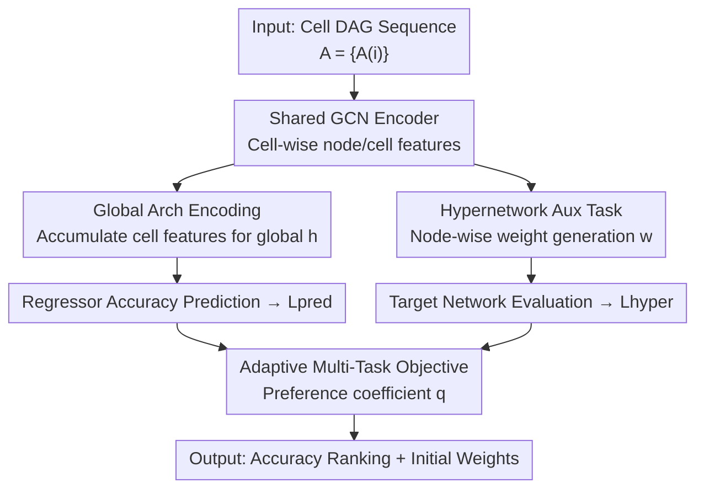

# HyperNAS: Enhancing Architecture Representation for NAS Predictor via Hypernetwork

**Conference**: CVPR 2026  
**Area**: NAS / AutoML / Neural Predictors  
**Keywords**: Neural Architecture Search, Performance Predictor, Hypernetwork, Multi-Task Learning, Few-shot  
**Code**: Not disclosed  

## TL;DR
HyperNAS treats "weight generation via hypernetwork" as an auxiliary task alongside the NAS performance predictor. Both tasks share a GCN encoder, coupled with an adaptive multi-task loss using a preference coefficient. This enables the model to learn architecture representations with better generalization even with minimal labeled samples—achieving 97.60% top-1 on CIFAR-10 using at least 5x fewer samples.

## Background & Motivation
**Background**: Neural Architecture Search (NAS) is essentially an expensive bi-level optimization problem. The bottleneck lies in the fact that "evaluating a candidate architecture requires training it to convergence." To bypass this cost, predictor-based NAS trains a regressor on a proxy dataset (architecture–accuracy pairs) to directly predict the accuracy of unseen architectures, compressing evaluation from "training a network" to "a single forward pass."

**Limitations of Prior Work**: The authors point out two chronic issues in existing neural predictors. First is **isolated cell encoding**—in cell-based search spaces, the dominant approach assumes the entire network is composed of several identical cells stacked in a hand-crafted hierarchy, thus encoding only a single cell for evaluation. While computationally efficient, this loses **macro-structural** information such as reduction operations and inter-cell dependencies. Second is **poor generalization**—predictors are trained on very small proxy datasets, while architectural relationships are highly non-linear. Simple predictors struggle to learn underlying patterns from few samples and easily overfit to seen architecture–accuracy pairs.

**Key Challenge**: The combination of few-shot data and complex architectural relationships. With limited samples, the predictor tends to memorize training pairs rather than understand "what makes an architecture good." Existing improvement routes—data augmentation (synthesizing isomorphic pairs, semi-supervised) and representation enhancement (stronger MLP / GCN / GIN / Transformer encoders)—either require generating extra data pairs or focus solely on encoder structures without providing fundamental supervisory signals for "understanding inter-architecture relationships."

**Key Insight**: The authors observe that hypernetworks are inherently capable of "dynamically generating weights based on input." In the past, SMASH and GHN directly used hypernetworks as architecture evaluators, but their ranking capability was limited by the hypernetwork's own optimization objective. HyperNAS shifts perspective: **Instead of using the hypernetwork as the primary judge, it is demoted to an auxiliary task**—generating weights for various architectures to force the shared encoder to characterize cross-architecture commonalities.

**Core Idea**: Use "weight generation via hypernetwork" as an auxiliary task, jointly trained with the primary performance prediction task via a shared GCN encoder. This forces the encoder to learn architecture representations that are more transferable and less prone to overfitting while serving both objectives.

## Method

### Overall Architecture
HyperNAS is a **multi-task paradigm**: the input is a cell-based architecture (represented as a sequence of cell DAGs $A=\{A^{(i)}\}_{i=1}^N$, where each cell consists of an upper triangular adjacency matrix $E^{(i)}$ and node features $V^{(i)}$). The output includes the predicted accuracy (for ranking during search) and a set of weights that can be used for initialization. Centrally, a **shared GCN encoder** $G$ sequentially encodes each cell into node features $\tilde V^{(i)}$ and cell features $z^{(i)}$. The architecture then splits into two task branches: the blue **performance prediction branch** aggregates cell features into a global feature $h$ to regress accuracy, while the green **hypernetwork branch** uses node features to generate weights $w^{(i)}$ cell-by-cell and applies them to the target network to calculate loss. The losses from both branches are finally balanced by an **adaptive multi-task loss** with a preference coefficient $q$. After training, the hypernetwork branch can be disabled, allowing it to revert to a standard fast predictor.

### Key Designs

**1. Global Architecture Encoding: Providing the predictor with macro-structural context**

Addressing the "isolated cell encoding" pain point, HyperNAS no longer encodes only a single cell. Instead, it uses the shared GCN to encode all cells **sequentially**. The GCN updates for the DAG follow both forward and backward information flows: $V_{l+1}=\tfrac12\mathrm{ReLU}(EV_lW_l^+)+\tfrac12\mathrm{ReLU}(E^\top V_lW_l^-)$. Crucially, before the $i$-th cell enters the GCN, its node features are augmented with the features of the preceding cell: $V^{(i)}=\{v+z^{(i-1)}\mid v\in V^{(i)}\}$, where $z^{(i)}=\mathrm{pool}(\tilde V^{(i)})$ and $z^{(0)}=0$. Consequently, each cell feature carries the context of preceding cells, allowing the model to distinguish cells that are structurally identical but located at different positions. Finally, all cell features are averaged into a global embedding $h=\tfrac1N\sum_i z^{(i)}$ for the regressor $\hat y=f_\theta(h)$, using MSE loss. The authors found that using cell positional encodings instead of "preceding cell feature superposition" yielded worse results, indicating that the actual feature propagation between cells is the source of macro information.

**2. Hypernetwork Auxiliary Task: Providing cross-architecture supervision via weight generation**

Addressing "poor generalization under few-shot conditions," HyperNAS attaches a **shared hypernetwork** $H$ (implemented as a multi-head MLP with fixed output dimensions, using different heads for different kernel sizes). The input consists of node features $v\in\tilde V$ from the shared GCN, and the output is the weight for the corresponding operation $w_v=H(v;\phi)$. The generated weights $w=\{w^{(i)}\}_{i=1}^N$ are applied to the target network and evaluated using standard cross-entropy $L_{hyper}$ on an **independent auxiliary dataset** $D_{aux}$ (e.g., CIFAR-10). Note that the hypernetwork does not have its own loss function; it "borrows" the target network's task for supervision. During training, the hypernetwork parameters $\phi$ and GCN encoder parameters $\phi$ are updated via backpropagation. This auxiliary task provides two benefits: first, it enables **soft weight sharing** across architectures, forcing the encoder into cross-architecture knowledge transfer and implicit regularization; second, it dynamically adjusts weights based on topology, expanding coverage of the architecture space. Unlike SMASH/GHN, the hypernetwork here is a "training partner," while the predictor remains the primary judge.

**3. Adaptive Multi-Task Objective: Personalized exploration on the Pareto front via preference coefficient q**

Jointly training two branches with fixed linear scalarization requires heavy tuning and often lands in sub-optimal solutions. Existing uncertainty-based adaptive losses (weighting by task variance) converge to the Pareto front but ignore "user preference for task importance." HyperNAS **non-linearly scales task losses** before weighting by introducing a preference coefficient $q$:

$$L_{total}=\sum_{t\in T}\frac{L_t^{(q-1)}}{2u_t^2}\cdot L_t+\ln(1+u_t^2)$$

Where $u_t$ represents learnable adaptive weights for each task, and $\ln(1+u_t^2)$ is a regularization term to prevent $u_t$ from becoming too large. The authors prove that introducing $q$ only changes the relative weights without breaking Pareto optimality (as a scaler $s$ can be recalibrated to sum weights to 1). When $q=2$, it reverts to the standard adaptive loss. Experiments show $q=1.5$ achieves the best balance across most data partitions.

### Loss & Training
The total loss follows the $L_{total}$ formula above, comprising $L_{pred}$ (MSE) and $L_{hyper}$ (Cross-Entropy). $D_{aux}$ is independent of the architecture–accuracy pairs used for predictor training. During the search phase, evolutionary algorithms are used in DARTS / ViT search spaces, where the predictor evaluates candidates. On CIFAR-10, HyperNAS uses only 200 sampled pairs (compared to 1000 for its single-task variant HyperNAS-P), and the hypernetwork branch is disabled during evaluation to save time.

## Key Experimental Results

### Main Results
Kendall's Tau is used to measure the correlation between predicted and ground-truth accuracy rankings on NAS-Bench-101/201. The table below shows results on NAS-Bench-201 with extremely low training sample ratios:

| Training Ratio | NP (GCN) | PINAT (Transformer) | HyperNAS (GCN) | Gain over PINAT |
|----------------|----------|---------------------|----------------|-----------------|
| 0.25% (39)     | 0.655    | 0.494               | **0.667**      | +0.173          |
| 0.5% (78)      | 0.626    | 0.549               | **0.677**      | +0.128          |
| 1% (156)       | 0.696    | 0.631               | **0.765**      | +0.134          |
| 3% (469)       | 0.757    | 0.706               | **0.836**      | +0.130          |

Search experiments (DARTS space CIFAR-10 → ImageNet; ViT space ImageNet) show HyperNAS matches or exceeds Prev. SOTA with minimal queries:

| Search Scenario | Metric | HyperNAS | Prev. SOTA | Note |
|-----------------|--------|----------|------------|------|
| CIFAR-10 (DARTS) | best top-1 | 97.60% | PINAT 97.58% | Only 200 queries; HyperNAS-P: 97.61% |
| ImageNet (DARTS Transfer) | top-1 | 75.4% | PINAT 75.1% | 6.6M Params |
| ImageNet (ViT-Base) | top-1 | 82.4% | AutoFormer 82.4% | ~20% query cost, <1 min search |

### Ablation Study
| Configuration | Observation | Explanation |
|---------------|-------------|-------------|
| NP (Isolated cell) | Weakest ranking | Baseline with single cell encoding |
| HyperNAS-P (Global, Single task) | Exceeds NP across all splits | Validates gains from global encoding |
| HyperNAS (+ Hypernet aux task) | Exceeds HyperNAS-P in most splits | Soft weight sharing promotes info exchange |
| HyperNAS-H (Hypernet only) | Lower accuracy than full model | Confirms the two tasks are complementary |
| $q=1.25/1.5/2/3$ | $q=1.5$ is optimal | $q$ adjusts the Pareto front better than $q=2$ |

### Key Findings
- **Global encoding relies on cell feature propagation, not positional encoding**: Replacing preceding cell features $z^{(i-1)}$ with positional embeddings significantly degraded ranking (t-SNE showed features no longer correlated with accuracy), proving that context superposition provides macro information.
- **Auxiliary task helps most when samples are scarce**: t-SNE visualizations show clearer accuracy clustering with the hypernetwork. It also compensates for performance drops caused by positional embeddings, proving its role in learning architectural laws.
- **Multi-task synergy**: The final HyperNAS predictor outperforms the single-task HyperNAS-P, and its hypernetwork validation accuracy is higher than a standalone hypernetwork (HyperNAS-H), indicating mutual promotion between tasks.

## Highlights & Insights
- **"Demoting" the evaluator to a "training partner" is the core insight**: While previous works used hypernetworks as the primary judge or not at all, HyperNAS uses it for auxiliary supervision. This avoids the hypernetwork's inherent weakness in ranking while leveraging its ability to inject cross-architecture knowledge—an "under-performing" task becomes a source of generalization.
- **No data augmentation required**: Unlike HAAP, which depends on synthesizing isomorphic pairs, HyperNAS obtains extra supervision from evaluating generated weights on $D_{aux}$, removing the need for complex pair construction.
- **Transferable preference coefficient $q$**: The strategy of non-linear scaling before adaptive weighting, combined with the Pareto optimality proof, can be reused in any multi-task scenario requiring a personalized balance.

## Limitations & Future Work
- The authors acknowledge that hypernetworks may still introduce significant overhead for **extremely large architectures**. Efficiency optimizations and scalability improvements are planned.
- ⚠️ Code is not public. Internal details like the multi-head MLP structure and $D_{aux}$ scale are scattered in the appendix; the main text provides only an overview.
- Global encoding assumes architectures are formed by sequential cells; its effectiveness on non-cell structures (e.g., irregular large models) remains unverified. Accuracy comparisons across different search spaces should be interpreted cautiously due to varying query budgets.

## Related Work & Insights
- **vs SMASH / GHN**: These used pre-trained hypernetworks for weight inheritance/evaluation; their ranking was hindered by optimization goals. HyperNAS uses it as an assistant to an independent predictor.
- **vs PINAT / TNASP (Transformer predictors)**: These focus on encoder architecture (Transformer power). HyperNAS uses a standard GCN backbone but outperforms them via supervision design, suggesting signal design is more effective than scaling encoder capacity.
- **vs HAAP / Semi-NAS (Data Augmentation)**: These expand samples via synthesis or semi-supervision. HyperNAS combines representation enhancement with auxiliary supervision on auxiliary data.

## Rating
- Novelty: ⭐⭐⭐⭐⭐ First to use hypernetworks as an auxiliary task for NAS predictor generalization.
- Experimental Thoroughness: ⭐⭐⭐⭐ Coverage of five spaces and multiple ablations, but no public code.
- Writing Quality: ⭐⭐⭐⭐ Clear motivation, solid Pareto proofs, though charts are dense.
- Value: ⭐⭐⭐⭐ Significant practical gains for few-shot NAS ranking; loss function is transferable.

<!-- RELATED:START -->

## Related Papers

- [\[CVPR 2026\] InTrain: Intrinsic Trainability for Zero-Cost Neural Architecture Search](intrain_intrinsic_trainability_for_zero-cost_neural_architecture_search.md)
- [\[CVPR 2026\] Enhancing Visual Representation with Textual Semantics: Textual Semantics-Powered Prototypes for Heterogeneous Federated Learning](enhancing_visual_representation_with_textual_semantics_textual_semantics_powered_p.md)
- [\[CVPR 2026\] The Power of Decaying Steps: Enhancing Attack Stability and Transferability for Sign-based Optimizers](the_power_of_decaying_steps_enhancing_attack_stability_and_transferability_for_s.md)
- [\[CVPR 2026\] FedRG: Unleashing the Representation Geometry for Federated Learning with Noisy Clients](fedrg_unleashing_the_representation_geometry_for_federated_learning_with_noisy_c.md)
- [\[ICML 2026\] Enhancing LLM Training via Spectral Clipping](../../ICML2026/optimization/enhancing_llm_training_via_spectral_clipping.md)

<!-- RELATED:END -->
