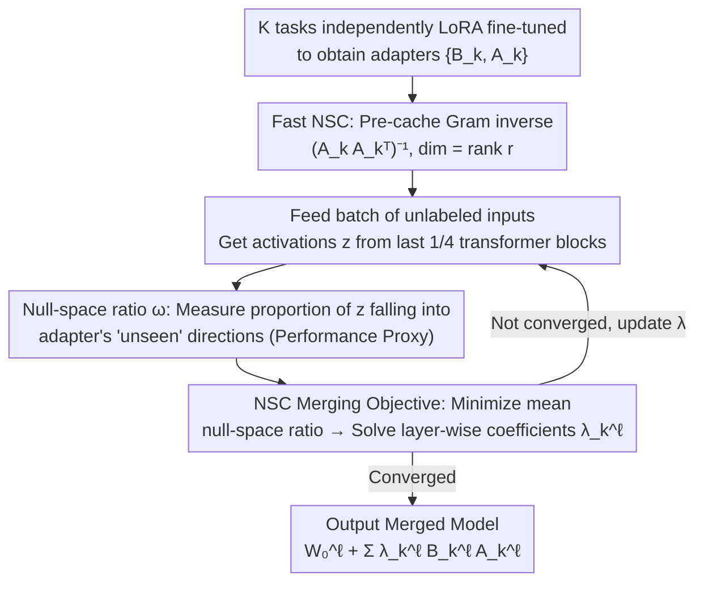

# Label-Free Cross-Task LoRA Merging with Null-Space Compression

**Conference**: CVPR 2026  
**arXiv**: [2603.26317](https://arxiv.org/abs/2603.26317)  
**Code**: [GitHub](https://github.com/wonyoung01/nsc_merging)  
**Area**: Optimization
**Keywords**: Model Merging, LoRA, Null-Space Compression, Label-Free, Cross-Task

## TL;DR

It is observed that the null-space ratio of the down-projection matrix A during LoRA fine-tuning decreases and strongly correlates with performance. Based on this, NSC Merging is proposed—a label-free, task-agnostic LoRA merging method that achieves SOTA results on 20 heterogeneous vision tasks, 6 NLI tasks, and VLM evaluations.

## Background & Motivation

Model Merging combines independently fine-tuned checkpoints into a single multi-task model without requiring joint training. In the era of foundation models, LoRA fine-tuning has become standard, making LoRA merging a critical direction.

Existing gradient-guided merging methods (e.g., AdaMerging) use output entropy minimization as a proxy objective to estimate merging weights. While effective for classification tasks, they face two fundamental limitations:
1. **Inapplicability to regression tasks**: The definition of entropy is only meaningful for classification; regression tasks such as depth estimation and surface normal prediction cannot utilize it.
2. **Non-scalability to LLMs/VLMs**: Entropy needs to be calculated at each generated token, with costs growing linearly with sequence length.

**Key Challenge**: A merging signal is needed that is applicable to both classification and regression and does not rely on output logits.

**Key Insight**: During LoRA fine-tuning, the null-space of the down-projection matrix $\mathbf{A}$ is systematically compressed—meaning more input activations fall into the adapter's projection subspace. This **null-space compression** is strongly negatively correlated with task performance and serves as a task-agnostic merging signal.

## Method

### Overall Architecture

The goal of NSC Merging is to merge $K$ independently fine-tuned LoRA adapters into a multi-task model, where the search for merging coefficients does not rely on task labels or output logits (otherwise, regression tasks and long-sequence LLMs remain unusable). The pipeline starts from trained adapters: first, $\{B_k, A_k\}$ are obtained for each task via independent LoRA fine-tuning; then, a small matrix $(A_kA_k^\top)^{-1}$ (for **Fast NSC** caching) is precomputed for each adapter, with dimensions related only to the LoRA rank $r$. Subsequently, a batch of unlabeled inputs is fed into the model to optimize layer-wise merging coefficients $\{\lambda_k^\ell\}$ per task, using the **null-space ratio** as a proxy signal and **mean null-space ratio minimization** as the objective. After iterative convergence, the merged model $W_0^\ell + \sum_k \lambda_k^\ell B_k^\ell A_k^\ell$ is produced. The entire process focuses on the geometry of input activations rather than prediction accuracy, which is the fundamental reason it covers classification, regression, and generation tasks simultaneously.

### Key Designs

**1. Null-Space Ratio: Turning LoRA Training Dynamics into a Performance Proxy Signal**

Prior gradient-guided merging methods (AdaMerging) rely on output entropy to judge merging quality, but entropy is only meaningful for classification and must be calculated per token. This work shifts to a purely input-side signal: for LoRA updates $\Delta W = BA$, the null-space $\mathcal{N}(A_k^\ell)$ of the down-projection matrix $A_k^\ell$ represents input directions discarded by the adapter. Thus, the null-space ratio is defined as:

$$\omega_k^\ell(\mathbf{z}) = \frac{\|\text{Proj}_{\mathcal{N}(A_k^\ell)}(\mathbf{z})\|_2}{\|\mathbf{z}\|_2}$$

It measures the proportion of an input activation $\mathbf{z}$ that falls into directions the adapter cannot "see." The authors observe that this ratio is systematically lowered during training—the adapter gradually pulls more task-relevant activations into its projection subspace—and $\omega$ is strongly negatively correlated with task performance across both classification and regression. The reliability of this signal stems from the small rank of LoRA (e.g., 16 dimensions vs. 768); since the adapter subspace covers only about 2.1% of the feature space, null-space compression implies that this limited capacity is being utilized effectively, allowing performance to be inferred without touching output logits.

**2. NSC Merging Objective: Learning Layer-wise Coefficients Label-Free via Mean Null-Space Ratio**

With the proxy signal established, the search for merging coefficients becomes a minimization of the mean null-space ratio across all tasks under the merged model:

$$\min_{\{\lambda_k^\ell\}} \frac{1}{K}\sum_{k=1}^K \mathbb{E}_{\mathbf{x} \sim \mathcal{D}_k}\big[\Omega_k(\mathbf{x}; \Theta_{merge})\big]$$

Where $\Omega_k$ is the average null-space ratio of task $k$ across all target layers, and merged parameters are $W_0^\ell + \sum_k \lambda_k^\ell B_k^\ell A_k^\ell$. Coefficients are expanded at a fine-grained "layer × task" level (unlike the global scaling in Task Arithmetic), enabling precise trade-offs between heterogeneous tasks. Because the objective relies only on the geometry of the adapters, it is task-type agnostic; for LLMs/VLMs, it only requires activations of input tokens, decoupling cost from sequence length and bypassing the scalability bottlenecks of entropy-based methods.

**3. Fast NSC: Reducing Per-step Overhead from $O(d^2)$ to $O(r^2)$ via Gram Inverse Caching**

Directly calculating null-space projections requires constructing the projection matrix for $\mathcal{N}(A_k^\ell)$ with dimension $d$ (feature dimension), which is costly to recompute every iteration. This paper reformulates the ratio using only small matrices:

$$\omega_k(\mathbf{z}) = \sqrt{1 - \frac{\mathbf{z}^\top A_k^\top(A_kA_k^\top)^{-1}A_k\mathbf{z}}{\|\mathbf{z}\|_2^2}}$$

Since $\mathbf{z}$ and $A_k\mathbf{z}$ are already computed during forward inference, the only requirement is to store $(A_kA_k^\top)^{-1}$—its dimension equals the LoRA rank $r$, which is much smaller than $d$, and it can be pre-cached. The bottleneck is thus reduced from $O(d^2)$ for full-space projection to $O(r^2)$ ($r\ll d$). Furthermore, the NSC objective is only computed on the last 1/4 of transformer blocks: ablations show this yields performance nearly equal to using all layers while saving significant overhead, whereas using only the final layer leads to a drop, indicating that null-space signals in deeper adapters are the most discriminative.

### Loss & Training

- Optimizer: AdamW, lr=0.001 (Vision) / 0.0003 (LLM/VLM)
- Initialization: $\lambda$ initialized to 0.4
- Iterations: 100 steps (Vision) / 500 steps (LLM/VLM)
- Use of unlabeled validation sets only; on LLMs, even input IDs alone are sufficient.

## Key Experimental Results

### Main Results — 20 Heterogeneous Vision Tasks (ViT-B)

| Method | NYUD-v2 (4 tasks) | PASCAL (5 tasks) | Taskonomy (11 tasks) | Total Avg. |
|------|------------|------------|---------------|-------|
| Task Arithmetic | ~46% | ~62% | ~103% | 77.2% |
| TIES | ~47% | ~62% | ~102% | 77.3% |
| KnOTS-TIES | ~45% | ~62% | ~102% | 76.6% |
| RobustMerge | ~69% | ~85% | ~100% | 89.9% |
| **NSC (Ours)** | ~**75%** | ~**87%** | ~**100%** | **92.0%** |

(Values are performance percentages normalized to single-task fine-tuning)

### LLM Results (LLaMA-3-8B, 6 NLI Tasks)

| Method | MNLI | QNLI | SNLI | RTE | SICK | SciTail | Avg. |
|------|------|------|------|-----|------|---------|------|
| TA | 92.8 | 86.8 | 93.3 | 93.6 | 83.8 | 95.0 | 90.9 |
| AdaMerging | 94.3 | 84.8 | 92.5 | 92.1 | 89.2 | 84.8 | 89.6 |
| RobustMerge | 94.3 | 88.1 | 93.7 | 93.6 | 83.0 | 94.5 | 91.2 |
| **NSC (Ours)** | 94.9 | 88.3 | 92.8 | 91.3 | **91.2** | **95.1** | **92.3** |

### Ablation Study

| Configuration | Description | Effect |
|------|------|------|
| Full layer NSC | Compute all LoRA layers | Best performance but high cost |
| Last 1/4 layers | Only last quarter of transformer blocks | Close to full layer performance with improved efficiency |
| Last 1 layer | Only the final block | Significant performance drop |
| Input IDs only | No image/text content required | Still effective for LLMs |

### Key Findings

- NSC shows the greatest advantage on heterogeneous mixtures of classification and regression tasks (+2.1% relative to RobustMerge on NYUD-v2), where other methods struggle with regression.
- AdaMerging performs poorly on LLMs (89.6%) because entropy calculation costs on long sequences lead to insufficient optimization.
- NSC provides the best balance: it does not sacrifice performance on some tasks by overfitting others (addressing the issue where prior methods overfit subsets of tasks).
- The null-space ratio remains correlated with performance in merged models: samples with lower ratios exhibit higher accuracy.

## Highlights & Insights

- Null-space compression is an elegant observation: the down-projection matrix of LoRA gradually "captures" more task-relevant activations during training, and this dynamic is converted into a merging signal.
- The purely input-oriented approach allows natural extension to regression and generation tasks, solving the fundamental limitations of entropy-based methods.
- The Gram inverse caching trick is practical: it reduces the computational bottleneck from $O(d^2)$ to $O(r^2)$ ($r \ll d$).
- The label-free and output-free characteristics make it the most "lightweight" gradient-guided merging method.

## Limitations & Future Work

- Still requires a small amount of unlabeled data for optimization, rather than being entirely data-agnostic.
- On heterogeneous vision tasks, normalized performance is still at 92%, leaving a significant gap compared to single-task fine-tuning.
- The choice of target layers (last 1/4) is empirical; different models might require different strategies.
- Evaluated only on ViT-B scale vision models; effectiveness on larger models (e.g., ViT-L/H) remains unknown.

## Related Work & Insights

- **vs AdaMerging**: Both use gradient optimization for merging coefficients, but AdaMerging uses output entropy (limited to classification, scales with sequence length), while NSC uses the null-space ratio (task-agnostic, input-oriented).
- **vs KnOTS**: KnOTS projects adapters into a shared subspace before merging SVD components, focusing more on adapter alignment than weight optimization.
- **vs Task Arithmetic**: TA uses a global scaling factor, which performs poorly on heterogeneous tasks (77.2%); NSC's fine-grained layer-wise coefficient control is significantly better.

## Rating

- Novelty: ⭐⭐⭐⭐ The null-space compression observation is novel and powerful, naturally deriving merging signals from LoRA structures.
- Experimental Thoroughness: ⭐⭐⭐⭐⭐ Covers 20 vision tasks + 6 NLI + VLM evaluations across 11 baselines with extensive ablations.
- Writing Quality: ⭐⭐⭐⭐ Motivation and methodological derivation are clear, with comprehensive experimental presentation.
- Value: ⭐⭐⭐⭐⭐ Resolves key bottlenecks for model merging in heterogeneous tasks, providing practical impact for the LoRA ecosystem.

<!-- RELATED:START -->

## Related Papers

- [\[CVPR 2026\] ACE-Merging: Data-Free Model Merging with Adaptive Covariance Estimation](ace-merging_data-free_model_merging_with_adaptive_covariance_estimation.md)
- [\[CVPR 2026\] Model Merging in the Essential Subspace](model_merging_in_the_essential_subspace.md)
- [\[CVPR 2026\] BD-Merging: Bias-Aware Dynamic Model Merging with Evidence-Guided Contrastive Learning](bd-merging_bias-aware_dynamic_model_merging_with_evidence-guided_contrastive_lea.md)
- [\[ICML 2026\] On the Convergence Rate of LoRA Gradient Descent](../../ICML2026/optimization/on_the_convergence_rate_of_lora_gradient_descent.md)
- [\[CVPR 2026\] DC-Merge: Improving Model Merging with Directional Consistency](dc-merge_improving_model_merging_with_directional_consistency.md)

<!-- RELATED:END -->
