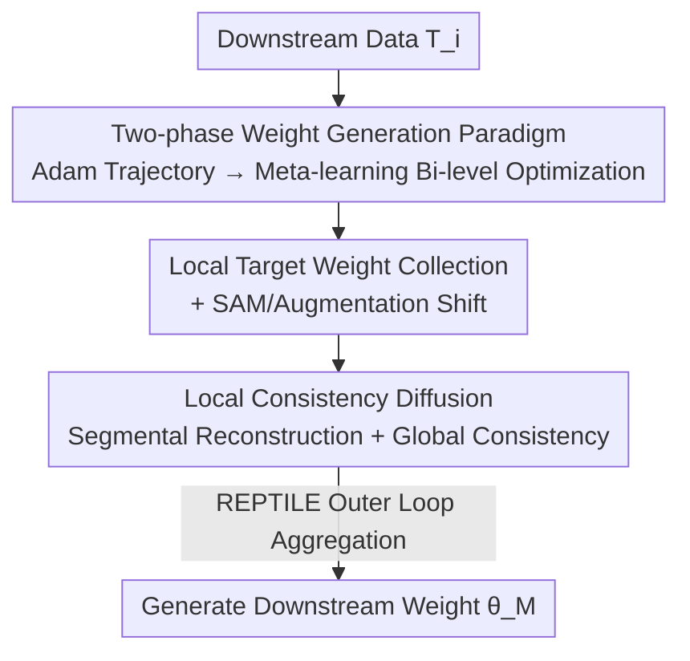

# Learning to Learn Weight Generation via Local Consistency Diffusion

**Conference**: CVPR 2026  
**Paper**: [CVF Open Access](https://openaccess.thecvf.com/content/CVPR2026/html/Guan_Learning_to_Learn_Weight_Generation_via_Local_Consistency_Diffusion_CVPR_2026_paper.html)  
**Code**: To be confirmed  
**Area**: Optimization / Meta-learning / Diffusion Models  
**Keywords**: Weight Generation, Diffusion Models, Meta-learning, Local Consistency, Gradient-free Fine-tuning  

## TL;DR
Mc-Di combines the bi-level optimization of meta-learning with diffusion-based weight generation and transforms the diffusion process from learning only "globally optimal weights" to "local consistency diffusion." By reconstructing weights segmentally along multiple intermediate points on the optimization trajectory, the model achieves higher accuracy and lower inference latency in tasks requiring frequent weight updates, such as transfer learning, few-shot learning, domain generalization, and language model fine-tuning.

## Background & Motivation

**Background**: Directly "generating" neural network weights $\theta$ for downstream tasks using diffusion models $f^G_\phi$ is an emerging direction (e.g., OCD, D2NWG). It transforms training/fine-tuning into a gradient-free generation process, which is highly attractive for scenarios necessitating frequent weight changes like transfer learning, few-shot learning, domain generalization, and language model fine-tuning.

**Limitations of Prior Work**: The authors identify two specific shortcomings. The first is **poor generalization**. Methods like VAE, Hypernetwork, OCD, and D2NWG are built on a single-level optimization framework and lack the capability for cross-task knowledge transfer, leading to performance drops on new tasks. The second is the **lack of local supervision signals**. Existing methods only treat the "global optimal weight $\theta_M$" as the generation target, ignoring the intermediate weights along the optimization trajectory. These intermediate weights encode strategic details of the optimizer (e.g., Adam).

**Key Challenge**: Directly incorporating intermediate weights $\theta_{i\times d}$ as generation targets into vanilla diffusion breaks the consistency between local and global targets. Vanilla diffusion treats every target as an "endpoint $x_T$ reached after $T$ denoising steps." Multiple conflicting targets lead to mutual interference, and the introduced local targets may actually degrade overall performance. Thus, using local targets while maintaining global consistency remains a non-trivial open problem.

**Goal**: (1) Inject cross-task generalization capabilities into weight generation; (2) Enable the diffusion process to utilize local targets along the optimization trajectory without breaking global optimality; (3) Improve the convergence of the weight generation paradigm without increasing additional time overhead.

**Key Insight**: View "learning to learn weight generation" as a meta-learning problem (using REPTILE for bi-level optimization) and redefine the diffusion target sequence. Instead of "approaching the endpoint in $T$ steps," the objective is to hit $\theta_d, \theta_{2d}, \dots, \theta_{k\times d}=\theta_M$ sequentially at $T/k$ step intervals.

**Core Idea**: Utilize "local consistency diffusion" to reconstruct weights segmentally along the optimization trajectory and transfer this generation capability across tasks via meta-learning.

## Method

### Overall Architecture
Mc-Di consists of two phases. **Weight Preparation Phase**: For each downstream task, a real optimizer (Adam) is run to record the full optimization trajectory $\{\theta_0, \theta_1, \dots, \theta_M\}$ ($\theta_0$ is the Gaussian initialized weight, and $M$ is the number of downstream training epochs). Then, $k$ local target weights $\{\theta_d, \theta_{2d}, \dots, \theta_{k\times d}\}$ are sampled uniformly at a fixed interval $d=M/k$. **Meta-training Phase**: Utilizing REPTILE's bi-level optimization, the outer loop maintains the meta-learner $f^G_\phi$, while the inner loop assigns a base learner $f^G_{\phi_i}$ to each local target. The "local consistency diffusion" models the generation process $\theta_0 \to \theta_{i\times d}$ using task embeddings $\text{Emb}_{T_i}$ (calculated by ResNet101) as a condition. **Inference Phase**: Consistent with vanilla diffusion, the process starts from Gaussian noise and iteratively denoises, hitting local targets segmentally to eventually recover the global optimal weight $\theta_M$.

### Key Designs

**1. Two-phase Weight Generation Paradigm: Bi-level Optimization for Cross-task Generalization**

To address the "poor generalization of single-level frameworks," Mc-Di splits weight generation into "Weight Preparation + Meta-training" and implements bi-level optimization via REPTILE. The outer loop meta-learner $f^G_\phi$ learns a good initialization across many tasks. The inner loop creates temporary copies $\phi_i$ for each sampled target $\theta_{i\times d}$ and performs $K$ updates $\phi_i \leftarrow \phi_i - \eta\nabla_{\phi_i} L^{loc}_i$. The outer loop then aggregates movements: $\phi \leftarrow \phi + \frac{\zeta}{B}\sum_{i=1}^{B}(\phi_i - \phi)$. Compared to single-level OCD, this bi-level structure enables the diffusion model to learn "how to quickly adapt generation strategies for new tasks" rather than memorizing specific weight distributions.

**2. Local Target Weight Collection + Functional Component Migration: Feeding Optimizer Strategy to Diffusion while Improving Convergence**

Existing methods focus solely on the global optimum $\theta_M$, losing intermediate trajectory information. Mc-Di samples weights uniformly at interval $d$ during Adam optimization to obtain $\{\theta_d, \theta_{2d}, \dots, \theta_{k\times d}\}$. These weights encapsulate "optimizer strategic details," providing denser supervision for diffusion. Furthermore, the authors shift two functional components **from the inner loop to the weight preparation phase**: Sharpness-Aware Minimization (SAM) is used to constrain curvature and reduce the maximum Hessian eigenvalue $\lambda$ near the global optimum, improving the convergence upper bound (Theorem 2 states $L_D(\hat\theta)-L_D(\theta^*) \le \frac{\lambda}{2}(c+\frac{2\psi}{\mu})(1-\frac{\mu}{l})^M$). Data augmentation is also shifted to improve robustness. Since the meta-training phase only requires pre-collected weights, adding these components incurs "no additional time overhead."

**3. Local Consistency Diffusion: Aligning Segmental Targets Without Interference**

This is the core of the paper. Vanilla diffusion treats both $\theta_{i\times d}$ and $\theta_M$ as the same "endpoint $x_T$ after $T$ steps," causing inconsistency and performance drops. Local consistency diffusion redefines the targets: starting from Gaussian noise, local targets $\theta_d, \theta_{2d}, \dots, \theta_{M=k\times d}$ are hit sequentially at **equal intervals of $T/k$ steps**. The local consistency loss is:

$$L^{loc}_i = \mathbb{E}_{t\in[0,\,i\times T/k)}\left\|\sqrt{1-\bar\alpha^i_t}\,f^G_\phi(x_t,t) - \sqrt{1-\bar\alpha_t}\,\epsilon\right\|^2,\quad x_t = \sqrt{\bar\alpha^i_t}\,\theta_{i\times d} + \sqrt{1-\bar\alpha^i_t}\,\epsilon$$

where $\bar\alpha^i_t = \prod_{j=t}^{i\times T/k - 1}\alpha_j$. When $k=1$, it degrades to vanilla diffusion (Mv-Di), making Mc-Di a strict generalization of existing methods. A counter-intuitive benefit is **lower computational cost**: although the nominal complexity $O(k\times T/2)$ of $L^{loc}$ is higher than $O(T)$, partitioning a search space of radius $T$ into $k$ sub-problems of radius $T/k$ allows $L^{loc}_1$ to converge first, followed by recursive solving. In practice, this achieves lower MSE with fewer diffusion steps.

### Loss & Training
The inner loop uses the local consistency loss $L^{loc}=\mathbb{E}_{i\in(0,k]}L^{loc}_i$; the outer loop uses REPTILE aggregation. Default hyperparameters: segment number $k=3$, diffusion steps $T=20$, inner learning rate $\eta=0.005$, meta learning rate $\zeta=0.001$, 3 inner steps, and 6000 meta-training epochs. The selection of $k=3$ is based on the trade-off curve between segment number and reconstruction MSE on Omniglot/Mini-ImageNet.

## Key Experimental Results

The platform used was 2×A100; all results are the mean and standard deviation of 5 independent experiments.

### Main Results

Transfer Learning (Meta-trained on ImageNet-1k, evaluated across datasets without label fine-tuning):

| Dataset | ICIS | GHN3 | D2NWG | Mv-Di(Ours) | Mc-Di(Ours) |
|--------|------|------|-------|-------------|-------------|
| CIFAR-10 | 61.75 | 51.80 | 60.42 | 61.14 | **63.57** (↑1.82) |
| CIFAR-100 | 47.66 | 11.90 | 51.50 | 49.62 | 50.69 (↓0.81) |
| STL-10 | 80.59 | 75.37 | 82.42 | 81.43 | **85.02** (↑2.60) |
| Aircraft | 26.42 | 23.19 | 27.70 | 29.37 | **29.97** (↑2.27) |
| Pets | 28.71 | 27.16 | 32.17 | 30.28 | **35.16** (↑2.99) |
| Latency(ms) | 9.2 | 14.5 | 6.7 | 4.7 | **3.5** (×1.9 Gain) |

Mc-Di achieved the best results in 5 out of 6 tasks (trailing by only 0.81% on CIFAR-100), with an average improvement of 2.42% over the runner-up while being 1.9× faster than D2NWG. In few-shot (5-way) and domain generalization (DomainNet), results were consistent: on DomainNet (5,1)/(20,5), Mc-Di reached 69.05/72.86, averaging 4.47%/5.28% higher than the runner-up and 1.7× faster than OCD. For LLM fine-tuning (generating LoRA matrices for RoBERTa-base): MRPC 89.43 / QNLI 91.86, accuracy was comparable to gradient fine-tuning, but the speed was 3.6×~4.0× faster.

### Ablation Study

Incremental ablation of main components (Omniglot / Mini-ImageNet, 5-way 1-shot accuracy):

| Config | C1 Meta+Diff | C2 Local Targets | C3 Local Consistency | Omniglot | Mini-ImageNet |
|------|:---:|:---:|:---:|---------|---------------|
| REPTILE | | | | 95.39 | 47.07 |
| OCD | | | | 95.04 | 59.76 |
| Mv-Di | ✓ | | | 96.65 | 62.53 |
| Tw-Di | ✓ | ✓ | | 94.28 | 49.72 |
| Mc-Di | ✓ | ✓ | ✓ | **97.34** | **64.87** |

### Key Findings
- **C3 (Local Consistency) is critical**: Tw-Di (94.28 / 49.72), which adds local targets without consistency, performs worse than Mv-Di (96.65 / 62.53), confirming that "raw local targets cause interference." Mc-Di only reaches the top performance after adding the local consistency loss.
- **$k=3$ is the sweet spot**: $k=1$ degrades to vanilla diffusion. $k>1$ improves accuracy via local targets, but excessively large $k$ is not beneficial; $k=3$ was fixed across datasets.
- **Functional components are a "free lunch"**: Shifting SAM and data augmentation to the preparation phase shifts the accuracy-GPU time curve upward without changing the convergence rate, achieving a gain with "zero additional time overhead."

## Highlights & Insights
- **Redefining diffusion "endpoints" as "equal-interval targets"**: While vanilla diffusion only cares about $x_T$, Mc-Di ensures local targets are hit at every $T/k$ steps. This clever redefinition utilizes dense supervision from optimization trajectories while maintaining compatibility ($k=1$) with existing methods like OCD/D2NWG.
- **"Nominally more expensive, actually more efficient"**: Dividing the search space of radius $T$ into $k$ sub-problems allows early convergence of initial segments, leading to lower MSE for a fixed GPU budget. This "divide and conquer" approach for diffusion steps is highly instructive.
- **Decoupling and shifting functional components**: Moving SAM/augmentation to the preparation phase improves convergence (via Hessian eigenvalue suppression) without consuming meta-training time. This strategy of "operating on the data side rather than the optimization side" can be migrated to other bi-level optimization frameworks.

## Limitations & Future Work
- **Dependency on real optimization trajectories**: Each task requires running Adam to generate a full trajectory before sampling. The cost of this preparation phase (especially for large models) is not fully discussed.
- **Strong theoretical assumptions**: Convergence analysis relies on $l$-smooth and $\mu$-strongly convex assumptions, which do not hold for neural network loss landscapes. The authors acknowledge this as a simplification for analytical tractability.
- **Limited validation scale**: LLM experiments were limited to RoBERTa-base + LoRA on binary classification. Whether this scales to larger models, generative tasks, or longer trajectories remains to be verified.

## Related Work & Insights
- **vs. OCD / D2NWG**: These use single-level diffusion to simulate weight optimization, modeling only $\theta_M$; Mc-Di uses bi-level meta-learning + local targets, showing stronger generalization and accuracy.
- **vs. REPTILE / Meta-Baseline (Gradient methods)**: Pure gradient meta-learning requires computing gradients at inference, leading to high latency (~20ms on Omniglot); Mc-Di generates weights without gradients, reducing latency to single-digit ms.
- **vs. Meta-Diff / Meta-Hypernetwork**: Also aimed at few-shot weight generation, but Mc-Di's local consistency diffusion utilizes intermediate trajectory supervision, providing significant gains on Mini/Tiered-ImageNet.

## Rating
- Novelty: ⭐⭐⭐⭐⭐ Redefining diffusion from "single point" to "equal-interval multi-targets" and proving it a generalization of prior work is both novel and self-consistent.
- Experimental Thoroughness: ⭐⭐⭐⭐ Covers transfer, few-shot, domain generalization, and LLM fine-tuning with incremental ablations, though the LLM scale is small.
- Writing Quality: ⭐⭐⭐⭐ Clear chain from motivation to theory to experiments; Figures 1 and 3 provide an intuitive explanation of "local consistency."
- Value: ⭐⭐⭐⭐ Gradient-free, low-latency weight generation is practically valuable for scenarios requiring frequent weight switching.

<!-- RELATED:START -->

## Related Papers

- [\[CVPR 2026\] DABO: Difficulty-Aware Bayesian Optimization with Diffusion-Learned Priors](dabo_difficulty-aware_bayesian_optimization_with_diffusion-learned_priors.md)
- [\[ICLR 2026\] LCA: Local Classifier Alignment for Continual Learning](../../ICLR2026/optimization/lca_local_classifier_alignment_for_continual_learning.md)
- [\[CVPR 2026\] Defending Unauthorized Model Merging via Dual-Stage Weight Protection](defending_unauthorized_model_merging_via_dual-stage_weight_protection.md)
- [\[CVPR 2026\] DC-Merge: Improving Model Merging with Directional Consistency](dc-merge_improving_model_merging_with_directional_consistency.md)
- [\[CVPR 2025\] Model Poisoning Attacks to Federated Learning via Multi-Round Consistency](../../CVPR2025/optimization/model_poisoning_attacks_to_federated_learning_via_multi-round_consistency.md)

<!-- RELATED:END -->
