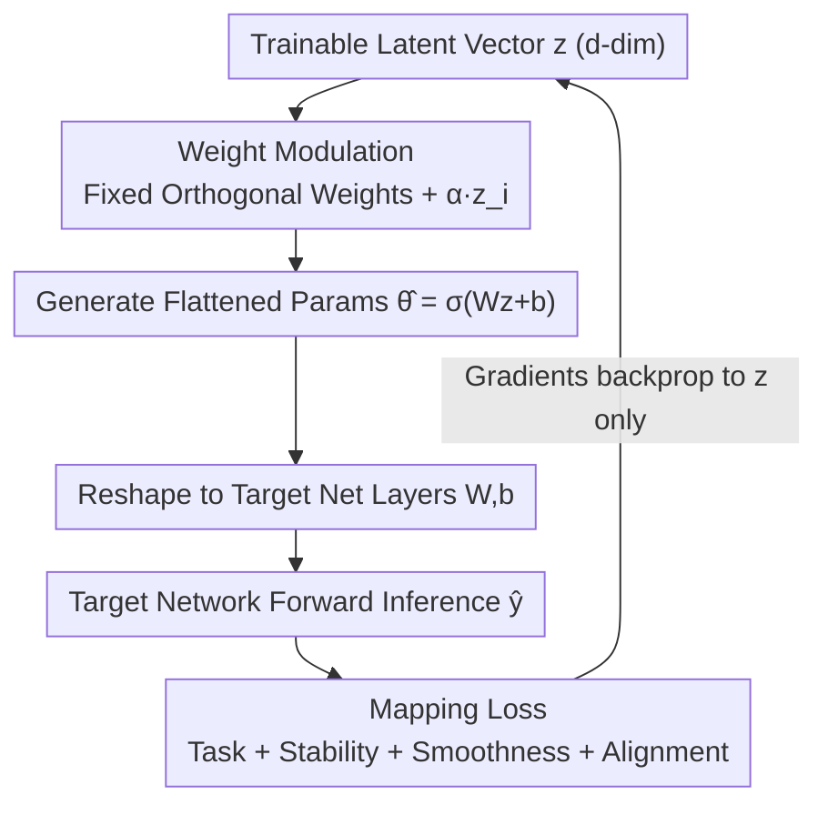

# Mapping Networks

**Conference**: CVPR 2026  
**Paper**: [CVF Open Access](https://openaccess.thecvf.com/content/CVPR2026/html/Sen_Mapping_Networks_CVPR_2026_paper.html)  
**Code**: None  
**Area**: Optimization / Parameter-Efficient Training  
**Keywords**: Hypernetworks, meta-parameterization, weight manifold, latent vector, overfitting suppression

## TL;DR
This paper proposes Mapping Networks—a "meta-parameterization" method that utilizes a low-dimensional trainable latent vector $z$ (coupled with fixed mapping weights modulated by $z$) to generate all parameters of a target network. By shifting the training process from a high-dimensional weight space to a low-dimensional latent space, the method achieves or exceeds the accuracy of the original network on tasks such as image classification, deepfake detection, and segmentation with approximately 500× fewer trainable parameters, while significantly suppressing overfitting.

## Background & Motivation

**Background**: Modern deep networks often possess parameter counts ranging from millions to trillions. Direct gradient descent training in the high-dimensional weight space $\mathbb{R}^P$ is computationally expensive, difficult to track, and prone to overfitting. Reducing training costs primarily follows two paths: reducing training time (via distributed multi-GPU systems) or reducing trainable parameters. The latter is more critical as it simultaneously enhances generalization and reduces the "black-box" nature of models.

**Limitations of Prior Work**: Existing parameter reduction techniques have various limitations. Pruning, the Lottery Ticket Hypothesis, and quantization are primarily oriented toward the **inference** stage, still requiring the target network to be fully trained first. Low-rank compression (e.g., SVD, $W \approx UV^\top$) operates directly on high-dimensional weight tensors, either as post-hoc decomposition or by imposing rigid linear constraints. Although HyperNetworks "generate weights," the hypernetwork and the target network are **jointly trained**, failing to bypass the training of the target network, and their compression rates are far lower than those achieved in this work.

**Key Challenge**: While training occurs in the high-dimensional $\mathbb{R}^P$ space, substantial empirical and theoretical evidence (such as the low intrinsic dimension of loss landscapes and the convergence of training trajectories to a shared low-dimensional manifold) suggests that trained parameters actually reside on a **low-dimensional manifold**. If the true degrees of freedom are much smaller than $P$, why perform training in a $P$-dimensional space?

**Goal**: (1) Theoretically prove the existence of a differentiable mapping from a low-dimensional latent space to a high-dimensional weight space with arbitrarily small error; (2) Design an architecture that practically implements this mapping to completely transfer training to the low-dimensional latent vector, **ensuring the target network is never directly trained**.

**Key Insight**: The authors first analyzed parameter snapshots of a small CNN trained on MNIST, observing via PCA/t-SNE that parameters in each layer evolve smoothly along an approximate affine subspace (Figure 2). Based on this, they proposed the "weight-manifold hypothesis" and constructed the mapping accordingly.

**Core Idea**: A low-dimensional trainable latent vector $z$ passes through a mapping network with "fixed but $z$-modulated" weights to generate all weights of the target network. This reduces the optimization problem from $\mathbb{R}^P$ to $\mathbb{R}^d$ ($d \ll P$), structurally constraining the search to an efficient manifold.

## Method

### Overall Architecture
Mapping Networks represent a form of Hypernetwork (referred to as "external reduction" in this paper): the target network $f_\theta$ is not directly trained. Instead, a low-dimensional trainable latent vector $z \in \mathbb{R}^d$ and a set of **fixed, orthogonally initialized mapping weights modulated by $z$** are used. The latent vector generates a flattened high-dimensional parameter vector $\hat\theta \in \mathbb{R}^P$ through the mapping network, which is then reshaped back into the weight/bias tensors of the target network's layers. The target network performs forward inference using only these generated parameters; **gradients are backpropagated only to the mapping network (ultimately to $z$ and the modulation coefficients)**, and the target network itself is never updated. The entire process is constrained by a Mapping Loss to ensure it satisfies both the downstream task and the geometric/analytical properties required by the mapping theorems.

### Key Designs

**1. Weight-Manifold Hypothesis and Mapping Theorem: Providing Existence Proofs for "Low-Dimensional Training"**

Shifting training to a low-dimensional space requires proof that a well-behaved mapping from "low-dimensional $\to$ high-dimensional weights" exists. The authors first formalize the **Weight-Manifold Hypothesis**: for network parameters $\theta \in \mathbb{R}^P$, there exists a differentiable embedded manifold $\mathcal{M}_\theta \subset \mathbb{R}^P$ with intrinsic dimension $d = \dim(\mathcal{M}_\theta) \ll P$, such that the optimal trained parameters $\theta^*$ reside on (or near) this manifold. Under three assumptions (parameter-to-output $L_\theta$-Lipschitz, loss $L_\ell$-Lipschitz, and $C^2$ manifold with bounded curvature), they prove the **Mapping Theorem**: for any $\varepsilon > 0$, there exists a $C^2$ mapping $g: \mathbb{R}^d \to \mathbb{R}^P$ and a latent vector $z^*$ such that $\|g(z^*) - \theta^*\| \le \delta$ (where $\delta = \varepsilon / (L_\ell L_\theta)$), leading to $|L(g(z^*)) - L(\theta^*)| \le \varepsilon$. The proof constructs a globally smooth $g$ using local $C^2$ diffeomorphisms $\varphi$ and smooth bump functions. The authors also provide Theorem 2 (solvability under additive modulation), proving that the "fixed weight + additive modulation" architecture used in the experiments is a valid $g$, with an error bound independent of the initial residual. This step elevates "low-dimensional training can approximate the optimum" from an intuition to a bounded guarantee.

**2. Mapping Network: Trainable Latent Vector + Fixed Modulated Weights**

This is the practical implementation of the mapping theorem. The latent vector $z = (z_0, \dots, z_{d-1})$ is the **only trainable** core, with its length serving as a hyperparameter to match the effective parameter distribution of the target network. The weights $w_{ij}$ of the mapping network itself are **fixed, orthogonally initialized, and do not participate in gradient updates**; they are simply modulated by the latent vector via additive affine modulation:

$$w_{ij} \leftarrow w_{ij} + \alpha\, z_i, \quad \forall j$$

where $\alpha$ is a small modulation scale. Retaining fixed weights rather than relying solely on direct projection from $z$ provides "context and prevents the projection from becoming a random mapping." After modulation, the flattened parameters are generated as $\hat\theta = \sigma(W \cdot z + b)$, then sliced and reshaped according to the cumulative indices of each layer into $W^{(l)}, b^{(l)}$ (Eq. 22). The target network performs standard forward passes $\hat y = \sigma(W_t^\top x + b_t)$ using these parameters, while gradients pass through the mapping network. Since the only learning degrees of freedom are $z$ (and a few modulation coefficients), the trainable parameters drop from $P$ to the order of $d$—the source of the 260×–525× compression.

**3. Mapping Loss: Turning Theorem Assumptions into Optimizable Regularization**

The architecture alone is insufficient; it must be guaranteed that the generated parameter manifold satisfies the smoothness and stability assumptions of the mapping theorem. The authors design four joint loss terms with **trainable** coefficients to let the network adaptively balance the task and regularization:

$$L_{map} = L_{task} + \lambda_{st}L_{stab} + \lambda_{sm}L_{smooth} + \lambda_{al}L_{align}$$

- **Task Loss** $L_{task}$: Cross-entropy for classification to ensure the generated parameters are optimal for the downstream task;
- **Stability Loss** $L_{stab} = \mathbb{E}\big[\|f_{\theta'}(z + \epsilon) - f_{\theta'}(z)\|_2^2\big]$ (where $\epsilon \sim \mathcal{N}(0, \sigma^2I)$), penalizing large output changes caused by micro-perturbations in the latent vector, corresponding to the local Lipschitz property in assumption A1;
- **Smoothness Loss** $L_{smooth} = \|\nabla_z M_\phi(z)\|_F^2$, penalizing the Frobenius norm of the mapping Jacobian to enforce $C^2$ continuity and suppress oscillation;
- **Alignment Loss** $L_{align} = 1 - \cos(z, W_m)$, aligning the latent vector with the row-mean direction of the modulation projection layer weights to enhance generalization.

Ablation studies (Table 6) show that the full combination (Full) consistently outperforms using only the task loss; for example, Ours† with 2,688 parameters improved from 91.11% to 94.08%.

**4. Training Strategies and Extensions: Scaling to Large Networks and Fine-Tuning**

To address memory issues in large networks, the authors provide two training strategies: **Single Latent Vector Training (SLVT)** uses one $z$ to approximate the entire network (sufficient for small nets, but fixed mapping weight counts explode for large nets); **Layer-Wise Training (LWT)** uses separate small latent vectors for each layer (since parameters of different layers may reside on different manifolds). In experiments, Ours† (LWT) generally outperformed Ours*. Three extensions further enhance utility: (a) **Low-Rank Decomposition (LRD)**—the mapping network generates $U, V$ directly instead of $W \approx UV^\top$, reducing FC layer parameters from $mn$ to $r(m+n)$; (b) **Pruning/Quantization** can be stacked with this method for inference acceleration; (c) **Fine-Tuning Extension**—generating modulation vectors $o$ instead of full parameters, where each $o_i$ modulates $L$ weights to be fine-tuned ($w_{ij} \leftarrow w_{ij} + \alpha\, o_i$), allowing a pretrained network (e.g., ResNet50) to be fine-tuned with minimal parameters (2,048 in experiments).

## Key Experimental Results

> Evaluated across image classification (MNIST/FMNIST), deepfake detection (Celeb-DF/FF++), segmentation (Cityscapes), time-series prediction (Air Pollution), and fine-tuning (ResNet50). `Ours*` = SLVT, `Ours†` = LWT.

### Main Results

| Task / Dataset | Baseline (# Params → Metric) | Ours (# Params → Metric) | Compression Ratio |
|------|------|------|------|
| Image Classif. MNIST | CNN1: 537,994 → 99.32% | Ours* 2072 → 99.56% | ~260× |
| Image Classif. FMNIST | CNN1: 537,994 → 92.89% | Ours† 4078 → 94.83% | ~131× |
| Deepfake Celeb-DF | CNN2: 108,618 → 79.03% | Ours* 2048 → 85.90% | ~53× |
| Deepfake FF++ | CNN2: 108,618 → 79.85% | Ours† 2688 → 86.28% | ~40× |
| Seg. Cityscapes (mIoU) | CNN3: 1,734,803 → 0.4957 (Pixel Acc 93.21%) | Ours* 8192 → 0.4623 (Pixel Acc 97.92%) | ~211× |
| Time-series Air (MSE) | LSTM: 12,961 → 0.0035 | Ours* 2048 → 0.00061 | ~6× |

Highlights: Accuracy in classification and detection increased rather than decreased, and pixel accuracy in segmentation rose from 93.21% to approximately 97.9% (though mIoU dropped slightly), indicating that the low-dimensional constraint acts as a form of regularization. The abstract claims approximately 500x parameter reduction (99.5%), consistent with 1,024 parameters versus CNN1 on FMNIST yielding 525x. ⚠️ Compression ratios in different rows are calculated based on their respective parameters; these are converted based on the table.

### Fine-Tuning Experiments (ResNet50 → Deepfake Detection)

| Method | # Trainable Params | Tuning Layers | Celeb-DF | FF++ |
|------|------|------|------|------|
| ResNet50 | 25M | All | 95.23% | 91.78% |
| Ours* | 2048 | All | 95.10% | 91.02% |
| ResNet50 | 17M | L-4 + FC | 91.11% | 88.03% |
| Ours* | 1024 | L-4 + FC | 92.10% | 89.23% |

With only 2,048 trainable parameters, the method approaches the accuracy of full fine-tuning of 25M parameters, even surpassing the baseline in some configurations (L-4+FC).

### Ablation Study (Mapping Loss, FashionMNIST, Table 6)

| Configuration | Ours* 2048 | Ours† 2688 |
|------|------|------|
| Task Loss Only | 87.88% | 91.11% |
| + Stability | 89.91% | 91.89% |
| + Smoothness | 90.23% | 91.50% |
| + Smoothness + Alignment | 90.67% | 93.63% |
| Full (All four) | 91.88% | 94.08% |

### Key Findings
- **Regularization Bonus of Manifold Hypothesis**: Low-dimensional latent training significantly suppresses overfitting—CNN1 on FMNIST showed a large train/test gap (99.10% train → 92.89% test), while Mapping Network with 2,072 parameters reduced this gap to just 1.8%.
- **Necessity of All Four Losses**: Removing stability, smoothness, or alignment leads to a performance drop. The Full configuration is optimal across both capacities, validating the strategy of encoding theorem assumptions as regularization terms.
- **Superiority of Layer-Wise Training (LWT)**: Ours† generally outperformed Ours*, confirming that parameters of different layers reside on different manifolds and require separate modeling.
- **Robustness Comparison**: In Table 7, a Full DNN (trainable mapping weights, but fixed latent vector, 6.75M parameters) achieved only 97.12% (MNIST), highlighting that training the latent vector is the key, rather than the capacity of the mapping weights. ⚠️ Some values in Table 7 are truncated in the cache; refer to the original text for details.

## Highlights & Insights
- **Theory + Architecture Closed Loop**: The mapping theorem proves that the low-to-high dimensional parameter mapping exists with bounded error, the "fixed modulated weight + trainable latent vector" architecture explicitly constructs this $g$, and the four losses enforce theorem assumptions—achieving logical self-consistency.
- **Direct Avoidance of Target Network Training**: Unlike HyperNetwork joint training, the target network is never directly trained. Gradients flow only within the mapping network, enabling approximately 500× parameter reduction.
- **Baseline-Agnostic + Orthogonal Stackability**: The method is agnostic to the target architecture (CNN/LSTM/ResNet) and is orthogonal to pruning, quantization, and low-rank decomposition, making it suitable for edge deployment.
- **Treating Overfitting as a Geometric Problem**: Low-dimensional manifold constraints naturally favor flatter, more robust solutions, equivalent to structural regularization—a perspective transferable to any scenario requiring parameter reduction or anti-overfitting.

## Limitations & Future Work
- **Scale Constraints**: Due to hardware limitations (Kaggle P100 / NVIDIA T1000), experiments were limited to small/medium CNNs/LSTMs and ResNet50 fine-tuning; the method's scalability to large models or massive datasets remains unproven despite the authors' claims.
- **Memory Cost of Fixed Mapping Weights**: Under SLVT, the number of fixed weights grows explosively with the size of the target network, consuming significant RAM. While LWT and LRD mitigate this, the overhead of generating and storing mapping weights for large networks remains a bottleneck.
- **Hyperparameter Sensitivity**: Latent vector dimension $d$, modulation scale $\alpha$, and the number of weights $L$ modulated by $o_i$ during fine-tuning all require tuning; sensitivity analysis is mostly relegated to the appendix.
- ⚠️ The cache is OCR text; some formulas (e.g., subscripts in Eq. 20–24, values in Table 7) may have line breaks or omissions. Refer to the original PDF for critical symbols.

## Related Work & Insights
- **vs. HyperNetworks**: Both generate target network weights, but HyperNetworks are jointly trained and cannot avoid training the target network, leading to lower compression. This work trains only the latent vector while the target network receives zero training updates, achieving a higher magnitude of parameter reduction.
- **vs. Pruning / Lottery Ticket / Quantization**: These are inference-oriented and require prior full training of the target network. This method is training-oriented, avoids training the target network from the start, and is orthogonal/stackable with them.
- **vs. Low-Rank Compression (SVD / $W \approx UV^\top$)**: Low-rank methods perform post-hoc decomposition or impose linear constraints on high-dimensional weights. This method uses non-linear, differentiable meta-parameterization to reduce the search space to a low-dimensional latent space as a whole.

## Rating
- Novelty: ⭐⭐⭐⭐ The theory-architecture-loss loop for meta-parameterization is a novel perspective.
- Experimental Thoroughness: ⭐⭐⭐ Wide task coverage, but the scale is small and large model validation is missing; some conclusions rely on the appendix.
- Writing Quality: ⭐⭐⭐ Theoretical sections are rigorous, but the notation is dense and OCR readability is average.
- Value: ⭐⭐⭐⭐ Transforming "training on low-dimensional manifolds" into a deployable, stackable paradigm has significant value for parameter-efficient training.

<!-- RELATED:START -->

## Related Papers

- [\[NeurIPS 2025\] Auto-Compressing Networks](../../NeurIPS2025/optimization/auto-compressing_networks.md)
- [\[ICLR 2026\] Entropic Confinement and Mode Connectivity in Overparameterized Neural Networks](../../ICLR2026/optimization/entropic_confinement_and_mode_connectivity_in_overparameterized_neural_networks.md)
- [\[ICLR 2026\] Rapid Training of Hamiltonian Graph Networks using Random Features](../../ICLR2026/optimization/rapid_training_of_hamiltonian_graph_networks_using_random_features.md)
- [\[ICML 2026\] The Implicit Bias of Adam and Muon on Smooth Homogeneous Neural Networks](../../ICML2026/optimization/the_implicit_bias_of_adam_and_muon_on_smooth_homogeneous_neural_networks.md)
- [\[ICLR 2026\] Πnet: Optimizing Hard-Constrained Neural Networks with Orthogonal Projection Layers](../../ICLR2026/optimization/pinet_optimizing_hard-constrained_neural_networks_with_orthogonal_projection_lay.md)

<!-- RELATED:END -->
