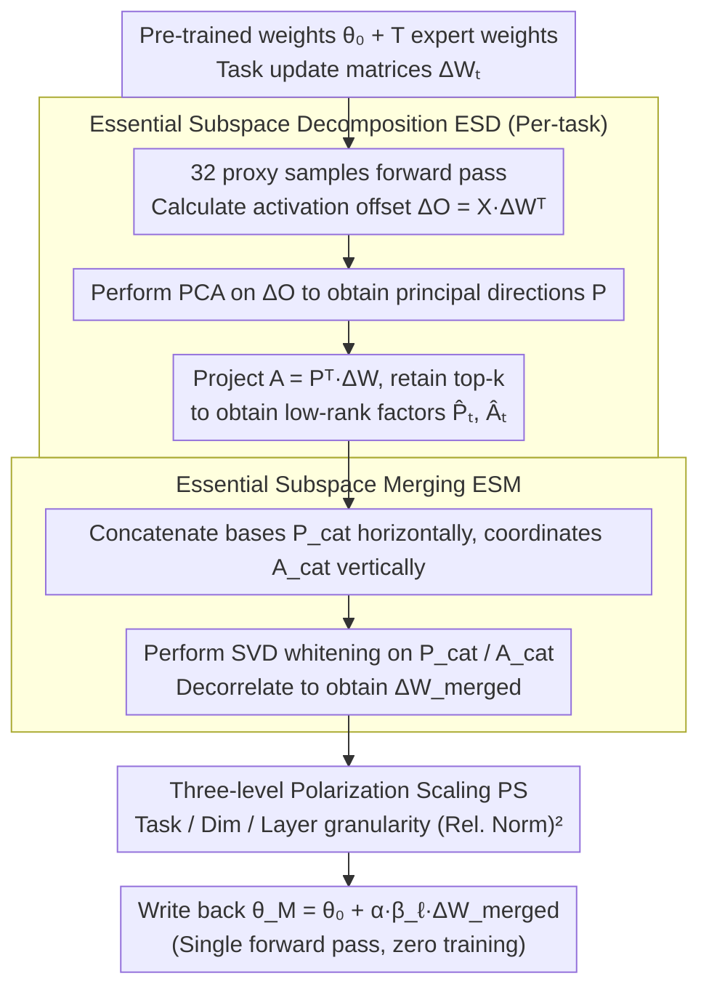

# Model Merging in the Essential Subspace

**Conference**: CVPR 2026  
**arXiv**: [2602.20208](https://arxiv.org/abs/2602.20208)  
**Code**: None  
**Area**: Optimization
**Keywords**: Model Merging, Principal Component Analysis, Essential Subspace, Polarization Scaling, Low-rank Decomposition

## TL;DR
The ESM framework is proposed to construct an "essential subspace" by performing PCA on activation offsets caused by parameter updates (rather than directly applying SVD to parameters). It utilizes three-level polarization scaling to enhance key parameters and suppress noise, achieving a 3.2% absolute accuracy improvement over Iso-CTS in a 20-task merging scenario with ViT-B/32.

## Background & Motivation

**Background**: Model merging fuses multiple expert models fine-tuned from the same pre-trained checkpoint into a single multi-task model without retraining. Recent SVD-based methods (TSV-M, Iso-CTS) achieve effective results by applying SVD truncation to task matrices to reduce interference.

**Limitations of Prior Work**: SVD decomposition minimizes the Frobenius norm reconstruction error of the parameter matrix $\Delta W$ but ignores the input feature distribution. The truncation error is $\sum_{i=k+1}^r \sigma_i^2 \cdot \mathbb{E}[(v_i^\top x)^2]$—even if $\sigma_i$ is small, if the input projection in the $v_i$ direction is large, truncation still results in significant functional loss.

**Key Challenge**: The SVD subspace is misaligned with the task's feature space, causing the discard of functionally important directions during low-rank merging. Furthermore, when merging a large number of tasks, noisy parameters can overwhelm critical knowledge.

**Goal**: (1) Construct a more essential low-rank subspace aligned with the feature distribution; (2) Enhance parameters with a high signal-to-noise ratio and suppress noise during merging.

**Key Insight**: Instead of directly decomposing the parameter matrix, PCA is performed on the **activation offsets** $\Delta O = X_{\text{proxy}} \Delta W^\top$ caused by parameter updates to obtain principal directions directly related to task functionality. Additionally, it is observed that parameter norms are highly correlated with directional importance.

**Core Idea**: Perform low-rank decomposition and merging within the principal component space of activation offsets (rather than the singular value space of parameters) and use polarization scaling to amplify consensus signals.

## Method

### Overall Architecture
Given pre-trained weights $\theta_0$ and $T$ expert weights fine-tuned on them, ESM merges them into a multi-task model $\theta_M$ without sacrificing individual task capabilities. The core premise is that merging should preserve directions that most significantly impact output activations rather than directions with the highest parameter energy. The process consists of three steps: first, Essential Subspace Decomposition (ESD) is performed on each task's update matrix in the principal directions of "activation offsets" to compress it into a subspace aligned with task functionality; second, Essential Subspace Merging (ESM) orthogonally concatenates low-rank factors from $T$ tasks; finally, Three-level Polarization Scaling (PS) is used to amplify high-confidence signals consistent across tasks and suppress noise. The final weights for each layer are written back as $\theta_M^{(\ell)} = \theta_0^{(\ell)} + \alpha \cdot \beta_\ell \cdot \Delta W_{\text{merged}}^{(\ell)}$, requiring only a single forward pass without training.

### Key Designs

**1. Essential Subspace Decomposition (ESD): Low-rank truncation in activation space instead of parameter space**

Traditional SVD decomposes the parameter matrix $\Delta W$ directly, where the truncation error includes the input weight term $\mathbb{E}[(v_i^\top x)^2]$. Even if a singular value is small, if the input happens to project heavily in that direction, discarding it causes severe functional loss. Thus, SVD low-rank approximation is misaligned with the actual feature space used by the task. ESD changes the decomposition object from parameters to outputs. It uses 32 unlabeled proxy samples for a forward pass to calculate the activation offset $\Delta O = X_{\text{proxy}} \Delta W^\top \in \mathbb{R}^{n \times d_{\text{out}}}$, performs PCA on $\Delta O$ to obtain principal directions $P = [p_1, \dots, p_{d_{\text{out}}}]$, and then projects $\Delta W$ onto them to obtain coordinate matrix $A = P^\top \Delta W$, retaining only the top-$k$ highest energy directions to get $\widehat{\Delta W} = \hat{P}\hat{A}$. The truncation error thus becomes purely $\sum_{i=k+1}^{d_{\text{out}}} \lambda_i$, depending only on the eigenvalues of discarded directions and decoupling from the input distribution. Experiments show that with only 5% of components retained, the CKA similarity of ESD is much higher than SVD, resulting from "ranking by functionality rather than parameter energy."

**2. Essential Subspace Merging (ESM): Orthogonal fusion of low-rank factors from $T$ tasks**

While ESD handles single-task compression, the essential subspaces of multiple tasks are not naturally orthogonal, leading to interference if simply added. ESM fuses them in three steps: allocating a rank budget $k = \lfloor d_{\text{out}} / T \rfloor$ for individual task truncation; horizontally concatenating all basis matrices into $P_{\text{cat}} = [\hat{P}_1 \mid \dots \mid \hat{P}_T]$ and vertically concatenating coordinate matrices into $A_{\text{cat}}$; and finally performing SVD whitening on both ($\tilde{P} = U_P V_P^\top$, $\tilde{A} = U_A V_A^\top$) to flatten singular values and retain only the orthogonal skeleton. Whitening is crucial—it forces cross-task basis vectors to decorrelate, ensuring tasks occupy non-overlapping directions and preventing task suppression during merging.

**3. Three-level Polarization Scaling (PS): Amplifying consensus and suppressing noise via "squared relative norm"**

Post-concatenation, all tasks are added equally. However, tasks vary in strength, dimensions in importance, and layers in weight. Noise from weak tasks can drown out critical knowledge when merging 20 tasks. PS does not learn coefficients but applies $(\text{relative norm})^2$ across three granularities—squaring makes the strong stronger and weak weaker, automatically widening the confidence gap. At the task level, $s_t^{(\ell)} = \big(\lVert\hat{A}_t^{(\ell)}\rVert_F \,/\, \mathbb{E}_i[\lVert\hat{A}_i^{(\ell)}\rVert_F]\big)^2$ prevents important tasks from dilution. At the dimension level, $c_j^{(\ell)} = \big(\lVert\mathbf{a}_j^{(\ell)}\rVert_2 \,/\, \mathbb{E}_i[\lVert\mathbf{a}_i^{(\ell)}\rVert_2]\big)^2$ enhances input dimensions with strong cross-task consistency. At the layer level, $\beta_\ell = \big(\lVert\Delta W_{\text{merged}}^{(\ell)}\rVert_F \,/\, \mathbb{E}_{i \in \mathcal{L}_{\text{type}}}[\lVert\Delta W_{\text{merged}}^{(i)}\rVert_F]\big)^2$, limited to comparable layers (e.g., all QKV layers) to avoid unfair competition between layers due to residual connections. This scaling is valid as authors verified the premise that "high norm corresponds to high-confidence directions." Loading parameters by norm order performs best even after normalization, indicating directional quality matters more than magnitude. Conversely, using reciprocal scaling causes performance to drop by over 5%.

### Loss & Training
ESM involves no training and requires only 32 unlabeled proxy samples for a single forward pass. The merging coefficient $\alpha$ is selected on a validation set. Total extra overhead is minimal: PCA takes 1.39s/task and orthogonalization takes 13.89s (one-time) on ViT-B/16.

## Key Experimental Results

### Main Results

**ViT-B/16, Average Absolute Accuracy (%)**

| Method | 8 tasks | 14 tasks | 20 tasks |
|------|---------|----------|----------|
| Task Arithmetic | 75.4 | 70.5 | 65.8 |
| TSV-M | 89.0 | 84.6 | 80.6 |
| Iso-CTS | 91.1 | 86.4 | 82.4 |
| **ESM (Ours)** | **91.8** | **87.4** | **84.9** |

**ViT-L/14, Average Absolute Accuracy (%)**

| Method | 8 tasks | 14 tasks | 20 tasks |
|------|---------|----------|----------|
| TSV-M | 93.0 | 89.2 | 87.7 |
| Iso-CTS | 94.7 | 91.0 | 90.1 |
| **ESM (Ours)** | **94.8** | **91.3** | **90.4** |

### Ablation Study

| Decomposition | PS | ViT-B/16 8tasks | ViT-B/16 20tasks | Description |
|---------|-----|-----------------|-----------------|------|
| SVD | None | 89.0 | 80.6 | Baseline (TSV-M) |
| SVD | All | 89.6 | 82.1 | PS works for SVD as well |
| ESD | None | 90.9 | 82.8 | ESD alone Gain +1.9/+2.2 |
| ESD | Layer-only | 91.4 | 83.7 | Layer scaling contributes most |
| ESD | All | **91.8** | **84.9** | Three-level scaling further improves |

### Key Findings
- ESD energy concentration is significantly higher than SVD: capturing equivalent energy with fewer components while maintaining higher CKA similarity.
- Polarization scaling is a general module: applying it to SVD improves performance by 1.5%, showing the universality of norm-based scaling.
- Proxy dataset composition has negligible impact: OOD data (ImageNet-1k) performs nearly identically to ID data (difference <0.1%). Even single-class sampling does not affect output, suggesting activation offset directions are an intrinsic property invariant to input.
- Stable superiority over SVD baseline is achieved with as few as 4 proxy samples.
- Reciprocal scaling leads to severe performance degradation (-5%+), validating the "high norm = high importance" hypothesis.

## Highlights & Insights
- **Compelling SVD vs. ESD comparison**: Theoretical (truncation error formula) and experimental (energy concentration, CKA) evidence demonstrates that decomposition in activation offset space outperforms parameter space. The core insight is that model merging should focus on functional impact rather than parameter energy.
- **Surprising robustness of proxy data**: Using completely OOD data for PCA yields nearly identical results. This implies that the activation offset principal direction of a fine-tuned model is an inherent property, independent of input data—an interesting finding in itself.
- **Elegant Polarization Scaling**: A simple $(relative norm)^2$ formula achieves the effect of "amplifying signal, compressing noise" across three independent levels. It is more efficient than methods learning scaling coefficients (e.g., AdaMerging) and does not strictly require a validation set for layer scaling.

## Limitations & Future Work
- Requires 32 proxy samples for a forward pass—while minimal, it is not strictly data-free (compared to ACE-Merging).
- Validated only on vision tasks (ViT/CLIP); lacks experiments on language models.
- Global $\alpha$ coefficient still requires validation set selection; full automation is not yet implemented.
- The rank budget $k = \lfloor d_{\text{out}} / T \rfloor$ is uniformly distributed, ignoring differences in task complexity; adaptive rank allocation could be explored.
- Whitening discards singular value information, which might over-compress useful scale variations.

## Related Work & Insights
- **vs. TSV-M**: TSV-M merges in parameter SVD space; ESM merges in activation PCA space. ESM consistently outperforms TSV-M significantly (+2~3%).
- **vs. Iso-CTS**: Iso-CTS constructs an isotropic public subspace via singular value normalization. ESM constructs an essential subspace from a functional perspective, showing greater advantages in 20-task scenarios (+2.5%).
- **vs. ACE-Merging**: Both are CVPR'26 model merging works but utilize different approaches—ACE uses a closed-form solution from covariance estimation, while ESM uses low-rank decomposition and orthogonalization from activation offset PCA. ACE is entirely data-free, while ESM needs 32 samples. They may be complementary.

## Rating
- Novelty: ⭐⭐⭐⭐ ESD decomposition is a novel approach, though PCA on activations is not entirely new in other contexts.
- Experimental Thoroughness: ⭐⭐⭐⭐⭐ Comprehensive ablations, proxy data robustness analysis, scaling visualization, and computation overhead reports.
- Writing Quality: ⭐⭐⭐⭐ Clear logic and rich visuals, though motives in the polarization scaling section are slightly long-winded.
- Value: ⭐⭐⭐⭐ SOTA for vision model merging, though lack of language model validation limits its initial scope.

<!-- RELATED:START -->

## Related Papers

- [\[CVPR 2026\] ACE-Merging: Data-Free Model Merging with Adaptive Covariance Estimation](ace-merging_data-free_model_merging_with_adaptive_covariance_estimation.md)
- [\[CVPR 2026\] BD-Merging: Bias-Aware Dynamic Model Merging with Evidence-Guided Contrastive Learning](bd-merging_bias-aware_dynamic_model_merging_with_evidence-guided_contrastive_lea.md)
- [\[CVPR 2026\] DC-Merge: Improving Model Merging with Directional Consistency](dc-merge_improving_model_merging_with_directional_consistency.md)
- [\[CVPR 2026\] Defending Unauthorized Model Merging via Dual-Stage Weight Protection](defending_unauthorized_model_merging_via_dual-stage_weight_protection.md)
- [\[ICLR 2026\] How does the optimizer implicitly bias the model merging loss landscape?](../../ICLR2026/optimization/how_does_the_optimizer_implicitly_bias_the_model_merging_loss_landscape.md)

<!-- RELATED:END -->
