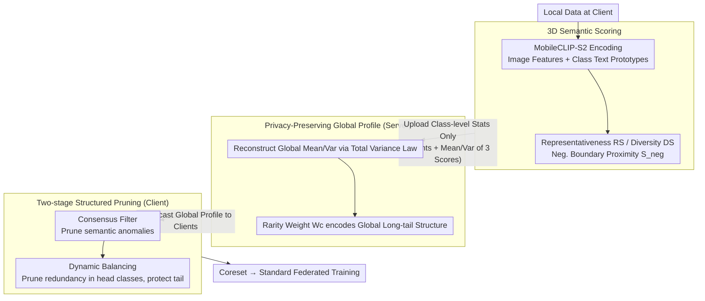

# SCOPE: Semantic Coreset with Orthogonal Projection Embeddings for Federated learning

**Conference**: CVPR2026  
**arXiv**: [2603.12976](https://arxiv.org/abs/2603.12976)  
**Code**: None  
**Area**: Optimization  
**Keywords**: Federated learning, coreset selection, long-tail distribution, Vision-Language Model, data pruning

## TL;DR
SCOPE utilizes a zero-training vision-language geometric scorer to compress each sample into three scalars: representativeness, diversity, and negative boundary proximity. The server aggregates only these lightweight statistics to form a global consensus, guiding clients to first prune semantically anomalous samples and then redundant majority-class samples. This achieves a balance between accuracy, robustness, and extremely low communication overhead in strong non-IID and long-tail federated scenarios.

## Background & Motivation
**Background**: Data pruning in federated learning (FL) is not new, but the problem becomes significantly more difficult when applied to real-world distributions driven by scientific instruments. This paper focuses on a typical realistic scenario: each edge node holds locally collected data that is voluminous, privacy-sensitive, and highly class-imbalanced, with varying data quality and label distributions across nodes.

**Limitations of Prior Work**: 
1. **Local-only perspective**: Many coreset methods judge sample importance based on local density, gradients, or loss. In FL, a sample appearing redundant to a single client might not be redundant for the global system; a "common sample" in one node might belong to a rare tail class globally.
2. **High training cost**: Many data selection methods require local warmup training on the full dataset to identify important samples via signals like loss, gradient norm, or forgetting events. This is uneconomical for high-throughput scientific data, as the majority of computation is spent before pruning even begins.
3. **High loss does not imply high value**: While high-loss samples are often treated as informative hard examples in natural image benchmarks, in scientific imaging or sensor data, high loss is frequently just noise, artifacts, sampling errors, or unstable labeling. Retaining these samples injects noise into federated aggregation rather than enhancing generalization.
4. **Conflict between global view and privacy/bandwidth**: Gaining a global perspective often involves uploading embeddings, gradients, or proxy datasets, which either leaks semantic information or consumes excessive bandwidth.

**Goal**: Therefore, this paper aims to solve three coupled sub-problems.
1. Whether sample utility can be quantified reliably without local training by relying solely on the semantic space of a pre-trained Vision-Language Model (VLM).
2. Whether this quantification can be compressed into a lightweight form to give the server a global statistical view without accessing high-dimensional features or raw samples.
3. Whether data compression can be achieved without destroying the long-tail structure, specifically ensuring that head classes do not further suppress tail classes.

**Key Insight**: Instead of transmitting high-dimensional embeddings, samples are projected into a few geometric metrics within a unified vision-language semantic space. Instead of letting clients prune based on local intuition, the server aggregates global class-level statistics and broadcasts a "global consensus" to guide local pruning.

**Core Idea**: Compress sample value into communicable scalars via VLM semantic projection, then upgrade federated pruning from "local heuristics" to "globally informed two-stage data governance" using global class statistics.

## Method
**Key Challenge**: The core contradiction is the need to prune useless samples to save computation/bandwidth without making incorrect deletions based on a local perspective—redundant samples in one node might be rare tail samples globally. 
**Mechanism**: The strategy differentiates samples into three categories: prune semantic anomalies (noise/class-mismatch), then prune redundant head-class samples (near class centers), while retaining samples that support decision boundaries, maintain intra-class diversity, or protect the tail. This criterion is built entirely on pre-trained VLM semantic geometry, independent of training dynamics, making the coreset construction zero-training and communication-efficient.

### Overall Architecture
The workflow consists of four steps. First, each client uses MobileCLIP-S2 to encode images into a shared semantic space, constructs text prototypes for each class using natural language prompts, and calculates three scalar scores for each sample: Representativeness (RS), Diversity (DS), and Negative Boundary Proximity ($S_{neg}$). Second, clients do not upload sample-level embeddings but instead send class-level statistics (sample counts per class + mean/variance of the three scores) to the server. The server constructs a global profile to identify global class rarity and the distribution range of semantic metrics. Third, clients receive this profile and execute a **Consensus Filter** to delete semantically contradictory samples. Finally, they perform **Dynamic Balancing**—pruning redundant samples only from classes that are "locally abundant and globally common" (head classes). The resulting coreset is then used for standard federated training.

### Key Designs

**1. 3D Semantic Scoring: Decomposing sample value into three orthogonal scalars**

A single metric cannot simultaneously preserve core anchors, intra-class diversity, and decision boundaries. SCOPE decomposes sample value into three complementary dimensions in the CLIP space. The Representativeness Score $RS_i = v_{img,i} \cdot t_{c_i}$ measures how typical a sample is. The Diversity Score $DS_i = \|v_{img,i} - RS_i\, t_{c_i}\|_2$ captures intra-class variation beyond the prototype via the residual of the orthogonal projection. The Boundary Proximity $S_{neg,i} = \max_{j \neq c_i} v_{img,i} \cdot t_j$ characterizes confusion with the nearest negative class. Explicitly decoupling RS and DS via orthogonal decomposition allows the filter to clearly distinguish noise, redundancy, and valuable boundary samples.

**2. Privacy-preserving Global Profile: Reclaiming global semantic coordinates via class statistics**

To gain a global view without uploading embeddings, SCOPE requires clients to upload only the sample count per class and the mean/variance of the three scores. The server uses the law of total variance to reconstruct the global mean and variance, serving as a reference for Z-score normalization. This decomposition accounts for heterogenity across clients that a simple average would underestimate. Simultaneously, the server calculates a rarity weight:

$$W_c \propto \left(\frac{1}{F_c + \epsilon}\right)^{\gamma}$$

This encodes the global long-tail structure, reducing communication from high-dimensional feature centers to the scale of class counts while preserving privacy.

**3. Two-stage Structured Pruning: Semantic denoising followed by frequency-based head suppression**

Merging "noise deletion" and "redundancy deletion" into one ranking often leads to the deletion of hard samples. SCOPE splits these into two stages. Stage 1, the **Consensus Filter**, uses an anomaly score $AS_i = \hat{Z}_{S_{neg},i} - \hat{Z}_{RS,i}$ to remove samples that look more like negative classes than the true class. This relies on semantic mismatch rather than high loss, avoiding the deletion of valid hard examples. Stage 2, **Dynamic Balancing**, uses a redundancy score $R_i = \hat{Z}_{RS,i} - \hat{Z}_{S_{neg},i} - \hat{Z}_{DS,i}$ to target "typical, far-from-boundary, non-novel" samples. Deletion is not uniform: it specifically targets classes where the class target metric $T_c = f_c / W_c$ is high (head classes with high local frequency and low global rarity).

### Loss & Training
SCOPE introduces no new loss functions; its premise is that "selection is training-free." Selection occurs before training, and the downstream process follows standard federated training (SGD, cosine decay, 200 rounds). Unlike baselines (FedCS, FedCore, EL2N, etc.) that require a warmup phase, SCOPE skips this, saving significant computation. This data construction reshapes the empirical distribution, reducing gradient bias via anomaly filtering and mitigating client drift through dynamic balancing.

## Key Experimental Results
The experiments cover four datasets: CIFAR-10, Tiny-ImageNet, CIFAR-100, and UHCS (microstructure data).
- **Non-IID skew**: Dirichlet parameter $\alpha \in \{0.1, 1.0\}$.
- **Global imbalance**: Imbalance Ratio $IR \in \{2, 5, 10\}$.
- **Hyperparameters**: $p_l = 0.1$ (anomaly ratio), $p_f \in \{0.1, 0.3, 0.5, 0.7, 0.9\}$ (redundancy ratio).

**Main Findings**:
1. SCOPE is more stable under high pruning rates compared to baselines.
2. SCOPE sometimes outperforms **Full DB** (e.g., 56.48% vs 55.63% on CIFAR-10), indicating it removes noise/bias that hinders aggregation.
3. Communication efficiency is superior; by transmitting class-level scalar statistics rather than high-dimensional feature centers, bandwidth is reduced by 128x to 512x compared to feature-based methods.

### Main Results

| Dataset/Setting | Metric | Ours (SCOPE) | Representative Baseline | Full DB | Conclusion |
|--------|------|------|----------|------|------|
| CIFAR-10, IR=2, $\alpha=0.1$, $p_f=0.1$ | Top-1 Acc | 56.48 | FedCore 55.96 / FedCS 53.09 | 55.63 | Ours exceeds Full DB, indicating denoising/balancing improves optimization trajectory. |
| CIFAR-10, IR=10, $\alpha=0.1$, $p_f=0.1$ | Top-1 Acc | 45.65 | FedCore 44.98 / FedCS 43.40 | 45.07 | Superior even under heavy long-tail distributions. |
| Tiny-ImageNet, IR=2, $\alpha=1.0$, $p_f=0.3$ | Top-1 Acc | 60.31 | GradND 59.49 / FedCS 58.81 | 59.85 | Best in group for medium pruning; highlights robustness. |
| Tiny-ImageNet, IR=5, $\alpha=0.1$, $p_f=0.9$ | Top-1 Acc | 55.38 | FedCore 52.42 / FedCS 52.57 | 54.41 | Highly competitive under extreme compression. |
| UHCS, IR=10, $\alpha=0.1$, $p_f=0.9$ | Top-1 Acc | 92.62 | GradND 83.33 / FedCS 80.33 | 93.99 | Significant advantage in scientific images; semantic geometry is more stable than gradients. |

### Ablation Study

| Configuration | CIFAR-10, IR=10, $p_f=0.1/0.5/0.9$ | Tiny-ImageNet, IR=5, $p_f=0.1/0.5/0.9$ | Description |
|------|---------|------|------|
| Full SCOPE | 45.65 / 45.04 / 42.80 | 54.65 / 54.28 / 55.28 | Complete global profile + anomaly filter + redundant balancing. |
| w/o Global Profiling | 38.68 / 31.61 / 19.04 | 53.76 / 50.19 / 38.36 | Performance collapses at high pruning rates; global consensus is essential. |
| w/o Anomalies Filter | 43.18 / 41.87 / 39.79 | 54.46 / 54.11 / 52.25 | Retaining semantic anomalies destabilizes aggregation. |
| w/o Redundant Filter | 42.61 / 42.45 / 42.61 | 54.07 / 54.03 / 54.78 | Loss of long-tail protection and compression efficiency. |

### Key Findings
- **Global profiling is the most critical component**: Performance drops significantly without it at high pruning rates.
- **Denoising and redundancy removal are complementary**: One handles noise while the other handles head-class dominance.
- **Robustness over hard samples**: SCOPE retains "boundary samples that are not dirty" while explicitly deleting "negative-like and non-typical" anomalies, which is more stable than high-loss strategies.
- **System efficiency**: Bandwidth for Tiny-ImageNet on ResNet-50 drops from ~160 MB to ~320 KB (512x reduction). Coreset selection time and peak memory consumption are reduced by approximately 7.7x to 7.9x compared to FedCS.

## Highlights & Insights
- The compression of the federated global perspective into "class-level scalar statistics" is a major highlight, making it scalable and privacy-compliant.
- The use of orthogonal projection to separate "standardness" from "novelty" is a clever way to quantify sample value.
- The two-stage filter addresses noise pollution before distribution compression, avoiding the conflation of noise and hard samples.
- The method is decoupled from the downstream architecture, allowing a CLIP-based scorer to serve CNNs or Transformers.

## Limitations & Future Work
- Heavy dependence on the quality of the pre-trained VLM semantic space. Performance might degrade if class names are abstract or not well-captured by prompts.
- Comparisons focus on coreset/pruning baselines rather than modern federated re-weighting or personalization methods.
- The theoretical analysis is more of a plausibility argument rather than tight convergence bounds.
- Requires a unified class vocabulary across clients; handling open-world or misaligned label spaces is for future work.

## Related Work & Insights
- **vs FedCS**: FedCS relies on high-dimensional centers and local training; SCOPE is lighter in communication and computation.
- **vs FedCore**: SCOPE moves the selection earlier (pre-training) and skips warmup costs.
- **vs EL2N/GradND**: These struggle with noise mistaken for hard samples; SCOPE explicitly suppresses such anomalies via semantic filtering.

## Rating
- Novelty: ⭐⭐⭐⭐☆
- Experimental Thoroughness: ⭐⭐⭐⭐☆
- Writing Quality: ⭐⭐⭐⭐☆
- Value: ⭐⭐⭐⭐⭐

<!-- RELATED:START -->

## Related Papers

- [\[CVPR 2026\] Fed-ADE: Adaptive Learning Rate for Federated Post-adaptation under Distribution Shift](fed-ade_adaptive_learning_rate_for_federated_post-adaptation_under_distribution_.md)
- [\[CVPR 2026\] Generalized and Personalized Federated Learning with Black-Box Foundation Models via Orthogonal Transformations](generalized_and_personalized_federated_learning_with_black-box_foundation_models.md)
- [\[CVPR 2026\] Domain Sensitive Federated Learning with Fisher-Informed Pruning](domain_sensitive_federated_learning_with_fisher-informed_pruning.md)
- [\[CVPR 2026\] FedRG: Unleashing the Representation Geometry for Federated Learning with Noisy Clients](fedrg_unleashing_the_representation_geometry_for_federated_learning_with_noisy_c.md)
- [\[CVPR 2026\] FedRAC: Rolling Submodel Allocation for Collaborative Fairness in Federated Learning](fedrac_rolling_submodel_allocation_for_collaborative_fairness_in_federated_learn.md)

<!-- RELATED:END -->
