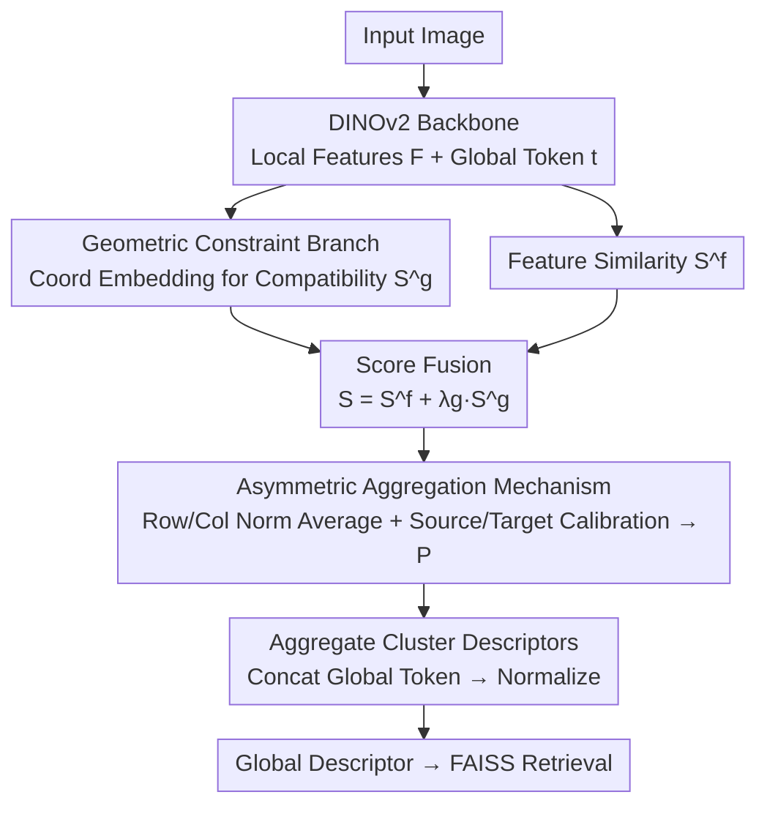

# A2GC: Asymmetric Aggregation with Geometric Constraints for Locally Aggregated Descriptors

**Conference**: CVPR 2026  
**Paper**: [CVF Open Access](https://openaccess.thecvf.com/content/CVPR2026/html/Li_A2GC_Asymmetric_Aggregation_with_Geometric_Constraints_for_Locally_Aggregated_Descriptors_CVPR_2026_paper.html)  
**Code**: https://github.com/CV4RA/A2GC  
**Area**: Visual Place Recognition / Image Retrieval  
**Keywords**: Visual Place Recognition, Optimal Transport, Feature Aggregation, Asymmetric Sinkhorn, Geometric Constraints

## TL;DR
Addressing the failure of the "symmetric Sinkhorn" assumption in feature aggregation for Visual Place Recognition (VPR), A2GC reformulates the Optimal Transport solver into an **asymmetric** version (averaging row/column normalization + independent source/target marginal calibration) and overlays a **geometric constraint branch** (using learnable coordinate embeddings to bias spatially adjacent features towards the same cluster), achieving 95.6% Recall@1 on Pitts30k.

## Background & Motivation

**Background**: Modern VPR follows a "two-stage" pipeline—deep backbones (e.g., DINOv2 ViT) extract local features, and aggregation modules compress these features into a compact global descriptor for retrieval. Aggregation is the performance bottleneck. Recently, Optimal Transport (OT) has become the mainstream framework: SALAD reformulates the "local features → learned cluster centers" soft assignment as a transport problem, solved via the Sinkhorn algorithm with a dustbin cluster to discard uninformative features.

**Limitations of Prior Work**: Standard Sinkhorn assumes that the **source and target marginals are symmetric and balanced**—effectively defaulting to the assumption that the "image feature distribution" and the "cluster center distribution" are similar. However, in practice, image features from diverse urban scenes can be clustered, heavy-tailed, or multi-modal; furthermore, the number of cluster centers (m=64) does not match the number of image tokens (n=H×W, hundreds or thousands). Forcing symmetric normalization limits performance when distributions are mismatched. Another neglected point: existing OT methods treat each feature as an **independent** entity, ignoring their spatial arrangement—whereas spatial adjacency often implies semantic correlation.

**Key Challenge**: The conflict between Sinkhorn's "symmetric marginal constraints" and the "naturally asymmetric source/target distributions" in VPR; and the waste of "spatial structural priors" due to the feature independence assumption.

**Goal**: (1) Relax the symmetry assumption of the OT solver to allow independent source and target marginal calibration; (2) Explicitly encode spatial geometric information into feature-cluster assignments to encourage spatially adjacent features to fall into the same cluster.

**Core Idea**: Replace symmetric Sinkhorn with **Asymmetric Optimal Transport** and integrate a **geometric compatibility** path—both embedded within the existing aggregation framework without changing the backbone or adding re-ranking, incurring almost zero extra overhead.

## Method

### Overall Architecture

The input to A2GC-VPR is a query/database image, and the output is a compact global descriptor for retrieval. The process is: The DINOv2 ViT backbone extracts a local feature map $F\in\mathbb{R}^{768\times H\times W}$ and a global token $t\in\mathbb{R}^{768}$. After projection, one path calculates the **feature similarity** $S^f$ with $m=64$ learnable cluster centers, while the other path computes **geometric compatibility** $S^g$ via coordinate embeddings. These are weighted and fused into a final score matrix $S$. This $S$ is fed as a log-affinity into the **Asymmetric OT Solver** (averaging row/column normalization → independent source/target calibration) to obtain the transport matrix $P$. $P$ is used to aggregate local features into cluster descriptors, which are then concatenated with the projected global token and normalized to form the final global descriptor. In the retrieval phase, L2-normalized descriptors are searched using FAISS.

The method is a clear pipeline of "dual-branch scoring → asymmetric solving → aggregation/concatenation," as illustrated in the architecture diagram:

### Key Designs

**1. Asymmetric Aggregation Mechanism: Letting source and target marginals calibrate independently, breaking free from symmetric Sinkhorn.**

The pain point is direct: Standard Sinkhorn's alternating symmetric row/column normalization becomes dominated by one dimension when the distributions and counts of source (clusters, $m+1$, including dustbin) and target (image tokens, $n$) are unequal. The A2GC solver has two stages. The first stage is **row/column normalization averaging**: Initialize the score matrix as $Z^{(0)}=M/\max(\tau,\epsilon)$ ($\tau$ is temperature, $\epsilon=10^{-6}$ for stability), then iterate $T=3$ times. In each iteration, row and column normalization are performed simultaneously in the log-domain and then averaged:

$$Z^{(t)}_r = Z^{(t-1)} - \mathrm{logsumexp}(Z^{(t-1)},\dim=2),\quad Z^{(t)}_c = Z^{(t-1)} - \mathrm{logsumexp}(Z^{(t-1)},\dim=1),\quad Z^{(t)}=\tfrac12\big(Z^{(t)}_r+Z^{(t)}_c\big)$$

Averaging instead of alternating balances row and column constraints simultaneously, preventing the solution from being "crushed" by one dimension and ensuring more stable convergence. The second stage is **Asymmetric Marginal Calibration**: After iterations, calibrate $u=\log a-\mathrm{logsumexp}(Z^{(T)},\dim=2)$ based on the source marginal $\log a$, applying $Z'=Z^{(T)}+u\mathbf{1}_n^\top$; then calibrate $v=\log b-\mathrm{logsumexp}(Z',\dim=1)$ based on the target marginal $\log b$, obtaining final $\log P=Z'+\mathbf{1}_{m+1}v^\top$. Crucially, $u$ and $v$ are calculated **separately and independently**—this is the source of "asymmetry." Standard Sinkhorn forces a shared symmetric constraint, while this allows the transport plan to adapt individually to each distribution, effectively handling the mismatch between cluster centers and image tokens in VPR.

**2. Geometric Constraints: Injecting spatial priors via learnable coordinate embeddings.**

The limitation of existing OT aggregation is treating features as independent points, losing the free prior of "spatial adjacency → semantic correlation." A2GC generates normalized coordinates $\mathrm{coord}_{xy}=\big(\tfrac{2x}{H-1}-1,\tfrac{2y}{W-1}-1\big)\in[-1,1]^2$ for each spatial position $(x,y)$, and uses a learnable projection network $\varphi_g$ ($1\times1$ convolution) to map them to geometric embeddings $g_{xy}=\varphi_g(\mathrm{coord}_{xy})\in\mathbb{R}^{d_g}$ ($d_g=16$). Each cluster center $c_j$ maintains it own learnable geometric embedding $c^g_j$ representing its "spatial preference." The geometric compatibility between position $(x,y)$ and cluster $j$ is the inner product $S^g_{ij}=g_{xy}^\top c^g_j$. The final score fuses this into feature similarity:

$$S_{ij} = S^f_{ij} + \lambda_g\, S^g_{ij}$$

where $\lambda_g$ is a **learnable scalar** (initialized at 0.15) that adaptively controls the strength of the geometric constraint. The effect is: when a cluster has a clear spatial preference, geometric compatibility pulls spatially adjacent features toward the same cluster, enhancing local consistency in assignments—at the cost of only a $1\times1$ convolution and a few embeddings.

### Loss & Training
The backbone is DINOv2 ViT-B/14, with only the **last 4 transformer blocks fine-tuned** and earlier blocks frozen (ablation shows tuning 2–4 blocks is optimal; full fine-tuning leads to overfitting). The aggregation module includes three sets of projection networks: global token to $g=256$, local features to cluster dimensions, and a scoring network for $m=64$ clusters. Training data is GSV-Cities (~1.2 million images, 23 cities, 4 images per location); AdamW optimizer with learning rate $6\times10^{-5}$, weight decay $9.5\times10^{-9}$, linearly decayed to 20%; MultiSimilarityLoss ($\alpha=1.0,\beta=50$) with MultiSimilarityMiner (cosine similarity, margin 0.1); batch size 60 on a single V100-32G.

## Key Experimental Results

### Main Results

Comparison with SOTA on four standard VPR benchmarks. A2GC (ViTg, descriptor size 33280) achieves the best results:

| Dataset | Metric | A2GC | Second Best | Note |
|--------|------|------|----------|------|
| Pitts30k | R@1/5/10 | **95.6**/99.3/99.8 | Pair-VPR 95.4/97.5/98.0 | Comprehensive lead in urban scenes |
| Pitts250k-test | R@1/5/10 | **97.3**/99.3/99.7 | FoL 97.0/99.2/99.5 | Surpasses FoL, SelaVPR |
| MSLS-val | R@1/5/10 | 93.6/97.5/97.9 | FoL 93.5 / Pair-VPR 95.4 | Slightly above FoL, R@1 below Pair-VPR |
| MSLS-challenge | R@1/5/10 | 80.6/90.9/92.5 | Pair-VPR 81.7 / FoL 80.0 | Comparable to FoL and Pair-VPR |

Note: Pair-VPR, SelaVPR, CricaVPR, etc., marked with `*` are two-stage re-ranking methods. A2GC achieves comparable or superior results as a **single-stage aggregation** method. ⚠️ On MSLS-challenge, Pair-VPR's R@1 (81.7) is actually higher than A2GC (80.6); the paper describes it as "comparable."

### Ablation Study

**Component Contribution** (Pitts30k val, ViTb):

| Configuration | R@1 | R@5 | R@10 | Description |
|------|-----|-----|------|------|
| Full A2GC | **94.9** | 98.5 | 99.5 | Full model |
| w/o Asymmetric Aggregation (A2GC) | 93.9 | 98.1 | 99.3 | R@1 drops by 1.0% |
| w/o Geometric Constraints (GC) | 94.1 | 97.9 | 99.5 | R@1 drops by 0.8% |
| w/o both | 92.5 | 96.4 | 97.8 | Drops by 2.4% without both |

**Backbone Scale** (Pitts30k):

| Backbone | Params | Latency | R@1 | R@5 | R@10 |
|------|--------|------|-----|-----|------|
| ViTs | 22.9M | 1.32ms | 94.0 | 98.5 | 99.3 |
| ViTb | 88.0M | 2.41ms | 94.9 | 98.5 | 99.5 |
| ViTl | 306.1M | 7.85ms | 95.4 | 99.2 | 99.7 |
| ViTg | 1106.3M | 25.06ms | 95.6 | 99.3 | 99.8 |

### Key Findings
- **Components are complementary and essential**: Removing asymmetric aggregation alone drops R@1 by 1.0%, and removing geometric constraints drops it by 0.8%. However, removing **both** drops performance by 2.4% (94.9→92.5), suggesting synergistic benefits.
- **Asymmetric aggregation has a larger impact on R@1**, while geometric constraints improve the consistency of top-5/10 results.
- **Scale-efficiency trade-off**: Moving from ViTs to ViTg only increases R@1 by 1.6% (94.0→95.6) but increases latency by 19× and parameters by 48×. ViTl is the sweet spot for practical deployment.
- **Fine-tuning strategy**: Tuning only the last 2–4 blocks is optimal (R@1 94.9%). **Full fine-tuning drops performance to 94.0%**, suggesting it disrupts pre-trained representations.
- **Descriptor size**: R@1 increases monotonically with size (93.7→95.0), but R@10 saturates at 99.5% after 2048+64.

## Highlights & Insights
- **Questioning the "Symmetric Sinkhorn" assumption is a clean entry point**: Changing the solver from symmetric to "average + independent calibration" is simple, interpretable, and directly addresses the real-world mismatch in VPR—this narrative of "exposing a default premise as flawed" is very persuasive.
- **Zero-cost geometric constraints**: A $1\times1$ convolution for coordinate embeddings + one geometric vector per cluster + a learnable $\lambda_g$ effectively injects the "spatial adjacency → same cluster" prior. This idea is transferable to any cluster-based aggregation.
- **Single-stage method competing with two-stage re-ranking**: A2GC approaches or exceeds methods like Pair-VPR and SelaVPR without re-ranking, implying that improvements in the aggregation layer can be more efficient than stacking re-ranking modules.

## Limitations & Future Work
- **Small absolute gains**: On already high baselines (SALAD/BoQ at 92–95% R@1), A2GC’s improvements are in the 0.5–1% range, and it doesn't consistently beat Pair-VPR on MSLS-challenge, indicating limited dividends in extreme cross-view/seasonal scenes.
- **Strong spatial assumptions**: The "spatial adjacency → same cluster" assumption holds in structured urban scenes but might be less effective under heavy repetitive textures, symmetric buildings, or large viewpoint changes. Whether the learnable $\lambda_g$ might shrink to zero in such cases is not deeply analyzed.
- **Theoretical properties of the asymmetric solver**: Averaging + independent calibration is no longer a strict doubly-stochastic projection. Its convergence/optimality guarantees are weaker than standard Sinkhorn, which the paper handles with empirical stability.
- **Future directions**: Making $\lambda_g$ adaptive per cluster/position or upgrading coordinate embeddings to relative positions/deformable offsets could further benefit large viewpoint change scenarios.

## Related Work & Insights
- **vs SALAD**: Both treat aggregation as OT with a dustbin cluster. However, SALAD uses standard symmetric Sinkhorn. A2GC replaces it with an asymmetric version and adds geometric constraints, improving R@1 from 95.1 to 97.3 on Pitts250k.
- **vs NetVLAD/MixVPR**: Earlier VLAD-based methods use learnable soft assignments or multi-scale mixing without OT transport constraints or distribution modeling. A2GC provides a more refined characterization of the assignment process.
- **vs SelaVPR/CricaVPR/Pair-VPR**: These involve transformer self-learning or cross-attention + two-stage re-ranking, often requiring architectural changes or extra overhead. A2GC emphasizes **no re-ranking and seamless integration** into existing frameworks at lower cost.

## Rating
- Novelty: ⭐⭐⭐⭐ Identifying the "symmetric Sinkhorn failure" is a clear and insightful angle; geometric constraints are more conventional.
- Experimental Thoroughness: ⭐⭐⭐⭐ Four benchmarks + complete ablations (backbone, size, fine-tuning, components); lacks a unified overhead comparison with re-ranking methods.
- Writing Quality: ⭐⭐⭐⭐ Clean motivation and complete formulas; horizontal comparison on MSLS-challenge is slightly optimistic.
- Value: ⭐⭐⭐⭐ Single-stage, low overhead, and plug-and-play for existing aggregation frameworks.

<!-- RELATED:START -->

## Related Papers

- [\[NeurIPS 2025\] On Topological Descriptors for Graph Products](../../NeurIPS2025/others/on_topological_descriptors_for_graph_products.md)
- [\[ICML 2026\] Networked Information Aggregation for Binary Classification](../../ICML2026/others/networked_information_aggregation_for_binary_classification.md)
- [\[NeurIPS 2025\] Asymmetric Duos: Sidekicks Improve Uncertainty](../../NeurIPS2025/others/asymmetric_duos_sidekicks_improve_uncertainty.md)
- [\[AAAI 2026\] Improved Differentially Private Algorithms for Rank Aggregation](../../AAAI2026/others/improved_differentially_private_algorithms_for_rank_aggregation.md)
- [\[ICCV 2025\] Joint Asymmetric Loss for Learning with Noisy Labels](../../ICCV2025/others/joint_asymmetric_loss_for_learning_with_noisy_labels.md)

<!-- RELATED:END -->
