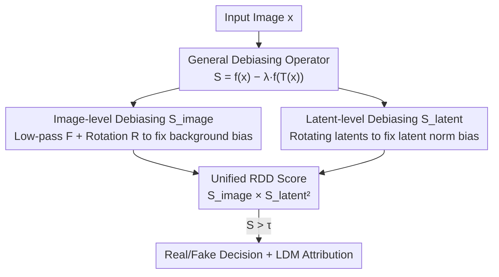

# A Debiased Reconstruction-based Framework for Training-Free Detection of AI-Generated Images

**Conference**: CVPR 2026  
**Paper**: [CVF Open Access](https://openaccess.thecvf.com/content/CVPR2026/html/Choi_A_Debiased_Reconstruction-based_Framework_for_Training_Free_Detection_of_AI-Generated_Images_CVPR_2026_paper.html)  
**Code**: To be confirmed  
**Area**: AI-Generated Image Detection  
**Keywords**: Training-free Detection, AIGI Forensics, Reconstruction Debiasing, Latent Diffusion, Data Augmentation

## TL;DR
To address the issue where "reconstruction-based training-free AI image detection" is biased by simple backgrounds or large latent norms, this paper proposes using augmentations like **rotation + low-pass filtering**—which "preserve bias factors but destroy forensic information"—to normalize reconstruction errors. By computing debiased scores at both the image and latent levels and fusing them into a unified RDD score, the method achieves training-free SOTA performance (average AUROC 0.981 / 0.940) across 18 sub-benchmarks including GenImage and LSUN-Bedroom.

## Background & Motivation

**Background**: Detecting whether an image is AI-generated (AIGI detection) has become a necessity. However, mainstream approaches are "training-based," requiring classifiers to be trained on real and fake images to learn discriminative features. Since generative models iterate rapidly and training data is often inaccessible, "training-free detection" is more practical: it relies only on a pretrained foundation model to design a scoring function $S(x)$, where $S(x) > \tau$ indicates a real image.

**Limitations of Prior Work**: The most common signal in training-free methods is the **image-level reconstruction error of LDM autoencoders** $f_{AE}(x)=d(x,\text{AE}(x))$ (e.g., AEROBLADE). The intuition is that since AEs are trained on the latent manifold of generative models, they reconstruct AIGIs with minimal loss while real images deviate from the distribution and exhibit higher error. However, the authors identify two **instance-specific biases** that dominate the scores regardless of authenticity:
- **Background Bias**: Real images with simple backgrounds or sparse textures are severely underestimated in reconstruction error, leading to misclassification as AI-generated (false positives). A toy experiment with 1,100 ImageNet "Jack-o'-lantern" images showed that after blacking out backgrounds with CLIPSeg, the reconstruction errors of real images became indistinguishable from those of SDv1.4 generated images.
- **Poor Generalization**: $f_{AE}$ depends heavily on the AE and fails for non-AE generative models (e.g., GANs). On LSUN ProGAN detection, the real/fake distribution of $f_{AE}$ overlaps completely (AUROC only 0.476).

**Key Challenge**: The "forensic signal (real vs. fake difference)" and "inherent instance attributes (background complexity, latent norm)" are coupled within the reconstruction error. The high variance of the latter overwhelms the former.

**Goal**: (1) Eliminate background as a confounding factor from image-level scores; (2) Introduce a new signal effective against GANs for training-free detection; (3) Fuse both signals into a unified score without introducing excessive hyperparameters.

**Key Insight**: Instead of improving the reconstruction error itself, one should find a transformation $T$ that **preserves bias factors but destroys forensic information**. By calculating the difference between the original and transformed image errors, the bias is canceled out, leaving only the real vs. fake difference. The authors discovered that rotation and low-pass filtering satisfy this property.

**Core Idea**: Perform normalized debiasing via "bias-preserving, forensic-destroying" augmentations—$S(x)=f(x)-\lambda f(T(x))$. This is applied at both image and latent levels, with the results multiplied for a unified score.

## Method

### Overall Architecture

The RDD input is a candidate image $x$, and the output is a scalar score $S_{RDD}(x)$ (higher values indicate real images). It processes through two parallel branches that are ultimately multiplied:

1. **Image-level Branch**: Uses the LDM autoencoder to calculate $f_{AE}$, debiased by low-pass filtering $F$ and 90° rotation $R$, resulting in LFID and RID scores. These are recursively combined into the image-level debiased score $S_{image}$, which specifically eliminates background bias and excels at detecting LDM-type images.
2. **Latent-level Branch**: Encodes the image into latent space $z_0=E(x)$ and uses the denoising reconstruction error $f_{latent}$ of a diffusion model at a small noise step $t$ as a new signal. Normalization is performed using rotated latents to remove "latent norm bias," yielding $S_{latent}$, which extends detection to non-AE models like GANs.
3. **Unification**: $S_{RDD}=S_{image}\times S_{latent}^2$. Multiplication is used because the two branches have different scales and ranges, and multiplication naturally balances them.

The key to the pipeline is not a new network architecture, but the repeated application of the same debiasing operator $S_{f,T,\lambda}(x)=f(x)-\lambda f(T(x))$ across different functions $f$ and transformations $T$.

### Key Designs

**1. General Debiasing Operator: Difference of Bias-Preserving, Forensic-Destroying Augmentations**

To address "bias coupling," where instance attributes mask forensic signals, the authors propose a unified formula:

$$S_{f,T,\lambda}(x) = f(x) - \lambda f(T(x)),\quad \lambda\in[0,1].$$

The transformation $T$ must satisfy two opposing properties: (1) **Preserve bias factors**—the background or norm bias on $T(x)$ should be nearly identical to $x$ to be canceled out; (2) **Destroy forensic information**—the real vs. fake difference on $T(x)$ should be diminished or distorted. Thus, $f(T(x))$ serves as a reference containing only bias, effectively normalizing the original score.

**2. Image-level Debiasing $S_{image}$: Dual Augmentation to Eliminate Background Bias**

Based on Fourier analysis, the authors found that real images exhibit **greater high-frequency deviation** in the $(x, \text{AE}(x))$ difference spectrum, while background information resides in low frequencies. This leads to two complementary augmentations:

- **Low-pass Filtered Image Debiasing (LFID)**: Filtering high frequencies makes real images easier to reconstruct while generated images change little, and backgrounds (low frequencies) remain unchanged. $S_{LFID}(x)=f_{AE}(x)-f_{AE}(F(x))$ with $\lambda_F=1$.
- **Rotated Image Debiasing (RID)**: Distortion after AE reconstruction for rotated images $R(x)$ is significantly more pronounced for generated images than real ones. $S_{RID}(x)=f_{AE}(x)-\lambda_R f_{AE}(R(x))$, where $R$ is a 90° rotation.

The total $S_{image}$ is computed recursively:

$$S_{image}(x)=S_{RID}(x)-S_{RID}(F(x))=f_{AE}(x)-f_{AE}(F(x))-\lambda_R f_{AE}(R(x))+\lambda_R f_{AE}(F(R(x))).$$

A key property is that $S_{image}$ is **commutative** regarding the order of operations.

**3. Latent-level Debiasing $S_{latent}$: Rotating Latents to Eliminate Latent Norm Bias**

To improve generalization for non-AE models, the authors introduce a **new training-free signal**: the latent space reconstruction error. After adding noise at a small step $t$, a denoising network $\epsilon_\theta$ predicts the noise:

$$f_{latent,t}(z_0)=\mathbb{E}_{\epsilon}\, d_{latent}(\epsilon_\theta(z_t,t,\phi),\epsilon)\approx\frac1n\sum_{i=1}^n d_{latent}(\epsilon_\theta(z_{t,i},t,\phi),\epsilon_i),$$

where $t$ is small to ensure reconstructability. However, a **latent-norm bias** exists: latents with larger $\ell_2$ norms naturally have lower reconstruction errors regardless of authenticity. By using **rotated latents** (preserving norm but deviating from the manifold) as a reference:

$$S_{latent}(z_0)=f_{latent,t}(R(z_0))-f_{latent,t}(z_0).$$

This significantly boosts GAN detection performance (LSUN ProGAN AUROC increases from 0.666 to 0.963).

**4. Unified RDD Score: Multiplicative Fusion of Complementary Signals**

$S_{image}$ excels at LDM detection, while $S_{latent}$ excels at GAN/Pixel-diffusion detection. To balance these without one dominating, the authors use multiplication:

$$S_{RDD}(x)=S_{image}(x)\times S_{latent}(E(x))^2.$$

Squaring $S_{latent}$ aligns the dimensions, as LPIPS in $S_{image}$ is effectively a sum of squared $\ell_2$ distances in feature space, mirroring the latent space error structure.

### Loss & Training

This method is **entirely training-free**. All scores are computed at test time using pretrained LDMs (SDv1.4/v2-base, MiniSD ensemble). Hyperparameters are fixed across all benchmarks: $t=0.05, \lambda_R=0.5$ (low-pass kernel size 3, $\sigma=0.8$).

## Key Experimental Results

### Main Results

Evaluated on GenImage (LDM-based T2I) and LSUN-Bedroom (GAN + Pixel-diffusion), RDD achieved SOTA or second-best on 16 out of 18 sub-benchmarks.

| Benchmark (Avg AUROC) | AEROBLADE | RIGID | Manifold Bias | WaRPAD | RDD (Ours) |
|--------|------|------|------|------|------|
| GenImage (8 models) | 0.932 | 0.820 | 0.719 | 0.946 | **0.981** |
| LSUN-Bedroom (10 models) | 0.476 | 0.861 | 0.920 | 0.934 | **0.940** |

Note: AEROBLADE fails (0.476) on LSUN when the AE model is unknown, while RDD remains robust (0.940) due to the latent branch.

### Ablation Study

Individual component contributions (Table 3) show the complementarity and the effectiveness of debiasing:

| Config | GenImage | LSUN-Bedroom | Description |
|------|------|------|------|
| $f_{latent}$ (Original Latent Recon) | 0.408 | 0.666 | Undebiased, weak |
| $f_{AE}$ (Original Image Recon) | 0.902 | 0.476 | Strong LDM, weak GAN |
| $S_{latent}$ (Debiased Latent) | 0.667 | 0.963 | Massive gain on GAN |
| $S_{image}$ (Debiased Image) | 0.969 | 0.464 | Further gain on LDM |
| $S_{RDD}$ (Unified) | **0.981** | **0.940** | Most robust overall |

### Key Findings

- **Debiasing is Effective**: $f_{AE} \rightarrow S_{image}$ improved GenImage AUROC from 0.902 to 0.969. $f_{latent} \rightarrow S_{latent}$ improved LSUN AUROC from 0.666 to 0.963.
- **Hyperparameter Robustness**: Performance is stable across a wide range of $\lambda_R$, $t$, and kernel parameters.
- **Augmentation Selection**: Common augmentations like ColorJitter or RandomResizedCrop performed significantly worse (0.907 / 0.841) than low-pass + rotation, validating the "bias-preserving, forensic-destroying" selection principle.
- **Robustness**: RDD remains stable under JPEG compression and resampling.
- **LDM Attribution**: $S_{image}$ outperfoms specialized methods like LatentTracer in identifying which LDM generated an image, and is ~50× faster (0.292s vs 14.65s).

## Highlights & Insights
- **Transferable Debiasing Paradigm**: The formula $f(x)-\lambda f(T(x))$ provides a blueprint for any training-free task where instance-specific attributes confound target signals.
- **Multi-purpose Rotation**: 90° rotation serves both as an OOD augmentation for image-level distortion and a norm-preserving reference for latent-level normalization.
- **Innovation in Signals**: First to use latent reconstruction error for training-free detection, specifically diagnosing and solving the "latent norm bias."
- **Multiplicative Fusion**: The use of multiplication and squaring to align scales ($S_{image} \times S_{latent}^2$) is theoretically sound and provides synergistic gains.

## Limitations & Future Work
- **Inference Speed**: Requires multiple forward passes (reconstruction on augmented images and latents), making it slower than single-score baselines.
- **LDM Dependency**: Relies on a "good" pretrained LDM; generalization to generative paradigms entirely different from the LDM's latent manifold remains bounded by the LDM's representation.
- **Augmentation Exploration**: Only rotation and low-pass filtering were validated; optimal "bias-preserving" transformations (perhaps learnable ones) could be explored.

## Related Work & Insights
- **vs. AEROBLADE**: Uses same $f_{AE}$ signal but lacks debiasing and latent branch, causing failure on non-LDM models.
- **vs. Manifold-induced Bias**: Uses CLIP space similarities; RDD is more robust on LDM-type data due to dual-level debiasing.
- **vs. LatentTracer**: LatentTracer requires optimization at test time (14.65s/image); RDD is optimization-free and significantly faster (0.292s/image).

## Rating
- Novelty: ⭐⭐⭐⭐⭐ 
- Experimental Thoroughness: ⭐⭐⭐⭐⭐ 
- Writing Quality: ⭐⭐⭐⭐ 
- Value: ⭐⭐⭐⭐⭐ 

<!-- RELATED:START -->

## Related Papers

- [\[CVPR 2026\] A Difference-in-Difference Approach to Detecting AI-Generated Images](a_difference-in-difference_approach_to_detecting_ai-generated_images.md)
- [\[CVPR 2026\] Zero-shot Detection of AI-Generated Image via RAW-RGB Alignment](zero-shot_detection_of_ai-generated_image_via_raw-rgb_alignment.md)
- [\[CVPR 2026\] FedSDR: Federated Graph Learning with Structural Noise Detection and Reconstruction](fedsdr_federated_graph_learning_with_structural_noise_detection_and_reconstructi.md)
- [\[CVPR 2026\] Debiased Sample Selection for Learning with Noisy Labels](debiased_sample_selection_for_learning_with_noisy_labels.md)
- [\[CVPR 2026\] SimRecon: SimReady Compositional Scene Reconstruction from Real Videos](simrecon_simready_compositional_scene_reconstruction_from_real_videos.md)

<!-- RELATED:END -->
