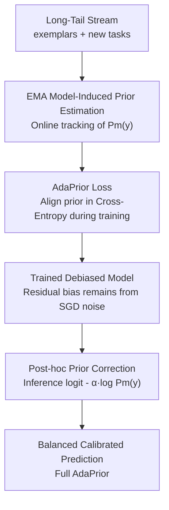

# AdaPrior: Bayesian-Inspired Adaptive Prior Correction for Long-Tailed Continual Learning

**Conference**: CVPR 2026  
**Paper**: [CVF Open Access](https://openaccess.thecvf.com/content/CVPR2026/html/Bhat_AdaPrior_Bayesian-Inspired_Adaptive_Prior_Correction_for_Long-Tailed_Continual_Learning_CVPR_2026_paper.html)  
**Code**: To be confirmed  
**Area**: Continual Learning / Long-Tail Recognition  
**Keywords**: Long-Tailed Class Incremental Learning (LTCIL), Bayesian Prior Correction, EMA Prior Estimation, Logit Adjustment, Model-Induced Prior

## TL;DR
AdaPrior reinterprets Long-Tailed Continual Learning (LTCIL) as a "model-induced prior drift" problem. It uses EMA to online estimate the model's self-learned prior $P_m(y)$, followed by Bayesian alignment for debiasing in both training loss and inference post-processing. This single-stage, plug-and-play approach consistently outperforms recent LTCIL baselines on CIFAR100-LT, ImageNet-subset-LT, and iNaturalist18-subset.

## Background & Motivation
**Background**: Long-tailed class incremental learning must simultaneously address two major challenges—catastrophic forgetting (limited exemplars for old tasks) and class imbalance (head classes dominate over tail classes). Mainstream approaches rely on either re-sampling/re-weighting or two-stage classifier alignment (e.g., GVAlign, LWS), where the classifier is fine-tuned on a balanced subset after initial training.

**Limitations of Prior Work**: Two-stage methods require an additional round of balanced training, leading to high computational overhead and poor scalability. Single-stage logit adjustment methods (such as frequency prior $\log P(y)$ correction or gradient re-weighting) **assume that the model accurately learns $P(y|x)$ and that the class prior equals the dataset frequency $P_\text{freq}(y)$**.

**Key Challenge**: The authors identify a neglected "hidden failure mode"—**prior drift**. In a continual stream, as new tasks arrive, model predictions become increasingly biased toward recently seen classes. Even if dataset class frequencies remain fixed, the **actual prior learned by the model** $P_m(y)$ shifts due to representation drift, imbalanced replay, and distillation, causing a mismatch with the static frequency prior $P_\text{freq}(y)$. Consequently, using a fixed $\log P(y)$ often leads to over- or under-correction, distorting the posterior $P(y|x)$. Fig.1 demonstrates that both classic LUCIR+CE and recent GVAlign develop strong biases toward new task classes in later stages.

**Goal**: Reformulate LTCIL from a "data count bias" problem to a "distribution misalignment" problem. The objective is to align the **model-induced prior** rather than data frequency in a single-stage, low-overhead manner that is plug-and-play for any CIL method.

**Core Idea**: Use $P_m(y)\approx \mathbb{E}_x[P(y|x)]$ to online estimate the model's own prior (via EMA tracking). Then, perform Bayesian alignment at both the **training loss** and **inference post-processing** levels to pull the posterior back to the balanced evaluation distribution $P_t(y)$ (as LTCIL evaluation sets are typically uniform).

## Method

### Overall Architecture
All modifications in AdaPrior occur at the "logit-prior" interface, making it backbone-agnostic and compatible with any CIL pipeline (the paper uses LUCIR as a base). The logic is: **first, online estimate the actual prior $P_m(y)$ learned by the model, then use it for dual-level debiasing during training (loss modification) and inference (logit adjustment)**.

The Bayesian starting point is Eq.2: when the training distribution is imbalanced, the learned posterior is distorted by the prior ratio $\frac{P_t(y)}{P(y)}$. Classic logit adjustment corrects this via $z_t = z - \log P(y) + \log P_t(y)$. AdaPrior's key change is replacing the static $P(y)$ with a **dynamic $P_m(y)$**. It supports three modes: ① Post-hoc only; ② AdaPrior Loss only; ③ Full AdaPrior (Ours = Loss for training + post-hoc to remove residual SGD noise).

### Key Designs

**1. EMA Online Estimation of Model-Induced Prior: Measuring the model's own bias in real-time**

This is the foundation of the method, addressing the issue that the "static frequency prior $P(y)$ does not match the actual model bias." AdaPrior stops using dataset class counts and instead measures the prior directly from the model's current posterior: $P_m(y)\approx \frac{1}{|D_\tau|}\sum_{x\in D_\tau} P_m(y|x)$, where $P_m(y|x)=\mathrm{Softmax}(z(x,y))$. During training, since $P_m(y)$ changes continuously, it is tracked via EMA:

$$P_m^{i}(y) = (1-\gamma)\,P_m^{i-1}(y) + \gamma\,\frac{1}{|B_i|}\sum_{x\in B_i} P_m(y|x)$$

where $i$ is the iteration, $B_i$ is the current batch, and $\gamma$ is the momentum. Initialization is set to $P_m^0(y)=P(y)$ (class frequency). This update is essentially a Robbins–Monro recursion. Theorem 3 proves that it converges almost surely to the true prior in steady states, and the tracking error is bounded during slow drift. The overhead is negligible, requiring only $O(K)$ memory for a vector of length $K$.

**2. AdaPrior Loss: Integrating prior alignment into Cross-Entropy**

Inference-only correction is insufficient because training itself remains biased toward head classes. The second design integrates prior correction into the loss function:

$$L_{PA} = -\log \frac{\exp\!\big(\bar z(x,y)+\log \tfrac{P_m(y)}{P_t(y)}\big)}{\sum_k \exp\!\big(\bar z(x,k)+\log \tfrac{P_m(k)}{P_t(k)}\big)}$$

where $\bar z$ denotes the unadjusted logit. Theorem 2 provides an interpretable decomposition: this loss is approximately equal to $\mathrm{CE}(P(y), P_m(y|x)) + \mathrm{KL}(P_m(y)\,\|\,P_t(y))$. It **simultaneously** minimizes prediction error and the divergence between the model's prior and the target balanced prior, consolidating what previously required a second stage of fine-tuning into a single-stage objective.

**3. Post-hoc Bayesian Correction: One-click debiasing during inference**

Even with debiased training, SGD noise can leave residual bias. The third design performs a lightweight logit correction during inference (Theorem 1):

$$z^{\tau}(x,y) = \bar z^{\tau}(x,y) + \alpha\,\big(\log P_t(y) - \log P_m^{\tau}(y)\big)$$

$\alpha\in[0,1]$ is a tempering coefficient. Since the LTCIL evaluation set is balanced ($P_t(y)$ is uniform), this simplifies to $z^{(\alpha)}(x,y)=z(x,y)-\alpha\log P_m^{\tau}(y)$, effectively suppressing head class logits and boosting target classes. $\alpha$ is necessary because $P_m$ is estimated from finite, drifting data; an optimal $\alpha\approx0.6\text{–}0.7$ balances correction and estimation noise.

## Key Experimental Results

### Main Results
Based on the LUCIR pipeline, using ResNet-32 for CIFAR100-LT and ResNet-18 for ImageNet-subset-LT/iNaturalist18-subset. Imbalance Factor (IF)=100, exemplars per class=20. LFS = Learn From Scratch; LFH = Learn From Half.

Shuffled LTCIL (Table 1, Average Incremental Accuracy %):

| Dataset/Setting | Split | GradReweight | LUCIR+CE | AdaPrior Loss | Full AdaPrior |
|------|------|------|------|------|------|
| CIFAR100-LT · LFS | 10 Tasks | 35.66 | 29.97 | 34.07 | **36.94** |
| CIFAR100-LT · LFH | 5 Tasks | 40.18 | 36.69 | 40.97 | **43.31** |
| ImageNet-subset · LFS | 10 Tasks | 45.12 | 34.77 | 42.04 | **45.28** |
| ImageNet-subset · LFH | 10 Tasks | 49.13 | 48.98 | 58.21 | **59.28** |

iNaturalist18-subset (Table 3, Natural extreme imbalance IF≈435, LFH):

| Method | Ordered 5-task | Ordered 10-task | Shuffled 5-task | Shuffled 10-task |
|------|------|------|------|------|
| GVAlign (Two-stage) | 72.42 | 70.69 | 67.23 | 64.41 |
| LUCIR | 70.29 | 69.65 | 62.83 | 63.39 |
| AdaPrior Loss | 74.31 | 72.52 | 67.69 | 67.57 |
| Full AdaPrior | **74.41** | 72.26 | **69.52** | **68.10** |

### Ablation Study

Comparison with other logit adjustment methods (Table 5):

| Method | CIFAR100-LT 10-task | ImageNet-subset 10-task | Note |
|------|------|------|------|
| LUCIR+CE | 37.45 | 48.98 | Baseline |
| +logN | 41.60 | 55.03 | Static frequency prior |
| +Balsoft | 41.06 | 54.75 | Balanced Softmax |
| +AdaPrior* (Post-hoc) | 41.91 | 56.27 | Dynamic prior post-hoc |
| +Full AdaPrior | **42.85** | **59.28** | Loss + post-hoc |

### Key Findings
- **Dynamic Prior > Static Frequency Prior**: Replacing $P(y)$ with EMA-estimated $P_m(y)$ yields consistent gains, confirming that priors drift during LTCIL.
- **Mutual Complementarity**: AdaPrior Loss is strong alone, but adding post-hoc correction further removes residual bias.
- **Robustness**: Performance is stable across $\gamma\approx0.05$ and $\alpha\approx0.6\text{–}0.7$. It maintains a lead even with as few as 5 exemplars per class.
- **Architecture Agnostic**: Applying post-hoc correction to PODNET without tuning still yields +1~3% gains.

## Highlights & Insights
- **Problem Redefinition**: Recasting the source of bias from "data counts" to "model-induced prior drift" is the core contribution.
- **Unified Mechanism**: A single prior estimate $P_m(y)$ drives two stages of debiasing with almost zero extra computational cost.
- **Theoretical Grounding**: Proving the CE + KL decomposition provides a rigorous basis for the modified loss function.
- **Tempering Logic**: Acknowledging noise in prior estimation using $\alpha$ is a simple yet effective robustification.

## Limitations & Future Work
- Experiments primarily focused on CNNs and small-to-medium scale data. Validation on Transformers and multi-modal backbones remains for future work.
- The scale-up evidence (ImageNet-1k) is currently limited to the appendix.
- Assumes evaluation distribution $P_t(y)$ is uniform; scenarios with imbalanced or unknown test priors are not explored.

## Related Work & Insights
- **Vs. Two-stage LTCIL (GVAlign/LWS)**: AdaPrior eliminates the need for a second stage by integrating alignment into the training loss (KL term).
- **Vs. Static Logit Adjustment (logN/Balanced Softmax)**: These methods fail when the prior drifts; AdaPrior's EMA tracking adapts to model shifts.
- **Vs. Gradient Re-weighting**: AdaPrior achieves better calibration (lower ECE/NLL) by moving beyond frequency-based assumptions.

## Rating
- Novelty: ⭐⭐⭐⭐ Clear perspective shift to dynamic model-induced priors.
- Experimental Thoroughness: ⭐⭐⭐⭐ Exhaustive ablation and cross-dataset testing, though 1k-scale validation is secondary.
- Writing Quality: ⭐⭐⭐⭐ Logical flow from motivation to theory and experiments.
- Value: ⭐⭐⭐⭐ Practical, single-stage, and plug-and-play.

<!-- RELATED:START -->

## Related Papers

- [\[CVPR 2026\] Confusion-Aware Spectral Regularizer for Long-Tailed Recognition](confusion-aware_spectral_regularizer_for_long-tailed_recognition.md)
- [\[CVPR 2026\] Adaptive Bayesian Early-Exit Networks for Efficient Non-Transferable Learning](adaptive_bayesian_early-exit_networks_for_efficient_non-transferable_learning.md)
- [\[CVPR 2026\] A Faster Path to Continual Learning](a_faster_path_to_continual_learning.md)
- [\[CVPR 2026\] FEAT: Federated Geometry-Aware Correction for Exemplar Replay under Continual Dynamic Heterogeneity](feat_federated_geometry_aware_correction_for_exemplar_replay_under_continual_dynamic_heterogeneity.md)
- [\[CVPR 2026\] Spectral Mixture-of-Experts for Continual Learning](spectral_mixture-of-experts_for_continual_learning.md)

<!-- RELATED:END -->
