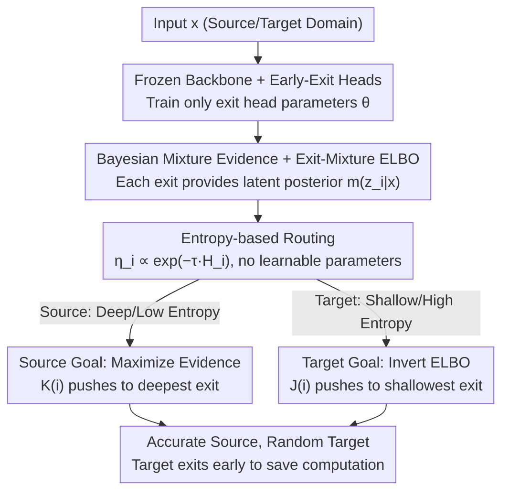

# Adaptive Bayesian Early-Exit Networks for Efficient Non-Transferable Learning

**Conference**: CVPR 2026  
**Paper**: [CVF Open Access](https://openaccess.thecvf.com/content/CVPR2026/html/Luan_Adaptive_Bayesian_Early-Exit_Networks_for_Efficient_Non-Transferable_Learning_CVPR_2026_paper.html)  
**Code**: Not publicly available  
**Area**: Model IP Protection / Non-transferable Learning / Dynamic Early-Exit Networks  
**Keywords**: Non-Transferable Learning, Early-Exit Network, Bayesian routing, Model IP protection, dynamic inference

## TL;DR
ENL-DEE redesigns "Non-Transferable Learning (NTL)" as a **Bayesian early-exit network**. By freezing the backbone and training only several early-exit classification heads, it uses entropy-based routing to guide source domain samples to deep exits (preserving performance) and eject target domain samples at shallow exits (non-semantic features, accuracy near random). This significantly strengthens model IP protection while drastically reducing training and inference costs.

## Background & Motivation
**Background**: Training a high-quality model is expensive, making the model a valuable piece of Intellectual Property (IP). Non-Transferable Learning (NTL) is a category of "usage authorization" methods: it ensures the model maintains high accuracy on the authorized **source domain**, while **intentionally** performing poorly on unauthorized **target domains**, thereby controlling "model usage only on permitted data." A typical scenario involves a diagnostic model trained by Hospital A being restricted from functioning on another hospital's data. Mainstream methods (NTL[36], CUTI[37]) rely on maximizing distribution differences between domains or emphasizing authorized private style features to block cross-domain transfer.

**Limitations of Prior Work**: The authors identify three critical flaws in existing NTL. ① **Training Inefficiency**—they require retraining the entire backbone and updating all parameters, which is nearly impossible for large-scale models. ② **Inference Inefficiency**—both source and target data must traverse the full network, even though target data is meant to yield incorrect results, making full traversal wasteful. ③ **Optimization Conflicts from Shared Backbones**—the source domain requires accuracy while the target domain requires inaccuracy, but both share the same parameters. Coupled with category overlaps, these conflicting objectives lead to degraded source accuracy and insufficient target suppression.

**Key Challenge**: Simultaneously maximizing source performance and minimizing target performance on a single set of parameters is inherently contradictory. Existing deterministic methods treat each input and decision as fixed, ignoring the uncertainty of different domains, which leads to unstable optimization and difficult coordination.

**Goal**: To develop an NTL framework that is both efficient in terms of training/inference costs and capable of **decoupling** the optimization of source and target domains.

**Key Insight**: The authors observe that deep features are semantically rich and beneficial for classification, whereas shallow features are low-level, non-semantic, and possess weak discriminative power. Therefore, if **source samples go deep and target samples exit early**, NTL goals are naturally achieved while saving computation. Determining "how deep to go" reliably requires characterizing the uncertainty of each exit. Thus, a **Bayesian** framework is used to estimate exit confidence, replacing fixed routing with adaptive routing.

**Core Idea**: Replace "retraining a shared backbone" with "frozen backbone + multiple early-exit heads + Bayesian entropy routing + domain-asymmetric loss." This transforms NTL from a full-network optimization problem into a lightweight task of tuning exit heads and routing samples to appropriate depths based on their domain.

## Method

### Overall Architecture
ENL-DEE (Efficient Non-transferable Learning via Dynamic Early-Exit) is built upon a **frozen backbone** with $E$ early-exit classification heads inserted at various depths. For a given input $x$, each exit $i$ first outputs a Gaussian posterior $m(z_i\mid x)$ for a latent variable $z_i$ from the backbone, which is then passed to its specific classification head to provide a prediction distribution $p_\theta^{(i)}(y\mid x)$. The framework models the decision of "which exit to use" as a discrete routing variable $d$. Soft routing weights $\eta_i(x)$ are calculated based on the **entropy** of each exit's prediction distribution (lower entropy/higher confidence results in higher weights). A **domain-dependent routing prior** $\pi^{(s)}/\pi^{(t)}$ pushes source samples toward deep exits and target samples toward shallow exits. During training, **only the exit head parameters $\theta$ are updated**, while the backbone remains frozen. Source and target domains use **opposite signs** in their losses, allowing them to utilize different sets of exit parameters and bypassing optimization conflicts. During inference, data can exit at intermediate layers—source data likely reaches the deepest exit, while target data is ejected early.

### Key Designs

**1. Frozen Backbone, Trained Exits: Replacing Full-Network Retraining with Exit Tuning**

The primary cost of existing NTL methods is retraining the entire backbone. ENL-DEE freezes the backbone $f_e$, which only serves to output the Gaussian parameters—mean $f_e^\mu(x)$ and covariance $f_e^\Sigma(x)$—for the latent variable at each exit, i.e., $m(z_i\mid x)=\mathcal N\!\big(z_i\mid f_e^\mu(x), f_e^\Sigma(x)\big)$. Learnable parameters $\theta$ are restricted to the classification heads. This reduces training costs from updating all weights to updating a few lightweight heads. More importantly, this provides the physical basis for solving optimization conflicts: as source and target domains are routed to different exits with **distinct parameter sets**, the conflicting goals no longer compete for the same weights.

**2. Exit-Mixture ELBO: Turning Exit Decisions into an Optimizable Variational Bound**

A limitation of deterministic NTL is treating exit decisions as fixed, failing to capture how reliable a sample is at a given layer. ENL-DEE views the likelihood as a mixture where each exit is a component weighted by $\eta_i(x)$:
$$p_\theta(y\mid x)=\sum_{i=1}^E \eta_i(x)\!\int p_\theta(y\mid z_i)\,p_\theta(z_i\mid x, d{=}i)\,dz_i.$$
To make this tractable, the authors introduce amortized posteriors $\{m(z_i\mid x)\}$ and $q(d\mid x)$, using Jensen's inequality to derive the Exit-Mixture ELBO:
$$\mathcal L_{\text{ELBO}}(x,y)=\sum_{i=1}^E \eta_i(x)\Big[\mathbb E_{z_i\sim m}\log p_\theta(y\mid z_i)-\mathrm{KL}\big(m(z_i\mid x)\,\|\,p(z_i)\big)\Big]-\mathrm{KL}\big(q(d\mid x)\,\|\,\pi\big).$$
The first term aligns predictions with the ground truth $y$ while regularizing the latent representation. The final term aligns the data-dependent routing $q(d\mid x)$ with a **domain-specific prior** $\pi$ (deep-biased $\pi^{(s)}$ for source, shallow-biased $\pi^{(t)}$ for target). Latent variables are sampled via reparameterization $z_i=f(x,\epsilon),\ \epsilon\sim\mathcal N(0,I)$.

**3. Entropy-based Routing: Deciding Exit Depth with Zero Extra Parameters**

The framework requires routing weights that reflect exit confidence without introducing new parameters. The authors use the Shannon entropy of each exit's prediction:
$$H_i(x)=-\sum_c p_\theta^{(i)}(y{=}c\mid x)\log p_\theta^{(i)}(y{=}c\mid x),$$
mapped to routing weights via a Boltzmann distribution:
$$\eta_i(x)=\frac{\exp(-\tau H_i(x))}{\sum_{j=1}^E \exp(-\tau H_j(x))},\qquad \tau>0\ (\text{setting }\tau{=}1).$$
Exits with lower entropy (higher confidence) receive higher weights. Since $\eta_i$ is derived entirely from output entropy, it contains **no learnable parameters**, ensuring $\theta$ remains localized in the classification heads and making "how deep to go" a data-driven adaptive decision.

**4. Domain-Asymmetric Depth Shaping: Encouraging Decisive Depth and Shallow Ambiguity**

The routing is further guided by domain-specific losses. A depth shaping coefficient $K(i)=\mathbb I[i{=}E]-\mathbb I[i{<}E]$ is defined (+1 for the deepest exit, -1 otherwise). The **Source Domain** maximizes evidence and shapes entropy by penalizing early decisiveness and rewarding late-stage certainty:
$$\mathcal L_s(x_s,y_s)=-\mathcal L_{\text{ELBO}}^{(s)}(x_s,y_s)+\alpha\sum_{i=1}^E \eta_i(x_s)\,K(i)\,H_i(x_s).$$
The **Target Domain** does the opposite, using $J(i)=-K(i)$ and inverting the ELBO (penalizing prediction fit while rewarding simple latent representations and shallow routing):
$$\mathcal L_t(x_t,y_t)=\mathcal F^{(t)}(x_t,y_t)+\alpha\sum_{i=1}^E \eta_i(x_t)\,J(i)\,H_i(x_t).$$
Consequently, source samples are pushed to deep exits (high accuracy), while target samples are pushed to shallow exits (random accuracy), fulfilling NTL requirements while improving efficiency.

## Key Experimental Results

### Main Results
Accuracy on the source domain should ideally be **high**, while accuracy on the target domain should be **low**. The **Performance Gain (PG)** metric is defined as:
$$\text{PG}=\big(Acc_s^{m}-Acc_s^{SL}\big)+\big(\overline{Acc}_t^{SL}-\overline{Acc}_t^{m}\big),$$
representing the gain relative to standard Supervised Learning (SL). Baselines include SL (no protection), NTL[36], and CUTI[37].

Target-Specified tasks on ViT (CIFAR-10 / STL-10):

| Method | Source | Source Acc | Target Acc | PG |
|------|------|---------|-----------|-----|
| SL | CIFAR-10 | 83.22 | 62.60(STL) | 0.0 |
| NTL | CIFAR-10 | 76.00 | 10.50(STL) | 44.9 |
| CUTI | CIFAR-10 | 74.42 | 10.50(STL) | 43.3 |
| **ENL-DEE** | CIFAR-10 | **82.10** | 11.00(STL) | **50.5** |
| **ENL-DEE** | STL-10 | **77.82** | 10.10(CIFAR) | **40.1** |

On ViT, ENL-DEE preserves source accuracy close to SL levels (82.1 vs 83.2), whereas NTL/CUTI drop to 74-76%. Target accuracy is successfully suppressed to ~11%. For DomainNet (ResNet-34), ENL-DEE maintains **positive PG** across all domain combinations, whereas NTL and CUTI often result in negative PG, signifying that their protection measures severely damage source performance.

### Exit Distribution Statistics (Mechanism Verification)
This verifies whether source/target samples exit at the intended depths (PACS / ViT):

| Source | exit0 | exit1 | exit2 | exit3 | exit4 |
|------|-------|-------|-------|-------|-------|
| Source | 0.09% | 0.00% | 0.26% | 0.00% | **99.65%** |
| Target | **95.70%** | 2.64% | 0.66% | 0.00% | 0.99% |

99.65% of source samples reach the final exit, while 95.70% of target samples are ejected at the very first exit, validating the theoretical mechanism and efficiency claims.

### Ablation Study

| Config | Behavior | Description |
|------|------|------|
| $\beta=0$ | Degenerates to SL | No protection applied |
| $\beta=1$ | **Highest PG** | Balanced source/target losses, optimal |
| $\beta=2$ | Decreased PG | Over-protection, source performance drops |
| Head Designs | Multiple architectures effective | Low sensitivity to specific head structures |

$\beta=1$ provides the best trade-off. Larger $\beta$ values sacrifice source usability for excessive target suppression.

## Highlights & Insights
- **Unified Mechanism**: Solves for both Non-transferability and early-exit efficiency using a single routing logic—target domain early exits provide protection and save compute simultaneously.
- **Backbone Freezing**: Shifting the training burden to lightweight exit heads makes NTL feasible for large pre-trained models.
- **Zero-Parameter Entropy Routing**: Using prediction entropy as a soft gate avoids new learnable parameters and provides a robust, data-driven confidence measure.
- **Physical Decoupling**: Optimization conflicts are resolved by routing domains to different parameter sets (distinct exit heads), which is more effective than weight balancing on shared parameters.

## Limitations & Future Work
- **Static assumption**: The current method assumes a static target domain; handling drifting or evolving target distributions remains a future direction.
- **Efficiency Reporting**: While logically sound, the paper lacks direct quantitative comparisons of training/inference time (e.g., FLOPs or wall-clock time) against baselines.
- **Inverted ELBO Stability**: The impact of using a reversed ELBO on the stability of shallow exit representations is not deeply analyzed.

## Related Work & Insights
- **vs NTL[36] & CUTI[37]**: Unlike prior methods that require full-network updates and full-inference passes, ENL-DEE uses path-based decoupling and frozen backbones to maintain superior source accuracy (especially on complex datasets like DomainNet) while minimizing costs.
- **vs Standard Early-Exit (BranchyNet)**: Traditional early-exit networks aim for uniform efficiency; this work is the first to utilize exit depth as a mechanism for IP protection and domain authorization.

## Rating
- Novelty: ⭐⭐⭐⭐⭐ 
- Experimental Thoroughness: ⭐⭐⭐⭐ 
- Writing Quality: ⭐⭐⭐⭐ 
- Value: ⭐⭐⭐⭐ 

<!-- RELATED:START -->

## Related Papers

- [\[CVPR 2026\] AdaPrior: Bayesian-Inspired Adaptive Prior Correction for Long-Tailed Continual Learning](adaprior_bayesian-inspired_adaptive_prior_correction_for_long-tailed_continual_l.md)
- [\[CVPR 2026\] Towards Knowledge-augmented Bayesian Deep Learning For Computer Vision](towards_knowledge-augmented_bayesian_deep_learning_for_computer_vision.md)
- [\[CVPR 2026\] Efficient Unrolled Networks for Large-Scale 3D Inverse Problems](efficient_unrolled_networks_for_large-scale_3d_inverse_problems.md)
- [\[CVPR 2026\] Adaptive Data Augmentation with Multi-armed Bandit: Sample-Efficient Embedding Calibration for Implicit Pattern Recognition](adaptive_data_augmentation_with_multi-armed_bandit_sample-efficient_embedding_ca.md)
- [\[CVPR 2026\] Smart Replay: Adaptive Scheduling of Memory Rehearsal for Computational Resource-Aware Incremental Learning](smart_replay_adaptive_scheduling_of_memory_rehearsal_for_computational_resource-.md)

<!-- RELATED:END -->
