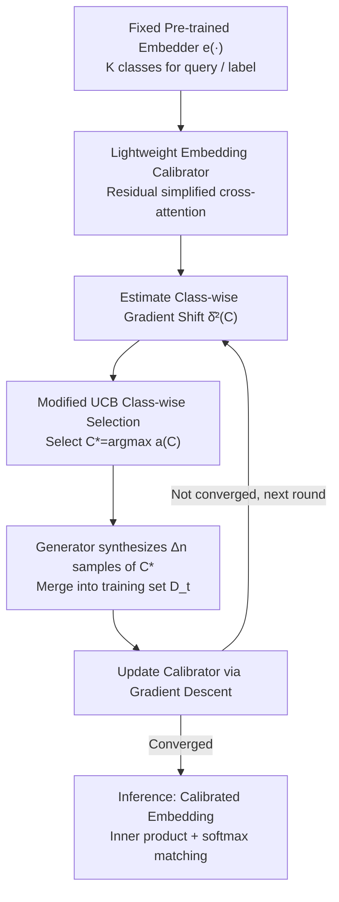

# Adaptive Data Augmentation with Multi-armed Bandit: Sample-Efficient Embedding Calibration for Implicit Pattern Recognition

**Conference**: CVPR 2026  
**Paper**: [CVF Open Access](https://openaccess.thecvf.com/content/CVPR2026/html/Tang_Adaptive_Data_Augmentation_with_Multi-armed_Bandit_Sample-Efficient_Embedding_Calibration_for_CVPR_2026_paper.html)  
**Code**: To be confirmed  
**Area**: Few-shot Learning / Data Augmentation / Embedding Calibration  
**Keywords**: Embedding Calibration, Multi-armed Bandit, Adaptive Data Augmentation, Few-shot, Long-tail Recognition

## TL;DR
ADAMAB trains a lightweight "calibrator" on top of frozen pre-trained embedding models and utilizes a modified Upper Confidence Bound (UCB) algorithm to adaptively determine which data to synthesize for augmentation on a **per-class** basis. This approach improves accuracy by up to approximately 40% on few-shot long-tail recognition tasks with only 2–5 initial samples per class, providing theoretical guarantees for convergence.

## Background & Motivation
**Background**: When utilizing LLMs/VLMs for implicit pattern recognition (e.g., long-tail topic classification, fine-grained categories, safety intent classification), prevailing practices include in-context learning, embedding similarity retrieval, rerankers, or fine-tuning/PEFT of base models.

**Limitations of Prior Work**: These methods encounter difficulties in "data scarcity + long-tail knowledge" scenarios. First, pre-training corpora of base models may not cover specific niche knowledge, and as they are "trained for generation," they excel at fitting likelihood $p(x\mid y)$ rather than the posterior $p(y\mid x)$ required for classification, resulting in low zero-shot accuracy. Second, fine-tuning is either prohibitively expensive in terms of compute (e.g., CLIP has 0.4B parameters) or entirely unfeasible (e.g., closed-source models only accessible via API without LoRA support). While active learning reduces labeling effort, it assumes a **large** pool of unlabeled samples, which does not exist in long-tail few-shot scenarios. Synthetic data augmentation bypasses human labor, but existing methods mostly rely on **random augmentation**, which wastes non-trivial invocation costs of advanced generators (like GPT-Image-1) and introduces high-variance gradients that divert convergence in few-shot training.

**Key Challenge**: In few-shot settings, a systematic "gradient shifting" exists between the empirical gradient calculated from small training sets and the true gradient. Blind random augmentation fails to suppress this shift efficiently—it is unbiased only in expectation but suffers from high variance.

**Goal**: Find a data augmentation strategy that achieves fast and stable convergence with a minimal generation budget, under the constraint of not modifying base model parameters and having extremely few initial samples per class.

**Key Insight**: Modeling "which class to synthesize" as a multi-armed bandit problem—where each class represents an arm. In each round, an arm is selected to synthesize $\Delta n$ samples, aiming to pick the class that minimizes the gradient shift to the greatest extent.

**Core Idea**: Combining "training a lightweight calibrator on fixed embeddings" with "adaptive per-class data augmentation via a modified UCB" saves both compute and data while providing convergence guarantees.

## Method

### Overall Architecture
ADAMAB addresses the problem by fixing a pre-trained embedder $e(\cdot)$ and training only a lightweight calibrator on top of it to recognize long-tail/implicit patterns, with training data supplemented via "on-demand synthesis." The pipeline is a closed loop of **alternating "class selection → synthesis → training" iterations**: in each round, the gradient of each class is estimated using the current model, then an MAB acquisition function identifies the class $C_t^*$ that "reduces gradient shifting most after augmentation." The generator is called to synthesize $\Delta n$ samples for that class, which are then merged into the training set. Subsequently, a gradient descent step updates the calibrator, and the cycle repeats until convergence. During inference, matching scores are obtained via inner product + softmax of the calibrated query/label embeddings.

### Key Designs

**1. Lightweight embedding calibrator: "Correcting" embeddings without touching heavy model parameters**

The limitation is that base models either restrict parameter updates or are too costly to tune, yet their embeddings fall short on long-tail knowledge. ADAMAB does not modify the embedder but attaches small networks to its output to perform **residual correction** on query and label embeddings:

$$\tilde{e}_\psi(q) = e(q) + Q(e(q);\psi), \qquad \tilde{e}_\phi(p_C) = e(p_C) + P(e(p_C);\phi)$$

After calibration, matching scores are computed via inner product and softmax, and $\psi, \phi$ are trained with cross-entropy: $s(q,p_C)=\frac{\exp(\tilde{e}_\psi^T(q)\tilde{e}_\phi(p_C))}{\sum_{C'}\exp(\tilde{e}_\psi^T(q)\tilde{e}_\phi(p_{C'}))}$, with loss $l=-\log s(q,p_y)$. The residual structure ensures maximum retention of the pre-trained knowledge, while the calibrator learns the "delta." The authors note these small networks can be viewed as **single-head, simplified cross-attention where the value matrix is identity**. Implementation-wise, each calibrator is a three-layer feed-forward network with residual connections, dimensions $(d_e/4, d_e/4, d_e)$, and approximately 0.6M–2.7M parameters (negligible compared to CLIP's 0.4B), making it ideal for resource-constrained few-shot training.

**2. Adaptive data augmentation = Acquisition problem to minimize "gradient shifting"**

In few-shot settings, the empirical gradient $g_t=\frac{1}{|D_t|}\sum_{x\in D_t}\nabla l(x;w_t)$ deviates from the true gradient $\nabla L(w_t)$. The authors define this deviation as gradient shifting $\delta_t^2=\Vert g_t-\nabla L(w_t)\Vert^2$. The paper provides a convergence bound (Theorem 1): under the $\beta$-smooth assumption and $\eta_t\le 1/\beta$,

$$\inf_{t\le T}\Vert\nabla L(w_t)\Vert^2 \le \frac{2L(w_1)}{\sum_t\eta_t}+\frac{\sum_t\eta_t\delta_t^2}{\sum_t\eta_t}$$

This implies **convergence speed is directly hindered by the gradient shift $\delta_t^2$**. Thus, "which data to augment" is formulated as an acquisition function $a(x;w_t)$: in each round, select $x_t^*=\arg\max_x a(x;w_t)$ to merge into the training set, aiming to minimize the post-augmentation shift. The ideal acquisition function directly minimizes the shift after adding the sample. However, two obstacles arise: ① the sample space is typically infinite, making direct search impossible; ② the true gradient $\nabla L(w_t)$ is unknown in few-shot settings.

**3. Modified UCB for class-wise MAB selection + Confidence bound relaxation**

To address the aforementioned obstacles: ① **"Sample selection" is replaced by "class selection"**—since the number of classes $K$ is finite, the decision space becomes solvable. Once class $C_t^*$ is chosen, $\Delta n$ samples are synthesized randomly from the class-conditional distribution $p_x(\cdot\mid C_t^*)$. ② **Current samples are used to estimate the true gradient**, and to account for estimation uncertainty in few-shot settings, a confidence term inspired by UCB is added. The final acquisition function (Eq. 9) is:

$$a(C;w_t,D_{t-1}) = -\hat{\delta}_t^2(C) + \frac{\alpha}{\sqrt{n_{t-1}+\Delta n}}\sqrt{\frac{1}{n_{C,t-1}}}$$

The first term $-\hat\delta_t^2(C)$ represents "exploitation"—estimating the gradient shift after adding $\Delta n$ samples of class $C$ (calculated using per-class empirical gradients $\nabla\hat L_C$ and the class-balanced global gradient $\nabla\hat L=\frac1K\sum_C\nabla\hat L_C$):

$$\hat{\delta}_t^2(C)=\Big\Vert \frac{\Delta n}{n_{t-1}+\Delta n}\nabla\hat L_C(w_t) + \frac{n_{t-1}}{n_{t-1}+\Delta n}\nabla L(D_{t-1};w_t) - \nabla\hat L(w_t)\Big\Vert_2^2$$

The second term $\frac{\alpha}{\sqrt{n_{t-1}+\Delta n}}\sqrt{1/n_{C,t-1}}$ represents "exploration"—the fewer samples $n_{C,t-1}$ a class has, the larger this term becomes, encouraging exploration. **The key innovation is the relaxation factor $\sqrt{n_{t-1}+\Delta n}$**: standard UCB lacks this denominator. The authors prove (Sec. A.2 / Remark 1) that this relaxation ensures convergence in Theorem 2—it maintains exploration in late training stages, making selections more uniform and causing the instantaneous regret to decay over rounds $t$. However, the authors emphasize this is **not equivalent to uniform random selection**: as samples become balanced, the first term (minimizing shift) dominates again, ensuring faster and more stable convergence. ADAMAB achieves $\inf_{t\le T}\mathbb{E}\Vert\nabla L(w_t)\Vert^2\le \mathcal{O}(1/T)+\mathcal{O}(\sqrt{\log T/T})+\sup_t\inf_C\delta_t^2(C)$, where the last term is the minimum shift any adaptive augmentation can achieve. This constitutes **the first few-shot adaptive data augmentation framework with convergence guarantees**, according to the authors.

### Loss & Training
The objective is the cross-entropy classification loss of the calibrator $l(q,y)=-\log s(q,p_y)$. The training workflow (Algorithm 1) involves: calculating per-class and balanced gradients, computing $\hat\delta_t^2(C)$ and acquisition functions, selecting arm $C_t^*$, synthesizing and merging data, and performing gradient descent iteratively. The maximum synthesized samples per class is capped at $3\Delta n$ (Text: $\Delta n=5$, OxfordPets: $\Delta n=3$, Flowers102/CUB200: $\Delta n=2$). Generators: GPT-4o-mini for text, GPT-Image-1-mini for images. Embedders: OpenAI-text-embedding-3-small / QWen3-emb-06b for text, CLIP-ViT-Large / Voyage-multimodal-3 for images.

## Key Experimental Results

The evaluation covers text (MultiWD 6 classes, Forbidden Question Set 13 classes, TREC 30 classes) and image datasets (OxfordPets 37 classes, Flowers102 102 classes, CUB200 200 classes), with 2–5 initial samples per class.

### Main Results
Text tasks (Selected zero-shot accuracy, improvement over original embedder in parentheses):

| Method | MultiWD | FQS | TREC | Parameters |
|------|---------|-----|------|------|
| GPT-4o-mini (ICL) | 37.89% | 80.31% | 60.03% | n/a |
| OpenAI-emb-3-small (Original) | 39.21% | 72.92% | 35.03% | n/a |
| Calibration w/ Initial Set Only | 50.66% (+11.45%) | 82.15% (+9.23%) | 46.80% (+11.77%) | +2.65M |
| Calibration w/ Random Aug. | 56.83% (+17.62%) | 86.15% (+13.23%) | 57.56% (+22.53%) | +2.65M |
| **Calibration w/ ADAMAB** | **58.15% (+18.94%)** | **89.54% (+16.62%)** | **61.63% (+26.60%)** | +2.65M |

Image tasks (Zero-shot, CLIP-ViT-Large as embedder):

| Method | OxfordPets | Flowers102 | CUB200 | Parameters |
|------|-----------|-----------|--------|------|
| CLIP-ViT-Large (Original) | 82.88% | 60.99% | 33.18% | 0.4B |
| Calibration w/ Initial Set Only | 90.95% (+8.07%) | 90.61% (+29.62%) | 62.44% (+29.26%) | +0.66M |
| Calibration w/ Random Aug. | 91.90% (+9.02%) | 90.26% (+29.27%) | 64.96% (+31.78%) | +0.66M |
| **Calibration w/ ADAMAB** | **93.20% (+10.32%)** | **93.17% (+32.18%)** | **68.60% (+35.42%)** | +0.66M |

Under the same augmentation budget, ADAMAB consistently outperforms random augmentation. Furthermore, calibrators (only 0.66M–2.65M parameters) significantly improve CLIP/embedding models, even surpassing the classification accuracy of GPT-4o-mini itself. This is because the calibrator distills the "generative likelihood" of the base model into the "discriminative posterior" required for classification.

### Ablation Study
| Configuration | Observation | Explanation |
|------|------|------|
| Initial Set vs. +Random Aug. vs. +ADAMAB | Acc. increases sequentially | Synthetic data is useful; adaptive selection is superior to random. |
| Increasing Aug. Rounds/Samples (Fig. 3) | Increases, then decreases | Beyond a certain point, homogeneity in samples from small generators leads to overfitting. |
| Exploration coefficient $\alpha=0$ | Significantly worse than $\alpha>0$ | Greedy selection based on noisy empirical shift leads to high regret and poor convergence. |
| $\alpha>0$ (Fig. 4) | Insensitive, slight increase | Exploration is necessary to stabilize convergence in few-shot settings, justifying confidence relaxation. |

### Key Findings
- **MAB class selection + Exploration is critical**: Setting $\alpha=0$ (greedy) results in the worst performance due to noisy estimates; as long as $\alpha > 0$, performance is robust and insensitive to the specific value.
- **Synthetic data is not "the more the better"**: Small generators (GPT-4o-mini / GPT-Image-1-mini) produce homogeneous samples even with prompt tuning. Beyond a certain threshold, lack of diversity causes overfitting, justifying the augmentation cap of $3\Delta n$.
- **Higher gains in fine-grained/long-tail tasks**: Absolute improvements reached the +30% range for fine-grained tasks like Flowers102 and CUB200.

## Highlights & Insights
- **Formulating data augmentation as MAB arm selection**: Using "one arm per class" with a gradient shift-based acquisition function compresses the infinite sample search space into a finite class selection problem, elegantly applying the exploration-exploitation framework.
- **Convergence guarantees via confidence bound relaxation**: The modification of multiplying by $\sqrt{n_{t-1}+\Delta n}$ in UCB is subtle but theoretical essential, transforming "adaptive data augmentation" from a heuristic into an algorithm with regret bounds.
- **Calibrator outperforming the generator**: A calibrator trained on GPT-4o-mini data can surpass GPT-4o-mini's own classification accuracy, illustrating the gap between generative likelihood and discriminative posterior while providing a low-cost bridge.
- **Transferable trick**: The residual lightweight calibrator (simplified single-head cross-attention) provides a general paradigm for "thin-layer calibration on frozen embeddings," applicable to any closed-source embedding API.

## Limitations & Future Work
- **Dependency on generator quality and diversity**: The performance ceiling is limited by the homogeneity of small generators; switching to stronger generators would increase costs, creating a tension between "budget efficiency" and "data diversity."
- **Approximation of gradient shift**: $\hat\delta_t^2(C)$ is still an estimate based on few samples. While relaxation mitigates this, the robustness boundary in extreme cases (e.g., 2 samples per class) depends on the theoretical analysis in the appendix.
- **Cost of class-level granularity**: Choosing "classes" instead of "samples" makes the problem solvable but may miss scenarios where specific "hard samples" within a class are the most informative.
- **Evaluation focus on classification**: It remains to be seen if this can be extended to non-classification tasks like retrieval or ranking.

## Related Work & Insights
- **vs. PEFT (LoRA / Adapter)**: PEFT requires access to and modification of base model parameters, making it unusable for closed-source APIs. ADAMAB is entirely embedder-agnostic.
- **vs. Active Learning**: Active Learning picks informative samples from an unlabeled pool and requires human labeling. ADAMAB "synthesizes" instead of "picks" and automatically labels samples via the chosen class arm.
- **vs. Random Data Augmentation**: Random augmentation is unbiased in expectation but has high variance and sub-optimal convergence in few-shot settings. ADAMAB explicitly reduces shift with a regret bound, proving faster and more stable under the same budget.

## Rating
- Novelty: ⭐⭐⭐⭐⭐ The first few-shot adaptive data augmentation framework with convergence guarantees; the combination of class-wise MAB and confidence relaxation is clean and theoretically grounded.
- Experimental Thoroughness: ⭐⭐⭐⭐ Covered 6 datasets across text/image domains, compared against ICL/reranker/embedding baselines, and analyzed ablations of sample size and exploration; however, horizontal comparisons with more adaptive augmentation methods are missing.
- Writing Quality: ⭐⭐⭐⭐ Clear chain of motivation–theory–algorithm, although theoretical parts may require the appendix for full comprehension.
- Value: ⭐⭐⭐⭐ Addresses the real-world pain point of "closed-source embedding + few-shot long-tail" with a low-cost, plug-and-play solution.

<!-- RELATED:START -->

## Related Papers

- [\[CVPR 2026\] DREAM: Document Recognition with Explicit Adaptive Memory](dream_document_recognition_with_explicit_adaptive_memory.md)
- [\[CVPR 2026\] OntoAug: Rethinking Generative Data Augmentation via Ontology Guidance](ontoaug_rethinking_generative_data_augmentation_via_ontology_guidance.md)
- [\[CVPR 2026\] Adaptive Bayesian Early-Exit Networks for Efficient Non-Transferable Learning](adaptive_bayesian_early-exit_networks_for_efficient_non-transferable_learning.md)
- [\[CVPR 2026\] Cross-View Distillation and Adaptive Masking for Incomplete Multi-View Multi-Label Classification](cross-view_distillation_and_adaptive_masking_for_incomplete_multi-view_multi-lab.md)
- [\[CVPR 2026\] Rethinking BCE Loss for Multi-Label Image Recognition with Fine-Tuning](rethinking_bce_loss_for_multi-label_image_recognition_with_fine-tuning.md)

<!-- RELATED:END -->
