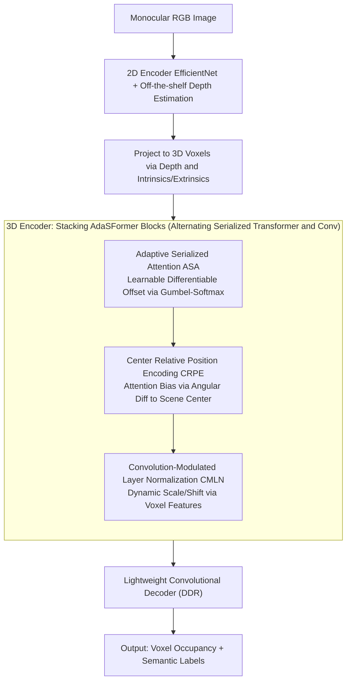

# AdaSFormer: Adaptive Serialized Transformers for Monocular Semantic Scene Completion from Indoor Environments

**Conference**: CVPR 2026  
**arXiv**: [2603.25494](https://arxiv.org/abs/2603.25494)  
**Code**: [https://github.com/alanWXZ/AdaSFormer](https://github.com/alanWXZ/AdaSFormer)  
**Area**: Others  
**Keywords**: Semantic Scene Completion, Serialized Transformer, Adaptive Attention, Indoor Scenes, Monocular RGB

## TL;DR
This paper proposes AdaSFormer, a serialized Transformer framework for indoor Monocular Semantic Scene Completion (MSSC). By introducing three core designs—Adaptive Serialized Attention (with learnable offsets), Center Relative Position Encoding, and Convolution-Modulated Layer Normalization—it achieves SOTA performance on NYUv2 and Occ-ScanNet.

## Background & Motivation

**Background**: Monocular Semantic Scene Completion predicts the complete 3D voxel occupancy and semantic labels from a single RGB image. While outdoor (autonomous driving) scenes have been extensively studied, indoor MSSC is more challenging due to complex spatial layouts and severe occlusions.

**Limitations of Prior Work**: Existing indoor methods primarily rely on CNN architectures, where local receptive fields fail to model long-range dependencies, and increasing 3D kernel sizes leads to cubic growth in computational overhead. While Transformers can model global context, direct application to dense 3D voxels results in prohibitive computational and memory costs.

**Key Challenge**: Indoor scenes require strong global context reasoning to infer geometry and semantics in occluded regions, but the $O(N^2)$ complexity of standard Transformers is infeasible for high-resolution 3D voxels.

**Key Insight**: Serialized Transformers convert irregular 3D data into ordered sequences, reducing complexity to $O(N \cdot G)$ through local grouping. However, existing grouping schemes are fixed, limiting the receptive field.

**Core Idea**: Introduce learnable offsets to adaptively adjust the serialization starting points, allowing different layers to obtain different receptive fields and more flexible spatial representations.

## Method

### Overall Architecture
AdaSFormer aims to reconstruct complete 3D semantic voxels from a monocular RGB image. Since high-resolution voxels make standard $O(N^2)$ attention infeasible, it serializes irregular 3D data into ordered tokens and utilizes local grouping to reduce complexity to $O(N \cdot G)$. The framework adapts the serialization method, position encoding, and feature normalization specifically for indoor SSC. The process is as follows: A monocular RGB image first passes through a 2D encoder (EfficientNet) for feature extraction and depth estimation. Features are projected into 3D space based on depth and passed into a 3D encoder composed of multiple AdaSFormer blocks. Each block alternates between Serialized Transformers (for long-range context) and Convolutions (for local geometry). Finally, a lightweight convolutional decoder outputs the voxel occupancy and semantics. The three core designs—ASA, CRPE, and CMLN—are embedded within the AdaSFormer blocks to manage "how to serialize," "how attention perceives space," and "how to align CNN and Transformer features."

### Key Designs

**1. Adaptive Serialized Attention (ASA): Making serialization starting points learnable**

Serialized Transformers flatten 3D voxels into a 1D sequence along a scanning curve and perform local attention in groups. Fixed grouping fixates the spatial coverage of each window. ASA allows the network to learn the starting point: given a patch size $P$, $K$ candidate offsets are introduced (spaced $P/K$ apart). Different layers select different offsets for varying receptive fields. This discrete selection is made differentiable using the Straight-Through Gumbel-Softmax: the forward pass uses a hard selection $\mathbf{y}_{hard}$, while the backward pass uses a soft distribution $\mathbf{y}_{soft} = \text{softmax}((\mathbf{l} + \mathbf{g})/\tau)$ to propagate gradients. A temperature annealing schedule is applied:

$$\tau_t = \max(\tau_{min}, \tau_{init} \cdot \exp(-\alpha t))$$

As training progresses, the selection converges from soft to hard. Unlike fixed 2D window shifts in Swin Transformer, ASA operates on 1D sequences with a broader offset space and participates in end-to-end optimization.

**2. Center Relative Position Encoding (CRPE): Encoding spatial density relative to the scene center**

Since convolutional components already encode local positions, standard absolute/relative position encodings are redundant. CRPE encodes "information richness" instead of just "location." It calculates the mean of all occupied voxel coordinates as the scene center $\mathbf{c}$. For each voxel, the relative yaw angle difference $\Delta\theta$ and pitch angle difference $\Delta\phi$ to the center are computed and passed through an MLP as an attention bias. This captures the prior that indoor structural/semantic information is center-oriented—regions near the center are typically denser and more informative.

**3. Convolution-Modulated Layer Normalization (CMLN): Dynamically modulating normalization parameters to align CNN and Transformer**

AdaSFormer blocks alternate between convolution and Transformer components. Since their feature types differ (local texture/geometry vs. global relationships), direct alternation causes feature statistic jumps. CMLN replaces fixed LayerNorm affine parameters with dynamic scale and shift generated from the current voxel features:

$$\text{CMLN}(h_i \mid X_{voxel}) = \gamma(X_{voxel}) \odot \frac{h_i - \mu_i}{\sigma_i} + \beta(X_{voxel})$$

where $\gamma, \beta$ are produced by an MLP from voxel features $X_{voxel}$. This uses convolutional features to modulate the Transformer normalization, ensuring adaptive alignment of heterogeneous representations.

### Loss & Training
Standard SSC losses (Cross-Entropy + Scene Completion IoU-related losses) are utilized.

## Key Experimental Results

### Main Results (NYUv2 Dataset)

| Method | Conference | SC IoU% | SSC mIoU% |
|------|------|---------|-----------|
| MonoScene | CVPR'22 | 42.51 | 26.94 |
| NDC-Scene | ICCV'23 | 44.17 | 29.03 |
| ISO | ECCV'24 | 47.11 | 31.25 |
| MonoMRN | ICCV'25 | 53.16 | 26.80* |
| **AdaSFormer (Ours)** | CVPR'26 | **SOTA** | **SOTA** |

*Note: MonoMRN is strong in SC IoU but lower in SSC mIoU; AdaSFormer achieves SOTA in both.

### Ablation Study (NYUv2)

| Configuration | SC IoU | SSC mIoU |
|------|--------|----------|
| Baseline (Std. Serialized Transformer) | Base | Base |
| + ASA (Learnable Offset) | +Gain | +Gain |
| + CRPE (Center Relative Encoding) | +Gain | +Gain |
| + CMLN (Modulated Norm) | +Gain | +Gain |
| Full Combination | **Best** | **Best** |

### Key Findings
- Adaptive Serialized Attention is the most critical component—learnable offsets significantly outperform fixed ones.
- Center Relative Position Encoding is particularly effective for indoor scenes due to center-oriented structural priors.
- CMLN resolves the feature mismatch issue in direct CNN-Transformer alternation.
- SOTA performance is achieved on both NYUv2 and Occ-ScanNet.
- Memory and computational overhead are significantly reduced compared to full 3D Transformers.

## Highlights & Insights
- **Learnable Serialization Offset**: Using Gumbel-Softmax to make discrete starting point selection differentiable is a versatile improvement for Serialized Transformers, applicable to point cloud segmentation and 3D detection.
- **Spatial Information Density Encoding**: Unlike standard encodings, CRPE encodes density—regions far from the scene center are often sparser.
- **Heterogeneous Feature Bridging**: CMLN provides an elegant solution for feature statistic mismatches in hybrid architecture designs.

## Limitations & Future Work
- Validated only on indoor scenes; performance on larger-scale indoor datasets is yet to be verified.
- Overall performance depends heavily on depth estimation quality; end-to-end training requires synergy between depth and completion networks.
- Voxel mean calculation for the scene center may not be robust against skewed occupancy distributions.
- Learnable offset candidates $K$ are predefined; adaptive spacing might be superior.

## Related Work & Insights
- **vs. MonoScene/NDC-Scene/ISO**: These utilize full CNN architectures lacking global reasoning; Ours introduces a Transformer to compensate.
- **vs. OctFormer/PTv3**: These are general Serialized Transformers; Ours adds learnable offsets specifically for SSC.
- **vs. Swin Transformer**: Swin uses fixed 2D window shifts; ASA's 1D sequence offset is more flexible and learnable.

## Rating
- Novelty: ⭐⭐⭐⭐ (Learnable serialization offset is creative; CRPE and CMLN designs are sound)
- Experimental Thoroughness: ⭐⭐⭐⭐ (Comprehensive validation on NYUv2 and Occ-ScanNet)
- Writing Quality: ⭐⭐⭐⭐ (Method description is clear and logical)
- Value: ⭐⭐⭐ (Significant improvement in indoor SSC, though the domain is specialized)

<!-- RELATED:START -->

## Related Papers

- [\[NeurIPS 2025\] Incomplete Multi-view Clustering via Hierarchical Semantic Alignment and Cooperative Completion](../../NeurIPS2025/others/incomplete_multi-view_clustering_via_hierarchical_semantic_alignment_and_coopera.md)
- [\[CVPR 2026\] SimRecon: SimReady Compositional Scene Reconstruction from Real Videos](simrecon_simready_compositional_scene_reconstruction_from_real_videos.md)
- [\[CVPR 2026\] DREAM: Document Recognition with Explicit Adaptive Memory](dream_document_recognition_with_explicit_adaptive_memory.md)
- [\[CVPR 2026\] Adaptive Bayesian Early-Exit Networks for Efficient Non-Transferable Learning](adaptive_bayesian_early-exit_networks_for_efficient_non-transferable_learning.md)
- [\[CVPR 2026\] HierUQ: Hierarchical Uncertainty Quantification with Adaptive Granularity Reconciliation for Degraded Image Classification](hieruq_hierarchical_uncertainty_quantification_with_adaptive_granularity_reconci.md)

<!-- RELATED:END -->
