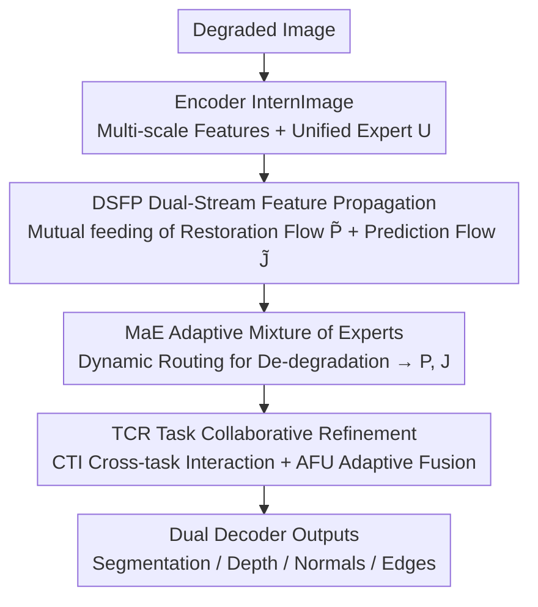

# ALLNet: Multi-task Dense Prediction for Degraded Images

**Conference**: CVPR 2026  
**Paper**: [CVF Open Access](https://openaccess.thecvf.com/content/CVPR2026/html/Wang_ALLNet_Multi-task_Dense_Prediction_for_Degraded_Images_CVPR_2026_paper.html)  
**Code**: Not yet released  
**Area**: Multi-task Dense Prediction / Image Restoration  
**Keywords**: Multi-task Dense Prediction, Image Restoration, Degraded Images, Mixture of Experts (MoE), Cross-task Synergy  

## TL;DR
ALLNet dismantles the two-stage cascaded "restoration-then-prediction" pipeline. Using a dual-decoder U-Net, it enables mutual feature feeding between the restoration and prediction streams at every scale. By employing a degradation-adaptive Mixture-of-Experts (MaE) module for de-degradation and a Task Collaborative Refinement (TCR) module for bidirectional semantic alignment, it outperforms existing SOTA methods across four tasks on degraded versions of NYUD-v2 and PASCAL-Context.

## Background & Motivation
**Background**: Multi-task Dense Prediction (MDP) jointly trains pixel-level tasks like semantic segmentation, depth estimation, surface normals, and edge detection within a shared encoder + multi-decoder network. By leveraging task correlations for mutual gain, it is more computationally efficient and robust than single-task models. However, most MDP works assume clean, high-quality images as input.

**Limitations of Prior Work**: In real-world scenarios, images are frequently contaminated by noise, rain, fog, or motion blur. The mainstream "divide and conquer" approach (Fig. 1a) adopts a two-stage pipeline: first using an all-in-one restoration network to clean the image, then feeding the intermediate result to an MDP model. This path has three major flaws: first, restoration and prediction are artificially severed, causing information flow to stall within each stage without global fusion; low-level enhancement and high-level semantics cannot cross-pollinate, which also increases structural complexity and latency. Second, existing all-in-one restoration models are often tightly coupled monolithic structures, lacking feature synergy mechanisms or modular flexibility for downstream tasks. Third, degradations obscure semantic structures; decoders evolve independently in the degraded feature space without cross-attention to bridge heterogeneous features.

**Key Challenge**: Restoration (low-level, degradation-aware) and multi-task prediction (high-level, semantic synergy) should naturally reinforce each other. However, the two-stage paradigm keeps them isolated, preventing "low-level enhancement" and "high-level semantic understanding" from corroborating in a global context.

**Goal**: To simultaneously achieve multi-scenario de-degradation and multi-task dense prediction within a unified network, allowing for global collaborative optimization. The authors claim this as the first attempt at multi-task dense prediction for degraded images (denoted as DTPDI in the paper).

**Core Idea**: Replace cascading with "dual-stream feature propagation + degradation-adaptive expert routing + cross-task collaborative refinement," intertwining restoration and prediction streams at every scale to achieve bidirectional feature interaction (Fig. 1b).

## Method

### Overall Architecture
ALLNet is a U-Net-shaped network: a shared encoder (using InternImage as the backbone for multi-scale feature extraction) + two parallel decoders—a multi-scenario restoration decoder and a multi-task prediction decoder. The methodology centers on a core belief: restoration and prediction should not be serial but should feed each other features at **every scale**. This mechanism is called Dual-Stream Feature Propagation (DSFP).

Specifically, at each scale, a Unified Expert $U$ extracts initial restoration features $\tilde{P}$ and prediction features $\tilde{J}$ from the encoder features. These two streams enter the MaE (Mixture of Experts) module: MaE uses dynamic routing to send restoration features to appropriate experts, yielding enhanced scene features $P$, which then guide the prediction features $J$. Subsequently, $P$ and $J$ enter the TCR (Task Collaborative Refinement) module for bidirectional refinement of semantics and details. The dual decoders jointly complete feature disentanglement and optimization to output dense prediction results under various degradation scenarios.

### Key Designs

**1. DSFP (Dual-Stream Feature Propagation): Changing "Restoration then Prediction" to Multi-scale Interaction**

This tackles the disconnection of information flow in two-stage paradigms. In traditional methods, the restoration output is a single image, and the prediction network only sees that image; there is no interaction between the degradation-aware features and task semantics. DSFP allows restoration and prediction decoders to progress in parallel at each scale $s=1/32, 1/16, 1/8, 1/4$. At each scale, a dual-stream interaction occurs: the restoration stream outputs degradation-aware features while the prediction stream outputs task-semantic features. These are fused repeatedly via MaE and TCR rather than meeting only at the end. Its value lies in breaking the unidirectional "restoration $\rightarrow$ prediction" bottleneck and allowing the restoration component to be a pluggable module.

**2. MaE (Adaptive Mixture of Experts): Scalable Multi-degradation Restoration via Degradation-Aware Expert Gradients + Image-level Routing**

This addresses the issues of monolithic all-in-one models that are hard to modularize and treat all degradations uniformly. MaE consists of two parts.

The first is the **restoration expert structure**. The authors design an expert gradient based on the observation that local and global degradations have different requirements for model capacity and receptive fields. Experts scale along two complementary dimensions: decreasing channels ($C_i = C/\alpha \times i$ for the $i$-th expert) and increasing window sizes $W_i$ to enhance the global modeling capability of complex experts. Inside each expert, the input $P_{in}$ is split into three sub-tensors for parallel branches: global correlation via window self-attention ($A = \mathrm{Softmax}(QK^\top/\sqrt{d_k})$, $M_1(P^{Att}_{in}) = AV$), local invariant extraction via dynamic convolution ($M_2(P^{Conv}_{in}) = \Phi_{depth}(P^{Conv}_{in};\Theta_{dyn}) \odot \omega(\Phi_{point}(P^{Conv}_{in}))$), and spatial-channel interaction via Window MLP $M_3$. A Mutual Branch Interaction (MBI) allows branches to reinforce each other:

$$P^i_{out} = M_i(P^i_{in}) + \lambda_i \cdot \sigma\Big(\sum_{j \neq i} P^j_{out}\Big), \quad P_{out} = \mathrm{MBI}(P^i_{out})$$

Finally, the Unified Expert $U$ and restoration experts are fused via Selective Kernel Feature Fusion (SKFF), yielding $J = \mathrm{SKFF}(P, \tilde{J}) = s_1 \cdot P + s_2 \cdot \tilde{J}$.

The second is **adaptive perception routing**. Unlike token-level routing, MaE uses an image-level strategy. A lightweight module extracts a prior vector `Prior` and a temperature factor $t$. The routing rule is:

$$\mathrm{Prior} = \mathrm{Linear}(\mathrm{GAP}(P_{in})), \quad T = \sigma(t) + 0.5, \quad G(P_{in}) = \mathrm{topk}\Big(\mathrm{Softmax}\big(\tfrac{P_{in} + \lambda \cdot \mathrm{Prior} + \epsilon}{T}\big)\Big)$$

Where $\epsilon \sim \mathcal{N}(0, 1/n^2)$ is an exploration term for training; temperature $T \in [0.5, 1.5]$ smooths the distribution for complex degradations (multi-expert synergy) and sharpens it for simple ones (high certainty). To favor parameter-efficient experts, a complexity-aware importance $\mathrm{Imp}_i$ is introduced, constrained by an auxiliary loss:

$$L_{aux}(P_{in}) = \varphi \cdot \mathrm{CV}(\mathrm{Imp}(P_{in}))^2 + \phi \cdot \mathrm{CV}(\mathrm{Load}(P_{in}))^2$$

**3. TCR (Task Collaborative Refinement): Bridging Heterogeneous Feature Spaces with Explicit Cross-Attention**

This addresses the fragmentation of feature spaces among task decoders in degraded scenarios. TCR allows restoration to benefit from semantic guidance and prediction to benefit from enhanced details.

**CTI (Cross-task Interaction Unit)** builds global semantic tokens for each task: $\theta_t = \theta^{rand}_t + \lambda \cdot \mathrm{MLP}(\mathrm{GAP}(\tilde{J}_t))$. These tokens interact with aggregated features to obtain task features $P_t = \theta_t \times P$. By pooling all tokens into $\Theta$ and corresponding features $P_{all}$, cross-task attention enables each task to perceive others:

$$A = \mathrm{Softmax}\Big(\tfrac{Q_a K_a}{\sqrt{C_a}}\Big), \quad \Theta' = A \times \Theta, \quad P'_{all} = A \times P_{all}$$

Intra-task refinement is then performed using $\mathrm{MDTA}(\theta'_t; P'_t)$.

**AFU (Adaptive Fusion Unit)** uses the refined task tokens $P''_t$ as queries and $J$ as key-values to build a global-to-local task-specific mapping:

$$J' = \mathrm{Softmax}\Big(\tfrac{(W_q(J))(W_k(P''))^\top}{\sqrt{C_a}}\Big)(W_v(P'')) + J$$

This injects global semantic information containing cross-task synergy into the features while preserving spatial structure.

### Loss & Training
Task supervision loss is applied to the dual-decoder outputs, coupled with the MaE auxiliary loss $L_{aux}$. Training uses InternImage as the backbone on NVIDIA 5090 GPUs. Adam optimizer ($\beta_1=0.9, \beta_2=0.999$) is used with a learning rate of $6 \times 10^{-5}$ and polynomial decay. All hyperparameters were selected using the NYUD-v2 dataset.

## Key Experimental Results

### Main Results
Datasets include NYUD-v2 and PASCAL-Context, synthesized with Gaussian noise, rain streaks, fog, and motion blur.

| Dataset | Task/Metric | Ours | Prev. SOTA | Note |
|--------|-----------|------|----------|------|
| NYUD-v2 | Semseg mIoU ↑ | 55.41 | 51.31 (MLoRE) | +4.10 |
| NYUD-v2 | Depth Rmse ↓ | 0.4992 | 0.5457 (TaskPrompter) | Lower is better |
| NYUD-v2 | Normal mErr ↓ | 18.85 | 19.71 (MLoRE) | Lower is better |
| NYUD-v2 | Boundary odsF ↑ | 79.13 | 74.47 (MLoRE) | +4.66 |
| PASCAL-Context | Semseg mIoU ↑ | 80.23 | 77.31 (MLoRE) | +2.92 |
| PASCAL-Context | Parsing mIoU ↑ | 69.40 | 66.58 (BridgeNet) | +2.82 |
| PASCAL-Context | Saliency maxF ↑ | 85.78 | 81.64 (MLoRE) | +4.14 |
| PASCAL-Context | Normal mErr ↓ | 13.92 | 15.23 (BridgeNet) | Lower is better |

Compared to the two-stage paradigm (using AdaIR for restoration), ALLNet as a "one-piece" solution outperforms the strongest two-stage combinations, confirming that global optimization is superior to cascading.

### Ablation Study
Incremental addition of components (InternImage-T baseline, $\Delta_{MTL}$ is the average gain relative to single-task):

| Configuration | Seg. mIoU ↑ | Dep. rmse ↓ | Norm. mErr ↓ | Edge odsF ↑ | $\Delta_{MTL}$(%) ↑ |
|------|------|------|------|------|------|
| STL (Single-task Upper Bound) | 55.08 | 0.5793 | 19.17 | 79.25 | – |
| MTL baseline | 48.69 | 0.5905 | 20.34 | 75.56 | -6.07 |
| +MaE | 53.28 | 0.5567 | 19.88 | 77.62 | -0.26 |
| +MaE+CTI | 54.75 | 0.5311 | 19.49 | 78.18 | 1.85 |
| +MaE+CTI+AFU | 55.06 | 0.5141 | 18.90 | 79.00 | 3.07 |
| +MaE+CTI+AFU+$\theta_t$ | 55.41 | 0.4992 | 18.85 | 79.13 | 3.87 |

### Key Findings
- **MaE is fundamental but insufficient**: The naive MTL baseline dropped 6.07% (negative transfer). MaE recovered $\Delta_{MTL}$ to -0.26, showing that de-degradation is a prerequisite for MTL in degraded settings, but not enough for positive gain.
- **TCR units are the key to positive gain**: Adding CTI pushed $\Delta_{MTL}$ to +1.85, and AFU to +3.07. Removing either causes significant drops, proving that bidirectional cross-task synergy drives the shift from negative transfer to positive gain.
- **Routing Strategy**: MaE’s complexity-biased routing effectively routes rain to Expert 1 and fog to Expert 4, showing clear division of labor compared to vanilla MoE.
- **t-SNE Visualization**: Restoration features $P$ cluster by degradation type, while prediction features $P''_t$ cluster by task. This confirms the dual-stream disentanglement: $P$ handles low-level degradation, while $P''_t$ handles high-level semantics.

## Highlights & Insights
- **Formulating all-in-one restoration as "Single-output, multi-condition MTL"**: Viewing each degradation type as a task condition allows restoration and prediction to be optimized within the same multi-task framework.
- **Clever "Channel Decreasing, Window Increasing" Expert Gradient**: A simple scaling rule creates experts with different capacities and receptive fields, matching local vs. global degradation needs.
- **Image-level Routing + Temperature Adaptation**: Avoiding token-level overhead, the router makes a single decision per image and adjusts temperature based on degradation complexity.
- **Clear causal chain for negative transfer reversal**: The ablation clearly identifies how to rescue performance (MaE for restoration, TCR for synergy), providing a highly persuasive argument.

## Limitations & Future Work
- **Reliance on Synthetic Degradation**: Due to the scarcity of real-world degraded data, experiments were conducted on synthetic rain/fog/noise. Generalization to real degradations remains a work in progress.
- **Structural Weight**: The combination of a dual-decoder U-Net, multiple experts, and cross-task attention is relatively heavy. The paper lacks a detailed parameter/FLOPs comparison with two-stage systems.
- **Task Set Limitations**: Evaluated only on 4-5 dense prediction tasks; sensitivity analyses for expert count $n$ and temperature ranges were limited.

## Related Work & Insights
- **vs. Two-stage Cascades**: Unlike methods that restore then predict (severing information flow), DSFP allows multi-scale mutual feeding and global optimization.
- **vs. All-in-one Restoration (e.g., PromptIR)**: While they are monolithic and hard to embed downstream, MaE provides a modular, routable mixture-of-experts that can serve as an independent network or an enhancement module.
- **vs. Standard MoE**: MaE introduces complexity-aware routing and auxiliary losses for differentiated division of labor based on degradation type.
- **vs. Multi-task Interaction (e.g., InvPT, TaskPrompter)**: While those focus on clean images, TCR bridges low-level restoration enhancement and high-level prediction semantics in degraded environments.

## Rating
- Novelty: ⭐⭐⭐⭐⭐ First unified framework for MDP on degraded images with targeted innovations.
- Experimental Thoroughness: ⭐⭐⭐⭐ Complete multi-task datasets, two-stage comparisons, and ablations, though lacking real-world data and efficiency metrics.
- Writing Quality: ⭐⭐⭐⭐ Clear motivation; logical module design.
- Value: ⭐⭐⭐⭐ Significant practical relevance for dense prediction in the wild.

<!-- RELATED:START -->

## Related Papers

- [\[ICLR 2026\] Ensemble Prediction of Task Affinity for Efficient Multi-Task Learning](../../ICLR2026/others/ensemble_prediction_of_task_affinity_for_efficient_multi-task_learning.md)
- [\[CVPR 2026\] Region-Wise Correspondence Prediction between Manga Line Art Images](region-wise_correspondence_prediction_between_manga_line_art_images.md)
- [\[CVPR 2026\] HierUQ: Hierarchical Uncertainty Quantification with Adaptive Granularity Reconciliation for Degraded Image Classification](hieruq_hierarchical_uncertainty_quantification_with_adaptive_granularity_reconci.md)
- [\[CVPR 2026\] Customized Fusion: A Closed-Loop Dynamic Network for Adaptive Multi-Task-Aware Infrared-Visible Image Fusion](customized_fusion_a_closed-loop_dynamic_network_for_adaptive_multi-task-aware_in.md)
- [\[CVPR 2026\] A Difference-in-Difference Approach to Detecting AI-Generated Images](a_difference-in-difference_approach_to_detecting_ai-generated_images.md)

<!-- RELATED:END -->
