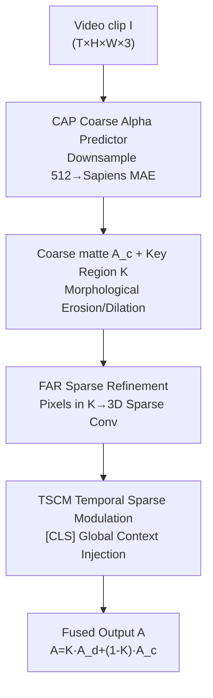

# $\alpha$Matte4K & $\mu$Matting: Dataset and Model for Ultra-Micro Precision Alpha Video Matting

**Conference**: CVPR 2026  
**Paper**: [CVF Open Access](https://openaccess.thecvf.com/content/CVPR2026/html/Chen_alphaMatte4K__muMatting_Dataset_and_Model_for_Ultra-Micro_Precision_Alpha_CVPR_2026_paper.html)  
**Code**: https://github.com/kadatec/mu-Matting  
**Area**: Video Understanding / Video Matting  
**Keywords**: Video matting, alpha matting, 4K high resolution, PBR synthetic dataset, sparse 3D convolution  

## TL;DR
Targeting 4K portrait video matting, this paper introduces $\alpha$Matte4K, a large-scale dataset with pixel-level precision and physical consistency generated via Physics-Based Rendering (PBR). It also proposes $\mu$Matting, which utilizes a portrait prior (MAE) to predict a coarse alpha and identify "difficult regions," followed by sparse 3D convolution refinement only on these regions. This approach achieves full-resolution 4K video matting without downsampling for the first time, surpassing existing SOTA in both accuracy and temporal consistency.

## Background & Motivation

**Background**: High-resolution portrait video matting must simultaneously satisfy three criteria: spatial detail (hair, translucent edges), temporal consistency (flicker-free), and 4K+ scalability. Existing temporal modeling methods fall into two categories: frame-by-frame methods (RVM, AdaM using ConvGRU or attention) and block-based methods (VMFormer processing multiple frames jointly). The latter faces explosive computational and memory overhead for multi-frame self-attention at high resolutions.

**Limitations of Prior Work**: To reduce computational load, mainstream methods typically follow a "downsample-then-upsample" pipeline, which tends to blur alpha predictions in translucent regions (Fig. 2 highlights how down-up sampling leads to inaccurate mattes). Another line of research relies on external masks (MaGGie, MatAnyone depend on SAM2 for initial masks), increasing system complexity and inference overhead, where errors from SAM2 propagate directly to the matting stage.

**Key Challenge**: There is a fundamental trade-off between quality and efficiency at high resolutions—maintaining accuracy requires high-resolution computation that hardware cannot sustain, while efficiency via downsampling sacrifices detail. Furthermore, supervised learning relies on data: the classic composition formula $I = \alpha F + (1-\alpha)B$ requires ground-truth alpha that is both accurate and temporally coherent. However, existing datasets (VM, HHM50K) use alpha labels derived from manual annotation, matting algorithms, or green-screen keying, which are inherently noisy; datasets like VM only provide foregrounds to be composited with external backgrounds, resulting in physical inconsistencies in lighting, geometry, and motion.

**Key Insight**: The authors re-examine the temporal structure of video and observe that temporal changes are **sparsely distributed**: in a 2-second clip, only **13.7%** of pixels change significantly over time, concentrated in boundaries and detailed areas, while large segments of the foreground remain static (Fig. 2 bottom heatmap). This implies that expensive spatio-temporal computation on the entire high-resolution frame is unnecessary; computational power should be focused solely on these 13.7% difficult regions.

**Core Idea**: On the model side—a resolution-agnostic "coarse localization + difficult region refinement" framework using sparse 3D convolutions. On the data side—generating the 4K $\alpha$Matte4K dataset from scratch using PBR to ensure pixel-accurate alpha labels and natural physical consistency between foreground and background.

## Method

This paper contributes both a dataset and a model: **$\alpha$Matte4K** addresses inaccurate and inconsistent training data, while **$\mu$Matting** solves the quality-efficiency trade-off at 4K.

### Overall Architecture

$\mu$Matting is a resolution-agnostic two-stage framework. The input is a video clip $I \in \mathbb{R}^{T\times H\times W\times 3}$ of $T$ frames (implemented as $T=4$), and the output is a full-resolution alpha matte $A$. The first stage, **CAP (Coarse Alpha Predictor)**, downsamples the video to 512×512 and employs a pre-trained portrait MAE to generate a coarse alpha $A_c^{\downarrow}$, while identifying "key regions" $K$ (hair, clothing edges, translucent areas) through morphological operations. The second stage, **FAR (Fractional Alpha Refiner)**, extracts pixels within $K$ into a sparse representation and processes them through a 3D sparse convolutional network. The **TSCM** module injects global spatio-temporal context back into the sparse features. Finally, the result $A_d$ is fused with the stable coarse prediction $A_c$ via $A = K\times A_d + (1-K)\times A_c$—preserving stable coarse predictions in non-key regions and applying refinement in key regions.

### Key Designs

**1. $\alpha$Matte4K: A 4K Dataset with Pixel-Level Precision via a Four-Stage PBR Pipeline**

To resolve the root cause of inaccurate alpha and physically inconsistent backgrounds, the authors abandon manual annotation/keying in favor of Physics-Based Rendering (PBR). The pipeline consists of four steps: ① **Digital Humans**—30 high-quality MetaHuman models (diverse skin tones, ages, hairstyles, clothing) driven by Mixamo skeletal animations; ② **3D Scenes**—22 large-scale urban/natural environments in Unreal Engine with 900 sampled camera positions; ③ **Camera Trajectories**—various preset motion paths, with camera views and character actions switching approximately every 130 frames to create temporal variety; ④ **Rendering**—9:16 portrait rendering common in short videos.

The key is that the alpha ground truth is **calculated** per-pixel by the renderer rather than manually labeled. This preserves precise boundaries in regions like hair and motion blur that are nearly impossible to label manually. Lighting, shadows, spatial layout, and hair dynamics are consistently modeled within the same physical scene. $\alpha$Matte4K contains 900 videos and over 115,000 frames at 2160×3840 (4K), making it the largest high-quality portrait video matting dataset.

**2. CAP (Coarse Alpha Predictor): Introducing Portrait MAE Priors to Video Matting**

To address the instability and internal holes/external noise in frame-by-frame or block-based methods, CAP downsamples the clip to 512×512 and feeds it into **Sapiens-0.3B**, a masked autoencoder (MAE) pre-trained on over 300 million portrait images. This provides a strong portrait prior, ensuring that the coarse prediction $A_c^{\downarrow}$ has a complete and coherent foreground structure. The encoder converts each frame into patch tokens plus a global `[CLS]` token to decode the coarse alpha.

Morphological erosion and dilation are then applied to the non-binary regions where $\alpha \in (0,1)$ in $A_c^{\downarrow}$ to obtain a smooth, expanded key region mask $K^{\downarrow}$ that frames boundaries and translucent structures. Both the coarse matte and key regions are upsampled to the original resolution. Training uses $L_{stage1}$, combining L1 and Laplacian pyramid losses for both pixel-level accuracy and multi-scale structural consistency:
$$L_{stage1} = \frac{1}{|N|}\sum_{i\in N}|A_c^{\downarrow(i)} - A_{gt}^{\downarrow(i)}| + \sum_{l=1}^{5}\frac{1}{2^{2l}}\|L_l(A_c^{\downarrow}) - L_l(A_{gt}^{\downarrow})\|_1$$

**3. FAR (Fractional Alpha Refiner): Lossless 4K Refinement via Sparse 3D Convolution**

This serves as the solution to the "quality-efficiency" contradiction. The original video $I$ and the upsampled coarse matte $A_c$ are concatenated along the channel dimension to form $I' \in \mathbb{R}^{T\times H\times W\times 4}$. Based on the key region $K$, only the pixels requiring optimization are extracted into a sparse representation $S_{in}\in\mathbb{R}^{N_k\times 4}$ ($N_k \ll$ total pixels). $S_{in}$ passes through a 3D sparse encoder and decoder to reconstruct spatial details and output a sparse alpha $S_{out}\in\mathbb{R}^{N_k\times 1}$, which is mapped back to the full resolution to obtain $A_d$. Since **only pixels within $K$ are updated**, expensive full-frame 4K computation and downsampling are avoided, achieving "lossless 4K" by aggregating spatio-temporal features only where they are needed.

**4. TSCM (Temporal Sparse Context Modulator): Restoring Global Context**

Sparse functions focus only on selected regions, ignoring global information. TSCM is a low-overhead module designed to fill this gap: it projects the global `[CLS]` token from the CAP encoder to a hidden dimension $\dim_h=256$, models cross-frame dependencies via a GRU, and applies the final state $h_T$ through element-wise multiplication back into the sparse encoder features $f_{enc}$:
$$f_{enc} = \sigma\big(\mathrm{FC}(\mathrm{GRU}(\mathrm{Proj}([CLS])))\big)\odot f_{enc}$$
This injects global cross-frame context into the sparse features, enhancing temporal consistency. It adds only 0.79M parameters (0.21% of the total) while improving all metrics.

### Loss & Training

In the second stage, a regional loss $L_{region}$ (L1 + Laplacian) is calculated for $A_d$ within region $K$. A temporal consistency loss $L_{temporal}$ is also introduced on the overlapping key regions $K_\cap = K_t \cap K_{t+1}$ to constrain the difference between adjacent frames:
$$L_{temporal} = \sum_t \frac{1}{|K_\cap|}\sum_{i\in K_\cap}\big((A_d^{(i,t)} - A_d^{(i,t+1)}) - (A_{gt}^{(i,t)} - A_{gt}^{(i,t+1)})\big)^2$$
Global supervision $L_{entire}$ is applied to the final fused image. The total second-stage loss is $L_{stage2} = \lambda_r L_{region} + \lambda_e L_{entire} + \lambda_t L_{temporal}$, with weights set to $\lambda_r=1,\lambda_e=0.5,\lambda_t=0.5$. Training data includes HHM50K, VM-HD, and $\alpha$Matte4K.

## Key Experimental Results

### Main Results

Comparison on the CRGNN real-world benchmark and VM 1920×1080 synthetic test set (lower is better; MAD/MSE ×10³, Grad ×10⁻³, dtSSD ×10²):

| Dataset | Metric | $\mu$Matting | RVM | SparseMat | VMFormer |
|--------|------|------|------|------|------|
| CRGNN | MAD↓ | **4.50** | 6.18 | 6.23 | 144.99 |
| CRGNN | MSE↓ | **1.57** | 2.87 | 2.86 | 132.82 |
| CRGNN | dtSSD↓ | **4.74** | 5.07 | 6.43 | 14.39 |
| VM 1920 | MAD↓ | **4.21** | 6.57 | 7.97 | 6.21 |
| VM 1920 | MSE↓ | 1.62 | 1.93 | 3.08 | **1.52** |

On the 4K scalability test set VM-4K (50 videos, 100 frames each at 3840×2160), comparing only methods capable of 4K inference:

| Method | MAD↓ | MSE↓ | Grad↓ | dtSSD↓ |
|------|------|------|------|------|
| RVM | 5.85 | 1.34 | 23.26 | 1.85 |
| SparseMat | 6.82 | 2.32 | 16.28 | 3.44 |
| **$\mu$Matting** | **2.71** | **0.74** | **7.07** | **1.11** |

At 4K, $\mu$Matting reduces MAD from RVM's 5.85 to 2.71 and Grad from 23.26 to 7.07, showing significant advantages at high resolutions.

### Ablation Study

**Dataset Effectiveness** (CRGNN: -V indicates VM fine-tuning only; -M indicates VM+$\alpha$Matte4K mixed fine-tuning for 5 epochs):

| Method | MAD↓ | MSE↓ | Grad↓ | dtSSD↓ |
|------|------|------|------|------|
| RVM-V | 6.45 | 3.08 | 14.91 | 5.28 |
| RVM-M | **6.14** | **2.88** | **14.27** | **5.13** |
| BiMatting-V | 22.01 | 15.53 | 23.44 | 3.23 |
| BiMatting-M | **16.61** | **10.66** | **20.23** | **3.00** |
| $\mu$Matting-V | 5.79 | 2.33 | 16.84 | 5.69 |
| $\mu$Matting (Mixed) | **4.50** | **1.57** | **13.57** | **4.74** |

Adding $\alpha$Matte4K improved all methods across all metrics, validating that physical realism and precise labels enhance model prediction and consistency.

**Ablation of CAP and TSCM Modules**:

| Config | Dataset | MAD↓ | MSE↓ | Grad↓ | Description |
|------|------|------|------|------|------|
| LPN (Original SparseMat) | HHM2K LR | 8.21 | 4.38 | 3.33 | LR coarse prediction baseline |
| CAP (Replacing LPN) | HHM2K LR | **7.61** | **4.01** | **2.17** | Superior MAE portrait prior |
| w/o TSCM | CRGNN | 4.64 | 1.61 | 14.08 | TSCM removed |
| Full $\mu$Matting | CRGNN | **4.50** | **1.57** | **13.57** | Complete model |

### Key Findings
- **The sparsity hypothesis holds**: Only 13.7% of pixels change over time in a 2-second clip. This empirical fact justifies the "coarse localization + refinement" design, allowing 4K accuracy to lead significantly by focusing computation.
- **Portrait MAE prior contribution**: Replacing the LPN in SparseMat with CAP reduced MAD from 8.21 to 7.61 and Grad from 3.33 to 2.17 on HHM2K, resulting in more complete foregrounds with fewer holes.
- **High cost-performance of TSCM**: At only 0.79M parameters, it improves all metrics by restoring global temporal context to sparse features.
- **Reason for dataset synergy**: t-SNE visualization shows the data distribution of $\alpha$Matte4K is closer to real videos than VM, explaining the performance gains in real-world scenarios.
- **Efficiency**: With 381.71M parameters, 4K inference uses 6.8GB VRAM at 11.8 FPS (15.2 FPS at 2K). While efficiency was not the primary focus, the framework has real-time 4K potential.

## Highlights & Insights
- **Architecture driven by data observation**: The 13.7% temporal sparsity is not just an explanation but a design principle for the sparse 3D architecture, demonstrating a strong logical chain from "observation to design."
- **PBR for ground-truth quality**: Areas like hair and motion blur are where manual labeling fails. PBR turns alpha into a "calculated truth," bypassing the ceiling of annotation accuracy—a strategy transferable to any high-precision soft segmentation task.
- **Sparse 3D Conv + Global Token Modulation**: A clever combination where sparse convolutions save computation but lose global info, which is then restored using the `[CLS]` token from the first stage via a GRU—essentially zero-cost reuse of a sub-product.
- **Coarse-to-fine fusion $A=K\cdot A_d+(1-K)\cdot A_c$**: This simple formula ensures stability by trusting the coarse prediction in non-key regions, preventing the refinement network from introducing jitter in static foreground areas.

## Limitations & Future Work
- Efficiency was not the primary goal: Current 4K inference at 11.8 FPS is not yet real-time. Future work will focus on pushing both components toward real-time 4K.
- Although physically consistent, $\alpha$Matte4K is still **purely synthetic** (MetaHuman + UE). There may be a domain gap in skin texture and noise distribution compared to real portraits.
- The key region $K$ depends on morphological operations and thresholds. If CAP fails in extreme poses or occlusions, the key region may be incomplete, leading to refinement failure.
- The method is specifically designed for **portrait** matting (incorporating MAE portrait priors). Transferring to general object matting would require changing the backbone prior.

## Related Work & Insights
- **vs RVM / AdaM (Frame-by-frame + Memory)**: These use ConvGRU/attention for temporal modeling but must downsample to save computation, blurring 4K details. This work uses sparse 3D conv on key regions for lossless full-resolution refinement, reducing 4K MAD from 5.85 to 2.71.
- **vs VMFormer (Block-based Multi-frame Attention)**: Multi-frame self-attention suffers from memory/compute explosion at high resolution and performs poorly on real datasets like CRGNN (MAD 144.99) due to domain mismatch. Sparse refinement avoids this cost.
- **vs SparseMat (Sparse Image Matting)**: While both use sparsity, SparseMat is image-based and lacks temporal continuity from simple frame differences. This work introduces 3D sparse conv + TSCM and proves CAP is superior to SparseMat's LPN.
- **vs MaGGie / MatAnyone (SAM2-guided)**: These rely on external masks; errors in SAM2 propagate. This work uses internal MAE priors for foreground stability, making the pipeline more robust without external models.

## Rating
- Novelty: ⭐⭐⭐⭐⭐ Data-driven sparse refinement and high-precision 4K PBR dataset.
- Experimental Thoroughness: ⭐⭐⭐⭐⭐ Comprehensive coverage across real, synthetic, and 4K datasets.
- Writing Quality: ⭐⭐⭐⭐ Clear logic, though some mathematical notation for downsampling is a bit dense.
- Value: ⭐⭐⭐⭐⭐ First lossless 4K video matting framework with a large-scale high-quality dataset; high utility for short videos and virtual meetings.

<!-- RELATED:START -->

## Related Papers

- [\[ECCV 2024\] COIN-Matting: Confounder Intervention for Image Matting](../../ECCV2024/others/coin-matting_confounder_intervention_for_image_matting.md)
- [\[CVPR 2026\] AniMimic: Imitating 3D Animation from Video Priors](animimic_imitating_3d_animation_from_video_priors.md)
- [\[CVPR 2026\] From Pixel to Precision: Enhancing Handwritten Mathematical Expression Recognition with Image-Level Reward](from_pixel_to_precision_enhancing_handwritten_mathematical_expression_recognitio.md)
- [\[CVPR 2026\] What Is the Optimal Ranking Score Between Precision and Recall? We Can Always Find It and It Is Rarely F₁](what_is_the_optimal_ranking_score_between_precision_and_recall_we_can_always_fin.md)
- [\[CVPR 2026\] A Unified Framework for Knowledge Transfer in Bidirectional Model Scaling](a_unified_framework_for_knowledge_transfer_in_bidirectional_model_scaling.md)

<!-- RELATED:END -->
