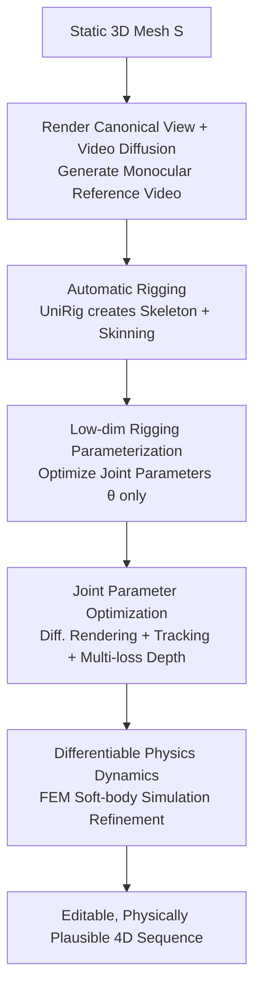

# AniMimic: Imitating 3D Animation from Video Priors

**Conference**: CVPR 2026  
**Paper**: [CVF Open Access](https://openaccess.thecvf.com/content/CVPR2026/html/Xie_AniMimic_Imitating_3D_Animation_from_Video_Priors_CVPR_2026_paper.html)  
**Code**: [Project Page](https://xpandora.github.io/AnimaMimic/) (Code not open-sourced)  
**Area**: 3D Vision / 4D Generation  
**Keywords**: 3D Animation, Video Diffusion Priors, Differentiable Rendering, Differentiable Physics Simulation, Automatic Rigging

## TL;DR
AniMimic utilizes monocular animations generated by video diffusion models as motion supervision. It automatically rigs a static 3D mesh and optimizes joint parameters via differentiable rendering to "lift" 2D motion into 3D. Subsequently, a differentiable FEM soft-body simulation is employed to incorporate inertia and elasticity, producing editable, physically plausible 4D sequences ready for animation pipelines.

## Background & Motivation
**Background**: Creating expressive 3D animations has traditionally relied on artists for manual rigging, keyframing, and deformation adjustment, which is time-consuming and expertise-dependent. Conversely, video diffusion models (e.g., Kling, Sora) can generate dynamic and visually coherent 2D motions from text or images, demonstrating high motion creativity.

**Limitations of Prior Work**: The output of video diffusion is confined to 2D image planes lacking explicit 3D structure, preventing direct use in rendering, simulation, or interactive editing. Existing 4D generation methods attempting to utilize these motion priors follow two main paths, both with drawbacks: one uses score-distillation sampling (SDS) to optimize NeRF/Gaussian splats directly, where geometry and appearance are entangled, leading to slow optimization and poor controllability; the other reconstructs motion from generated videos using implicit fields or Gaussians, which are incompatible with modern CG workflows and difficult to reuse.

**Key Challenge**: A gap exists between the 2D "creativity" of video diffusion and the "structural controllability" of explicit 3D rigged meshes required by downstream animation. Furthermore, motions optimized purely via Linear Blend Skinning (LBS) are quasi-static, lacking realistic inertia and elasticity.

**Goal**: Rather than reconstructing geometry, the goal is to **animate an existing explicit 3D mesh**—incorporating video diffusion motion priors while maintaining the mesh's editability and simulation readiness.

**Key Insight**: Borrowing from traditional animation workflows—sketching the skeleton first and then iteratively refining motion—motion is parameterized using a low-dimensional "skeleton + mesh" representation instead of directly manipulating tens of thousands of vertices.

**Core Idea**: Differentiable rendering is used to back-propagate 2D motion supervision from video diffusion to **joint parameters** (low-dimensional and stable). A **differentiable physics simulation** embedded in the optimization loop then upgrades quasi-static motion into realistic dynamics with inertia and elasticity.

## Method

### Overall Architecture
The input is a textured static mesh $S$ (created by artists or generated via text/image-to-3D), and the output is an animation sequence $\{S_1, ..., S_T\}$. The process consists of two main stages: First, the mesh is rendered into a canonical view and fed into a video diffusion model to generate a monocular reference video (providing the motion prior). A feed-forward rigging network automatically constructs the skeleton and skinning weights, converting the mesh into a rigged representation. In **Stage 1**, joint rotation and translation parameters are optimized via differentiable rendering, point tracking, and depth supervision to align the mesh motion with video cues. In **Stage 2**, a differentiable soft-body simulation is integrated for physics-based refinement, adding inertia/elasticity effects missing in LBS and eliminating surface artifacts caused by rigging.

### Key Designs

**1. Low-dim Rigging Parameterization: Replacing "Moving Vertices" with "Moving Joints"**

Directly optimizing mesh vertex positions involves high dimensionality and a massive search space, leading to instability. AniMimic instead models motion using a skeletal system: a root joint $J_0$ and a set of joints $\{J_i\}_{i=1}^K$. Each joint has a local rotation $R_i \in SO(3)$ and translation $t_i$. Global transformations are calculated via Forward Kinematics (FK) along the kinematic chain: $T_i = T_{\text{parent}(i)}[R_i \mid t_i]$. Vertex deformation uses Linear Blend Skinning (LBS): $x_i = \sum_{k=1}^K w_{ik} T_k X_i$, where $\sum_k w_{ik}=1$. Skeletons and skinning weights are predicted by a feed-forward network, **UniRig**, trained on large-scale rigged models. The final pose parameters to be optimized are $\theta = \{(r_i, t_i)\}_{i=0}^K$, where $r_i$ uses a 6D rotation representation. This stabilizes optimization and ensures natural editability.

**2. Joint Parameter Optimization: Lifting Pose to 3D via Multi-path 2D Supervision**

AniMimic treats the video diffusion reference frame sequence $\{I_t\}$ as supervision to optimize $\theta_t$ for each frame. The total loss is:

$$L = \lambda_{rgb}L_{rgb} + \lambda_{mask}L_{mask} + \lambda_{track}L_{track} + \lambda_{depth}L_{depth} + \lambda_{smooth}L_{smooth} + \lambda_{reg}L_{reg}.$$

Each term serves a specific purpose: $L_{rgb}$ and $L_{mask}$ use PyTorch3D’s differentiable SoftPhong and silhouette rendering to align appearance/foreground with reference frames. To handle hallucinated regions in diffusion videos, $L_{track}$ is added—sampling points in the foreground, back-projecting them to mesh barycentric coordinates $\beta_i$, and using **AllTracker** to track their 2D trajectories in the generated video, constraining projected mesh points to follow these trajectories. $L_{depth}$ uses **VGGT** to predict frame-wise depth (with normalization to handle scale ambiguity). $L_{smooth}$ penalizes sudden changes between adjacent frames, while $L_{reg}$ clips local transformations within a threshold $\hat\theta$.

**3. Differentiable Physics Dynamics: Upgrading Quasi-static Motion via FEM**

Motions optimized via rigging have two issues: imperfect skinning weights from automatic networks cause surface artifacts, and LBS is inherently quasi-static. AniMimic embeds a **differentiable FEM soft-body simulation** into the loop. The surface mesh is converted to a tetrahedral mesh $S_{\text{tet}}$ via TetWild. Following Newton's second law $\frac{d^2x}{dt^2}=M^{-1}f(x)$, it uses Backward Euler for numerical integration, formulated as an optimization:

$$x^{n+1} = \arg\min_x \tfrac{1}{2}\|x - \tilde{x}\|_M^2 + \Psi(x),$$

where elastic energy $\Psi(x)$ uses the Fixed Corotated model. The adjoint method + AutoDiff allow gradients to flow back through time integration. Global joint transforms $T_i$ act as boundary conditions for the nearest tetrahedra. The simulation optimizes the Young's modulus $E_i$ for each tetrahedron to match the reference video. A coarse-to-fine clustering strategy is used for $E_i$ to ensure stability.

### Loss & Training
Both stages use Adam ($LR=10^{-3}$). Stage 1 optimizes $\theta_t$. Stage 2 optimizes element-wise Young's modulus $E_i$ (specifically $\log E_i$) while $T_i$ serves as boundary conditions. The physics module is implemented in Warp (supporting AutoDiff). Reference videos are produced via "Render single frame $\rightarrow$ LLM generates motion prompt $\rightarrow$ Kling Image-to-Video".

## Key Experimental Results

### Main Results
Evaluated on a multi-source textured 3D dataset. Metrics use two new views ($\pm 45^\circ$) in addition to the input view.

| Method | SSIM↑ | LPIPS↓ | VBAQ↑ | VBOC↑ | VBIQ↑ |
|------|-------|--------|-------|-------|-------|
| SC4D | **0.9403** | 0.0924 | 0.541 | 0.174 | 0.392 |
| DreamMesh4D | 0.8662 | 0.1482 | 0.543 | 0.175 | 0.550 |
| Puppeteer | 0.9023 | 0.1097 | 0.572 | 0.176 | **0.632** |
| **Ours** | 0.9318 | **0.0849** | **0.581** | **0.176** | 0.606 |

Ours leads in LPIPS, temporal consistency (VBOC), and aesthetic quality (VBAQ). SC4D has the highest SSIM but often generates incorrect textures and distorted geometry.

### User Study (2AFC Preference Rate vs. Baseline)
| Comparison | VQ | TC | MP | Total |
|----------|------------|------------|------------|------|
| vs SC4D | 96% | 93% | 92% | 91% |
| vs DreamMesh4D | 88% | 91% | 95% | 91% |
| vs Puppeteer | 74% | 78% | 69% | 71% |

### Ablation Study
| Configuration | Phenomenon |
|------|------|
| Full | Consistent shape/motion, fits reference video. |
| w/o Depth | Geometric distortion, deviates from reference motion. |
| w/o Mask | Poor foreground alignment. |
| w/o Track | Loss of trajectory accuracy. |
| w/o Physics | Jitter and self-intersection in large-deformation areas. |

### Key Findings
- Removing any loss component leads to distortion; mask, track, and depth supervisions are complementary.
- The physics refinement stage specifically addresses jitter and self-intersections in LBS-rigged meshes during large deformations.
- Baselines have distinct flaws: SC4D suffers from topological holes; DreamMesh4D distorts geometry at joints; Puppeteer has restricted motion range.

## Highlights & Insights
- **Smart Trade-off**: By animating explicit meshes rather than reconstructing geometry, Ours avoids geometry-appearance entanglement and ensures compatibility with industrial pipelines.
- **Physics-in-the-loop**: Incorporating differentiable FEM simulation solves both surface artifacts and the lack of dynamics (inertia/elasticity).
- **Robust Supervision**: Ours acknowledges that diffusion videos are unreliable (hallucinations/lighting shifts) and extracts robust geometric cues (tracking + depth) as supervision.
- **Metric Interpretation**: Lower SSIM does not necessarily mean lower quality in 4D tasks, as high SSIM can hide low-frequency structural preservation with incorrect textures.

## Limitations & Future Work
- **Pipeline Dependency**: Heavy reliance on external components (Kling, UniRig, SAM2, AllTracker, VGGT). Errors in rigging or tracking propagate to the final result.
- **Monocular Ambiguity**: Complex occlusions or large self-shadowing in 2D videos make 3D lifting difficult.
- **Computational Cost**: Physics simulation and element-wise optimization add overhead; times per sequence were not detailed.
- **Future Directions**: Multi-view reference videos, feed-forward material parameter prediction, and joint-contact physical constraints (e.g., foot sliding).

## Related Work & Insights
- **vs SDS-based 4D (SC4D)**: These optimize implicit representations; Ours animates explicit meshes, offering better controllability and temporal consistency.
- **vs DreamMesh4D**: DreamMesh4D uses many independent control nodes leading to joint distortion; Ours uses low-dim skeletons + physics for more stable, larger-range motion.
- **vs Puppeteer**: While Puppeteer also uses rigging, its motion is quasi-static and limited; Ours contributes **differentiable physics** to capture realistic dynamics.

## Rating
- Novelty: ⭐⭐⭐⭐ Integrating differentiable FEM into a video-driven rigging optimization loop is a novel solution to existing pain points.
- Experimental Thoroughness: ⭐⭐⭐ Comprehensive ablations and user studies, though the number of sequences is relatively small.
- Writing Quality: ⭐⭐⭐⭐ Clear explanation of the two-stage pipeline and supervision design.
- Value: ⭐⭐⭐⭐ Strong practical orientation for bridging generative video with industrial animation workflows.

<!-- RELATED:START -->

## Related Papers

- [\[CVPR 2026\] 3D-Object Perception Transformer (3PT)](3d-object_perception_transformer_3pt.md)
- [\[CVPR 2026\] Efficient Unrolled Networks for Large-Scale 3D Inverse Problems](efficient_unrolled_networks_for_large-scale_3d_inverse_problems.md)
- [\[CVPR 2026\] 4DWorldBench: A Comprehensive Evaluation Framework for 3D/4D World Generation Models](4dworldbench_a_comprehensive_evaluation_framework_for_3d4d_world_generation_mode.md)
- [\[CVPR 2026\] $\alpha$Matte4K & $\mu$Matting: Dataset and Model for Ultra-Micro Precision Alpha Video Matting](alphamatte4k_mumatting_dataset_and_model_for_ultra-micro_precision_alpha_video_m.md)
- [\[ICCV 2025\] Jigsaw++: Imagining Complete Shape Priors for Object Reassembly](../../ICCV2025/others/jigsaw_imagining_complete_shape_priors_for_object_reassembly.md)

<!-- RELATED:END -->
