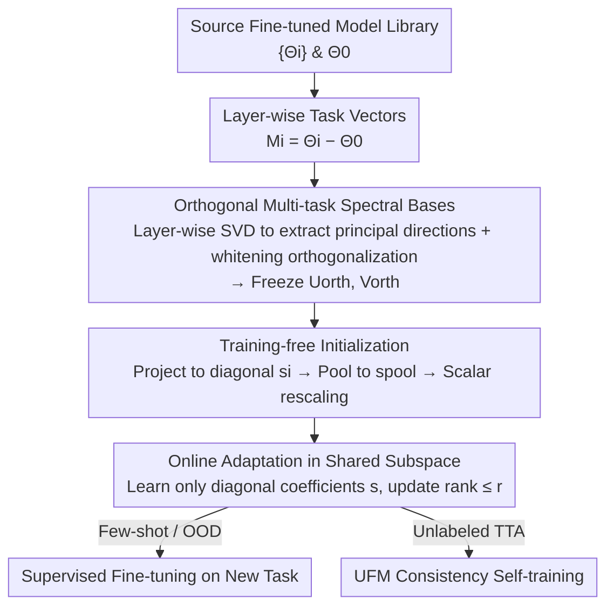

# Basis-Oriented Low-rank Transfer for Few-Shot and Test-Time Adaptation

**Conference**: CVPR 2026  
**Paper**: [CVF Open Access](https://openaccess.thecvf.com/content/CVPR2026/html/Park_Basis-Oriented_Low-rank_Transfer_for_Few-Shot_and_Test-Time_Adaptation_CVPR_2026_paper.html)  
**Code**: To be confirmed  
**Area**: Transfer Learning / Parameter-Efficient Fine-Tuning  
**Keywords**: Low-rank transfer, task vectors, spectral bases, few-shot, test-time adaptation

## TL;DR
BOLT performs layer-wise SVD and orthogonalization on the "task vectors" of a set of fine-tuned source models to obtain a shared set of orthogonal spectral bases. For entirely new tasks, these bases are frozen, and only a tiny number of diagonal coefficients per layer (approx. 8k parameters) are trained. This provides a strong initialization and parameter-efficient fine-tuning path for few-shot, OOD, and unlabeled test-time adaptation, without requiring any meta-training.

## Background & Motivation
**Background**: Adapting large pre-trained models (such as CLIP) to downstream tasks typically follows two main paradigms. One is gradient-based meta-learning (e.g., MAML), which explicitly learns an initialization that is "easy to adapt quickly." The other is direct reuse of existing fine-tuned models, representing each fine-tuned checkpoint as a "task vector" $\Delta_i = \Theta_i - \Theta_0$, and performing weighted merging (task arithmetic / model merging).

**Limitations of Prior Work**: Meta-learning requires an additional round of bi-level optimization over a large number of tasks, which is both computationally expensive and unstable. Moreover, re-meta-training whenever new tasks emerge is impractical. On the other hand, model merging is cheap, but $\Theta_{agg} = \Theta_0 + \sum_i \alpha_i \Delta_i$ fundamentally only interpolates between "known task solutions." When the primary update directions of different tasks do not align, naive addition entangles conflicting directions together (interference), leading to unpredictable behavior. More critically, for completely unseen target tasks, there is no principled way to select the coefficients $\alpha_i$, nor is there a true "adaptation step for the new task."

**Key Challenge**: Merging methods treat task vectors as "finished weights to be superimposed," thereby restricting their output to the interpolation of span spaces of source tasks. Consequently, they inevitably overfit to training tasks when faced with unseen ones. What they fundamentally lack is a **clean, decoupled coordinate system** upon which adaptation can be performed.

**Key Insight**: The authors observe that the task vector update $M_i^{(\ell)}$ at each layer is actually **low-rank**, with energy concentrated in a few dominant singular directions. Therefore, rather than superimposing entire task vectors as finished weights, it is more effective to collect the dominant singular directions of multiple source tasks, orthogonalize them across tasks to construct a shared "spectral coordinate system," and then restrict the new task to learning "how far to move along each coordinate axis."

**Core Idea**: Replace "merging weights" with a set of **task-aware spectral bases** extracted and orthogonalized from source models, constraining the update of unseen tasks to a "diagonal matrix under this basis." Consequently, adaptation only requires learning very few diagonal coefficients per layer—providing both a training-free strong initialization and a highly parameter-efficient fine-tuning path.

## Method

### Overall Architecture
BOLT (Basis-Oriented Low-rank Transfer) consists of two stages. **Offline Stage**: Given pre-trained weights $\Theta_0$ and a set of source task fine-tuned models $\{\Theta_i\}_{i=1}^N$, the layer-wise task vector updates $M_i^{(\ell)}$ are calculated first. Thin-SVD is performed on each update to extract the top-$k_i$ dominant singular directions. These directions are stacked across tasks into $U_{stack}^{(\ell)}, V_{stack}^{(\ell)}$, and then orthogonalized into shared bases $U_{orth}^{(\ell)}, V_{orth}^{(\ell)}$ via a whitening step. Once constructed, these bases are **permanently frozen**. **Online Stage**: When facing an unseen task, each source task update is projected onto the shared bases to retain only the diagonal. They are then averaged to yield a data-free initialization $s_{pool}$, followed by a global scalar rescaling step to calibrate the magnitude. Finally, only the diagonal coefficient vector $s^{(\ell)}$ of each layer is trained. The weight update for the new task is restricted to $\Delta_{new}^{(\ell)} = U_{orth}^{(\ell)} \, \mathrm{diag}(s^{(\ell)}) \, V_{orth}^{(\ell)\top}$. Through this pipeline, the trainable parameters for the new task are compressed to about 8k, and the effective rank of the update is explicitly controlled within $\le r$.

### Key Designs

**1. Orthogonal Multi-Task Spectral Bases: Cleanse Dominant Singular Directions of Source Tasks into a Decoupled Coordinate System**

The root vulnerability of naive task arithmetic lies in the fact that update directions of different tasks are mutually correlated; superimposing them causes mutual interference. BOLT addresses this by leveraging the empirical fact that "layer-wise updates are low-rank." Performing thin-SVD on the layer update, $M_i^{(\ell)} = U_i^{(\ell)} \Sigma_i^{(\ell)} V_i^{(\ell)\top}$, reveals only a few large singular values, indicating that $M_i^{(\ell)}$ resides almost entirely within a low-dimensional subspace spanned by a few dominant directions. Therefore, BOLT keeps only the top-$k_i$ left and right singular directions for each source task per layer, stacking them horizontally across $N$ tasks to form $U_{stack}^{(\ell)} \in \mathbb{R}^{m_\ell \times r}$ and $V_{stack}^{(\ell)} \in \mathbb{R}^{n_\ell \times r}$, where $r = \sum_i k_i$. Since these stacked directions remain mutually correlated, a whitening step is applied to orthogonalize them:

$$U_{orth}^{(\ell)} = U_{stack}^{(\ell)} \left( U_{stack}^{(\ell)\top} U_{stack}^{(\ell)} + \varepsilon I \right)^{-\frac{1}{2}}, \quad \varepsilon > 0$$

The same applies to the $V$ side. Equivalently, following prior work, the authors perform SVD on $U_{stack}=\Psi_u\Sigma_u\Phi_u^\top$ and take $U_{orth}=\Psi_u\Phi_u^\top$ (discarding singular values and retaining only the orthogonal factors). After orthogonalization, $U_{orth}$ and $V_{orth}$ have orthogonal columns/rows, serving as shared spectral coordinates in which all subsequent target task updates are represented. This step transforms "entangled directions" into "orthogonal coordinate axes," providing the foundation for all subsequent diagonalization operations.

**2. Closed-Form Solution for Diagonal Reconstruction: Optimally Compressing any Update into a Diagonal Line on the Basis**

With the orthogonal bases, the core question becomes: in this subspace, using a **diagonal matrix** $D$ to reconstruct the source update $M$, what is the optimal $D$? The authors solve the least-squares problem $\min_D \|M - UDV^\top\|_F^2$ (where $D$ is restricted to be diagonal). Utilizing the orthogonality of $U$ and $V$, the update $M$ is first projected onto the coordinate system to obtain the full coefficient matrix $S = U^\top M V \in \mathbb{R}^{r\times r}$ (Eq. 7, measuring the activation intensity of $M$ on each pair of directions). After inserting and subtracting $USV^\top$, the cross terms vanish due to orthogonality ($U^\top(M-USV^\top)V = S - S = 0$), the norm decomposes, and the problem simplifies to $\min_D \|S - D\|_F^2$. Because off-diagonal terms are independent of $D$, the optimal solution is simply to **extract the diagonal of $S$ directly**:

$$D^\star = \mathrm{diag}(s), \quad s := \mathrm{diag}(S) \in \mathbb{R}^r$$

This means that under the shared basis, each source task only needs to retain an $r$-dimensional vector $s_i$ to represent it optimally (under diagonal constraint). This compresses "an entire layer-wise update matrix" into "a single diagonal line," providing the mathematical basis for reducing parameters from millions to around 8k, while ensuring that learning only diagonal coefficients online is a principled approach with closed-form optimality rather than an arbitrary simplification.

**3. Training-Free Initialization: Pooling Source Coefficients + Scalar Rescaling for a Cost-Free Head Start**

Since each source task is compressed into a diagonal vector $s_i = \mathrm{diag}(U^\top M_i V)$ in the exact same coordinate system, they are mutually **comparable and averageable**. For an unseen task, a data-free initialization is computed by taking the component-wise mean: $s_{pool} = \frac{1}{N}\sum_i s_i$ (Eq. 19). Because the overall scale of the pooled vector might not match the target task, a highly lightweight scalar calibration step is added. Over a small candidate set $\alpha \in \{1,3,5,7,10\}$, a few mini-batches from the training set are used to evaluate the accuracy of $\Theta_0 + \sum_\ell U_{orth}^{(\ell)} \mathrm{diag}(\alpha\, s_{pool}^{(\ell)}) V_{orth}^{(\ell)\top}$, selecting the highest-performing $\hat\alpha$, resulting in the initial $s_0^{(\ell)} = \hat\alpha\, s_{pool}^{(\ell)}$. This step keeps the basis unchanged and costs almost nothing, yet successfully aligns the overall magnitude of diagonal updates to the target task, stabilizing early adaptation. This is where BOLT and meta-learning achieve the "same results through different means"—both aim to provide a strong initialization for new tasks, but BOLT **analytically** derives it from the existing model library, bypassing any meta-optimization rounds.

**4. Online Adaptation in Shared Subspace: Freezing Bases to Only Learn Diagonal, Explicitly Controlling Rank to Prevent Overfitting**

During adaptation, the bases are kept frozen, and the only learnable parameters are the layer-wise diagonal coefficients $s^{(\ell)}$. The allowable update for the new task is parameterized as:

$$\Delta_{new}^{(\ell)}(s^{(\ell)}) = U_{orth}^{(\ell)} \, \mathrm{diag}(s^{(\ell)}) \, V_{orth}^{(\ell)\top}, \qquad \Theta(s) = \Theta_0 + \sum_\ell \Delta_{new}^{(\ell)}(s^{(\ell)})$$

By construction, $\mathrm{rank}(\Delta_{new}^{(\ell)}) \le r$, and the update is strictly forced to remain within the task-aware subspace spanned by the source tasks. Unlike LoRA, which "injects low-rank factors out of nowhere" where both directions and coefficients must be learned from scratch, BOLT's directions originate from the actual dominant singular directions of source tasks and are already orthogonally decoupled. Thus, learning transpires along a single degree of freedom: "how far to walk on each axis." By locking updates into an established spectral subspace, BOLT explicitly controls the effective rank and minimizes trainable parameters, dramatically reducing the risk of overfitting to spurious correlations in data-scarce and distribution-shift scenarios.

### Loss & Training
In few-shot and OOD settings, standard supervised loss is used to optimize only the diagonal coefficients $s$. For unlabeled test-time adaptation (TTA), an offline transductive protocol is adopted (assuming access to the complete unlabeled target set, rather than strict online streaming). A customized unsupervised FixMatch (UFM) variant is employed: weak/strong augmentations are generated for each image, producing sharpened pseudo-labels from the weak views as fixed targets for high-confidence samples, while other samples are optimized using a consistency loss with confidence masking for a few epochs with a cosine learning rate scheduler. Throughout this process, only the low-dimensional spectral coefficients are updated, while the encoder backbone remains untouched. Each layer retains at most 12 singular directions, totaling around 8k trainable parameters; the spectral bases are aggregated from all domain-specific source task vectors.

## Key Experimental Results

The backbones evaluated are CLIP ViT-B/32, ViT-B/16, and ViT-L/14. Evaluation spans three tracks: few-shot classification ($k\in\{1,2,4,8,16\}$), ImageNet-family OOD robustness, and unlabeled TTA. The datasets are categorized into two domains: the "general domain" (17 datasets including DTD, GTSRB, CIFAR, Food101, etc.) and the "remote sensing domain" (15 datasets including AID, EuroSAT, RESISC45, etc.). Due to the massive discrepancy in visual statistics and the substantial domain gap between remote sensing and CLIP pre-trained representations, the latter acts as a rigorous testbed for low-rank adaptation.

### Main Results

Few-shot accuracy (averaged over three backbones and all within-domain datasets, %):

| Domain / Shot | Zero-shot | LoRA | TIP | LP++ | aTLAS | BOLT |
|---|---|---|---|---|---|---|
| General 1-shot | 60.74 | 60.97 | 61.49 | 43.34 | 66.34 | **71.30** |
| General 16-shot | 60.74 | 69.57 | 63.78 | 72.09 | 74.44 | **78.46** |
| Remote Sensing 1-shot | 58.59 | 70.12 | 60.36 | 51.85 | 69.87 | **80.77** |
| Remote Sensing 16-shot | 58.59 | 90.76 | 73.26 | 88.47 | 86.24 | **91.86** |

BOLT outperforms other methods across all shots in both domains, and **its advantage is more pronounced as the number of samples decreases** (the General 1-shot accuracy surpasses the second-best, aTLAS, by nearly 5 percentage points, and the Remote Sensing 1-shot accuracy is nearly 11 percentage points higher). This demonstrates that spectral basis adaptation is highly suited for extremely data-scarce scenarios. Compared to aTLAS (which learns anisotropic scaling on top of existing task vectors, requiring all task vectors to be stored and jointly optimized), BOLT only constructs the shared orthogonal bases once and repeatedly reuses them, yielding superior memory efficiency.

OOD Robustness (ViT-B/32, 16-shot, %):

| Method | ImageNet-A | ImageNet-R | ImageNet-S | ImageNet-V2 |
|---|---|---|---|---|
| Zero-shot CLIP | 14.76 | 50.95 | 38.92 | 52.91 |
| LoRA | 10.28 | 42.16 | 36.76 | 54.51 |
| aTLAS | 14.87 | 52.21 | 39.83 | 55.29 |
| BOLT | **15.88** | **53.85** | **41.26** | **55.69** |

BOLT achieves the highest performance across all four OOD variants. LoRA suffers the most severe degradation due to its larger parameter size, which is highly prone to overfitting under low-data OOD conditions (scoring only 10.28 on ImageNet-A); in contrast, BOLT's layer-wise spectral parameterization ensures far more robust cross-distribution transfer.

Unlabeled TTA (Average Accuracy in General Domain, %):

| Method | ViT-B/32 | ViT-B/16 | ViT-L/14 |
|---|---|---|---|
| Zero-shot CLIP | 56.87 | 61.55 | 67.90 |
| Layer Norm | 62.68 | 67.63 | 74.08 |
| aTLAS | 56.87 | 61.56 | 67.92 |
| BOLT | **67.74** | **69.92** | **74.11** |

Equipped with the UFM loss, BOLT outperforms both zero-shot CLIP and other baselines across all three backbones. Notably, **the smallest backbone, ViT-B/32, yields the largest gain** (+10.9), illustrating that spectral diagonal adaptation can effectively utilize unlabeled target data to compensate for the limited capacity of smaller models.

### Ablation Study

| Configuration | Observation | Explanation |
|------|------|------|
| Varying preserved rank $r$ | Accuracy increases with $r$ and saturates at $r\approx 12$ | The smaller ViT-B/32 is highly sensitive at lower ranks; larger models remain robust even with a small $r$. |
| Varying number of source task vectors | Performance rises rapidly with the first few source tasks, then plateaus | A compact yet diverse set of source tasks is sufficient to span the subspace. |

### Key Findings
- **Low rank is sufficient**: Performance saturates at $r\approx 12$, validating the "low-rank nature of task updates" and explaining why 8k parameters are adequate. ViT-B/32 is highly sensitive to the rank choice, whereas larger models are robust to small $r$ due to their inherent redundancy.
- **Minimal source task requirements**: A small hand of diverse source tasks is capable of spanning the shared subspace, with diminishing returns as more are added. The value of spectral bases lies in the "diversity of covered directions" rather than "quantity."
- **Highly robust under data scarcity**: The three most challenging settings—few-shot, OOD, and small backbone TTA—are precisely where BOLT achieves the most substantial relative improvements. This highlights that the anti-overfitting benefit of constraining updates to a task-aware subspace is most valuable when data is scarce.

## Highlights & Insights
- **Replacing 'weight merging' with 'learning path distance in a decoupled coordinate system'**: This is the most elegant conceptual shift of the paper. Task vectors are no longer treated as ready-made components to overlay, but rather as structures to extract orthogonal coordinate axes, where the new task only learns diagonal coefficients. This single shift simultaneously resolves interference, overfitting, and parametrical efficiency issues.
- **Closed-form solution for diagonal reconstruction**: Simplifying the "subspace-regularized update reconstruction" to $\min_D\|S-D\|_F^2$ yields an optimal solution that simply extracts the diagonal of $S$. This provides a rigorous mathematical foundation for "only training diagonal coefficients" rather than treating it as a heuristic engineering shortcut/approximation. The derivation is exceptionally clean and reusable.
- **Training-free initialization is practically free**: Averaging the source coefficients and executing a single scalar sweep yields a robust initialization. This effectively replaces meta-learning's "optimization of initialization" with "computation of initialization," paving the way for seamless transplantation into any repository of pre-existing fine-tuned models.
- **High transferability**: As long as there is a collection of fine-tuned checkpoints sharing the same backbone, this "direction extraction $\to$ orthogonalization $\to$ diagonal adaptation" pipeline can be seamlessly applied to NLP/multimodal PEFT setups.

## Limitations & Future Work
- **Dependency on prior source model libraries**: The quality of BOLT's bases directly depends on whether a pre-existing pool of diverse fine-tuned models with the same backbone is available. If source tasks are sparse or lack diversity, the subspace will not be sufficiently spanned, and unseen tasks might fall into directions unrepresented by the bases.
- **TTA relies on an offline transductive protocol**: It requires access to the complete unlabeled target data rather than strict single-pass online streaming. Its performance under truly online, stream-based scenarios remains unverified (as noted by the authors).
- **Validation restricted to CLIP visual classification**: Whether it is equally applicable across architectures (e.g., autoregressive language models, structured detection/segmentation tasks) remains unknown. Additionally, numerical specifics such as $\varepsilon$ in the whitening step and the computational overhead on extraordinarily large layers merit further investigation.
- **Future directions**: Potential paths include exploring "layer-wise adaptive rank $r$," picking source tasks based on alignment/coverage metrics, or relaxing the diagonal matrix constraint to a block-diagonal structure to trade off complexity for model capacity on tougher tasks.

## Related Work & Insights
- **vs. LoRA**: LoRA injects low-rank factors from scratch, requiring both directions and coefficients to be learned simultaneously. BOLT's directions are directly derived from the actual dominant singular directions of source tasks and orthogonally decoupled, requiring only diagonal coefficient updates. Consequently, it employs fewer parameters and offers greater robustness to OOD overfitting (as evidenced by LoRA's heavy degradation on OOD benchmarks).
- **vs. aTLAS**: aTLAS learns anisotropic scaling directly on top of existing task vectors, which essentially re-weights "existing directions" and demands joint storage and optimization of all task vectors. In contrast, BOLT orthogonalizes directions into a new coordinate system first; it only needs to store a single set of shared bases, and direction decoupling alleviates interference.
- **vs. Model Merging / Task Arithmetic**: Merging is constrained to interpolation within known task solutions and offers no principled approach to unseen tasks. BOLT treats task vectors as "sources of bases" rather than "finished products to superimpose," retaining a genuine diagonal adaptation process geared towards the target task.
- **vs. MAML-style Meta-Learning**: Both paradigms seek to deliver a robust initialization for unseen tasks. However, meta-learning relies on expensive and unstable bi-level optimization and target meta-training phases. BOLT analytically pools spectral coefficients from an established model library to yield initialization, requiring zero meta-training.

## Rating
- Novelty: ⭐⭐⭐⭐⭐ Reconceptualizing task vectors from "mergeable finished weights" into an "orthogonal spectral coordinate system + diagonal adaptation" offers a highly fresh perspective backed by clean derivations.
- Experimental Thoroughness: ⭐⭐⭐⭐ Comprehensive evaluation on three backbones, two distinct domain families, and across three tracks (few-shot, OOD, and TTA) yielding consistent state-of-the-art results; however, it lacks validation on non-CLIP architectures or online streaming TTA.
- Writing Quality: ⭐⭐⭐⭐ The paper provides step-by-step mathematical derivations and clear motivations, though some core implementation details are deferred to the supplementary material.
- Value: ⭐⭐⭐⭐⭐ Achieving strong adaptation with only ~8k parameters and being readily plug-and-play over pre-existing fine-tuned model repositories makes this highly valuable for practical deployment.

<!-- RELATED:START -->

## Related Papers

- [\[CVPR 2026\] Neural Collapse in Test-Time Adaptation](neural_collapse_in_test-time_adaptation.md)
- [\[CVPR 2026\] WiTTA-Bench: Benchmarking Test-Time Adaptation for WiFi Sensing](witta-bench_benchmarking_test-time_adaptation_for_wifi_sensing.md)
- [\[ICLR 2026\] Prior-Free Tabular Test-Time Adaptation](../../ICLR2026/others/prior-free_tabular_test-time_adaptation.md)
- [\[ICML 2026\] Private and Stable Test-Time Adaptation with Differential Privacy](../../ICML2026/others/private_and_stable_test-time_adaptation_with_differential_privacy.md)
- [\[NeurIPS 2025\] Test-Time Adaptation by Causal Trimming](../../NeurIPS2025/others/test-time_adaptation_by_causal_trimming.md)

<!-- RELATED:END -->
