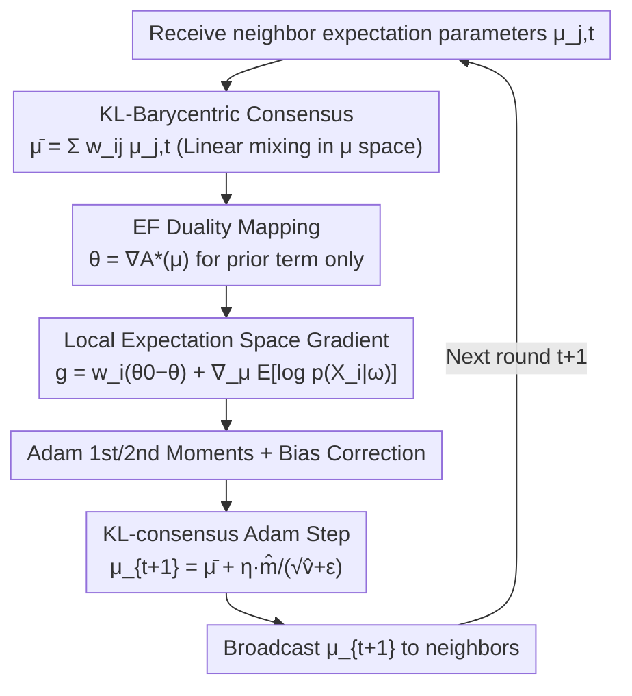

# Beyond Euclidean Gossip: KL-Barycentric Consensus on Heterogeneous and Imbalanced Images

**Conference**: CVPR 2026  
**Paper**: [CVF OpenAccess](https://openaccess.thecvf.com/content/CVPR2026/html/Xu_Beyond_Euclidean_Gossip_KL-Barycentric_Consensus_on_Heterogeneous_and_Imbalanced_Images_CVPR_2026_paper.html)  
**Code**: https://github.com/x-lu/Beyond-euclidean-gossip  
**Area**: Distributed Optimization / Decentralized Learning  
**Keywords**: Decentralized Learning, Variational Inference, Natural Gradient, KL-Barycenter, Information Geometry  

## TL;DR
Addressing the collapse of fully decentralized training under non-i.i.d. data and imbalanced client scales, this paper replaces the "Euclidean gossip" operation (averaging model parameters between neighbors) with linear mixing in the expectation parameter space of exponential families. This approach happens to be equivalent to a curvature-aware KL-Barycentric consensus (natural gradient step), reducing the per-round complexity from $O(d^3)$ to $O(d)$ without constructing or inverting the Fisher matrix. The authors provide an implementation called KL-consensus Adam, which has nearly the same overhead as Adam and achieves approximately 20% higher accuracy than the Euclidean consensus baseline on CIFAR-100.

## Background & Motivation
**Background**: Fully decentralized learning removes the central server, with each client (e.g., a hospital) communicating only with its neighbors on a graph while keeping data strictly local, which is particularly suitable for privacy and compliance-sensitive scenarios. Mainstream methods almost exclusively achieve consensus in **Euclidean space**: Gossip-SGD directly broadcasts and averages model weights, SGP adds a push-sum scalar for debiasing, GT-SGD communicates an additional tracker to estimate the global gradient, and QGM maintains an approximate global momentum using neighbor parameters. When the graph is well-connected and data are i.i.d., these methods approach the accuracy of centralized training.

**Limitations of Prior Work**: The essence of consensus in these methods is "uniform weighted averaging of raw information," which **completely ignores the curvature of the parameter manifold and the reliability of clients**. Consequently, a small client with very few samples, high noise, or even OOD data is given the same weight as a large client with abundant clean data during averaging. Once reality-common statistical heterogeneity (covariate shifts caused by different patient groups, protocols, or equipment) is combined with sample size imbalance, naive averaging is skewed by large sites, amplifying distribution drift and leading to unstable training and performance drops.

**Key Challenge**: Decentralized Variational Bayes (DVB) originally provided a principled path by coordinating the ELBO of each client and using the KL divergence of the posterior to measure "who is more trustworthy." however, classic DVB either requires conjugate exponential families with closed-form updates or global ELBO computation, making it **impossible to scale to the millions of parameters in modern deep networks**. Thus, the problem becomes: Can we enjoy the curvature-awareness and heterogeneity resistance of information geometry (KL/Fisher metrics) without paying the $O(d^3)$ cost of constructing/inverting the Fisher matrix?

**Goal**: (1) Transition decentralized consensus from Euclidean geometry to the Fisher–Rao manifold to align the mixing step with curvature; (2) Find an implementation that requires no Fisher matrix and keeps communication volume equivalent to Euclidean gossip; (3) Provide convergence guarantees for the convex case; (4) Implement this as a plug-and-play optimizer, KL-consensus Adam, with overhead $\approx$ Adam.

**Key Insight**: The authors leverage the duality of Exponential Families (EF)—the mapping from the natural parameter $\theta$ of the posterior to the expectation parameter $\mu = \nabla A(\theta)$ is an exact identity mapping. This mapping depends only on the variational family being an EF, **independent of whether the deep network likelihood is non-convex**. In the $\mu$ space, natural gradients degenerate into ordinary Euclidean gradients, and linear averaging of $\mu$ is precisely the forward KL-Barycenter.

**Core Idea**: Replace "linear gossip in the weight space" with "linear gossip in the expectation parameter $\mu$ space." While the latter appears equally cheap on the surface, it is substantially a geometrically correct KL-Barycentric consensus.

## Method

### Overall Architecture
The method solves the decentralized consensus optimization in Eq.(3): each client $i$ maintains local variational parameters and communicates only with neighbors $N_i$, aiming for all clients to agree on a high-quality variational posterior without a central coordinator. The approach consists of three layers: first, writing the "neighbor mixture + natural gradient ascent" as a decentralized mirror descent step in the **natural parameter $\theta$ space** (4.1); then, using EF duality to **move this step to the expectation parameter $\mu$ space**, proving that linear mixing of $\mu$ is KL-Barycentric consensus and natural gradients become standard gradients, thereby bypassing the Fisher matrix (4.2); finally, instantiating this recursion as Adam running on $\mu$ (4.3) and proving convergence in the convex case (4.4).

The data flow for one iteration of KL-consensus Adam (Algorithm 1) on each client is shown below:

### Key Designs

**1. Natural Gradient VI Consensus: Placing the mixing step on the Fisher–Rao manifold**

Euclidean gossip averages directly in the weight space. However, when client gradients are heterogeneous, the average direction in the weight space **does not necessarily correspond to a step in the KL trust region**, potentially misaligning with the manifold geometry and slowing down or sabotaging training. This paper changes to decentralized updates on natural parameters:

$$\theta_{i,t+1} = \sum_{j\in N_i} w_{ij}\,\theta_{j,t} + \eta_t\,\tilde\nabla_\theta L_i(\theta_{i,t})$$

The first term is the graph-induced averaging operator, whose fixed point satisfies $\theta_i=\theta_j$ on edges, contracting divergence under spectral gap conditions. The second term is the steepest ascent direction under Fisher–Rao geometry, where the natural gradient is $\tilde\nabla_\theta L = F(\theta)^{-1}\nabla_\theta L$. For EF posteriors, $F(\theta)=\nabla^2 A(\theta)$, which exactly induces the KL (information) geometry on the parameter manifold. Expanding the local objective, the natural gradient of the prior term has a clean form $w_i(\theta_0-\theta_{i,t})$, decomposing the step into three actions: **neighbor mixing** (contracting divergence), **conjugate prior pull** (anchoring each client's posterior to a shared prior for stability), and **local data-driven natural gradient** (the only term dependent on the likelihood). This makes the update naturally curvature-aware and reparameterization-invariant, enhancing robustness against heterogeneity.

**2. Expectation Parameter Mapping: Making KL-Barycentric consensus a cheap linear mixture**

While the update in Design 1 is geometrically correct, explicitly constructing or inverting the Fisher matrix for deep networks is $O(d^3)$ and infeasible. The key move in this paper is switching to the **expectation parameters** of the EF: $\mu = \nabla A(\theta) = \mathbb{E}_{q_\theta}[\phi(\omega)]$. In minimal coordinates, $F(\theta)=\nabla^2 A(\theta)$, so the natural gradient exactly equals the standard gradient of the dual objective in $\mu$ space: $\tilde\nabla_\theta L_i = \nabla_\mu L_i^*(\mu)$. Thus, the entire step can be **conducted entirely in the $\mu$ space**, mapping back only when necessary:

$$\mu_{i,t+1} = \sum_{j\in N_i} w_{ij}\,\mu_{j,t} + \eta_t\,\nabla_\mu L_i^*(\mu_{i,t}),\qquad \theta_{i,t+1}=\nabla A^*(\mu_{i,t+1})$$

Why is this step "geometrically correct" rather than a heuristic? Because in exponential families, weighted linear averaging of $\mu$ **is precisely the solution to the forward KL-Barycenter (M-projection)**: $q^\star=\arg\min_{q\in\mathrm{EF}}\sum_i w_i\,\mathrm{KL}(q_{\theta_i}\|q)$ satisfies $\mu^\star=\sum_i w_i\mu_i$ and $\theta^\star=\nabla A^*(\mu^\star)$. This means "standard gossip on $\mu$" has the same communication volume as "standard gossip on weights" (both transfer one parameter vector), but the former implicitly achieves curvature-correct KL consensus. Furthermore, Eq.(6) can be written as mirror descent in $\mu$ space—regularized by the Bregman divergence induced by $A^*$ plus neighbor consistency—indicating this is a principled "descent + mixture" recursion. Complexity is reduced from $O(d^3)$ to $O(d)$.

**3. KL-consensus Adam: Natural gradients via Adam moment buffers with zero extra cost**

To make the theory applicable to deep learning, a specific optimizer is needed. The authors instantiate the recursion as: running Adam on the expectation space gradient $g_{i,t}=\nabla_\mu L_i^*(\mu_{i,t})$ while performing neighbor mixing on $\mu$ to achieve KL consensus (i.e., "KL-consensus in $\mu$ + Adam step on $\nabla_\mu L_i^*$"). Since the Euclidean gradient in $\mu$ space equals the natural gradient in $\theta$ space, this implementation is **naturally Fisher-free** while inheriting the coordinate-wise adaptivity of Adam. Each client maintains only a diagonal Gaussian posterior $q(\omega)=\mathcal{N}(m,\mathrm{diag}(\sigma^2))$, where expectation parameters and dual mappings are $O(d)$ closed-forms:

$$\mu_1=m,\quad \mu_2=m^2+\sigma^2;\qquad \theta_1=m/\sigma^2,\quad \theta_2=-\tfrac12\sigma^{-2}$$

The likelihood gradient term $\nabla_\mu \mathbb{E}_{q_{\mu_{i,t}}}[\log p(X_i|\omega)]$ is approximated using a single-sample Monte Carlo (MC=1, one forward/backward pass at the current mean, no extra sampling), keeping computation and memory almost identical to standard Adam. Algorithm 1 summarizes the flow: neighbor mixing $\bar\mu_{i,t}\leftarrow\sum_j w_{ij}\mu_{j,t}$ $\rightarrow$ dual mapping for the prior term $\rightarrow$ computing local gradient $g_{i,t}=w_i(\theta_0-\theta_{i,t})+\nabla_\mu\mathbb{E}[\log p(X_i|\omega)]$ $\rightarrow$ Adam 1st/2nd moments and bias correction $\rightarrow$ expectation parameter update $\mu_{i,t+1}=\bar\mu_{i,t}+\eta_t\,\hat m_{i,t+1}/(\sqrt{\hat v_{i,t+1}}+\epsilon)$ $\rightarrow$ broadcast $\mu_{i,t+1}$. Notably, this is just an example: any optimizer providing natural gradient/Fisher preconditioning (K-FAC, Adafactor, Shampoo, etc.) can be integrated into the same information-form consensus.

**4. Convergence Guarantee in the Convex Case**

To show that "descent + mixture" is not just an empirical trick, the authors view Eq.(4) as decentralized mirror descent for the global objective $L(\theta)=\sum_i L_i(\theta)$, with the mirror map being the EF log-partition $A$. Via EF duality, this is equivalent to standard gradient descent with a consensus operator on $f(\mu)=-L^*(\mu)$ in $\mu$ space. Under standard assumptions—undirected connected graph, doubly stochastic symmetric mixture matrix $W$ with spectral gap $1-\lambda$ ($\lambda=\max\{|\lambda_2(W)|,|\lambda_M(W)|\}<1$), and gradients with bounded unbiased variance—Theorem 1 shows: for convex $f$ with diminishing step sizes, the average iterate reaches the standard decentralized rate $O\!\big(\tfrac{1}{(1-\lambda)T}\big)$; for $\mu_c$-strongly convex $f$ with a sufficiently small constant step size, it converges linearly to a neighborhood $O\!\big(\tfrac{\eta}{1-\lambda}\big)$ controlled by variance. Network effects enter only through the spectral gap $1-\lambda$, while curvature is preconditioned by the EF information geometry in $\mu$ space.

### Loss & Training
The local objective is the split ELBO (Eq. 2): $L_i(\theta_i)=w_i\,\mathbb{E}_{q_{\theta_i}}[\log \tfrac{p(\theta)}{q_{\theta_i}(\theta)}]+\mathbb{E}_{q_{\theta_i}}[\log p(X_i|\omega)]$, where $w_i$ distributes the global KL regularization among clients. Compared to Adam, only two hyperparameters are added, both weighted by data scale: KL distribution weight $w_i=N_i/N$ and mixture weight $w_{ij}=N_i/(N_i+N_j)$.

## Key Experimental Results

### Main Results
On CIFAR-100 (ResNet-50+GroupNorm, trained from scratch without data augmentation, centralized SGD upper bound 64.57%), non-i.i.d. severity is controlled by Dirichlet concentration $\alpha$ (smaller is more heterogeneous) and sample imbalance by $\beta$ (smaller is more skewed). Results for 8 clients (Table 1):

| Config (8 clients) | Gossip-SGD | SGP | GT-SGD | QGM | Euclidean-Adam | **Ours (KL-consensus Adam)** |
|---|---|---|---|---|---|---|
| $\alpha=1.0$ | 21.23 | 14.79 | 40.08 | 54.32 | 53.72 | **60.10** |
| $\alpha=0.1$ | 16.98 | 12.05 | 27.73 | 49.10 | 46.72 | **57.55** |
| $\alpha=0.01$ | 10.77 | 8.89 | 28.61 | 40.85 | 35.18 | **54.39** |
| $\beta=0.5$ ($\alpha{=}0.1$) | 13.31 | 12.06 | 29.60 | 43.53 | 47.25 | **53.84** |
| $\beta=0.02$ ($\alpha{=}0.1$) | 13.53 | 10.93 | 24.93 | 42.85 | 44.87 | **52.82** |

As heterogeneity and imbalance increase, the gap with baselines widens: at $\alpha=0.01$, Ours leads the runner-up QGM by approximately 13.5 percentage points and remains closest to the centralized upper bound. The trend is consistent for 16 clients (Table 2), where KL-consensus Adam ranks first in all settings (e.g., $\alpha=0.01$: 42.09% vs. QGM 34.73%). Similar leads are seen in medical image segmentation on Kvasir-SEG (U-Net+ResNet-34 encoder, centralized Dice 0.796 / IoU 0.699) (Table 3, $\alpha=0.1$: Dice 0.767 vs. QGM 0.720).

### Ablation Study
The core ablation is the comparison with **Euclidean-Adam**, which uses the exact same local Adam (minibatch gradients, EMA moments, bias correction, coordinate-wise scaling) and the same communication budget. **The only difference is replacing the KL-Barycentric fusion in $\mu$ space with Euclidean mixing in the weight space**, thus only changing the geometry of the consensus step.

| Config (8 clients, CIFAR-100) | $\alpha=1.0$ | $\alpha=0.1$ | $\alpha=0.01$ | Description |
|---|---|---|---|---|
| Euclidean-Adam (w/o KL consensus) | 53.72 | 46.72 | 35.18 | Adam adaptivity only, weight space averaging |
| **KL-consensus Adam (Full)** | 60.10 | 57.55 | 54.39 | Information geometry consensus, slower decay under heterogeneity |

When heterogeneity increases from $\alpha=1.0$ to $0.01$, Euclidean-Adam drops approx. 18.5 points, while KL-consensus Adam only drops approx. 5.7 points—demonstrating that the robustness gain comes from "geometrically correct KL consensus controlling client drift" rather than Adam's adaptivity itself.

### Key Findings
- **Geometry is the Key Variable**: Euclidean-Adam vs. KL-consensus Adam differ only in the consensus geometry, yet the gap reaches 19 points under heavy heterogeneity. QGM performs as the best baseline because its momentum "partially" captures curvature.
- **Consensus Error Converges**: The authors trace per-parameter divergence $E_t=\tfrac1d\sum_i\|\mu_{i,t}-\bar\mu_t\|_2^2$, which rises briefly and then steadily decreases (log scale), verifying the contraction of divergence in the theory.
- **Robustness to Noise and Topology**: Performance remains superior even when some clients are corrupted with JPEG compression noise (Table 4, $\tau=3$ noise clients: Dice 0.750). Performance remains consistent across ring, two-hop ring, and hierarchical tree topologies (Table 5).

## Highlights & Insights
- **The "Change Space, Not Protocol" Ingenuity**: Communication content, volume, and local computation are identical to Euclidean gossip. By simply changing the averaged quantity from weights to expectation parameters $\mu$, a cheap linear mixture is upgraded to a geometrically correct KL-Barycentric consensus.
- **Fisher-free Natural Gradient**: By leveraging the fact that Euclidean gradients in $\mu$ space equal natural gradients in $\theta$ space, the method avoids $O(d^3)$ Fisher inversion, bringing information geometry to deep network scales with $O(d)$ complexity.
- **Plug-and-play**: The consensus operator is decoupled from the optimizer; Adam is just an example, and any Fisher-preconditioned optimizer can use the same information-form consensus.

## Limitations & Future Work
- **Theory-Practice Gap**: Convergence guarantees only cover convex objectives; global optimality for deep networks is not claimed.
- **Posterior Expressivity**: The implementation assumes a diagonal Gaussian posterior and single-sample MC (MC=1), ignoring correlations between parameters, which might underestimate uncertainty in some tasks.
- **Dependence on Topology**: Performance is influenced by the spectral gap $1-\lambda$, and performance in extremely sparse, time-varying, or directed graphs hasn't been fully verified.

## Related Work & Insights
- **vs. Euclidean Consensus (Gossip-SGD / SGP / GT-SGD / QGM)**: These average uniformly in weight/momentum space, ignoring curvature. This paper uses KL-Barycentric consensus in $\mu$ space, which is curvature-aware and robust with identical communication costs.
- **vs. Li et al. (Natural Gradient + Gradient Tracking DVB)**: They solve local ELBOs with natural gradients but communicate vanilla gradients with trackers, essentially remaining an Euclidean consensus with extra overhead. This paper achieves information geometric consensus via simple linear mixing in $\mu$.

## Rating
- **Novelty**: ⭐⭐⭐⭐⭐ The insight that "linear gossip in expectation space = forward KL-Barycentric consensus" for decentralized deep learning is clean and compelling.
- **Experimental Thoroughness**: ⭐⭐⭐⭐ Covers heterogeneity, imbalance, noise, and multiple topologies, but with limited datasets and client scales.
- **Writing Quality**: ⭐⭐⭐⭐ Clear derivation and diagrams, though notation is dense.
- **Value**: ⭐⭐⭐⭐⭐ Robustness to heterogeneity/imbalance with nearly zero extra cost is highly practical for cross-institutional decentralized training.

<!-- RELATED:START -->

## Related Papers

- [\[NeurIPS 2025\] Johnson-Lindenstrauss Lemma Beyond Euclidean Geometry](../../NeurIPS2025/others/johnson-lindenstrauss_lemma_beyond_euclidean_geometry.md)
- [\[CVPR 2026\] Consensus vs. Controversy: Mapping the Decision Space Where Architectures Diverge](consensus_vs_controversy_mapping_the_decision_space_where_architectures_diverge.md)
- [\[CVPR 2026\] A Difference-in-Difference Approach to Detecting AI-Generated Images](a_difference-in-difference_approach_to_detecting_ai-generated_images.md)
- [\[CVPR 2026\] ALLNet: Multi-task Dense Prediction for Degraded Images](allnet_multi-task_dense_prediction_for_degraded_images.md)
- [\[CVPR 2026\] A Debiased Reconstruction-based Framework for Training-Free Detection of AI-Generated Images](a_debiased_reconstruction-based_framework_for_training-free_detection_of_ai-gene.md)

<!-- RELATED:END -->
