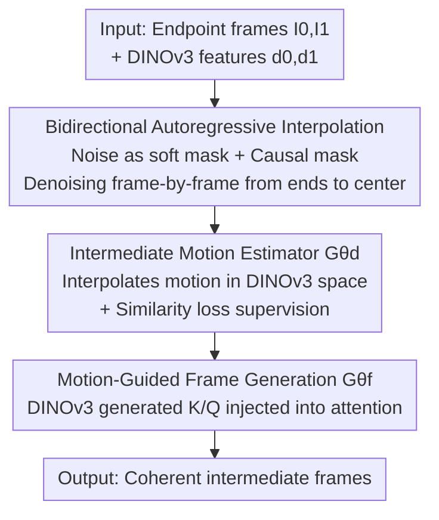

# Bi-directional Autoregressive Diffusion for Large Complex Motion Interpolation

**Conference**: CVPR 2026  
**Paper**: [CVF Open Access](https://openaccess.thecvf.com/content/CVPR2026/html/Ma_Bi-directional_Autoregressive_Diffusion_for_Large_Complex_Motion_Interpolation_CVPR_2026_paper.html)  
**Code**: Provided via the project page (The paper states "Please visit the project page for the code"; the specific repository URL is not provided in the text ⚠️ refer to the original text)  
**Area**: Video Frame Interpolation / Diffusion Models / Human Motion  
**Keywords**: Video frame interpolation, autoregressive diffusion, DINOv3 motion representation, large complex motion, temporal consistency

## TL;DR
ARVFI reformulates video frame interpolation from "generating all intermediate frames at once" to "generating frames autoregressively from two endpoints towards the center." By replacing optical flow with DINOv3 features as the motion representation, it significantly enhances interpolation accuracy for large complex motions (leading in FID across benchmarks) while reducing sampling to 15 steps—approximately 3x faster than its backbone, Wan.

## Background & Motivation
**Background**: The goal of Video Frame Interpolation (VFI) is to synthesize temporally coherent intermediate frames between two input frames. The core challenge lies in estimating inter-frame motion to establish pixel correspondence. Early methods relied on optical flow and local motion assumptions, while recent trends shift toward using pre-trained video diffusion models (e.g., Wan) that treat interpolation as a "conditional generation task" given endpoint frames, implicitly learning inter-frame motion distributions.

**Limitations of Prior Work**: When faced with large, non-rigid, and highly non-linear movements (e.g., a dancer's legs), existing diffusion-based interpolation methods still produce incoherent motion and inconsistent object appearances (deformed hands, broken bicycles) across frames.

**Key Challenge**: The authors attribute these failures to two root causes. First, the **full-sequence generation strategy**—current methods generate all intermediate frames simultaneously, ignoring the fact that frames further from the input endpoints are significantly harder to interpolate. This results in high uncertainty for distant frames, leading to collapsed temporal continuity and appearance inconsistency. Second, the **pixel-level reconstruction objective**—low-level representations like L1/L2 losses or optical flow are sensitive to appearance changes and lack semantic invariance, failing to provide sufficient supervision for motion generation in large-displacement scenarios, which often destroys object structures.

**Goal**: To model both "motion" and "appearance" within a unified framework, specifically designed to overcome challenges in large complex motion interpolation.

**Key Insight**: Since distant frames are more difficult, they should not be generated simultaneously. Instead, similar to autoregressive models, each frame should be predicted based on already generated neighboring frames, breaking a difficult problem into a series of "context-supported" simpler predictions. Furthermore, since pixel or optical flow representations are unstable, DINOv3 features—which possess high-level semantics and provide naturally dense motion information via patch similarity—are used as the motion representation.

**Core Idea**: A two-pronged approach using "Bidirectional Autoregressive Interpolation + DINOv3 Motion Representation." The system first interpolates intermediate motion in the DINOv3 feature space and then uses this motion as a conditional guide to generate pixel frames.

## Method

### Overall Architecture
ARVFI is a two-stage, bidirectional autoregressive interpolation framework. The inputs are the two endpoint frames $I_0, I_1$ and their DINOv3 features $d_0, d_1$, and the output is the intermediate frame sequence. In the first stage, the **Intermediate Motion Estimator** $G_{\theta d}$ interpolates the intermediate motion representation $d = \{d_{\tau_1}, ..., d_{\tau_{N-1}}\}$ in the DINOv3 feature space. In the second stage, the **Intermediate Frame Generator** $G_{\theta f}$ generates frame pixels conditioned on the estimated DINOv3 features. Neither stage generates all frames "at once"; instead, by using **progressively increasing noise as soft masks** and a **bidirectional causal attention mask**, denoising proceeds from the two endpoint frames toward the temporal center—each frame depends only on cleared neighboring frames rather than distant frames that are still pure noise.

Notably, motion estimation and frame generation utilize **two independent Diffusion Transformers** (both modified from Wan2.1-Fun-InP-1.3B) because DINOv3 features and frame embeddings have different data distributions; experiments show that joint generation (as in VideoJAM) degrades frame quality.

### Key Designs

**1. Bidirectional Autoregressive Interpolation: Generating Distant Frames Based on Neighbors**

This design directly addresses the "collapse of distant frames" caused by full-sequence generation. ARVFI does not output all intermediate frames simultaneously; instead, it starts from the frames closest to the inputs and progresses toward the temporal center. Rather than a hard "generate one frame completely before the next," it adopts a "soft" autoregression: using **sequential noise as a mask**. The diffusion timestep for each frame increases with its distance from the input frames; frames near the inputs have lower noise and are denoised first, while distant frames have higher noise and are processed later. During training (Algorithm 1), for the $i$-th frame, $t_i = \min(t + i \cdot s, T)$ is used, where $t$ is a randomly sampled base timestep and $s$ is the inter-frame step interval, forcing "further frames to have more noise." In one sampling iteration, ARVFI first removes part of the noise from the nearest frames $(\tau_1, \tau_5)$, then continues denoising based on these and the next batch of frames $(\tau_2, \tau_4)$, iterating until all frames are generated.

To prevent distant frames (still pure noise) from leaking noise into current frames, ARVFI applies a **bidirectional causal attention mask** to all DiT blocks: each frame's attention can only attend to frames that have already been denoised (red arrows in Fig 3). This is a critical improvement over Diffusion-Forcing—which samples unidirectionally from start to end using an RNN and breaks the bidirectional causality of VFI where both ends are known. ARVFI adapts this into a bidirectional causal version for Diffusion Transformers. Each frame is based on more generated frames with less noise, resulting in smoother transitions and better temporal consistency with fewer sampling steps.

**2. DINOv3 Motion Representation + Similarity Loss: Stabilizing Large Motion via Semantic Features**

This design targets the failure of pixel-level or optical flow representations to supervise complex motion. Optical flow often degrades for small objects or large complex movements, and the flow-warping process can produce unpredictable color jumps that destabilize diffusion training. ARVFI uses DINOv3 features as the motion representation instead: DINOv3 contains both high-level semantics and low-level structure, providing dense motion information through cross-frame patch similarity that is robust to appearance, lighting, and geometric distortion (Fig 2 shows its superior accuracy for a high-lighted shoe).

To ensure generated intermediate DINOv3 features carry the correct motion, the authors add a **similarity loss** in addition to the reconstruction loss:

$$L_{sim} = \|d_0 \cdot d - d_0 \cdot \hat{d}\|^2 + \|d_1 \cdot d - d_1 \cdot \hat{d}\|^2$$

Where $d$ is the ground-truth intermediate DINOv3 feature, $\hat{d}$ is the estimate, and $d_0, d_1$ are endpoint input features. This requires the "patch similarity between estimated features and inputs" to match the "ground-truth similarity," explicitly constraining motion consistency (similarity is only calculated with the two endpoints to save memory). The total loss for the motion estimator is $L_d = L_{\epsilon d} + \zeta L_{sim}$, with $\zeta = 0.5$.

**3. Motion-Guided Frame Generation: Injecting DINOv3 Motion as K/Q via Attention**

Once intermediate DINOv3 features are obtained, the challenge is how to "feed" them into the frame generator. VideoJAM jointly generates frames and flow visualizations, while Motion-I2V adds extra modules; both have costs. ARVFI uses a lightweight approach: the frame generator $G_{\theta f}$ is based on Wan2.1-Fun-InP-1.3B. Factors like shared MLPs and normalization compute additional attention queries $Q_d$ and keys $K_d$ from the estimated DINOv3 features, which are then **added** to the $Q_f, K_f$ derived from the frame embeddings, resulting in enhanced $Q, K$ for attention across all 30 DiT blocks (Fig 4).

Since DINOv3 patch similarity provides the same motion prior for all blocks, these MLPs are shared across blocks using the same $Q_d/K_d$. This injects motion cues into frame generation with almost no extra computational cost; because the pre-trained DiT structure remains intact, the frame generation stage trains stably and efficiently.

### Loss & Training
The motion estimator $G_{\theta d}$ uses $L_d = L_{\epsilon d} + 0.5 \cdot L_{sim}$. DINOv3 inputs are not noised; they are concatenated along the temporal dimension with noise, and their timesteps are set to minimum (equivalent to no noise). Training occurs in two steps: first, $G_{\theta d}$ is trained for 500k iterations; then, $G_{\theta f}$ is trained for 200k iterations using DINOv3 features generated by the trained $G_{\theta d}$. Both DiT models are trained on $576\times320$ resolution with $\to25$ interpolation settings using 8 A100-80G GPUs, total batch size 8, learning rate 2e-5, and AdamW. During inference, the timestep intervals for DINOv3 estimation and frame generation are 500 and 150, totaling only 15 diffusion sampling steps.

## Key Experimental Results

### Main Results
Evaluated on DAVIS-7 ($\to8$ interpolation), FCVG test set ($\to25$ interpolation), and the self-collected Pixels (100 sequences) dataset against 8 SOTAs (4 non-generative + 4 diffusion-based). ARVFI leads across LPIPS / FID / FVD:

| Dataset | Metric | ARVFI | Runner-up | Note |
|:---|:---|:---:|:---:|:---|
| DAVIS-7 | FID↓ | **21.65** | 22.10 (LDMVFI) | FVD 188.77 is also best |
| Test Set[42] | FID↓ | **19.03** | 28.52 (Wan) | Lead of ~33% |
| Test Set[42] | LPIPS↓ | **0.206** | 0.223 (Wan) | — |
| Pixels | FID↓ | **17.60** | 22.48 (Wan) | FVD 101.71 is best |

Non-generative methods (e.g., FILM) often achieve high reconstruction scores by generating blurry frames but suffer from poor perceptual quality. Diffusion-based methods degrade under large motion due to motion generation limitations. ARVFI aligns closer to the ground truth distribution by estimating motion representations and sampling videos effectively.

### Ablation Study
Step-wise model simplification on the FCVG dataset (Table 2):

| Configuration | LPIPS↓ | FID↓ | FVD↓ | Description |
|:---|:---:|:---:|:---:|:---|
| Frame Full-Seq | 0.217 | 27.63 | 210.53 | Simultaneous full-seq (Baseline) |
| Frame Bi-AR | 0.210 | 23.41 | 205.32 | Bi-directional autoregressive, FID −4.2 |
| Uni-Flow Vis | 0.215 | 23.88 | 203.37 | Joint generation with flow vis, minor gain |
| Uni-DINOv3 | 0.232 | 28.97 | 223.37 | Joint generation with DINOv3, performs worse |
| **Our ARVFI** | **0.206** | **19.03** | **201.47** | Dual DiT separation + motion guidance |

### Key Findings
- **The autoregressive strategy is the primary contribution**: Switching from Full-Seq to Bi-AR reduced FID from 27.63 to 23.41, with significant improvements in temporal consistency for hands and heads.
- **"Joint generation" is counterproductive**: Putting motion representation and frame generation into the same diffusion model (Uni-DINOv3) increased FID to 28.97. This is because the data distributions of DINOv3 features and frame embeddings differ; joint modeling biases the model between distributions, proving ARVFI's dual-independent DiT design is correct.
- **Superior efficiency** (Table 3, $1024\times576$, $\to25$): ARVFI requires only 15 sampling steps (0.775s per frame), saving ~70% time compared to Wan (50 steps, 2.582s), and is an order of magnitude faster than FCVG (14.382s) and GI (23.467s). Autoregression simplifies the problem into context-aware generation, reducing required steps.
- **Overwhelming Human Preference**: Among 20 observers and 400 votes, 85% favored ARVFI for natural motion, 12% chose Wan, and all other methods totaled <3%.

## Highlights & Insights
- **The observation that "distant frames are harder" is simple yet overlooked**: Existing diffusion VFI defaults to simultaneous generation for all intermediate frames. ARVFI addresses the uncertainty of distance using autoregression + incremental noise soft masks effectively.
- **Bidirectional causal mask is the key bridge for bringing Diffusion-Forcing to VFI**: Original unidirectional sampling breaks the bidirectional nature of VFI. An attention mask transforms it into a bidirectional causal version suitable for Diffusion Transformers, which is an elegant engineering solution.
- **Using DINOv3 for motion + K/Q attention injection is nearly cost-free**: Transforming semantic features through MLPs into extra $Q_d/K_d$ and sharing them across blocks injects motion priors without altering the pre-trained DiT structure, ensuring stable training.
- **Similarity loss designed to compare only with endpoints**: Using relative patch similarity as supervision and calculating it only against input frames avoids the recursive complexity of all-to-all sequence similarity, representing a practical trade-off between memory and accuracy.

## Limitations & Future Work
- The authors direct readers to the project page for code without providing a direct repository link; reproducibility depends on external updates ⚠️ refer to the original text.
- Reliance on pre-trained Wan2.1-Fun-InP-1.3B and DINOv3 ViT-S; two independent DiTs require long training (500k + 200k iterations on 8×A100), making the training cost high. Transferability to scenarios without strong backbones is unclear.
- Evaluation scale remains relatively small (100 sequences for Pixels, 20-person user study), limiting the coverage of diverse large complex motions.
- While autoregression mitigates distant frame error, it is still inherently sequence-dependent—a deep analysis of error propagation from near to far frames is missing.
- The concrete construction of the diffusion schedule matrix $S$ is in the supplementary material, leaving a gap in the main text's explanation of the inference flow.

## Related Work & Insights
- **vs. Wan (Full-sequence diffusion backbone)**: Wan generates all frames simultaneously in 50 steps; ARVFI modifies this to bidirectional autoregression + DINOv3 guidance, achieving better results in 15 steps. FID dropped from 28.52 to 19.03 while being 3x faster, proving "generation order + motion representation" is more critical than the backbone alone.
- **vs. Diffusion-Forcing**: The latter uses unidirectional autoregression with RNNs, breaking VFI's bidirectional causality; ARVFI adapts it to the "endpoints-known" VFI setting using bidirectional causal masks in DiT.
- **vs. VideoJAM / Motion-I2V (Joint/Extra-module motion modeling)**: VideoJAM uses a single model for joint generation, and Motion-I2V uses extra modules; ARVFI separates the two via DINOv3 and dual DiTs. Ablations show joint modeling (Uni-DINOv3) performs worse, validating the separation.
- **vs. Flow/Sparse-matching VFI (FILM, GIMM-VFI, FCVG)**: These rely on pixel-level correspondence and produce blur or deformation under large non-rigid motion; ARVFI provides semantic robustness via DINOv3 patch similarity.

## Rating
- Novelty: ⭐⭐⭐⭐⭐ Adapting autoregressive generation into a bidirectional causal version for VFI + using DINOv3 for motion representation is novel and complementary.
- Experimental Thoroughness: ⭐⭐⭐⭐ Main comparisons on three datasets + complete ablation + efficiency + user study, though evaluation scale is somewhat limited.
- Writing Quality: ⭐⭐⭐⭐ Logical flow from motivation to experiment is clear with good visuals, though critical scheduling details are relegated to the supplement.
- Value: ⭐⭐⭐⭐⭐ Significant simultaneous gains in both accuracy and efficiency for large motion interpolation; highly relevant for practical VFI and video generation.

<!-- RELATED:START -->

## Related Papers

- [\[ICML 2026\] AMDP: Asynchronous Multi-Directional Pipeline Parallelism for Large-Scale Models Training](../../ICML2026/others/amdp_asynchronous_multi-directional_pipeline_parallelism_for_large-scale_models_.md)
- [\[CVPR 2026\] Learning Long-term Motion Embeddings for Efficient Kinematics Generation](learning_long-term_motion_embeddings_for_efficient_kinematics_generation.md)
- [\[ICCV 2025\] SyncDiff: Synchronized Motion Diffusion for Multi-Body Human-Object Interaction Synthesis](../../ICCV2025/others/syncdiff_synchronized_motion_diffusion_for_multi-body_human-object_interaction_s.md)
- [\[CVPR 2026\] FlashVSR: Towards Real-time Diffusion-Based Streaming Video Super Resolution](flashvsr_towards_real-time_diffusion-based_streaming_video_super_resolution.md)
- [\[CVPR 2026\] Large-scale Robust Enhanced Ensemble Clustering via Outlier Decoupling](large-scale_robust_enhanced_ensemble_clustering_via_outlier_decoupling.md)

<!-- RELATED:END -->
